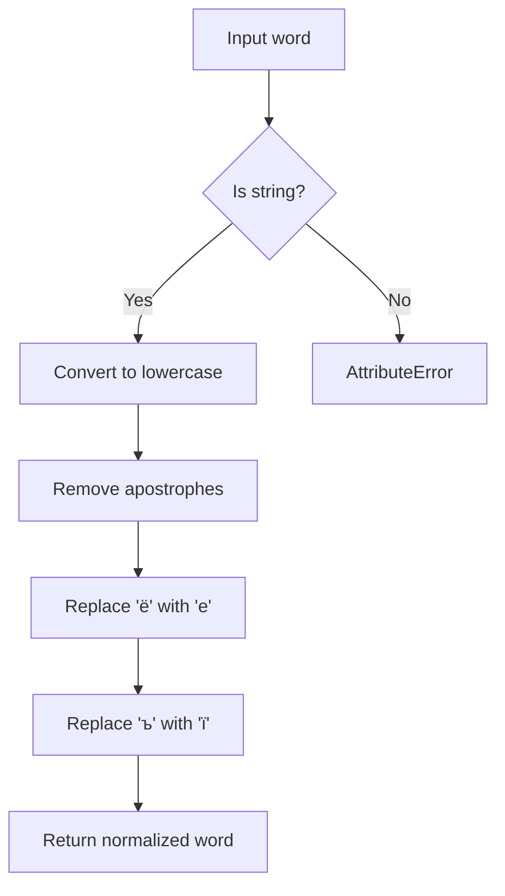

# `ukrainian.py`

## `sumy.nlp.stemmers.ukrainian.stem_word` · *function*

## Summary:
Applies Ukrainian morphological stemming to reduce words to their base forms by removing suffixes according to linguistic rules.

## Description:
This function performs Ukrainian word stemming by applying a series of regular expression-based transformations to remove morphological suffixes. It follows a specific algorithmic approach that prioritizes certain types of suffix removal based on grammatical categories such as perfective ground, reflexive, adjective, participle, verb, and noun patterns.

The function serves as a key component in Ukrainian text processing pipelines, particularly for information retrieval systems and natural language processing applications where normalized word forms are beneficial.

## Args:
    word (str): The Ukrainian word to be stemmed. Should contain Ukrainian characters.

## Returns:
    str: The stemmed version of the input word with morphological suffixes removed.

## Raises:
    None explicitly raised in the visible code.

## Constraints:
    Preconditions:
    - Input must be a string
    - Word should contain Ukrainian characters
    
    Postconditions:
    - Returns a string representing the stemmed form of the input word
    - If no Ukrainian vowels are found, returns the original word unchanged

## Side Effects:
    None

## Control Flow:
```mermaid
flowchart TD
    A[Start stem_word] --> B[_preprocess(word)]
    B --> C{Contains Ukrainian vowels?}
    C -->|No| D[Return word]
    C -->|Yes| E[Find RVRE pattern]
    E --> F[Split word into start and suffix]
    F --> G[Apply PERFECTIVE_GROUND pattern]
    G --> H{Pattern matched?}
    H -->|No| I[Apply REFLEXIVE pattern]
    I --> J[Apply ADJECTIVE pattern]
    J --> K{Pattern matched?}
    K -->|Yes| L[Apply PARTICIPLE pattern]
    K -->|No| M[Apply VERB pattern]
    M --> N{Pattern matched?}
    N -->|No| O[Apply NOUN pattern]
    O --> P[Apply 'и$' pattern]
    P --> Q{Matches DERIVATIONAL?}
    Q -->|Yes| R[Apply 'ость$' pattern]
    R --> S[Apply 'ь$' pattern]
    S --> T{Pattern matched?}
    T -->|Yes| U[Apply 'ейше?$' pattern]
    U --> V[Apply 'нн$' pattern]
    V --> W[Return start + suffix]
```

## Examples:
    >>> stem_word("програмування")
    "програмуван"
    
    >>> stem_word("роботи")
    "робот"

## `sumy.nlp.stemmers.ukrainian._preprocess` · *function*

## Summary:
Normalizes Ukrainian text for stemmer processing by applying lowercase conversion and character replacement transformations.

## Description:
Applies text normalization to Ukrainian words in preparation for stemming operations. This utility function standardizes orthographic variations in Ukrainian text by converting to lowercase and replacing specific Cyrillic characters ('ё' and 'ъ') with their standard equivalents ('е' and 'ї'). The function is designed to be used internally by the Ukrainian stemmer module to ensure consistent text processing.

## Args:
    word (str): The Ukrainian word to normalize. Must be a string containing Cyrillic characters.

## Returns:
    str: The normalized word with lowercase conversion and character replacements applied. Returns an empty string if input is empty.

## Raises:
    AttributeError: If input word is not a string type, as the method calls .lower() and string methods directly.

## Constraints:
    Preconditions:
        - Input must be a string type
        - Function assumes input contains Cyrillic characters that may need normalization
    
    Postconditions:
        - Output is always lowercase
        - Apostrophes are completely removed from input
        - Characters 'ё' and 'ъ' are replaced with 'е' and 'ї' respectively

## Side Effects:
    None: This function performs no I/O operations or external state mutations.

## Control Flow:


## Examples:
    >>> _preprocess("Привіт'")
    'привіт'
    
    >>> _preprocess("міст'о")
    'місто'
    
    >>> _preprocess("від'їзд")
    'відїзд'
    
    >>> _preprocess("під'їхав")
    'підїхав'
    
    >>> _preprocess("СТРОКА")
    'строка'

## `sumy.nlp.stemmers.ukrainian._update_suffix` · *function*

## Summary:
Updates a suffix string by applying regex pattern replacement and reports whether any changes occurred.

## Description:
This utility function performs regex-based pattern replacement on a suffix string. It's designed to be used in morphological stemming operations where suffixes need to be modified according to specific rules. The function returns both a boolean flag indicating whether the suffix was modified and the resulting string after replacement.

## Args:
    suffix (str): The suffix string to process
    pattern (str): Regular expression pattern to search for within the suffix
    replacement (str): String to replace matching patterns with

## Returns:
    tuple[bool, str]: A tuple containing (changed_flag, result_string) where:
        - changed_flag (bool): True if the suffix was modified by the replacement operation, False otherwise
        - result_string (str): The resulting string after applying the regex substitution

## Raises:
    None explicitly raised

## Constraints:
    - Preconditions: All arguments must be strings
    - Postconditions: The returned result string will be identical to the input suffix if no pattern matches were found

## Side Effects:
    None

## Control Flow:
```mermaid
flowchart TD
    A[Start _update_suffix] --> B[Apply re.sub(pattern, replacement, suffix)]
    B --> C{suffix != result}
    C -->|True| D[Return (True, result)]
    C -->|False| E[Return (False, result)]
```

## Examples:
    # Example 1: Suffix modification occurs
    changed, new_suffix = _update_suffix("ing", "ing$", "ed")
    # Returns: (True, "ed")
    
    # Example 2: No modification occurs  
    changed, new_suffix = _update_suffix("ing", "ed$", "ed")
    # Returns: (False, "ing")
```

