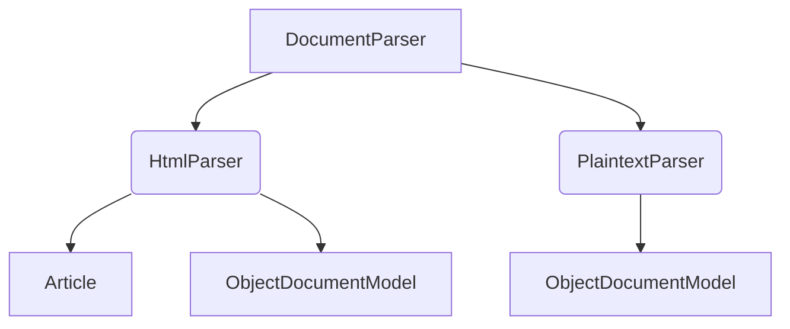

# `sumy.parsers`

## Tree:
parsers/
├── html.py
├── parser.py
└── plaintext.py

## Role:
Provides document parsing capabilities for different input formats (HTML and plain text) into structured document models suitable for summarization.

## Description:
This module offers specialized parsers for converting raw document content from various formats (HTML and plain text) into a standardized internal document model that can be consumed by summarization algorithms. The parsers implement a common interface defined by the base `DocumentParser` class, ensuring consistent handling of document content regardless of input format.

The module is used primarily by the summarization algorithms in the `sumy.summarizers` package, which depend on parsed documents in a uniform structure to perform their operations effectively.

The parsers are grouped together because they share common functionality for tokenization and document structure creation while implementing different strategies for handling their respective input formats.

## Components:
*   `DocumentParser` - Base class providing tokenization services and defining the interface for all document parsers
*   `HtmlParser` - Parses HTML content using the breadability library to extract main article content, then structures it into document objects
*   `PlaintextParser` - Parses plain text content, identifying headings and organizing content into paragraphs

## Public API:
*   `DocumentParser(tokenizer)` - Constructor for base parser class providing tokenization services
*   `HtmlParser.from_string(string, url, tokenizer)` - Creates HTML parser from string content
*   `HtmlParser.from_file(file_path, url, tokenizer)` - Creates HTML parser from file
*   `HtmlParser.from_url(url, tokenizer)` - Creates HTML parser from URL
*   `PlaintextParser.from_string(string, tokenizer)` - Creates plaintext parser from string
*   `PlaintextParser.from_file(file_path, tokenizer)` - Creates plaintext parser from file
*   `DocumentParser.tokenize_sentences(paragraph)` - Tokenizes paragraph into sentences
*   `DocumentParser.tokenize_words(sentence)` - Tokenizes sentence into words
*   `DocumentParser.document` - Property returning parsed document model
*   `DocumentParser.significant_words` - Property returning significant words for summarization
*   `DocumentParser.stigma_words` - Property returning stigma words for summarization

## Dependencies:
*   Internal: `sumy.models.ObjectDocumentModel`, `sumy.models.Paragraph`, `sumy.models.Sentence`
*   Internal: `sumy.utils.fetch_url`, `sumy.utils.to_unicode`
*   Internal: `sumy.tokenizers.Tokenizer`
*   External: `breadability` (for HTML content extraction in HtmlParser)
*   External: `functools.cached_property` (for caching properties)
*   External: `string.punctuation` (for character checking)

## Constraints:
*   All parsers require a tokenizer instance to be passed during construction
*   HTML parser requires a URL parameter when constructed directly (though it's optional in factory methods)
*   Parsers must be initialized with valid content before accessing document properties
*   Thread safety is not guaranteed - parsers should not be shared across threads without synchronization
*   The `fetch_url` utility must be available for URL-based parsing in HtmlParser

---

## Files

- [`html.py`](parsers/html.md)
- [`parser.py`](parsers/parser.md)
- [`plaintext.py`](parsers/plaintext.md)

