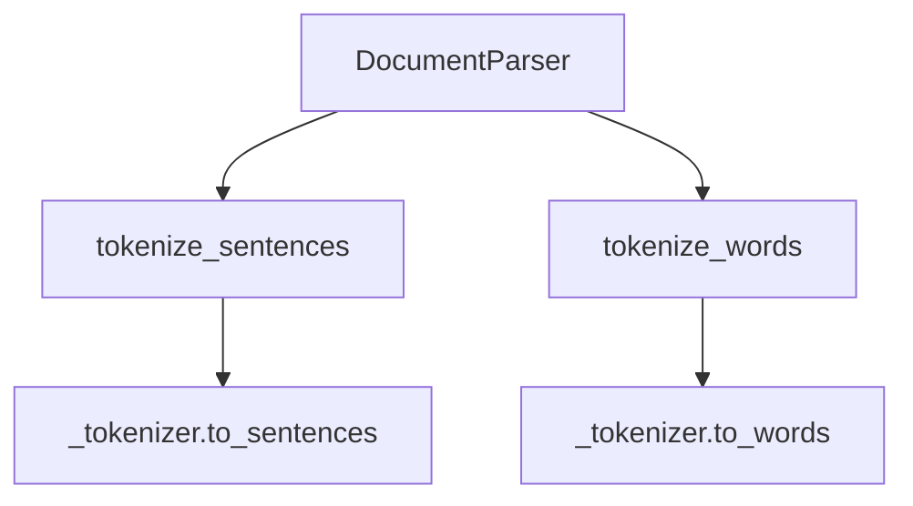

# `parser.py`

## `sumy.parsers.parser.DocumentParser` · *class*

## Summary:
A document parser that provides sentence and word tokenization services using a provided tokenizer.

## Description:
The DocumentParser class serves as an abstraction layer over a tokenizer object, providing convenient methods for splitting text into sentences and words. It is designed to work with various tokenizer implementations and provides utility methods for cleaning and processing text segments.

This class acts as a bridge between raw text input and tokenized representations, making it easier to process documents for summarization or other text analysis tasks. The parser is particularly useful in the context of the sumy library for automatic text summarization.

## State:
- `_tokenizer`: Tokenizer instance used for actual tokenization operations. Must implement `to_sentences()` and `to_words()` methods. Type: tokenizer object. Invariant: Must not be None.

## Lifecycle:
- Creation: Instantiate with a valid tokenizer object via `DocumentParser(tokenizer)`
- Usage: Call `tokenize_sentences()` to split paragraphs into sentences, or `tokenize_words()` to split sentences into words
- Destruction: No special cleanup required; relies on Python's garbage collection

## Method Map:


## Raises:
- None explicitly raised by `__init__`
- Exceptions may be raised by underlying tokenizer methods if they fail

## Example:
```python
# Assuming a tokenizer is available
parser = DocumentParser(tokenizer)
paragraph = "This is the first sentence. This is the second sentence!"
sentences = parser.tokenize_sentences(paragraph)
# Returns: ['This is the first sentence.', 'This is the second sentence!']

sentence = "This is a sample sentence."
words = parser.tokenize_words(sentence)
# Returns: ['This', 'is', 'a', 'sample', 'sentence']
```

### `sumy.parsers.parser.DocumentParser.__init__` · *method*

## Summary:
Initializes a DocumentParser instance with the specified tokenizer for text processing.

## Description:
This constructor sets up a DocumentParser object by storing the provided tokenizer, which will be used for tokenizing sentences and words in subsequent parsing operations. The tokenizer is expected to have methods `to_sentences()` and `to_words()` for text processing.

## Args:
    tokenizer: An object implementing the required tokenization interface with `to_sentences()` and `to_words()` methods.

## Returns:
    None

## Raises:
    None

## State Changes:
    Attributes READ: None
    Attributes WRITTEN: self._tokenizer

## Constraints:
    Preconditions: The tokenizer parameter must be a valid object with `to_sentences()` and `to_words()` methods.
    Postconditions: The DocumentParser instance will have its `_tokenizer` attribute set to the provided tokenizer.

## Side Effects:
    None

### `sumy.parsers.parser.DocumentParser.tokenize_sentences` · *method*

## Summary:
Splits a paragraph into individual sentences using the parser's tokenizer and filters out empty or whitespace-only sentences.

## Description:
This method takes a text paragraph as input and breaks it down into individual sentences using the underlying tokenizer. It then filters out any empty or whitespace-only sentences from the result. This method is part of the document parsing pipeline and is typically called during the sentence segmentation phase of text processing.

The separation of this logic into its own method allows for consistent sentence tokenization across different parts of the parser while maintaining clean code organization. It also enables easy replacement or extension of the tokenization strategy through the injected tokenizer dependency.

## Args:
    paragraph (str): The input text paragraph to be segmented into sentences

## Returns:
    list[str]: A list of non-empty sentence strings extracted from the input paragraph, with leading and trailing whitespace removed from each sentence

## Raises:
    AttributeError: If self._tokenizer does not have a to_sentences method
    TypeError: If paragraph is not a string type

## State Changes:
    Attributes READ: self._tokenizer
    Attributes WRITTEN: None

## Constraints:
    Preconditions: 
    - self._tokenizer must be initialized and have a to_sentences method
    - paragraph must be a string type
    
    Postconditions:
    - Returns a list of strings where each string represents a sentence
    - All returned sentences are non-empty (stripped of leading/trailing whitespace)
    - The order of sentences in the returned list preserves the order from the input paragraph

## Side Effects:
    None

### `sumy.parsers.parser.DocumentParser.tokenize_words` · *method*

## Summary:
Converts a sentence into a list of word tokens using the parser's injected tokenizer.

## Description:
This method serves as a delegate to the underlying tokenizer's word tokenization functionality. It transforms a textual sentence into its constituent word tokens, which is a fundamental step in document processing pipelines for tasks like text analysis, summarization, and natural language processing.

The method is part of the DocumentParser class that provides structured parsing capabilities for text documents. It encapsulates the tokenization logic and ensures consistency in how word-level tokenization is performed throughout the system.

## Args:
    sentence (str): The input sentence to be tokenized into individual words.

## Returns:
    list[str]: A list of word tokens extracted from the input sentence. Each token represents a word in the sentence.

## Raises:
    AttributeError: If the injected tokenizer does not have a `to_words` method.
    TypeError: If the sentence parameter is not a string type.

## State Changes:
    Attributes READ: self._tokenizer
    Attributes WRITTEN: None

## Constraints:
    Preconditions:
        - The DocumentParser instance must have been initialized with a valid tokenizer object
        - The tokenizer must implement a `to_words` method
        - The sentence parameter must be a string
    
    Postconditions:
        - The returned list contains word tokens extracted from the input sentence
        - The order of tokens in the returned list matches the order of words in the input sentence

## Side Effects:
    None - This method performs no I/O operations or external service calls. It only delegates to the injected tokenizer's method.

