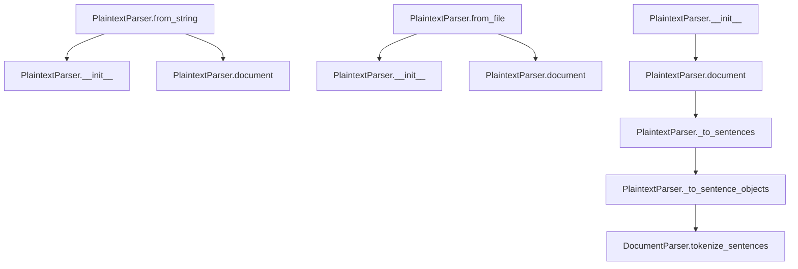

# `plaintext.py`

## `sumy.parsers.plaintext.PlaintextParser` · *class*

## Summary:
Parses plain text into a structured document model with support for headings and sentence segmentation.

## Description:
The PlaintextParser class converts raw text input into a structured document representation suitable for text summarization tasks. It handles text parsing by identifying headings (uppercase lines), separating paragraphs (empty lines), and segmenting content into sentences. The parser supports both string and file-based input through factory methods.

## State:
- `_text` (str): The normalized and stripped input text
- `_tokenizer`: Tokenizer instance inherited from DocumentParser for sentence and word tokenization
- `SIGNIFICANT_WORDS` (tuple): Inherited constant containing important words for summarization
- `STIGMA_WORDS` (tuple): Inherited constant containing stigma words for summarization

## Lifecycle:
- Creation: Instantiate using `from_string()` or `from_file()` class methods, or directly with `PlaintextParser(text, tokenizer)`
- Usage: Access the parsed `document` property to get the structured document model
- Destruction: No explicit cleanup required; relies on Python's garbage collection

## Method Map:


## Raises:
- None explicitly raised in `__init__`
- File-related exceptions (FileNotFoundError, IOError) may occur in `from_file()` when opening files

## Example:
```python
from sumy.parsers.plaintext import PlaintextParser
from sumy.nlp.tokenizers import Tokenizer

# Parse from string
parser = PlaintextParser.from_string("Hello world.\n\nThis is a test.", Tokenizer("english"))
doc = parser.document

# Parse from file
parser = PlaintextParser.from_file("/path/to/file.txt", Tokenizer("english"))
doc = parser.document
```

### `sumy.parsers.plaintext.PlaintextParser.from_string` · *method*

## Summary:
Creates a new PlaintextParser instance from a text string and tokenizer.

## Description:
This class method serves as a factory constructor for PlaintextParser objects, providing an alternative way to instantiate parsers from text content rather than files. It is typically used in the document processing pipeline when text content is already available in memory as a string.

## Args:
    cls: The class object (used for class method decorator)
    string (str): The text content to parse
    tokenizer: The tokenizer object used for sentence and word tokenization

## Returns:
    PlaintextParser: A new instance of PlaintextParser initialized with the provided string and tokenizer

## Raises:
    None explicitly raised by this method

## State Changes:
    Attributes READ: None
    Attributes WRITTEN: None (the returned instance will have its own state)

## Constraints:
    Preconditions: 
    - The string parameter must be a valid text string
    - The tokenizer parameter must be a valid tokenizer object compatible with DocumentParser
    
    Postconditions:
    - Returns a properly initialized PlaintextParser instance
    - The instance's internal text representation will be the provided string, processed through to_unicode() and strip()

## Side Effects:
    None

### `sumy.parsers.plaintext.PlaintextParser.from_file` · *method*

## Summary:
Creates a new PlaintextParser instance by reading text content from a file and initializing it with the provided tokenizer.

## Description:
This class method serves as a factory constructor that reads text content from a file and initializes a new PlaintextParser instance. It provides a convenient way to parse plaintext documents directly from files without manually opening and reading them first. The method handles UTF-8 encoding and ensures proper initialization of the parser with the file content and tokenizer.

## Args:
    file_path (str): Absolute or relative path to the text file to be parsed.
    tokenizer: Tokenizer object used to process the text content for parsing.

## Returns:
    PlaintextParser: A new instance of PlaintextParser initialized with content from the file and the provided tokenizer.

## Raises:
    FileNotFoundError: If the specified file_path does not exist or cannot be accessed.
    UnicodeDecodeError: If the file cannot be decoded using UTF-8 encoding.

## State Changes:
    Attributes READ: None
    Attributes WRITTEN: None (creates new instance, doesn't modify existing object state)

## Constraints:
    Preconditions: 
    - The file_path must point to an existing readable file
    - The file must be readable with UTF-8 encoding
    - The tokenizer parameter must be a valid tokenizer object
    
    Postconditions:
    - Returns a properly initialized PlaintextParser instance
    - The returned instance contains the text content from the file
    - The returned instance uses the provided tokenizer for processing

## Side Effects:
    I/O operations: Reads from the filesystem at the specified file_path
    External service calls: None
    Mutations to objects outside self: None

### `sumy.parsers.plaintext.PlaintextParser.__init__` · *method*

## Summary:
Initializes a PlaintextParser instance with text content and tokenizer.

## Description:
Constructs a PlaintextParser object by initializing the parent DocumentParser with the provided tokenizer and processing the input text to ensure proper Unicode encoding and whitespace removal.

## Args:
    text (str or bytes): The plaintext content to parse, which will be converted to Unicode and stripped of leading/trailing whitespace.
    tokenizer: A tokenizer object used for sentence and word tokenization operations.

## Returns:
    None: This method initializes the object's state but does not return a value.

## Raises:
    None explicitly raised by this method, though underlying conversion operations may raise exceptions.

## State Changes:
    Attributes READ: None
    Attributes WRITTEN: 
        - self._text: Stores the Unicode-converted and stripped text content
        - self._tokenizer: Stores the provided tokenizer instance from parent class initialization

## Constraints:
    Preconditions:
        - text parameter should be convertible to Unicode string
        - tokenizer parameter should be a valid tokenizer object compatible with DocumentParser interface
    Postconditions:
        - self._text contains the input text as a Unicode string with leading/trailing whitespace removed
        - self._tokenizer is properly initialized from the parent class

## Side Effects:
    None: This method performs no I/O operations or external service calls. It only initializes internal object state.

### `sumy.parsers.plaintext.PlaintextParser.significant_words` · *method*

## Summary:
Returns a cached tuple of significant words extracted from document headings, or falls back to default significant words if none are found.

## Description:
This method extracts words from all headings within the document's paragraphs and returns them as a cached tuple. If no words are found in any headings, it returns the class-defined default significant words. As a cached_property, this method computes its result once and caches it for subsequent accesses, making repeated calls efficient.

The significant words are intended to represent key terminology or main topics that appear in document headings, which are often indicative of important content sections. When no heading words are present, the method falls back to the predefined SIGNIFICANT_WORDS class attribute containing common Czech terms like "významný", "vynikající", etc.

## Args:
    None

## Returns:
    tuple[str]: A cached tuple containing words extracted from document headings, or the default SIGNIFICANT_WORDS class attribute tuple if no heading words are found.

## Raises:
    None explicitly raised

## State Changes:
    Attributes READ: self.document, self.SIGNIFICANT_WORDS
    Attributes WRITTEN: None

## Constraints:
    Preconditions: 
    - self.document must be properly initialized and contain paragraphs with headings
    - The document structure must support accessing .paragraphs and .headings attributes
    
    Postconditions:
    - Returns either a tuple of words from headings or the default SIGNIFICANT_WORDS tuple
    - The returned tuple is immutable (due to tuple conversion)
    - Method result is cached after first invocation

## Side Effects:
    None

### `sumy.parsers.plaintext.PlaintextParser.stigma_words` · *method*

## Summary:
Returns the collection of stigma words used for sentiment analysis in text processing.

## Description:
This property provides access to a predefined set of negative or undesirable words that are used for identifying stigma-related content in text documents. The method is implemented as a cached property to avoid recomputation on each access.

## Args:
    None

## Returns:
    tuple[str]: A tuple containing stigma words such as "nejhorší", "zlý", "šeredný" that represent negative or undesirable terms in the analyzed text.

## Raises:
    None

## State Changes:
    Attributes READ: self.STIGMA_WORDS
    Attributes WRITTEN: None

## Constraints:
    Preconditions: The class must inherit from DocumentParser which defines STIGMA_WORDS
    Postconditions: Always returns the same tuple of stigma words for the lifetime of the object instance

## Side Effects:
    None

### `sumy.parsers.plaintext.PlaintextParser.document` · *method*

## Summary:
Converts plain text into a structured document model with paragraphs and sentences, handling headings and paragraph breaks.

## Description:
Processes the internal text representation line by line to construct a hierarchical document structure. This method identifies headings (uppercase lines), separates paragraphs (empty line breaks), and converts remaining text into sentences using the tokenizer. The resulting document model provides structured access to document content for further processing.

This method is implemented as a separate method because it encapsulates the complex logic of text parsing and document construction, making the code more readable and testable. It also allows for caching via the @cached_property decorator when accessed as a property.

## Args:
    None

## Returns:
    ObjectDocumentModel: A structured document model containing paragraphs with sentences and headings.

## Raises:
    None explicitly raised

## State Changes:
    Attributes READ: self._text, self._tokenizer
    Attributes WRITTEN: None

## Constraints:
    Preconditions: 
    - self._text must be a string containing the document text
    - self._tokenizer must be initialized and callable
    
    Postconditions:
    - Returns a valid ObjectDocumentModel instance
    - All text lines are processed into appropriate document structure

## Side Effects:
    None

### `sumy.parsers.plaintext.PlaintextParser._to_sentences` · *method*

## Summary:
Converts a list of text lines and Sentence objects into a list of Sentence objects, properly handling mixed content types by accumulating text and converting it to sentences.

## Description:
Processes a sequence of lines that may contain either raw text strings or pre-existing Sentence objects. When encountering a Sentence object, it flushes any accumulated text and adds the existing sentence to results. When encountering text strings, it accumulates them into a single paragraph before converting to Sentence objects via _to_sentence_objects. This method is used internally by the document property to process paragraph content during text parsing.

## Args:
    lines (list): A list containing either string lines or Sentence objects to be converted into Sentence objects.

## Returns:
    list[Sentence]: A list of Sentence objects created from the input lines, maintaining proper ordering.

## Raises:
    None explicitly raised.

## State Changes:
    Attributes READ: self._tokenizer
    Attributes WRITTEN: None

## Constraints:
    Preconditions: 
    - Input lines should be a list that may contain strings or Sentence objects
    - The method assumes that Sentence objects are properly initialized with appropriate tokenizer
    - Text strings should not be None or empty when processed
    
    Postconditions:
    - All input lines are converted to Sentence objects
    - Sentence objects are properly ordered according to input sequence
    - Empty text segments are not converted to Sentence objects
    - Mixed content (strings and Sentence objects) is handled correctly

## Side Effects:
    None

### `sumy.parsers.plaintext.PlaintextParser._to_sentence_objects` · *method*

## Summary:
Converts raw text into a generator of Sentence objects using the parser's tokenizer.

## Description:
This method transforms a text string into individual sentence objects by first tokenizing the text into sentences and then creating Sentence instances with the parser's tokenizer. It serves as a utility method for converting textual content into structured sentence representations.

The method is called during document parsing operations when raw text needs to be converted into Sentence objects for further processing in the document model.

## Args:
    text (str): The raw text content to be converted into sentence objects.

## Returns:
    generator[Sentence]: A generator yielding Sentence objects created from the tokenized sentences.

## Raises:
    None explicitly raised.

## State Changes:
    Attributes READ: self._tokenizer, self.tokenize_sentences
    Attributes WRITTEN: None

## Constraints:
    Preconditions: 
    - The `text` parameter must be a string
    - The parser must have been initialized with a valid tokenizer
    - The tokenizer must support the `to_sentences` method
    
    Postconditions:
    - Returns a generator of Sentence objects
    - Each Sentence object is properly initialized with the provided text and tokenizer

## Side Effects:
    None

