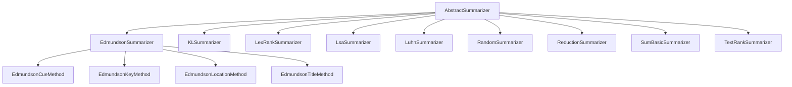

# `sumy.summarizers`

## Tree:
summarizers/
├── _summarizer.py
├── edmundson.py
├── edmundson_cue.py
├── edmundson_key.py
├── edmundson_location.py
├── edmundson_title.py
├── kl.py
├── lex_rank.py
├── lsa.py
├── luhn.py
├── random.py
├── reduction.py
├── sum_basic.py
└── text_rank.py

## Role:
Provides implementations of various automatic text summarization algorithms for extracting important sentences from documents.

## Description:
This module contains multiple text summarization algorithms that implement different approaches to automatically summarize text documents. Each algorithm follows the same interface defined by the AbstractSummarizer base class, making them interchangeable for use in applications requiring document summarization. The algorithms vary in complexity and approach, from simple statistical methods to sophisticated graph-based and machine learning-inspired techniques.

Primary consumers of this module include the main summarization pipeline components and any application that needs to extract key information from text documents. The module is designed to be cohesive around the shared concept of text summarization algorithms, providing a unified interface for different approaches.

## Components:
*   `AbstractSummarizer` - Base class defining the interface for all summarization algorithms
*   `EdmundsonSummarizer` - Implements Edmundson's method combining multiple criteria (cue, key, title, location)
*   `EdmundsonCueMethod` - Implements cue word-based scoring for summarization
*   `EdmundsonKeyMethod` - Implements key word-based scoring for summarization
*   `EdmundsonLocationMethod` - Implements location-based scoring for summarization
*   `EdmundsonTitleMethod` - Implements title-based scoring for summarization
*   `KLSummarizer` - Implements KL-divergence based summarization
*   `LexRankSummarizer` - Implements graph-based LexRank algorithm
*   `LsaSummarizer` - Implements Latent Semantic Analysis based summarization
*   `LuhnSummarizer` - Implements Luhn's algorithm using chunk-based sentence scoring
*   `RandomSummarizer` - Implements random sentence selection for baseline comparison
*   `ReductionSummarizer` - Implements reduction-based sentence ranking algorithm
*   `SumBasicSummarizer` - Implements SumBasic algorithm for extractive summarization
*   `TextRankSummarizer` - Implements graph-based TextRank algorithm

## Public API:
*   `AbstractSummarizer` - Base class for all summarizers, defines the common interface
*   `EdmundsonSummarizer` - Main Edmundson summarizer combining multiple criteria
*   `KLSummarizer` - KL-divergence based summarization algorithm
*   `LexRankSummarizer` - Graph-based LexRank algorithm
*   `LsaSummarizer` - Latent Semantic Analysis based summarization
*   `LuhnSummarizer` - Chunk-based sentence scoring algorithm
*   `RandomSummarizer` - Random sentence selection for baseline comparison
*   `ReductionSummarizer` - Reduction-based sentence ranking algorithm
*   `SumBasicSummarizer` - SumBasic extractive summarization algorithm
*   `TextRankSummarizer` - Graph-based TextRank algorithm

## Dependencies:
*   Internal: `_summarizer` - Provides base `AbstractSummarizer` class and helper utilities
*   External: `numpy` - Required by LexRankSummarizer and LsaSummarizer for numerical operations
*   External: `scipy` - Required by LsaSummarizer for singular value decomposition
*   External: `collections.Counter` - Used for frequency counting in several algorithms
*   External: `math` - Used for mathematical operations in various algorithms

## Constraints:
*   All summarizers must be initialized with a valid stemmer callable
*   Some algorithms require NumPy to be installed (LexRankSummarizer, LsaSummarizer)
*   EdmundsonSummarizer requires proper configuration of bonus/stigma/null words for its constituent methods
*   Algorithms expect document objects with specific properties (sentences, words, headings, paragraphs)
*   Thread safety is not guaranteed for stateful summarizers that modify internal state
*   Some algorithms may have performance implications with very large documents due to computational complexity

---

## Files

- [`_summarizer.py`](summarizers/_summarizer.md)
- [`edmundson.py`](summarizers/edmundson.md)
- [`edmundson_cue.py`](summarizers/edmundson_cue.md)
- [`edmundson_key.py`](summarizers/edmundson_key.md)
- [`edmundson_location.py`](summarizers/edmundson_location.md)
- [`edmundson_title.py`](summarizers/edmundson_title.md)
- [`kl.py`](summarizers/kl.md)
- [`lex_rank.py`](summarizers/lex_rank.md)
- [`lsa.py`](summarizers/lsa.md)
- [`luhn.py`](summarizers/luhn.md)
- [`random.py`](summarizers/random.md)
- [`reduction.py`](summarizers/reduction.md)
- [`sum_basic.py`](summarizers/sum_basic.md)
- [`text_rank.py`](summarizers/text_rank.md)

