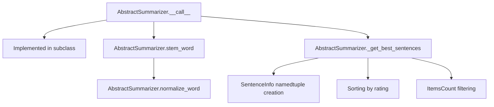

# `_summarizer.py`

## `sumy.summarizers._summarizer.AbstractSummarizer` · *class*

## Summary:
Abstract base class for text summarization algorithms that provides common functionality for stemmer management and sentence ranking.

## Description:
The AbstractSummarizer serves as a foundation for concrete summarization implementations. It provides shared utilities such as word stemming, normalization, and sentence ranking capabilities. Concrete subclasses must implement the `__call__` method to define specific summarization algorithms.

## State:
- `_stemmer`: callable object used for stemming words; initialized via constructor parameter with default value `null_stemmer`
- The class maintains no other persistent state beyond the stemmer

## Lifecycle:
- Creation: Instantiate with optional custom stemmer (must be callable); raises ValueError if stemmer is not callable
- Usage: Call instance with document and desired sentence count to generate summary
- Destruction: No special cleanup required; uses standard Python garbage collection

## Method Map:


## Raises:
- `ValueError`: When the provided stemmer is not callable during initialization

## Example:
```python
# Basic usage pattern
summarizer = AbstractSummarizer()  # Uses default null_stemmer
# Concrete implementation would be used in practice:
# concrete_summarizer = SomeConcreteSummarizer()
# summary = concrete_summarizer(document, 5)
```

### `sumy.summarizers._summarizer.AbstractSummarizer.__init__` · *method*

## Summary:
Initializes the abstract summarizer with a stemmer for text processing.

## Description:
Configures the summarizer instance with a stemmer function that will be used for normalizing words during the summarization process. This method validates that the provided stemmer is callable and stores it as an instance attribute for later use in text processing operations.

## Args:
    stemmer (callable): A callable object that performs stemming operations on text tokens. Defaults to null_stemmer from nlp.stemmers module.

## Returns:
    None: This method does not return any value.

## Raises:
    ValueError: Raised when the provided stemmer argument is not callable.

## State Changes:
    Attributes READ: None
    Attributes WRITTEN: self._stemmer

## Constraints:
    Preconditions: The stemmer parameter must be a callable object that accepts text tokens and returns stemmed versions.
    Postconditions: The instance will have its _stemmer attribute set to the provided stemmer function.

## Side Effects:
    None: This method performs no I/O operations or external service calls.

### `sumy.summarizers._summarizer.AbstractSummarizer.__call__` · *method*

## Summary:
Abstract method that must be implemented by subclasses to perform document summarization.

## Description:
This method serves as the interface for the summarization algorithm. As an abstract method in the base class, it must be overridden by concrete implementations to provide specific summarization functionality. The method takes a document and specifies how many sentences should be included in the resulting summary.

## Args:
    document (Document): The input document to summarize, typically containing a collection of sentences.
    sentences_count (int or str): The desired number of sentences in the summary. Can be an integer count or a percentage string (e.g., "30%").

## Returns:
    tuple[Sentences]: A tuple of sentences forming the summary, ordered according to their importance in the original document.

## Raises:
    NotImplementedError: Raised by this base implementation to indicate that subclasses must override this method.

## State Changes:
    Attributes READ: None
    Attributes WRITTEN: None

## Constraints:
    Preconditions: 
    - The document parameter must be a valid Document object containing sentences
    - The sentences_count parameter must be a positive integer or valid percentage string
    
    Postconditions:
    - The returned tuple contains sentences from the original document
    - The number of sentences in the result matches the requested count or percentage

## Side Effects:
    None

### `sumy.summarizers._summarizer.AbstractSummarizer.stem_word` · *method*

## Summary:
Normalizes and stems a word using the summarizer's configured stemmer.

## Description:
Processes a word through normalization (unicode conversion and lowercase) followed by stemming. This method serves as a central point for word processing throughout the summarization pipeline, ensuring consistent text preprocessing across different summarization algorithms.

## Args:
    word (str): The input word to be normalized and stemmed.

## Returns:
    str: The stemmed version of the normalized input word.

## Raises:
    None explicitly raised by this method.

## State Changes:
    Attributes READ: self._stemmer, self.normalize_word
    Attributes WRITTEN: None

## Constraints:
    Preconditions: The word parameter must be a string that can be processed by the normalize_word method.
    Postconditions: The returned value is the stemmed version of the normalized input word.

## Side Effects:
    None

### `sumy.summarizers._summarizer.AbstractSummarizer.normalize_word` · *method*

## Summary:
Normalizes a word by converting it to Unicode and lowercasing it for consistent text processing.

## Description:
This method transforms input text into a standardized format by first converting it to Unicode encoding and then converting it to lowercase. This normalization is essential for text comparison and matching operations in summarization algorithms where case and encoding variations should not affect results.

## Args:
    word (str or bytes): The input word or text to normalize. Can be a string or bytes object.

## Returns:
    str: The normalized word as a Unicode lowercase string.

## Raises:
    None explicitly raised, but underlying `to_unicode` conversion may raise exceptions for invalid byte sequences.

## State Changes:
    None - This is a pure function that doesn't modify object state.

## Constraints:
    Preconditions: Input should be a string or bytes object that can be converted to Unicode.
    Postconditions: Returned value is always a lowercase Unicode string.

## Side Effects:
    None - This function has no side effects beyond the standard string conversion operations.

### `sumy.summarizers._summarizer.AbstractSummarizer._get_best_sentences` · *method*

## Summary:
Selects the best-rated sentences from a collection based on a rating function or dictionary, returning them in their original order.

## Description:
This method identifies the highest-rated sentences from a collection based on either a callable rating function or a dictionary mapping sentences to ratings. It handles various count specifications (integer, percentage string, or callable) and ensures returned sentences maintain their original ordering by performing two-stage sorting: first by rating (highest first), then by original position.

## Args:
    sentences (iterable): Collection of sentences to evaluate.
    count (int, float, str, or callable): Number of sentences to select. Can be an integer (absolute count), percentage string (e.g., "50%"), or callable that filters the ranked sentences.
    rating (callable or dict): Function that rates sentences or dictionary mapping sentences to their ratings.
    *args: Additional positional arguments passed to the rating function.
    **kwargs: Additional keyword arguments passed to the rating function.

## Returns:
    tuple: A tuple of selected sentences ordered by their original positions in the input collection.

## Raises:
    AssertionError: When rating is a dictionary and additional args/kwargs are provided.
    ValueError: When count value is unsupported.

## State Changes:
    None

## Constraints:
    Preconditions:
        - Sentences must be iterable
        - Rating must be either callable or dict
        - If rating is dict, args and kwargs must be empty
        - Count must be a supported type (int, float, str, or callable)
    Postconditions:
        - Returns exactly the requested number of sentences (or fewer if insufficient)
        - Sentences in result maintain their original order from input

## Side Effects:
    None

