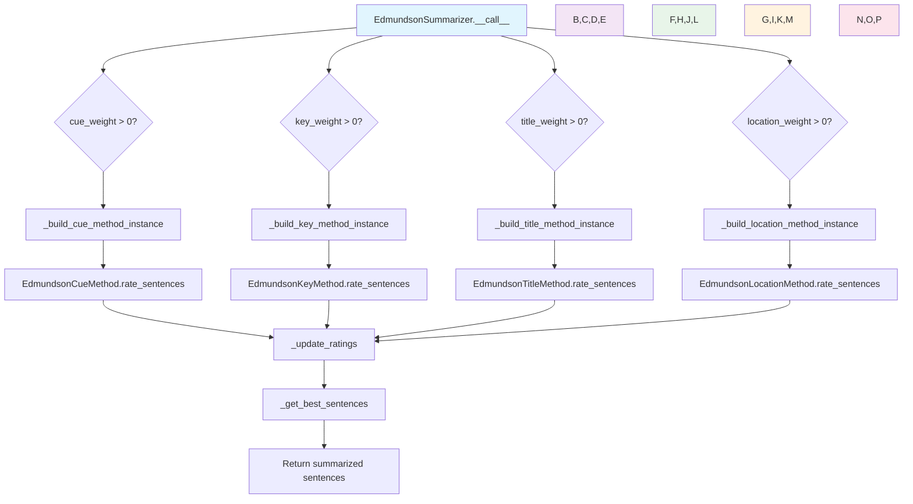

# `edmundson.py`

## `sumy.summarizers.edmundson.EdmundsonSummarizer` · *class*

## Summary:
Implements the Edmundson summarization algorithm that combines multiple scoring methods (cue, key, title, location) to rank sentences for summarization.

## Description:
The EdmundsonSummarizer applies multiple text summarization techniques simultaneously, each weighted according to configurable parameters. It combines scoring from four different Edmundson-based methods: cue words analysis, key word frequency analysis, title-based positioning, and location-based positioning. This class serves as a unified interface for Edmundson-style summarization approaches, allowing users to configure different weighting schemes for various summarization strategies. It inherits from AbstractSummarizer, providing the standard summarization interface.

## State:
- `_bonus_words`: frozenset of stemmed words that boost sentence scores (used by cue method)
- `_stigma_words`: frozenset of stemmed words that penalize sentence scores (used by cue method)  
- `_null_words`: frozenset of stemmed words that influence sentence positioning (used by title and location methods)
- `_cue_weight`: float weight for cue method contribution (default 1.0)
- `_key_weight`: float weight for key method contribution (default 0.0)
- `_title_weight`: float weight for title method contribution (default 1.0)
- `_location_weight`: float weight for location method contribution (default 1.0)
- `_stemmer`: stemming function applied to words before processing

## Lifecycle:
- Creation: Instantiate with optional stemmer and weight parameters; weights must be non-negative
- Usage: Call instance with document and desired sentence count, or call specific methods
- Destruction: No special cleanup required (uses standard Python garbage collection)

## Method Map:


## Raises:
- ValueError: When negative weights are provided during initialization
- ValueError: When bonus_words, stigma_words, or null_words are empty when required by specific methods

## Example:
```python
from sumy.summarizers.edmundson import EdmundsonSummarizer
from sumy.nlp.stemmers import null_stemmer

# Create summarizer with custom weights
summarizer = EdmundsonSummarizer(
    stemmer=null_stemmer,
    cue_weight=1.0,
    key_weight=0.5,
    title_weight=1.0,
    location_weight=0.8
)

# Set required word collections for methods that need them
summarizer.bonus_words = ['important', 'significant', 'crucial']
summarizer.stigma_words = ['however', 'but', 'although']
summarizer.null_words = ['the', 'and', 'or']

# Summarize document
summary = summarizer(document, 3)

# Or use specific methods
cue_summary = summarizer.cue_method(document, 3)
key_summary = summarizer.key_method(document, 3)
```

### `sumy.summarizers.edmundson.EdmundsonSummarizer.__init__` · *method*

## Summary:
Initializes an EdmundsonSummarizer instance with configurable weighting parameters for different summarization methods.

## Description:
Configures the Edmundson summarizer with a stemmer and weight coefficients for cue, key, title, and location methods. This constructor validates that all weight parameters are non-negative and stores them as floating-point values for use in the summarization process.

## Args:
    stemmer (callable): A callable object used for stemming words. Defaults to null_stemmer.
    cue_weight (float): Weight coefficient for cue-based sentence scoring. Defaults to 1.0.
    key_weight (float): Weight coefficient for key-term-based sentence scoring. Defaults to 0.0.
    title_weight (float): Weight coefficient for title-based sentence scoring. Defaults to 1.0.
    location_weight (float): Weight coefficient for location-based sentence scoring. Defaults to 1.0.

## Returns:
    None: This is a constructor method that initializes object state.

## Raises:
    ValueError: If any of the weight parameters (cue_weight, key_weight, title_weight, location_weight) are negative.

## State Changes:
    Attributes READ: None
    Attributes WRITTEN: 
        - self._cue_weight: Stores the cue weight as a float
        - self._key_weight: Stores the key weight as a float  
        - self._title_weight: Stores the title weight as a float
        - self._location_weight: Stores the location weight as a float
        - self._stemmer: Inherited from parent class AbstractSummarizer

## Constraints:
    Preconditions: All weight parameters must be greater than or equal to zero.
    Postconditions: All weight parameters are stored as float values in the instance.

## Side Effects:
    None: This method performs no I/O operations or external service calls.

### `sumy.summarizers.edmundson.EdmundsonSummarizer._ensure_correct_weights` · *method*

## Summary:
Validates that all provided weight values are non-negative, raising an error if any are negative.

## Description:
This private validation method ensures that all weight parameters passed to the Edmundson summarizer are non-negative values. It is called during the initialization or configuration phase of the summarizer to prevent invalid weight settings that could lead to unexpected behavior in the text summarization process.

## Args:
    *weights (float): Variable number of weight values to validate. Each weight must be a numeric value.

## Returns:
    None: This method does not return any value.

## Raises:
    ValueError: Raised when any of the provided weight values is less than 0.0 with the message "Negative weights are not allowed."

## State Changes:
    Attributes READ: None
    Attributes WRITTEN: None

## Constraints:
    Preconditions: All arguments must be numeric values that can be compared to 0.0
    Postconditions: All provided weights are guaranteed to be >= 0.0 after successful execution

## Side Effects:
    None: This method performs only validation and has no side effects beyond raising exceptions.

### `sumy.summarizers.edmundson.EdmundsonSummarizer.bonus_words` · *method*

## Summary:
Sets the bonus words for sentence scoring by stemming and freezing the input collection.

## Description:
Configures the bonus words used in Edmundson summarization to identify important sentences. This method processes a collection of words through the stemmer (inherited from AbstractSummarizer) and stores them as an immutable frozenset for efficient lookup during sentence rating calculations. Bonus words are typically significant terms that increase sentence scores.

## Args:
    collection (iterable[str]): Collection of words to be used as bonus words for sentence scoring.

## Returns:
    None: This method does not return a value.

## Raises:
    None: This method does not explicitly raise exceptions.

## State Changes:
    Attributes READ: None
    Attributes WRITTEN: self._bonus_words

## Constraints:
    Preconditions: The collection parameter should contain words that are meaningful for identifying important sentences in the document.
    Postconditions: The self._bonus_words attribute is updated to contain a frozenset of stemmed versions of the input words.

## Side Effects:
    None: This method performs no I/O operations or external service calls. It only modifies the object's internal state.

### `sumy.summarizers.edmundson.EdmundsonSummarizer.stigma_words` · *method*

## Summary:
Sets the stigma words for Edmundson summarization by converting input words to their stemmed forms and storing them as an immutable frozenset.

## Description:
This method serves as a setter property for the `_stigma_words` attribute in the EdmundsonSummarizer class. It processes a collection of words by applying the stemmer to each word and stores the result as an immutable frozenset. Stigma words are used in Edmundson's summarization technique to penalize sentences containing these words, typically representing less important or redundant terms.

## Args:
    collection (iterable): An iterable collection of words to be processed as stigma words.

## Returns:
    None: This method does not return a value.

## Raises:
    None explicitly raised, but may propagate exceptions from `self.stem_word()` or `frozenset()` construction.

## State Changes:
    Attributes READ: None
    Attributes WRITTEN: `self._stigma_words`

## Constraints:
    Preconditions: The collection parameter should be iterable and contain valid words for stemming.
    Postconditions: `self._stigma_words` will contain a frozenset of stemmed versions of the input words.

## Side Effects:
    None: This method performs no I/O operations or external service calls. It only modifies the object's internal state.

### `sumy.summarizers.edmundson.EdmundsonSummarizer.null_words` · *method*

## Summary:
Sets the collection of words that should be ignored or treated neutrally during Edmundson summarization.

## Description:
This method configures the set of words that will be considered "null" in the Edmundson summarization approach. These words are typically stop words or common words that shouldn't contribute positively or negatively to sentence scoring. The method processes the input collection by stemming each word using the summarizer's stemmer and stores the result as an immutable frozenset in the instance variable `_null_words`.

This method is part of the Edmundson summarization framework which uses weighted approaches based on cue words, key words, title words, and location words to rank sentences for summarization.

## Args:
    collection (iterable): A collection of words (strings) to be treated as null words in the summarization process.

## Returns:
    None: This method does not return a value.

## Raises:
    None explicitly raised, but may raise exceptions from:
    - `self.stem_word()` if the collection contains non-string elements
    - `frozenset()` construction if the collection is not iterable

## State Changes:
    Attributes READ: None
    Attributes WRITTEN: `self._null_words`

## Constraints:
    Preconditions: 
    - The `collection` parameter must be iterable
    - Each item in the collection should be convertible to a string for stemming
    
    Postconditions:
    - `self._null_words` is set to a frozenset containing the stemmed versions of all words in the input collection
    - All words in the collection are processed through `self.stem_word()` before being stored

## Side Effects:
    None: This method performs no I/O operations or external service calls. It only modifies internal state.

### `sumy.summarizers.edmundson.EdmundsonSummarizer.__call__` · *method*

## Summary:
Rates sentences using multiple Edmundson methods and returns the highest-rated sentences from a document.

## Description:
This method implements the core summarization logic of the Edmundson approach by applying weighted scoring methods to rate sentences in a document. It conditionally applies cue, key, title, and location methods based on their respective weight parameters, aggregates the ratings, and selects the best sentences according to the specified count. This method serves as the main interface for performing Edmundson-based document summarization.

## Args:
    document: Document object containing sentences to summarize
    sentences_count: Integer specifying number of sentences to return, or a callable that filters sentences

## Returns:
    tuple[Sentence]: A tuple of Sentence objects representing the most important sentences in the document, ordered by importance rating

## Raises:
    ValueError: If any of the required word sets (bonus_words, stigma_words, null_words) are empty when their respective methods are used, or if negative weights are provided

## State Changes:
    Attributes READ: _cue_weight, _key_weight, _title_weight, _location_weight
    Attributes WRITTEN: None

## Constraints:
    Preconditions: 
    - Document must contain sentences to summarize
    - All required word sets (bonus_words, stigma_words, null_words) must be properly initialized if their respective weights are greater than 0.0
    - Weights must be non-negative values
    Postconditions:
    - Returns exactly sentences_count sentences (or fewer if document has fewer sentences)
    - Sentences are ordered by their importance rating in descending order

## Side Effects:
    None

### `sumy.summarizers.edmundson.EdmundsonSummarizer._update_ratings` · *method*

## Summary:
Updates sentence ratings by accumulating new ratings with existing ones.

## Description:
This private method accumulates ratings from different Edmundson scoring methods (cue, key, title, location) by adding new ratings to existing ratings for each sentence. It's used internally by the EdmundsonSummarizer to combine scores from multiple weighting strategies.

The method is called during the summarization process in the `__call__` method, where it aggregates ratings from each of the four Edmundson methods (cue, key, title, location) to build a comprehensive score for each sentence.

## Args:
    ratings (defaultdict(int)): Dictionary mapping sentences to their accumulated ratings
    new_ratings (dict): Dictionary mapping sentences to new ratings to be added

## Returns:
    defaultdict(int): Updated ratings dictionary with new ratings added to existing ones

## Raises:
    AssertionError: When the length of ratings and new_ratings differ and neither is empty

## State Changes:
    Attributes READ: None
    Attributes WRITTEN: None

## Constraints:
    Preconditions: 
    - Either both `ratings` and `new_ratings` are empty, or they both have the same number of elements
    - `ratings` should be a defaultdict(int) or similar dictionary-like object
    - `new_ratings` should be a dictionary mapping sentences to numeric ratings
    
    Postconditions:
    - All sentences in `new_ratings` will have their ratings updated in `ratings`
    - The returned dictionary contains the accumulated ratings

## Side Effects:
    None

### `sumy.summarizers.edmundson.EdmundsonSummarizer.cue_method` · *method*

## Summary:
Computes sentence ratings using cue-based weighting and returns the highest-rated sentences from a document.

## Description:
This method implements the cue-based summarization approach by building a cue method instance and applying it to rate sentences in the document. It uses bonus words (positive cues) and stigma words (negative cues) to assign weights to sentences based on their content.

## Args:
    document: The input document containing sentences to be rated.
    sentences_count: Number of top-rated sentences to return, or a callable filter.
    bonus_word_value (float): Weight multiplier for bonus words. Defaults to 1.0.
    stigma_word_value (float): Weight multiplier for stigma words. Defaults to 1.0.

## Returns:
    tuple: A tuple of the highest-rated sentences from the document, ordered by rating.

## Raises:
    ValueError: If bonus_words or stigma_words have not been set on the summarizer instance.

## State Changes:
    Attributes READ: _bonus_words, _stigma_words
    Attributes WRITTEN: None

## Constraints:
    Preconditions: 
    - The summarizer instance must have bonus_words and stigma_words set
    - The document must contain sentences to rate
    Postconditions:
    - Returns exactly sentences_count sentences (or filtered subset if sentences_count is callable)
    - Sentences are ordered by their computed cue-based ratings in descending order

## Side Effects:
    None

### `sumy.summarizers.edmundson.EdmundsonSummarizer._build_cue_method_instance` · *method*

## Summary:
Creates and returns an EdmundsonCueMethod instance configured with the summarizer's stemmer, bonus words, and stigma words.

## Description:
This method serves as a factory for creating EdmundsonCueMethod instances. It validates that bonus and stigma words have been set before constructing the cue method instance. The cue method implements the Edmundson approach to text summarization that rates sentences based on the presence of bonus words (positive indicators) and stigma words (negative indicators).

## Args:
    None

## Returns:
    EdmundsonCueMethod: An initialized instance of the cue method class configured with the summarizer's stemmer, bonus words, and stigma words.

## Raises:
    ValueError: When bonus_words or stigma_words are empty (not set), as validated by __check_bonus_words() and __check_stigma_words() respectively.

## State Changes:
    Attributes READ: self._stemmer, self._bonus_words, self._stigma_words
    Attributes WRITTEN: None

## Constraints:
    Preconditions: 
    - Bonus words must be set via the bonus_words property before calling this method
    - Stigma words must be set via the stigma_words property before calling this method
    
    Postconditions:
    - Returns a valid EdmundsonCueMethod instance with proper initialization
    - The returned instance is ready to be used for sentence rating and summarization

## Side Effects:
    None

### `sumy.summarizers.edmundson.EdmundsonSummarizer.key_method` · *method*

## Summary:
Ranks sentences using key word frequency analysis and returns a specified number of top-ranked sentences based on bonus word significance.

## Description:
This method implements the key word-based summarization approach from Edmundson's technique. It analyzes document sentences for occurrences of bonus words and ranks them based on weighted significance. The method serves as a standalone summarization technique that can be combined with other Edmundson methods in the main `__call__` method.

The method accepts flexible sentence count specifications:
- Integer: Returns exactly that many sentences
- Percentage string (e.g., "20%"): Returns that percentage of total sentences
- Callable predicate: Returns sentences that satisfy the predicate condition

## Args:
    document: The input document containing sentences to summarize
    sentences_count: Number of sentences to return, can be an integer, percentage string (e.g., "20%"), or callable predicate function
    weight: Weight threshold for considering words as significant (float, default: 0.5)

## Returns:
    tuple: A tuple of sentence objects ordered by their key word significance scores, with length determined by sentences_count parameter

## Raises:
    ValueError: When bonus words have not been set (empty bonus_words collection)

## State Changes:
    Attributes READ: _bonus_words, _stemmer
    Attributes WRITTEN: None

## Constraints:
    Preconditions: Bonus words must be set via the bonus_words property before calling this method
    Postconditions: Returns exactly the requested number of sentences (or fewer if document is shorter), with sentences ordered by significance score

## Side Effects:
    None

### `sumy.summarizers.edmundson.EdmundsonSummarizer._build_key_method_instance` · *method*

## Summary:
Creates and returns an EdmundsonKeyMethod instance configured with the summarizer's stemmer and bonus words.

## Description:
This method constructs an EdmundsonKeyMethod instance that can be used to rate sentences based on key word frequency. It ensures bonus words are properly set before creating the method instance, following the same pattern as other build methods in the class.

## Args:
    None

## Returns:
    EdmundsonKeyMethod: An instance of EdmundsonKeyMethod configured with the current stemmer and bonus words.

## Raises:
    ValueError: If the bonus_words attribute is empty (not set), as checked by __check_bonus_words().

## State Changes:
    Attributes READ: self._stemmer, self._bonus_words
    Attributes WRITTEN: None

## Constraints:
    Preconditions: The bonus_words property must be set with a non-empty collection of words before calling this method.
    Postconditions: Returns a valid EdmundsonKeyMethod instance ready for use in sentence rating.

## Side Effects:
    None

### `sumy.summarizers.edmundson.EdmundsonSummarizer._build_title_method_instance` · *method*

## Summary:
Creates and returns an EdmundsonTitleMethod instance configured with the summarizer's stemmer and null words.

## Description:
This private factory method constructs an EdmundsonTitleMethod instance using the current summarizer's stemmer and null words configuration. It ensures that null words are properly initialized before creating the method instance, which is essential for title-based sentence scoring in the Edmundson summarization approach.

The method is invoked during the main summarization process when the title weight component is enabled (_title_weight > 0.0) to compute sentence ratings based on significant words found in document headings.

## Args:
    None

## Returns:
    EdmundsonTitleMethod: A configured instance of the title-based summarization method

## Raises:
    ValueError: When null_words is empty (not set), triggered by the __check_null_words() validation

## State Changes:
    Attributes READ: self._stemmer, self._null_words
    Attributes WRITTEN: None

## Constraints:
    Preconditions: 
    - self._null_words must be set (not empty) before calling this method
    - self._stemmer must be properly initialized
    
    Postconditions: 
    - Returns a valid EdmundsonTitleMethod instance
    - The returned instance is configured with current stemmer and null_words

## Side Effects:
    None

### `sumy.summarizers.edmundson.EdmundsonSummarizer.location_method` · *method*

## Summary:
Computes sentence ratings based on location-based features and returns the highest-rated sentences from a document.

## Description:
This method implements the location-based summarization approach from Edmundson's technique, where sentence importance is determined by their position within paragraphs and the document structure. It builds a location-specific summarization instance and applies it to rate sentences according to positional weights.

The method is part of the EdmundsonSummarizer class and is used to apply location-based weighting to sentences during the summarization process.

## Args:
    document (Document): The input document containing sentences and paragraphs to summarize.
    sentences_count (int or callable): Number of sentences to return or a predicate function to filter sentences.
    w_h (float): Weight for heading significance (default: 1.0).
    w_p1 (float): Weight for first paragraph sentences (default: 1.0).
    w_p2 (float): Weight for last paragraph sentences (default: 1.0).
    w_s1 (float): Weight for first sentence in paragraph (default: 1.0).
    w_s2 (float): Weight for last sentence in paragraph (default: 1.0).

## Returns:
    tuple[Sentence]: A tuple of the highest-rated sentences from the document, ordered by importance.

## Raises:
    ValueError: If null words have not been set via the null_words property before calling this method.

## State Changes:
    Attributes READ: self._null_words
    Attributes WRITTEN: None

## Constraints:
    Preconditions: 
    - The null_words property must be set with a collection of words before calling this method
    - Document must contain valid sentences and paragraphs
    - All weight parameters must be non-negative numbers
    
    Postconditions:
    - Returns exactly sentences_count sentences (or fewer if document is too short)
    - Sentences are returned in order of their computed importance ratings

## Side Effects:
    None

### `sumy.summarizers.edmundson.EdmundsonSummarizer._build_location_method_instance` · *method*

## Summary:
Creates and returns an EdmundsonLocationMethod instance configured with the summarizer's stemmer and null words.

## Description:
This method serves as a factory for creating EdmundsonLocationMethod instances. It ensures that null words are properly initialized before constructing the location-based summarization method. The method is called during the summarization process when location-weighted scoring is enabled, and it's also used by the dedicated location_method() interface.

## Args:
    None

## Returns:
    EdmundsonLocationMethod: An initialized instance of the location-based summarization method.

## Raises:
    ValueError: When null_words is empty, triggered by the __check_null_words() call.

## State Changes:
    Attributes READ: self._stemmer, self._null_words
    Attributes WRITTEN: None

## Constraints:
    Preconditions: 
    - self._null_words must be set (not empty) before calling this method
    - self._stemmer must be properly initialized
    
    Postconditions:
    - Returns a valid EdmundsonLocationMethod instance
    - The returned instance is configured with the current stemmer and null words

## Side Effects:
    None

### `sumy.summarizers.edmundson.EdmundsonSummarizer.__check_bonus_words` · *method*

## Summary:
Validates that bonus words have been set before building summarization methods that require them.

## Description:
This private method ensures that the `_bonus_words` attribute contains actual words before proceeding with the creation of cue-based or key-based summarization methods. It's called internally by the summarizer to prevent runtime errors when bonus words are unexpectedly empty.

The method is invoked during the construction of summarization method instances in `_build_cue_method_instance()` and `_build_key_method_instance()`.

## Args:
    None

## Returns:
    None

## Raises:
    ValueError: When `self._bonus_words` is empty (evaluates to False), indicating that bonus words have not been set via the `bonus_words` property setter.

## State Changes:
    Attributes READ: self._bonus_words
    Attributes WRITTEN: None

## Constraints:
    Preconditions: The `bonus_words` property must be set with a collection of words before calling this method.
    Postconditions: Either the method completes silently or raises a ValueError with a descriptive message.

## Side Effects:
    None

### `sumy.summarizers.edmundson.EdmundsonSummarizer.__check_stigma_words` · *method*

## Summary:
Validates that the stigma words collection is not empty before proceeding with summarization.

## Description:
This private method performs a validation check to ensure that the stigma_words attribute has been properly initialized with a non-empty collection. It is called during the summarization process to prevent operations on an empty stigma word set, which would lead to incorrect results.

## Args:
    None

## Returns:
    None

## Raises:
    ValueError: When the '_stigma_words' attribute is empty (evaluates to False in boolean context), indicating that stigma words have not been set.

## State Changes:
    Attributes READ: self._stigma_words
    Attributes WRITTEN: None

## Constraints:
    Preconditions: The EdmundsonSummarizer instance must have the '_stigma_words' attribute initialized (even if empty) before this method is called.
    Postconditions: If this method completes successfully, the '_stigma_words' attribute contains at least one stigma word.

## Side Effects:
    None

### `sumy.summarizers.edmundson.EdmundsonSummarizer.__check_null_words` · *method*

## Summary:
Validates that the null words collection is properly initialized before building title or location methods.

## Description:
This private validation method ensures that the `_null_words` attribute contains at least one word before proceeding with the creation of title or location-based summarization methods. It is called internally by `_build_title_method_instance` and `_build_location_method_instance` to prevent runtime errors when these methods require null words for processing.

## Args:
    None

## Returns:
    None

## Raises:
    ValueError: When `self._null_words` is empty or falsy, indicating that the `null_words` property has not been set with a collection of words.

## State Changes:
    Attributes READ: self._null_words
    Attributes WRITTEN: None

## Constraints:
    Preconditions: The `null_words` property must be set with a collection of words before calling this method, or it will raise a ValueError.
    Postconditions: If this method completes successfully, `self._null_words` contains at least one word.

## Side Effects:
    None

