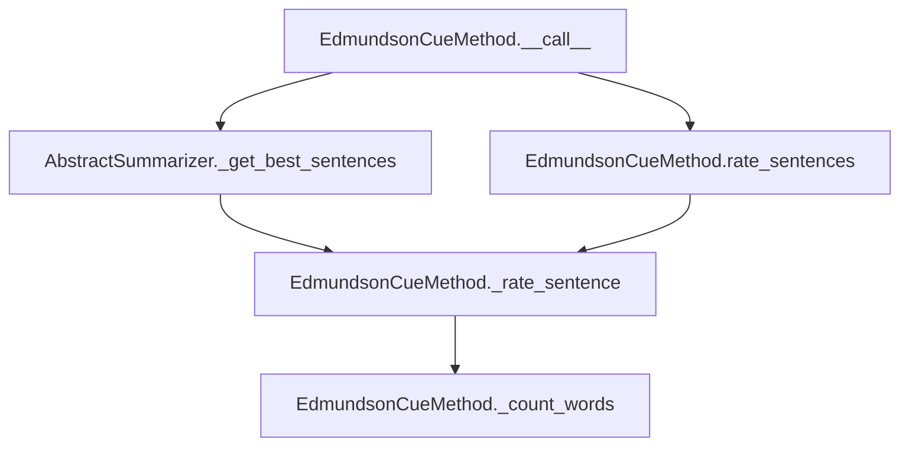

# `edmundson_cue.py`

## `sumy.summarizers.edmundson_cue.EdmundsonCueMethod` · *class*

## Summary:
Implements the Edmundson cue word method for text summarization by rating sentences based on the presence of bonus and stigma words.

## Description:
The EdmundsonCueMethod is a sentence scoring algorithm that evaluates sentences based on the occurrence of predefined bonus words (positive indicators) and stigma words (negative indicators). It assigns positive weights to bonus words and negative weights to stigma words, then computes a net score for each sentence to determine its importance for summarization.

This class is typically instantiated by summarizer factories or configuration parsers that set up the appropriate bonus and stigma word lists for specific domains or applications.

## State:
- `_bonus_words`: Set or list of words considered positive indicators for sentence importance
- `_stigma_words`: Set or list of words considered negative indicators for sentence importance
- `_stemmer`: Callable object used to normalize and stem words for comparison

The class maintains these attributes throughout its lifetime and uses them for sentence rating calculations. The stemmer is inherited from AbstractSummarizer.

## Lifecycle:
- Creation: Instantiate with a stemmer function and two collections of words (bonus_words and stigma_words)
- Usage: Call the instance with document, sentence count, and weighting factors, or use rate_sentences() method
- Destruction: No special cleanup required; relies on Python's garbage collection

## Method Map:


## Raises:
- ValueError: If the stemmer provided to the parent class is not callable (inherited from AbstractSummarizer)

## Example:
```python
# Create the summarizer with custom bonus and stigma words
bonus_words = {'important', 'significant', 'crucial'}
stigma_words = {'unimportant', 'irrelevant', 'minor'}
summarizer = EdmundsonCueMethod(stemmer=porter_stemmer, 
                               bonus_words=bonus_words, 
                               stigma_words=stigma_words)

# Get best sentences from a document
best_sentences = summarizer(document, sentences_count=3, 
                           bonus_word_weight=2.0, stigma_word_weight=1.5)

# Rate all sentences in a document
sentence_ratings = summarizer.rate_sentences(document, 
                                            bonus_word_weight=2.0, 
                                            stigma_word_weight=1.5)
```

### `sumy.summarizers.edmundson_cue.EdmundsonCueMethod.__init__` · *method*

## Summary:
Initializes the Edmundson cue word method with stemmer and cue word collections.

## Description:
Configures the Edmundson summarization method by setting up the stemmer for word normalization and storing bonus and stigma word collections that will be used to rate sentences during the summarization process. This method establishes the core linguistic resources needed for cue-based sentence scoring.

## Args:
    stemmer (callable): A callable object that performs stemming operations on words. Must be callable and typically accepts a string argument.
    bonus_words (iterable): Collection of words that increase sentence ratings when present. These words are considered positive cues for important sentences.
    stigma_words (iterable): Collection of words that decrease sentence ratings when present. These words are considered negative cues for less important sentences.

## Returns:
    None: This method initializes instance variables and does not return a value.

## Raises:
    ValueError: Raised by the parent AbstractSummarizer class if the stemmer parameter is not callable.

## State Changes:
    Attributes READ: None
    Attributes WRITTEN: 
        - self._stemmer: Set to the provided stemmer instance
        - self._bonus_words: Set to the provided bonus_words collection
        - self._stigma_words: Set to the provided stigma_words collection

## Constraints:
    Preconditions:
        - The stemmer parameter must be callable
        - bonus_words and stigma_words should be iterable collections of words
    Postconditions:
        - Instance variables _stemmer, _bonus_words, and _stigma_words are properly initialized
        - The object is ready for sentence rating operations

## Side Effects:
    None: This method performs no I/O operations or external service calls. It only initializes internal state.

### `sumy.summarizers.edmundson_cue.EdmundsonCueMethod.__call__` · *method*

## Summary:
Selects the most informative sentences from a document using cue word weighting based on bonus and stigma word counts.

## Description:
This method implements the Edmundson cue-based summarization technique by evaluating sentences based on the presence of bonus words (positive indicators) and stigma words (negative indicators). It leverages the parent class's _get_best_sentences utility to rank and select the top sentences according to their computed ratings.

The method is typically called during the summarization pipeline when a document needs to be condensed into a specified number of sentences using cue word analysis.

## Args:
    document (Document): The input document containing sentences to summarize
    sentences_count (int): The desired number of sentences in the final summary
    bonus_word_weight (float): Weight multiplier for bonus word occurrences
    stigma_word_weight (float): Weight multiplier for stigma word occurrences

## Returns:
    tuple[Sentence]: A tuple of selected sentences ordered by importance, with length equal to sentences_count

## Raises:
    None explicitly raised, but may propagate exceptions from parent class methods or underlying utilities

## State Changes:
    Attributes READ: self._bonus_words, self._stigma_words, self._stemmer
    Attributes WRITTEN: None

## Constraints:
    Preconditions: 
    - Document must have a sentences attribute containing Sentence objects
    - Bonus_word_weight and stigma_word_weight must be numeric values
    - Sentences_count must be a positive integer or callable that accepts a list of SentenceInfo objects
    
    Postconditions:
    - Returns exactly sentences_count sentences (or fewer if document has insufficient sentences)
    - Sentences are ordered by their computed cue-based ratings in descending order

## Side Effects:
    None - This method is pure and doesn't cause any external I/O or state changes beyond returning results

### `sumy.summarizers.edmundson_cue.EdmundsonCueMethod._rate_sentence` · *method*

## Summary:
Rates a sentence based on the presence of bonus and stigma words using weighted scoring.

## Description:
Computes a numerical score for a sentence by counting occurrences of bonus words and stigma words, then applying weighted penalties and rewards. This method is used internally by the Edmundson cue-based summarization approach to rank sentences for inclusion in the final summary.

## Args:
    sentence: A sentence object containing words to analyze
    bonus_word_weight (float): Weight multiplier applied to bonus word counts
    stigma_word_weight (float): Weight multiplier applied to stigma word counts

## Returns:
    float: The computed sentence rating, where higher values indicate better sentences. Positive ratings favor bonus words, negative ratings favor stigma words.

## State Changes:
    Attributes READ: self._bonus_words, self._stigma_words
    Attributes WRITTEN: None

## Constraints:
    Preconditions: 
    - sentence must have a words attribute containing iterable of words
    - bonus_word_weight and stigma_word_weight must be numeric values
    - self._bonus_words and self._stigma_words must be initialized collections
    
    Postconditions:
    - Returns a numeric value representing sentence quality score
    - The score reflects relative balance between bonus and stigma words

## Side Effects:
    None

### `sumy.summarizers.edmundson_cue.EdmundsonCueMethod._count_words` · *method*

## Summary:
Counts occurrences of bonus and stigma words in a collection of words.

## Description:
This private helper method analyzes a collection of words to determine how many belong to the predefined bonus word set and stigma word set. It's used internally by the Edmundson cue-based summarization algorithm to calculate sentence ratings.

The method is called during sentence scoring in the `_rate_sentence` method as part of the Edmundson cue-based summarization approach, where bonus words contribute positively to sentence scores while stigma words contribute negatively.

## Args:
    words (iterable): Collection of words to analyze for bonus/stigma word matches

## Returns:
    tuple[int, int]: A tuple containing (bonus_words_count, stigma_words_count) representing the number of bonus and stigma words found respectively

## Raises:
    None explicitly raised

## State Changes:
    Attributes READ: self._bonus_words, self._stigma_words
    Attributes WRITTEN: None

## Constraints:
    Preconditions: 
    - The `words` parameter should be iterable containing string-like objects
    - `self._bonus_words` and `self._stigma_words` should be set-like objects (e.g., sets or frozensets) for efficient lookup
    Postconditions: 
    - Returns a tuple of two non-negative integers
    - The returned counts are bounded by the length of the input words collection

## Side Effects:
    None

### `sumy.summarizers.edmundson_cue.EdmundsonCueMethod.rate_sentences` · *method*

## Summary:
Rates all sentences in a document using bonus and stigma word weights, returning a mapping of sentences to their computed scores.

## Description:
This method computes relevance scores for each sentence in the provided document by counting bonus and stigma words and applying the specified weights. It serves as the core scoring mechanism for Edmundson's cue-based summarization approach, where sentences containing more bonus words (positive indicators) or fewer stigma words (negative indicators) receive higher scores.

The method is typically called during the summarization process when determining which sentences are most representative of the document's content. It's designed to be a standalone method to encapsulate the sentence rating logic, making it reusable and testable independently from the main summarization pipeline.

## Args:
    document (Document): The document object containing sentences to be rated
    bonus_word_weight (float): Weight multiplier for bonus words (default: 1.0)
    stigma_word_weight (float): Weight multiplier for stigma words (default: 1.0)

## Returns:
    dict[Sentence, float]: Dictionary mapping each sentence to its computed rating score

## Raises:
    None explicitly raised

## State Changes:
    Attributes READ: self._bonus_words, self._stigma_words, self._stemmer
    Attributes WRITTEN: None

## Constraints:
    Preconditions:
    - Document must have a sentences attribute containing iterable of Sentence objects
    - Bonus_word_weight and stigma_word_weight must be numeric values
    - self._bonus_words and self._stigma_words must be initialized in the class instance
    
    Postconditions:
    - Returns a dictionary with exactly one entry for each sentence in the document
    - All returned scores are numeric values (int or float)

## Side Effects:
    None

