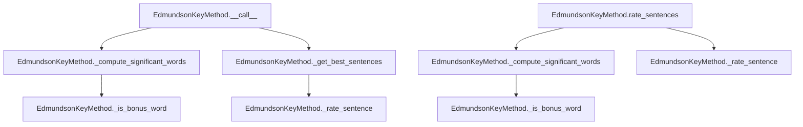

# `edmundson_key.py`

## `sumy.summarizers.edmundson_key.EdmundsonKeyMethod` · *class*

## Summary:
Implements Edmundson's key word method for text summarization by identifying significant words from a predefined bonus word list and using them to rate sentences.

## Description:
The EdmundsonKeyMethod class is a text summarization technique that identifies important words from a predefined set of bonus words and uses their frequency to rate sentences. It's designed to work with the sumy library's summarization framework and inherits from AbstractSummarizer. This method focuses on extracting key information by emphasizing sentences containing frequently occurring bonus words.

## State:
- `_bonus_words`: Set or list of words considered as bonus words that are prioritized for significance calculation. Type: set or list of strings. Valid values: any collection of strings representing important keywords.
- `_stemmer`: Callable object used for stemming words during processing. Type: callable. Invariant: Must be a callable that accepts a string and returns a stemmed string.

## Lifecycle:
- Creation: Instantiate with a stemmer callable and a collection of bonus words (set or list)
- Usage: Call the instance with document, sentences_count, and weight parameters to get summarized sentences, or use rate_sentences() method to get sentence ratings
- Destruction: No special cleanup required; relies on Python's garbage collection

## Method Map:


## Raises:
- ValueError: Raised by parent AbstractSummarizer.__init__ if stemmer is not callable

## Example:
```python
from sumy.summarizers.edmundson_key import EdmundsonKeyMethod
from sumy.nlp.stemmers import null_stemmer

# Create instance with bonus words
bonus_words = {'important', 'key', 'significant', 'crucial'}
summarizer = EdmundsonKeyMethod(null_stemmer, bonus_words)

# Apply to document
# sentences = summarizer(document, 3, 0.5)
# Or get sentence ratings
# ratings = summarizer.rate_sentences(document, 0.5)
```

### `sumy.summarizers.edmundson_key.EdmundsonKeyMethod.__init__` · *method*

## Summary:
Initializes an Edmundson key word method summarizer with a stemmer and bonus words collection.

## Description:
Constructs an EdmundsonKeyMethod instance that implements the Edmundson key word method for text summarization. This method identifies significant words based on a set of bonus words that receive extra weighting in the scoring process. The constructor prepares the summarizer by storing the stemmer for word normalization and the collection of bonus words used to identify important terms.

## Args:
    stemmer (callable): A callable object that performs stemming on words. Must be callable and typically accepts a string argument.
    bonus_words (iterable): A collection of words that are considered bonus words and will receive extra weight in the summarization process.

## Returns:
    None: This method initializes the object's state and does not return a value.

## Raises:
    ValueError: Raised by the parent AbstractSummarizer class when the stemmer parameter is not callable.

## State Changes:
    Attributes READ: None
    Attributes WRITTEN: 
    - self._stemmer: Set to the provided stemmer parameter (inherited from parent)
    - self._bonus_words: Set to the provided bonus_words parameter

## Constraints:
    Preconditions:
    - The stemmer parameter must be callable
    - The bonus_words parameter should be iterable containing strings or compatible word representations
    
    Postconditions:
    - The object is initialized with a valid stemmer for word processing
    - The object stores the bonus_words collection for later use in identifying significant words

## Side Effects:
    None: This method performs no I/O operations or external service calls. It only initializes internal state.

### `sumy.summarizers.edmundson_key.EdmundsonKeyMethod.__call__` · *method*

*No documentation generated.*

### `sumy.summarizers.edmundson_key.EdmundsonKeyMethod._compute_significant_words` · *method*

## Summary:
Computes a tuple of significant words from a document based on frequency thresholds relative to the most frequent word.

## Description:
This private method processes document words to identify significant terms by applying stemming, filtering bonus words, counting frequencies, and returning words that exceed a frequency threshold. It's part of the Edmundson key method summarization approach that identifies important words based on their relative frequency in the document.

## Args:
    document: A document object containing words to process
    weight (float): Threshold ratio for determining significant words, where words must have frequency greater than weight * max_frequency

## Returns:
    tuple: A tuple of significant words (strings) that meet the frequency threshold criteria, or empty tuple if no words qualify

## Raises:
    None explicitly raised

## State Changes:
    Attributes READ: self.stem_word, self._is_bonus_word
    Attributes WRITTEN: None

## Constraints:
    Preconditions: 
    - document must have a words attribute that is iterable
    - weight must be a numeric value >= 0
    - self.stem_word must be callable
    - self._is_bonus_word must be callable
    
    Postconditions:
    - Returns a tuple of strings representing significant words
    - Empty tuple returned when no words meet frequency threshold
    - All returned words have been stemmed and filtered through bonus word criteria

## Side Effects:
    None

### `sumy.summarizers.edmundson_key.EdmundsonKeyMethod._is_bonus_word` · *method*

*No documentation generated.*

### `sumy.summarizers.edmundson_key.EdmundsonKeyMethod._rate_sentence` · *method*

## Summary:
Rates a sentence by counting how many of its stemmed words appear in the set of significant words.

## Description:
This method computes a relevance score for a given sentence by comparing its stemmed words against a predefined set of significant words. It's used as a scoring mechanism in the Edmundson key-based summarization approach to rank sentences based on their importance. The method applies stemming to each word in the sentence before checking membership in the significant words set.

## Args:
    sentence (Sentence): The sentence object containing words to be analyzed
    significant_words (iterable): A collection of stemmed words considered significant for summarization

## Returns:
    int: The count of significant words found in the sentence's stemmed words

## Raises:
    None explicitly raised

## State Changes:
    Attributes READ: None
    Attributes WRITTEN: None

## Constraints:
    Preconditions: 
    - sentence must have a words attribute that is iterable
    - significant_words must support the 'in' operator for membership testing
    Postconditions:
    - Returns a non-negative integer representing the number of matches

## Side Effects:
    None

### `sumy.summarizers.edmundson_key.EdmundsonKeyMethod.rate_sentences` · *method*

## Summary:
Rates all sentences in a document based on significance of words using the Edmundson key method approach.

## Description:
Computes significant words from the document using a weighting threshold, then rates each sentence based on how many significant words it contains. This method is used as part of the Edmundson key-based summarization algorithm to rank sentences for inclusion in the final summary.

## Args:
    document (Document): The document containing sentences to be rated
    weight (float): Weight threshold for determining significant words, defaults to 0.5

## Returns:
    dict[Sentence, int]: Dictionary mapping each sentence to its significance rating

## Raises:
    None explicitly raised

## State Changes:
    Attributes READ: self._bonus_words, self._stemmer
    Attributes WRITTEN: None

## Constraints:
    Preconditions: Document must contain sentences and words; weight must be a valid numeric value between 0 and 1
    Postconditions: Returns a dictionary with all sentences in the document mapped to integer ratings

## Side Effects:
    None

