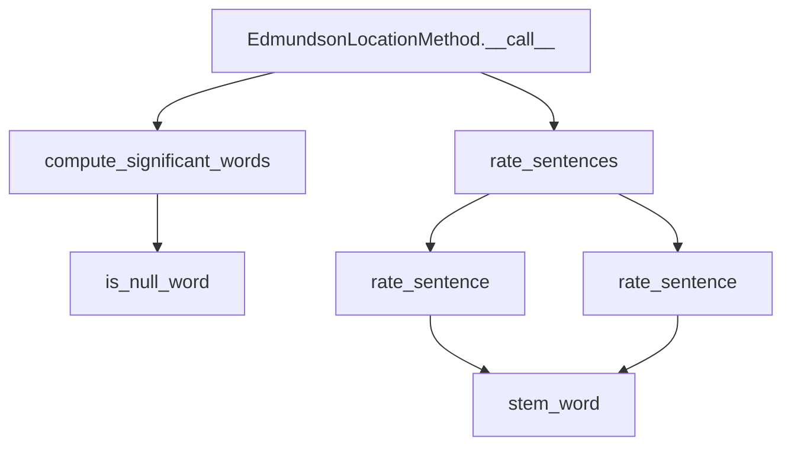

# `edmundson_location.py`

## `sumy.summarizers.edmundson_location.EdmundsonLocationMethod` · *class*

## Summary:
Implements Edmundson's location-based text summarization method that rates sentences based on their position in documents and content significance.

## Description:
The EdmundsonLocationMethod class implements a summarization technique that combines content-based significance with positional weighting. It assigns higher weights to sentences that appear in document headings, beginning and ending paragraphs, and beginning and ending sentences. This class is designed to be used as a summarizer component in text summarization pipelines, particularly for extracting important sentences from structured documents.

## State:
- `_null_words`: frozenset of words that should be excluded from significant word computation
- `_stemmer`: callable object used for stemming words (inherited from AbstractSummarizer)

## Lifecycle:
- Creation: Instantiate with a stemmer function and a set of null words (stop words to ignore)
- Usage: Either call the instance directly with document, sentence count, and weighting parameters, or use the rate_sentences method to compute ratings separately
- Destruction: No special cleanup required; uses standard Python garbage collection

## Method Map:


## Raises:
- ValueError: If the stemmer provided to the constructor is not callable

## Example:
```python
# Create summarizer with a stemmer and null words
from sumy.summarizers.edmundson_location import EdmundsonLocationMethod
from sumy.nlp.stemmers import Stemmer

stemmer = Stemmer('english')
null_words = {'the', 'and', 'or', 'but'}
summarizer = EdmundsonLocationMethod(stemmer, null_words)

# Rate sentences with custom weights
document = ... # Some document object
ratings = summarizer.rate_sentences(document, w_h=2.0, w_p1=1.5, w_p2=1.5, w_s1=1.0, w_s2=1.0)

# Get best sentences using the callable interface
best_sentences = summarizer(document, sentences_count=3, w_h=2.0, w_p1=1.5, w_p2=1.5, w_s1=1.0, w_s2=1.0)
```

### `sumy.summarizers.edmundson_location.EdmundsonLocationMethod.__init__` · *method*

## Summary:
Initializes an Edmundson location-based summarizer with a stemmer and null words list.

## Description:
Constructs an EdmundsonLocationMethod instance that implements a location-based text summarization algorithm. This method extends AbstractSummarizer to provide sentence scoring based on positional heuristics and significant word matching from document headings.

## Args:
    stemmer (callable): A callable object that performs stemming operations on words. Must be a valid stemmer function.
    null_words (iterable): Collection of words that should be filtered out during processing, typically stop words or insignificant terms.

## Returns:
    None: This method initializes the object's internal state and does not return a value.

## Raises:
    ValueError: Raised by the parent AbstractSummarizer class when the stemmer argument is not callable.

## State Changes:
    Attributes READ: None
    Attributes WRITTEN: 
        - self._stemmer: Set to the provided stemmer instance
        - self._null_words: Set to the provided null_words collection

## Constraints:
    Preconditions:
        - The stemmer parameter must be callable
        - The null_words parameter should be iterable containing string-like objects
        
    Postconditions:
        - self._stemmer is initialized with the provided stemmer
        - self._null_words is initialized with the provided null_words collection

## Side Effects:
    None: This method performs no I/O operations or external service calls. It only initializes internal object attributes.

### `sumy.summarizers.edmundson_location.EdmundsonLocationMethod.__call__` · *method*

## Summary:
Computes location-based sentence ratings and returns the highest-rated sentences from a document.

## Description:
Implements the Edmundson location-based summarization approach by computing significant words from document headings, rating sentences based on their position and significance, and returning the top-rated sentences. This method serves as the primary interface for executing location-based document summarization.

## Args:
    document (Document): The input document containing sentences and headings to summarize.
    sentences_count (int): The number of top-rated sentences to return.
    w_h (float): Weight for the significance factor (based on heading words).
    w_p1 (float): Weight for first paragraph sentences.
    w_p2 (float): Weight for last paragraph sentences.
    w_s1 (float): Weight for first sentence in paragraph.
    w_s2 (float): Weight for last sentence in paragraph.

## Returns:
    tuple[Sentence]: A tuple of Sentence objects representing the most important sentences in the document, ordered by their importance.

## Raises:
    None explicitly raised, but may propagate exceptions from underlying methods like _compute_significant_words or _rate_sentences.

## State Changes:
    Attributes READ: None (reads from document properties)
    Attributes WRITTEN: None (does not modify instance state)

## Constraints:
    Preconditions:
        - Document must have valid sentences and headings
        - All weight parameters should be numeric values
        - Sentences_count must be a positive integer
    Postconditions:
        - Returns exactly sentences_count sentences (or fewer if document has insufficient sentences)
        - Sentences are returned in order of appearance in the original document

## Side Effects:
    None - This method is pure and does not cause any I/O operations or external service calls.

### `sumy.summarizers.edmundson_location.EdmundsonLocationMethod._compute_significant_words` · *method*

## Summary:
Computes a frozenset of significant words from document headings after stemming and filtering out null words.

## Description:
This method extracts significant words from document headings by processing each heading's words through stemming and filtering operations. It serves as a utility method to identify important terminology from document structure elements for use in sentence scoring calculations.

The method is called during the summarization process when computing significant words that will be used to rate sentences based on their relevance to document headings.

## Args:
    document: A document object containing headings with words attribute

## Returns:
    frozenset: A frozen set of significant words (after stemming and null word filtering)

## Raises:
    AttributeError: If document does not have a headings attribute
    TypeError: If document.headings contains objects without words attribute

## State Changes:
    Attributes READ: self._null_words, self._stemmer
    Attributes WRITTEN: None

## Constraints:
    Preconditions: 
    - Document must have a headings attribute that is iterable
    - Each heading in document.headings must have a words attribute that is iterable
    - self._null_words must be defined and contain the set of words to filter out
    
    Postconditions:
    - Returns a frozenset of stemmed words
    - All returned words have been filtered to exclude null words

## Side Effects:
    None

### `sumy.summarizers.edmundson_location.EdmundsonLocationMethod._is_null_word` · *method*

## Summary:
Checks if a given word is contained in the collection of null words used for filtering.

## Description:
This method serves as a predicate function to determine whether a word should be excluded from consideration during the summarization process. It's primarily used in the `_compute_significant_words` method to filter out null words from the significant words extracted from document headings.

## Args:
    word (str): The word to check against the null words collection.

## Returns:
    bool: True if the word exists in `self._null_words`, False otherwise.

## State Changes:
    Attributes READ: self._null_words

## Constraints:
    Preconditions: The method assumes `self._null_words` is initialized and contains the set of words to be filtered out.
    Postconditions: The method returns a boolean value indicating membership in the null words collection.

## Side Effects:
    None: This method performs only a membership test and has no side effects.

### `sumy.summarizers.edmundson_location.EdmundsonLocationMethod._rate_sentences` · *method*

## Summary:
Rates sentences in a document based on their positional importance within paragraphs and sentences, applying weighted scoring for location-based significance.

## Description:
This method computes positional ratings for all sentences in a document by combining base sentence ratings with location-based weights. It's called during the summarization process to prioritize sentences based on their position in the document structure. The method separates positional logic from the main summarization workflow, making it reusable and testable independently.

The method is invoked by both the `__call__` method (during summarization) and the `rate_sentences` method (for direct sentence rating), ensuring consistent positional scoring regardless of usage context.

## Args:
    document (Document): The document containing paragraphs and sentences to rate
    significant_words (frozenset): Set of significant words computed from document headings
    w_h (float): Weight multiplier for base sentence ratings
    w_p1 (float): Weight added to sentences in the first paragraph
    w_p2 (float): Weight added to sentences in the last paragraph
    w_s1 (float): Weight added to sentences at the beginning of a paragraph
    w_s2 (float): Weight added to sentences at the end of a paragraph

## Returns:
    dict[Sentence, float]: Dictionary mapping each Sentence object to its computed positional rating score

## Raises:
    None explicitly raised

## State Changes:
    Attributes READ: None
    Attributes WRITTEN: None

## Constraints:
    Preconditions:
        - Document must have valid paragraphs and sentences structure
        - significant_words must be a frozenset of stemmed words
        - All weight parameters should be numeric values
    Postconditions:
        - Returns a dictionary with one entry for each sentence in the document
        - All returned ratings are numeric values

## Side Effects:
    None

### `sumy.summarizers.edmundson_location.EdmundsonLocationMethod._rate_sentence` · *method*

## Summary:
Rates a sentence by counting how many of its stemmed words appear in a set of significant words.

## Description:
This method implements the core scoring mechanism for Edmundson's location-based summarization approach. It evaluates how much a sentence matches the content of document headings by comparing stemmed words in the sentence against a pre-computed set of significant words derived from headings. This method is called during the sentence rating phase of the summarization process.

## Args:
    sentence: A sentence object containing a `words` attribute with tokenized text
    significant_words: A collection (likely frozenset) of stemmed words considered significant for summarization

## Returns:
    int: The count of words in the sentence that are present in the significant_words collection

## Raises:
    None explicitly raised

## State Changes:
    Attributes READ: None
    Attributes WRITTEN: None

## Constraints:
    Preconditions:
        - The sentence object must have a `words` attribute containing iterable words
        - The significant_words parameter must support the `in` operator for membership testing
        - The self.stem_word method must be callable and properly initialized
    
    Postconditions:
        - Returns a non-negative integer representing word overlap count
        - The returned value is bounded by the number of words in the sentence

## Side Effects:
    None

### `sumy.summarizers.edmundson_location.EdmundsonLocationMethod.rate_sentences` · *method*

## Summary:
Rates sentences in a document based on their location and significance of words, returning a mapping of sentences to their computed ratings.

## Description:
This method implements the Edmundson location-based summarization technique by computing significant words from document headings and then rating each sentence based on its position within paragraphs and its content's relevance to significant words. It serves as a core component in the Edmundson location-based summarization approach.

The method is typically called by the `__call__` method of the `EdmundsonLocationMethod` class during the summarization process, where it computes sentence ratings before selecting the best sentences.

## Args:
    document: The document object containing sentences and headings to be processed.
    w_h (float): Weight for significant word matching. Defaults to 1.
    w_p1 (float): Weight for first paragraph sentences. Defaults to 1.
    w_p2 (float): Weight for last paragraph sentences. Defaults to 1.
    w_s1 (float): Weight for first sentence in paragraph. Defaults to 1.
    w_s2 (float): Weight for last sentence in paragraph. Defaults to 1.

## Returns:
    dict: A dictionary mapping each sentence object to its computed rating score.

## Raises:
    None explicitly raised, but may propagate exceptions from internal methods like `_compute_significant_words` or `_rate_sentences`.

## State Changes:
    Attributes READ: self._null_words, self._stemmer
    Attributes WRITTEN: None

## Constraints:
    Preconditions: 
    - Document must have valid headings and sentences structure
    - Weight parameters should be numeric values
    - The class must be properly initialized with a stemmer and null words
    
    Postconditions:
    - Returns a dictionary mapping sentences to float ratings
    - Ratings reflect both positional importance and content significance

## Side Effects:
    None directly, but may indirectly cause I/O or processing through the stemmer function and internal method calls.

