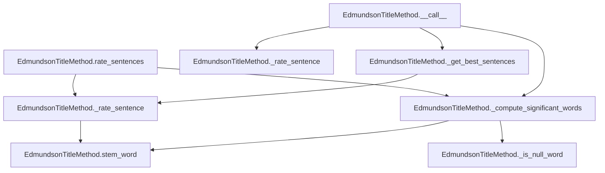

# `edmundson_title.py`

## `sumy.summarizers.edmundson_title.EdmundsonTitleMethod` · *class*

## Summary:
Implements the Edmundson title-based summarization method that rates sentences based on significant words found in document headings.

## Description:
The EdmundsonTitleMethod class implements a summarization technique that leverages important words from document headings to rate and select the most informative sentences. It inherits from AbstractSummarizer and provides sentence scoring based on the overlap between sentence words and significant heading words.

This class is typically instantiated by summarizer factories or directly when configuring a summarization pipeline that uses the Edmundson title method approach. The class serves as a distinct abstraction for implementing title-based sentence scoring in document summarization.

## State:
- `_null_words`: Collection of words that should be filtered out during significant word computation. Type: set-like collection. Valid values: any collection of words to exclude from significant word analysis.
- `stemmer`: callable object used for stemming words. Type: callable. Invariant: must be a callable that accepts a string and returns a stemmed string.

## Lifecycle:
- Creation: Instantiate with a stemmer callable and a collection of null words (e.g., stop words)
- Usage: Call the instance with a document and desired sentence count to get a summary, or call rate_sentences() to get all sentence ratings
- Destruction: No special cleanup required; relies on Python's garbage collection

## Method Map:


## Raises:
- ValueError: Raised by parent class AbstractSummarizer when the stemmer parameter is not callable

## Example:
```python
# Create the summarizer with a stemmer and null words
from sumy.summarizers.edmundson_title import EdmundsonTitleMethod
from sumy.nlp.stemmers import Stemmer

stemmer = Stemmer('english')
null_words = {'the', 'and', 'or', 'but'}
summarizer = EdmundsonTitleMethod(stemmer, null_words)

# Rate sentences in a document
rated_sentences = summarizer.rate_sentences(document)

# Get a summary with top 3 sentences
summary = summarizer(document, 3)
```

### `sumy.summarizers.edmundson_title.EdmundsonTitleMethod.__init__` · *method*

## Summary:
Initializes an Edmundson title-based summarization method with a stemmer and null words list.

## Description:
Configures the EdmundsonTitleMethod instance by setting up the stemming functionality and defining words that should be excluded from significance calculations. This method serves as the constructor for the EdmundsonTitleMethod class, which implements a text summarization technique that rates sentences based on their similarity to heading words.

## Args:
    stemmer (callable): A callable object that performs stemming operations on words. Must be a valid stemmer function.
    null_words (iterable): Collection of words that should be ignored during significance calculations. These are typically stop words or common terms that don't contribute to sentence importance.

## Returns:
    None: This method initializes the object's internal state and does not return a value.

## Raises:
    ValueError: Raised by the parent AbstractSummarizer class when the stemmer parameter is not callable.

## State Changes:
    Attributes READ: None
    Attributes WRITTEN: 
        - self._null_words: Set to the provided null_words parameter
        - self._stemmer: Inherited from AbstractSummarizer parent class, set via super().__init__(stemmer)

## Constraints:
    Preconditions:
        - The stemmer parameter must be callable
        - The null_words parameter should be iterable containing string-like objects
    Postconditions:
        - The instance will have a properly initialized stemmer from the parent class
        - The instance will store the provided null_words for filtering during significance computation

## Side Effects:
    None: This method performs no I/O operations or external service calls. It only initializes internal object attributes.

### `sumy.summarizers.edmundson_title.EdmundsonTitleMethod.__call__` · *method*

## Summary:
Selects the most important sentences from a document based on heading-derived significant words.

## Description:
This method implements the Edmundson Title-based summarization approach by identifying significant words from document headings and selecting sentences that contain the most of these significant words. It serves as the primary interface for the summarizer and orchestrates the sentence selection process.

## Args:
    document (Document): The input document containing sentences and headings to summarize.
    sentences_count (int): The number of top-ranked sentences to return.

## Returns:
    tuple[Sentence]: A tuple of Sentence objects representing the most important sentences in the document.

## Raises:
    None explicitly raised by this method.

## State Changes:
    Attributes READ: None
    Attributes WRITTEN: None

## Constraints:
    Preconditions: 
    - The document must have a valid sentences attribute
    - The document must have a valid headings attribute
    - Sentences_count must be a non-negative integer
    
    Postconditions:
    - Returns exactly sentences_count sentences (or fewer if document has insufficient sentences)
    - Sentences are ordered by their position in the original document

## Side Effects:
    None

### `sumy.summarizers.edmundson_title.EdmundsonTitleMethod._compute_significant_words` · *method*

## Summary:
Extracts and processes significant words from document headings for text summarization.

## Description:
Processes document headings to identify significant words by extracting words from each heading, applying stemming to normalize them, and filtering out null words. This method serves as a dedicated utility for preparing significant word sets that are used in sentence scoring calculations.

The method is called during the summarization process when determining which words should be considered important for ranking sentences. It's separated from other logic to maintain clean responsibility boundaries and enable reuse in different contexts within the Edmundson title-based summarization approach.

## Args:
    document: Document object containing headings with words attribute

## Returns:
    frozenset: Immutable set of significant words extracted from document headings, each word stemmed and filtered of null words

## Raises:
    AttributeError: If document does not have a headings attribute or if headings don't have words attribute
    TypeError: If document or headings are not of expected types

## State Changes:
    Attributes READ: self._null_words (used in _is_null_word method)
    Attributes WRITTEN: None

## Constraints:
    Preconditions: 
    - document must have a headings attribute that is iterable
    - each heading in document.headings must have a words attribute
    - self._null_words must be initialized in the class instance
    
    Postconditions:
    - Returns a frozenset containing only non-null, stemmed words from document headings
    - All returned words are normalized to lowercase through stemming

## Side Effects:
    None

### `sumy.summarizers.edmundson_title.EdmundsonTitleMethod._is_null_word` · *method*

## Summary:
Checks if a word is contained in the collection of null words used for filtering.

## Description:
This method determines whether a given word should be filtered out as a null word during the computation of significant words from document headings. It's used as a predicate function in filtering operations to exclude common stop words from consideration.

## Args:
    word (str): The word to check against the null words collection.

## Returns:
    bool: True if the word is in the null words collection, False otherwise.

## Raises:
    None explicitly raised.

## State Changes:
    Attributes READ: self._null_words
    Attributes WRITTEN: None

## Constraints:
    Preconditions: The method assumes that self._null_words is properly initialized as a collection containing null words.
    Postconditions: The method returns a boolean value indicating membership in the null words set.

## Side Effects:
    None.

### `sumy.summarizers.edmundson_title.EdmundsonTitleMethod._rate_sentence` · *method*

## Summary:
Rates a sentence by counting how many of its stemmed words appear in the set of significant words.

## Description:
This private method computes a relevance score for a given sentence by comparing its stemmed words against a predefined set of significant words derived from document headings. It's used internally by the Edmundson title-based summarization algorithm to rank sentences based on their topical relevance to the document's main themes.

The method is called during the sentence ranking phase of the summarization process, specifically when determining which sentences best represent the document's key topics. It's used by both the `__call__` method and the `rate_sentences` method of the EdmundsonTitleMethod class.

## Args:
    sentence: A sentence object with a `words` attribute containing tokenized words
    significant_words: A frozenset of stemmed words considered significant for the document

## Returns:
    int: The count of significant words found in the sentence after stemming

## Raises:
    None explicitly raised

## State Changes:
    Attributes READ: None
    Attributes WRITTEN: None

## Constraints:
    Preconditions:
        - `sentence` must have a `words` attribute containing iterable word tokens
        - `significant_words` must be a set-like object supporting the `in` operator
        - `self.stem_word` must be callable and properly initialized
    
    Postconditions:
        - Returns a non-negative integer representing the number of matching words
        - The returned value is bounded by the number of words in the sentence

## Side Effects:
    None

### `sumy.summarizers.edmundson_title.EdmundsonTitleMethod.rate_sentences` · *method*

## Summary:
Rates all sentences in a document based on their overlap with significant words extracted from document headings.

## Description:
Computes significant words from document headings and assigns a score to each sentence based on how many significant words it contains. This method is used as part of the Edmundson title-based summarization approach where headings are considered important for identifying key content.

## Args:
    document (Document): The document containing sentences to be rated and headings to extract significant words from.

## Returns:
    dict[Sentence, int]: A dictionary mapping each sentence to its significance score based on overlapping significant words from document headings.

## Raises:
    None explicitly raised, but may raise exceptions from underlying methods like _compute_significant_words or _rate_sentence.

## State Changes:
    Attributes READ: self._null_words
    Attributes WRITTEN: None

## Constraints:
    Preconditions: 
    - Document must have a sentences attribute containing iterable of Sentence objects
    - Document must have a headings attribute containing iterable of heading objects with words attribute
    - Self must have _null_words attribute properly initialized
    
    Postconditions:
    - Returns a dictionary with all sentences from the document as keys
    - Each sentence is mapped to an integer score (0 or higher)
    - Score represents count of significant words found in the sentence

## Side Effects:
    None

