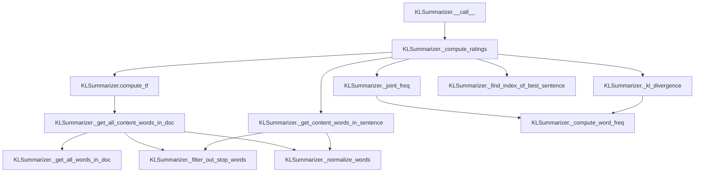

# `kl.py`

## `sumy.summarizers.kl.KLSummarizer` · *class*

## Summary:
KLSummarizer is a text summarization algorithm that uses Kullback-Leibler divergence to select the most informative sentences for creating a summary.

## Description:
This class implements a summarization technique based on information theory, specifically using Kullback-Leibler (KL) divergence to measure the difference between probability distributions of words in candidate sentences versus the entire document. It iteratively selects sentences that maximize the diversity of information content in the summary. The summarizer inherits from AbstractSummarizer and implements the required __call__ method for document summarization.

## State:
- stop_words: frozenset - Set of stop words to filter out from consideration during summarization. Default is an empty frozenset.
- _stemmer: callable - Stemmer function inherited from parent class for normalizing words (via AbstractSummarizer.__init__)

## Lifecycle:
- Creation: Instantiate with optional stemmer parameter (inherits from AbstractSummarizer)
- Usage: Call instance with (document, sentences_count) arguments to generate summary
- Destruction: No special cleanup required; relies on Python garbage collection

## Method Map:


## Raises:
- ValueError: Raised by parent class AbstractSummarizer.__init__ if stemmer is not callable

## Example:
```python
from sumy.summarizers.kl import KLSummarizer
from sumy.parsers.plaintext import PlaintextParser
from sumy.nlp.tokenizers import Tokenizer

# Create summarizer
summarizer = KLSummarizer()

# Parse document
parser = PlaintextParser.from_string("Your long text here...", Tokenizer("english"))

# Generate summary with 3 sentences
summary = summarizer(parser.document, 3)
for sentence in summary:
    print(sentence)
```

### `sumy.summarizers.kl.KLSummarizer.__call__` · *method*

## Summary:
Computes sentence ratings using KL divergence and returns the most informative sentences from a document.

## Description:
This method serves as the main entry point for the KL divergence-based text summarization algorithm. It processes a document by extracting sentences, computing relevance scores using KL divergence between sentence content and document distribution, and selecting the highest-rated sentences to form a summary.

## Args:
    document (Document): The input document containing sentences to summarize
    sentences_count (int): The number of sentences to include in the final summary

## Returns:
    tuple[Sentence]: A tuple of Sentence objects representing the most informative sentences in order of importance

## Raises:
    None explicitly raised by this method, though underlying methods may raise exceptions

## State Changes:
    Attributes READ: None
    Attributes WRITTEN: None

## Constraints:
    Preconditions: 
    - document must have a sentences property that yields an iterable of Sentence objects
    - sentences_count must be a non-negative integer
    
    Postconditions:
    - Returns exactly sentences_count sentences (or fewer if document has insufficient sentences)
    - Sentences are ordered by their computed importance scores

## Side Effects:
    None

### `sumy.summarizers.kl.KLSummarizer._get_all_words_in_doc` · *method*

## Summary:
Extracts all words from a collection of sentences into a single flattened list.

## Description:
This static method takes a collection of sentence objects and flattens them into a single list containing all words from all sentences. It is used throughout the KL divergence-based summarization algorithm to gather word frequencies and perform various text processing operations.

The method is called by several other methods in the KLSummarizer class including `_get_all_content_words_in_doc`, `_compute_ratings`, and `_joint_freq` to build comprehensive word lists for statistical analysis.

## Args:
    sentences (iterable): An iterable collection of sentence objects, where each sentence has a `words` attribute containing a list of words.

## Returns:
    list: A flattened list containing all words from all sentences in the input collection, preserving order.

## Raises:
    AttributeError: If any sentence object in the input collection does not have a `words` attribute.

## State Changes:
    None: This is a static method and does not modify any instance attributes.

## Constraints:
    Preconditions:
        - Input `sentences` must be iterable
        - Each item in `sentences` must have a `words` attribute that is iterable
        - All items in `sentences` should be sentence objects with proper word structure
    
    Postconditions:
        - Returns a list with length equal to the sum of words in all sentences
        - Words appear in the same order as they appear in the input sentences

## Side Effects:
    None: This method performs no I/O operations or external service calls. It only processes the input data locally.

### `sumy.summarizers.kl.KLSummarizer._get_content_words_in_sentence` · *method*

## Summary:
Extracts and normalizes content words from a sentence, filtering out stop words.

## Description:
Processes a sentence by normalizing all words to lowercase and removing stop words to isolate meaningful content words for further analysis in the KL divergence summarization algorithm.

## Args:
    sentence: A sentence object containing a `words` attribute with tokenized words.

## Returns:
    list[str]: A list of normalized content words (tokens) from the sentence, excluding stop words.

## Raises:
    None explicitly raised.

## State Changes:
    Attributes READ: self.stop_words
    Attributes WRITTEN: None

## Constraints:
    Preconditions: The sentence argument must have a `words` attribute containing a list of words.
    Postconditions: The returned list contains only normalized words that are not in the stop words set.

## Side Effects:
    None

### `sumy.summarizers.kl.KLSummarizer._normalize_words` · *method*

## Summary:
Normalizes a list of words by converting each word to lowercase and unicode format.

## Description:
Applies word normalization to a collection of words, converting each word to lowercase and ensuring unicode encoding. This method is used throughout the KL summarization process to standardize word representations before further processing such as stop word filtering.

## Args:
    words (list[str]): A list of words to be normalized.

## Returns:
    list[str]: A list of normalized words, each converted to lowercase and unicode encoded.

## Raises:
    None: This method does not explicitly raise exceptions.

## State Changes:
    Attributes READ: self.normalize_word
    Attributes WRITTEN: None

## Constraints:
    Preconditions: The input `words` parameter must be iterable containing string-like objects.
    Postconditions: All returned words are guaranteed to be lowercase unicode strings.

## Side Effects:
    None: This method performs no I/O operations or external service calls. It only processes the input list and returns a transformed list.

### `sumy.summarizers.kl.KLSummarizer._filter_out_stop_words` · *method*

## Summary:
Filters out stop words from a list of words, returning only those that are not in the summarizer's stop words set.

## Description:
This method implements a standard text preprocessing technique for summarization by removing common stop words (such as articles, prepositions, and conjunctions) from a collection of words. It is used internally by the KL summarizer to focus on content-bearing words that are more representative of the document's meaning.

The method is called during the text processing pipeline when preparing words for statistical analysis in the KL divergence computation. It ensures that only significant lexical items are considered when calculating word frequencies and divergence measures.

## Args:
    words (list[str]): A list of words to filter, typically obtained from sentence tokenization or document word extraction

## Returns:
    list[str]: A filtered list containing only words that are not present in self.stop_words

## Raises:
    None explicitly raised

## State Changes:
    Attributes READ: self.stop_words
    Attributes WRITTEN: None

## Constraints:
    Preconditions: 
    - Input `words` should be a list of strings
    - self.stop_words should be a set-like object supporting the 'in' operator
    
    Postconditions:
    - Returned list contains only words not present in self.stop_words
    - Order of remaining words is preserved from the input list
    - Empty list is returned if all input words are stop words or input is empty

## Side Effects:
    None

### `sumy.summarizers.kl.KLSummarizer._compute_word_freq` · *method*

## Summary:
Computes frequency counts for each word in a list of words.

## Description:
This static method takes a list of words and returns a dictionary mapping each unique word to its frequency count. It's used internally by the KL summarizer to calculate word frequencies for various computations including term frequency and joint probability distributions.

## Args:
    list_of_words (list[str]): A list of words for which to compute frequency counts.

## Returns:
    dict[str, int]: A dictionary where keys are unique words from the input list and values are their respective frequency counts.

## Raises:
    None: This method does not raise any exceptions.

## State Changes:
    Attributes READ: None
    Attributes WRITTEN: None

## Constraints:
    Preconditions: The input list should contain hashable elements (strings in this case).
    Postconditions: The returned dictionary will contain exactly one entry for each unique word in the input list.

## Side Effects:
    None: This method has no side effects and is pure.

### `sumy.summarizers.kl.KLSummarizer._get_all_content_words_in_doc` · *method*

## Summary:
Extracts and normalizes content words from a collection of sentences by removing stop words.

## Description:
Processes a list of sentences to extract all words, filters out stop words, and normalizes the remaining words to lowercase. This method is used to prepare text data for term frequency calculations in the KL-divergence based summarization algorithm.

## Args:
    sentences (list): A list of sentence objects containing words to process.

## Returns:
    list[str]: A list of normalized content words (all lowercase, with stop words removed) extracted from the input sentences.

## Raises:
    None explicitly raised.

## State Changes:
    Attributes READ: self.stop_words
    Attributes WRITTEN: None

## Constraints:
    Preconditions: 
    - Input sentences must be iterable and contain sentence objects with a 'words' attribute
    - Each sentence's words must be iterable
    
    Postconditions:
    - Returns a list of strings that are all lowercase
    - All stop words as defined by self.stop_words are filtered out
    - The returned list preserves the order of words as they appear in the input sentences

## Side Effects:
    None

### `sumy.summarizers.kl.KLSummarizer.compute_tf` · *method*

## Summary:
Computes term frequency for content words in a document by normalizing word frequencies by the total count of content words.

## Description:
This method calculates the term frequency (TF) for each content word in the provided sentences. It first extracts all content words from the document, then computes the frequency of each word, and finally normalizes these frequencies by dividing by the total number of content words. This method is used in the KL-divergence calculation for sentence ranking in the KLSummarizer algorithm.

## Args:
    sentences (list): A list of sentence objects containing words to process

## Returns:
    dict: A dictionary mapping each content word to its term frequency (normalized frequency)

## Raises:
    None explicitly raised

## State Changes:
    Attributes READ: None
    Attributes WRITTEN: None

## Constraints:
    Preconditions: 
    - The sentences parameter must be iterable and contain sentence objects with words attribute
    - Each sentence must have a words attribute that is iterable
    
    Postconditions:
    - Returns a dictionary with keys as content words and values as normalized frequencies (between 0 and 1)
    - The sum of all returned frequencies equals 1.0

## Side Effects:
    None

### `sumy.summarizers.kl.KLSummarizer._joint_freq` · *method*

## Summary:
Computes a joint probability distribution from two word frequency lists by combining and normalizing word frequencies.

## Description:
This method calculates the joint frequency distribution of words from two input lists. It's used in the KL (Kullback-Leibler) summarization algorithm to compute probability distributions for divergence calculations. The method combines word frequencies from two word lists and normalizes them by the total length of both lists to produce a probability distribution.

Called by: `_compute_ratings` method during the KL divergence calculation process, specifically when evaluating candidate sentences for inclusion in the summary.

This logic is encapsulated in its own method because it performs a specific mathematical operation that's reused in the KL divergence computation and benefits from being separated for clarity and testability.

## Args:
    word_list_1 (list[str]): First list of words to compute frequency distribution for
    word_list_2 (list[str]): Second list of words to compute frequency distribution for

## Returns:
    dict[str, float]: Dictionary mapping words to their joint probability frequencies, where probabilities sum to 1.0

## Raises:
    None explicitly raised

## State Changes:
    Attributes READ: None
    Attributes WRITTEN: None

## Constraints:
    Preconditions: Both input word lists should contain valid word strings
    Postconditions: The returned dictionary contains normalized probabilities that sum to 1.0

## Side Effects:
    None

### `sumy.summarizers.kl.KLSummarizer._kl_divergence` · *method*

## Summary:
Computes the Kullback-Leibler divergence between two frequency distributions using logarithmic operations.

## Description:
This static method implements the KL divergence calculation for comparing a joint frequency distribution (summary_freq) against a document frequency distribution (doc_freq). It's used in the KL-based text summarization algorithm to rank sentences based on their information content relative to the document. The method ignores words that don't appear in both distributions.

## Args:
    summary_freq (dict): Dictionary mapping words to their frequencies in the summary/joint distribution.
    doc_freq (dict): Dictionary mapping words to their frequencies in the document.

## Returns:
    float: The computed KL divergence value. Returns 0.0 when no common words exist between the distributions or when frequency values are zero.

## Raises:
    ValueError: When math.log() encounters zero or negative values due to invalid input distributions.

## State Changes:
    None - This is a static method that doesn't modify any instance attributes.

## Constraints:
    Preconditions:
        - Both summary_freq and doc_freq should be dictionaries with string keys and numeric values
        - Values in doc_freq should be non-negative numbers
        - Values in summary_freq should be positive numbers (to avoid log(0) in computation)
    
    Postconditions:
        - Returns a finite float value representing the divergence measure
        - The result is non-negative (KL divergence property)

## Side Effects:
    None - This method performs only mathematical computations and doesn't cause any I/O or external service calls.

### `sumy.summarizers.kl.KLSummarizer._find_index_of_best_sentence` · *method*

## Summary:
Returns the index of the sentence with the lowest KL divergence value in the list of candidate sentences.

## Description:
This method identifies the optimal next sentence to include in a summarization by finding the index of the minimum value in a list of KL divergence scores. It is used in the Kullback-Leibler divergence-based summarization algorithm to select the most informative sentence that minimizes divergence from the document's overall word distribution.

The method is called during the iterative process of building a summary, where each iteration selects the sentence that best maintains the document's information content while minimizing redundancy.

## Args:
    kls (list[float]): A list of KL divergence values representing how well each remaining candidate sentence matches the overall document distribution.

## Returns:
    int: The index of the sentence with the minimum KL divergence value in the input list.

## Raises:
    ValueError: If the input list `kls` is empty, causing `min()` to raise a ValueError.

## State Changes:
    - Attributes READ: None
    - Attributes WRITTEN: None

## Constraints:
    - Preconditions: The input list `kls` must not be empty
    - Postconditions: Returns an integer index within the bounds of the input list

## Side Effects:
    - None

### `sumy.summarizers.kl.KLSummarizer._compute_ratings` · *method*

## Summary:
Computes KL divergence-based ratings for sentences to determine summarization order.

## Description:
This method implements a greedy algorithm that selects sentences based on minimizing KL divergence between the joint probability distribution of selected sentences and the document's overall word frequency distribution. It iteratively chooses the sentence that contributes least to the overall divergence when added to the summary.

The method is called during the summarization process by the `__call__` method of `KLSummarizer` to rank sentences for inclusion in the final summary.

## Args:
    sentences (iterable): Collection of sentence objects to rate

## Returns:
    dict: Mapping from sentence objects to negative integer ratings, where lower values indicate higher priority in the summary

## Raises:
    None explicitly raised

## State Changes:
    Attributes READ: None
    Attributes WRITTEN: None

## Constraints:
    Preconditions: 
    - Input sentences must be iterable
    - Each sentence must have a `words` attribute
    - The class must have implemented helper methods like `compute_tf`, `_get_content_words_in_sentence`, etc.
    
    Postconditions:
    - Returns a dictionary mapping each input sentence to a unique negative integer rating
    - All input sentences are processed exactly once

## Side Effects:
    None

