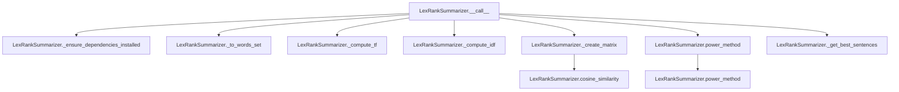

# `lex_rank.py`

## `sumy.summarizers.lex_rank.LexRankSummarizer` · *class*

## Summary:
Implements the LexRank algorithm for automatic text summarization by ranking sentences based on their similarity to other sentences in the document.

## Description:
The LexRankSummarizer is a sentence-ranking summarizer that uses a graph-based approach to determine the most important sentences in a document. It constructs a similarity matrix between sentences and applies a power iteration method to compute sentence scores. This class should be instantiated when performing automatic text summarization using the LexRank algorithm, typically as part of a larger summarization pipeline.

The class inherits from AbstractSummarizer and implements the core summarization logic by computing term frequency-inverse document frequency (TF-IDF) weights, creating a similarity matrix, and applying the power method to rank sentences. It is designed to be called with a document and desired sentence count to produce a summary.

## State:
- threshold: float, default 0.1 - similarity threshold for matrix construction
- epsilon: float, default 0.1 - convergence threshold for power method  
- _stop_words: frozenset - set of normalized, stemmed stop words to exclude from processing
- _stemmer: callable - stemming function inherited from AbstractSummarizer

## Lifecycle:
Creation: Instantiate with optional stemmer parameter (inherited from AbstractSummarizer). Configure stop_words property to define preprocessing behavior.
Usage: Call instance with (document, sentences_count) arguments where document is a Document object and sentences_count is the desired number of summary sentences. The document should contain sentences to summarize.
Destruction: No explicit cleanup required; relies on Python's garbage collection.

## Method Map:


## Raises:
- ValueError: When NumPy dependency is not installed, raised by _ensure_dependencies_installed method

## Example:
```python
from sumy.summarizers.lex_rank import LexRankSummarizer
from sumy.parsers.plaintext import PlaintextParser
from sumy.nlp.tokenizers import Tokenizer

# Create summarizer instance
summarizer = LexRankSummarizer()

# Configure stop words if needed
summarizer.stop_words = ['the', 'and', 'or']

# Parse document
parser = PlaintextParser.from_string("Your text here...", Tokenizer("english"))
document = parser.document

# Generate summary with 3 sentences
summary = summarizer(document, 3)
for sentence in summary:
    print(sentence)
```

### `sumy.summarizers.lex_rank.LexRankSummarizer.stop_words` · *method*

## Summary:
Configures the stop words collection for the LexRank summarizer by normalizing input words and storing them as an immutable frozenset.

## Description:
This method serves as a property setter for the internal `_stop_words` attribute. When invoked with an iterable of words, it normalizes each word using the inherited `normalize_word` method (which converts to lowercase Unicode) and stores the result as a frozenset for efficient lookup during text processing in the summarization algorithm.

## Args:
    words (iterable): An iterable of words to be treated as stop words. These will be normalized before storage.

## Returns:
    None: This method does not return a value.

## Raises:
    None: This method does not explicitly raise exceptions.

## State Changes:
    Attributes READ: None
    Attributes WRITTEN: self._stop_words

## Constraints:
    Preconditions: The input `words` parameter must be iterable and convertible to strings.
    Postconditions: The `_stop_words` attribute is updated to contain normalized versions of all input words, stored as a frozenset.

## Side Effects:
    None: This method only modifies the internal state of the object and has no external side effects.

### `sumy.summarizers.lex_rank.LexRankSummarizer.__call__` · *method*

## Summary:
Computes sentence importance scores using the LexRank algorithm and returns the most relevant sentences from a document.

## Description:
This method implements the LexRank text summarization algorithm by computing similarity-based sentence scores using TF-IDF metrics and a power iteration method. It serves as the main entry point for performing summarization with the LexRank approach.

The method follows these steps:
1. Ensures required dependencies (NumPy) are installed
2. Converts document sentences to word sets for processing
3. Computes Term Frequency (TF) and Inverse Document Frequency (IDF) metrics
4. Constructs a similarity matrix based on sentence similarities
5. Applies power method to calculate sentence importance scores
6. Selects and returns the highest-rated sentences

This logic is encapsulated in its own method because it represents the complete LexRank summarization workflow that needs to be reusable and testable as a cohesive unit.

## Args:
    document (Document): The input document containing sentences to summarize. Must have a `sentences` attribute containing a sequence of Sentence objects.
    sentences_count (int or str): Number of sentences to return, or percentage string (e.g., "10%"). If int, specifies exact count. If string ending with "%", specifies percentage.

## Returns:
    tuple[Sentence]: A tuple of Sentence objects ranked by importance according to the LexRank algorithm, ordered from highest to lowest score.

## Raises:
    ValueError: If NumPy dependency is not installed, or if document contains no sentences and sentences_count is greater than 0.

## State Changes:
    Attributes READ: 
    - self.threshold: Threshold for matrix normalization (default 0.1)
    - self.epsilon: Convergence threshold for power method (default 0.1)
    - self._stop_words: Stop words collection for text processing
    
    Attributes WRITTEN: None

## Constraints:
    Preconditions:
    - Document must contain sentences (non-empty)
    - NumPy must be available for computation
    - Sentences_count must be a valid integer or percentage string
    
    Postconditions:
    - Returns a tuple of sentences in descending order of importance
    - Returns empty tuple if document contains no sentences
    - Returns exactly sentences_count sentences (or fewer if document has fewer sentences)

## Side Effects:
    - May raise ValueError if NumPy is not installed
    - Accesses external NumPy library for mathematical computations
    - Processes document sentences through text normalization and stemming
    - Calls various helper methods (_to_words_set, _compute_tf, _compute_idf, _create_matrix, power_method, _get_best_sentences)

### `sumy.summarizers.lex_rank.LexRankSummarizer._ensure_dependencies_installed` · *method*

## Summary:
Checks that NumPy dependency is installed and available for LexRank summarization.

## Description:
This static method verifies that the NumPy library is properly installed and importable. It is called at the beginning of the summarization process to ensure all required dependencies are available before proceeding with computation-intensive operations that rely on NumPy arrays and linear algebra functions.

## Args:
    None

## Returns:
    None

## Raises:
    ValueError: When the NumPy library cannot be imported or is not available.

## State Changes:
    None

## Constraints:
    Preconditions: The method assumes that the LexRankSummarizer class is being used and that NumPy is required for the summarization algorithm.
    Postconditions: If successful, ensures that NumPy is available for subsequent operations in the summarization pipeline.

## Side Effects:
    None

### `sumy.summarizers.lex_rank.LexRankSummarizer._to_words_set` · *method*

## Summary:
Converts a sentence into a normalized and stemmed word set, filtering out stop words.

## Description:
Processes a sentence by normalizing each word (converting to lowercase), stemming each normalized word, and removing stop words from the result. This method serves as a standardized preprocessing step for sentence tokenization in the LexRank algorithm.

## Args:
    sentence: A sentence object containing a `words` attribute that provides access to the words in the sentence.

## Returns:
    list[str]: A list of stemmed, normalized words from the sentence that are not in the stop words collection.

## Raises:
    None explicitly raised.

## State Changes:
    Attributes READ: 
        - self._stop_words: The collection of stop words used to filter results
        - self.normalize_word: Method used to normalize words
        - self.stem_word: Method used to stem words
    
    Attributes WRITTEN: None

## Constraints:
    Preconditions:
        - The sentence parameter must have a `words` attribute that is iterable
        - Each item in sentence.words must be a valid word that can be processed by normalize_word and stem_word methods
        
    Postconditions:
        - The returned list contains only words that are not in self._stop_words
        - All returned words are normalized (lowercase) and stemmed
        - The order of words in the returned list is preserved from the original sentence

## Side Effects:
    None

### `sumy.summarizers.lex_rank.LexRankSummarizer._compute_tf` · *method*

## Summary:
Computes normalized term frequency metrics for a collection of sentences by dividing each term's frequency by the maximum frequency in that sentence.

## Description:
This method transforms raw term frequency counts into normalized values for each sentence. It's a key preprocessing step in the LexRank summarization algorithm that prepares term frequency data for subsequent similarity matrix computation. The normalization ensures that terms appearing most frequently in a sentence contribute proportionally to their importance within that sentence.

The method is called during the summarization pipeline in `LexRankSummarizer.__call__()` after converting sentences to word sets but before computing IDF metrics and creating the similarity matrix.

## Args:
    sentences (list[list[str]]): A list of sentences, where each sentence is represented as a list of words (strings).

## Returns:
    list[dict[str, float]]: A list of dictionaries, where each dictionary corresponds to a sentence and maps terms (strings) to their normalized term frequency values (floats between 0 and 1).

## Raises:
    None explicitly raised, but may encounter issues if sentences contain unexpected data types.

## State Changes:
    Attributes READ: None
    Attributes WRITTEN: None

## Constraints:
    Preconditions:
        - Input sentences should be lists of strings representing words
        - Each sentence should contain at least one word (though empty sentences are handled gracefully)
    
    Postconditions:
        - Returns a list of dictionaries with the same length as the input sentences
        - Each returned dictionary contains keys that correspond to terms in the respective input sentence
        - All normalized TF values are between 0 and 1 inclusive

## Side Effects:
    None

### `sumy.summarizers.lex_rank.LexRankSummarizer._find_tf_max` · *method*

## Summary:
Computes the maximum term frequency value from a term frequency dictionary, returning 1 for empty dictionaries to prevent division by zero.

## Description:
This method extracts the maximum value from the term frequency dictionary to normalize term frequencies. It serves as a utility function to safely compute the maximum TF value, providing a fallback of 1 when no terms are present to avoid division by zero errors during normalization.

The method is called during the term frequency computation phase in the LexRank summarization algorithm, specifically in the `_compute_tf` method where term frequencies are normalized by dividing each term's frequency by the maximum frequency in the document.

## Args:
    terms (dict): A dictionary mapping terms to their frequency counts

## Returns:
    float: The maximum frequency value from the terms dictionary, or 1 if the dictionary is empty

## Raises:
    None

## State Changes:
    None

## Constraints:
    Preconditions:
        - The `terms` parameter must be a dictionary-like object with numeric values
        - The values in the dictionary should be non-negative numbers representing term frequencies
    
    Postconditions:
        - Returns a positive number (1 or greater) as the maximum frequency
        - Does not modify the input `terms` dictionary

## Side Effects:
    None

### `sumy.summarizers.lex_rank.LexRankSummarizer._compute_idf` · *method*

## Summary:
Computes inverse document frequency (IDF) metrics for terms across a collection of sentences.

## Description:
This method implements the IDF calculation used in the LexRank summarization algorithm. It determines how rare or common each term is across the entire document collection, which helps weight terms appropriately in the similarity calculations. The method is called during the summarization process to prepare IDF metrics needed for sentence scoring.

## Args:
    sentences (list[list[str]]): A list of sentences, where each sentence is represented as a list of terms (words).

## Returns:
    dict[str, float]: A dictionary mapping each unique term to its IDF value, computed as log(N / (1 + n_j)) where N is the total number of sentences and n_j is the count of sentences containing the term.

## Raises:
    None explicitly raised.

## State Changes:
    Attributes READ: None
    Attributes WRITTEN: None

## Constraints:
    Preconditions:
    - Input sentences must be a non-empty list
    - Each sentence must be a list of terms (strings)
    - All terms should be normalized consistently (typically lowercase, stemmed)
    
    Postconditions:
    - Returns a dictionary with all unique terms from input sentences as keys
    - IDF values are positive floating-point numbers
    - The method is deterministic and produces identical results for identical inputs

## Side Effects:
    None.

### `sumy.summarizers.lex_rank.LexRankSummarizer._create_matrix` · *method*

## Summary:
Constructs a normalized stochastic similarity matrix from sentence pairs using cosine similarity with thresholding.

## Description:
This method generates a square similarity matrix where each entry [i,j] represents the normalized similarity between sentence i and sentence j. It computes cosine similarity between all sentence pairs, applies thresholding (similarity values above threshold become 1.0), and normalizes by row degrees to create a stochastic matrix suitable for the LexRank algorithm's PageRank computation.

## Args:
    sentences (list): List of sentence objects to compare
    threshold (float): Threshold value above which similarities are set to 1.0
    tf_metrics (list): TF (term frequency) metrics for each sentence
    idf_metrics (list): IDF (inverse document frequency) metrics for each sentence

## Returns:
    numpy.ndarray: A square matrix of shape (n_sentences, n_sentences) containing binary values (0 or 1.0) representing thresholded similarities between sentences

## Raises:
    None explicitly raised

## State Changes:
    Attributes READ: None
    Attributes WRITTEN: None

## Constraints:
    Preconditions: 
    - sentences must be a non-empty list
    - threshold must be a numeric value
    - tf_metrics and idf_metrics must have same length as sentences
    - self.cosine_similarity method must be implemented
    
    Postconditions:
    - Returned matrix is square with dimensions matching number of sentences
    - All values in returned matrix are either 0 or 1.0
    - Matrix rows sum to 1 (normalized stochastic matrix)
    - Each row represents a probability distribution over sentence similarities

## Side Effects:
    None

### `sumy.summarizers.lex_rank.LexRankSummarizer.cosine_similarity` · *method*

## Summary:
Computes a weighted cosine similarity between two sentences using TF-IDF metrics.

## Description:
This function calculates the cosine similarity between two sentences by considering term frequencies (TF) and inverse document frequency (IDF) weights. It's used in the LexRank summarization algorithm to measure semantic similarity between sentences.

## Args:
    sentence1 (iterable): First sentence represented as a collection of terms/words.
    sentence2 (iterable): Second sentence represented as a collection of terms/words.
    tf1 (dict): Term frequency mapping for the first sentence, where keys are terms and values are frequencies.
    tf2 (dict): Term frequency mapping for the second sentence, where keys are terms and values are frequencies.
    idf_metrics (dict): Inverse document frequency mapping for terms, where keys are terms and values are IDF scores.

## Returns:
    float: Cosine similarity score between 0.0 and 1.0, where 1.0 indicates identical sentences and 0.0 indicates no similarity. Returns 0.0 when either sentence has zero magnitude.

## Raises:
    None explicitly raised, but may raise KeyError if terms in sentences are not present in tf or idf dictionaries.

## State Changes:
    None - This is a pure function that doesn't modify any object state.

## Constraints:
    Preconditions:
        - Both sentence1 and sentence2 should be iterable collections of terms
        - tf1, tf2, and idf_metrics should be dictionaries with terms as keys
        - All terms in sentences should exist as keys in idf_metrics dictionary
    Postconditions:
        - Returns a float value in the range [0.0, 1.0]
        - If both sentences are empty or have no common terms, returns 0.0

## Side Effects:
    None - This function performs no I/O operations or external service calls.

### `sumy.summarizers.lex_rank.LexRankSummarizer.power_method` · *method*

*No documentation generated.*

