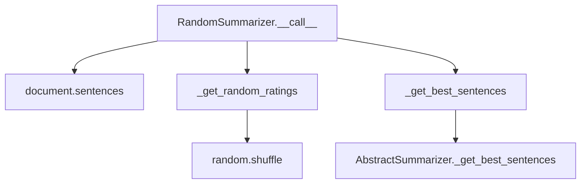

# `random.py`

## `sumy.summarizers.random.RandomSummarizer` · *class*

## Summary:
RandomSummarizer is a sentence selection algorithm that assigns random scores to sentences and selects the highest-rated ones to form a summary.

## Description:
This class implements a random-based summarization approach where sentences are assigned random integer ratings and selected based on those ratings. It serves as a baseline or randomized approach for document summarization, useful for comparison purposes or when a completely random selection is desired. The class extends AbstractSummarizer and implements the required __call__ method to perform summarization.

## State:
- Inherits stemmer from parent class AbstractSummarizer with default null_stemmer
- No additional instance attributes beyond parent class state
- The _get_random_ratings method generates a dictionary mapping sentences to random integer ratings between 0 and len(sentences)-1

## Lifecycle:
- Creation: Instantiate with optional stemmer parameter (defaults to null_stemmer)
- Usage: Call the instance with a document object and desired number of sentences
- Destruction: No special cleanup required; relies on Python's garbage collection

## Method Map:


## Raises:
- ValueError: If the stemmer parameter passed to parent constructor is not callable

## Example:
```python
from sumy.summarizers.random import RandomSummarizer
from sumy.parsers.plaintext import PlaintextParser
from sumy.nlp.tokenizers import Tokenizer

# Create summarizer
summarizer = RandomSummarizer()

# Parse document
parser = PlaintextParser.from_string("Your long text here...", Tokenizer("english"))
document = parser.document

# Generate summary with 3 sentences
summary = summarizer(document, 3)
```

### `sumy.summarizers.random.RandomSummarizer.__call__` · *method*

## Summary:
Generates random sentence ratings and selects the highest-rated sentences from a document.

## Description:
This method implements the core summarization logic for the RandomSummarizer by assigning random scores to sentences and returning the top-ranked sentences based on those scores. It serves as the main entry point for the summarization process in this class.

## Args:
    document (Document): The input document containing sentences to summarize.
    sentences_count (int or str): Number of sentences to select or percentage (e.g., "30%") of total sentences.

## Returns:
    tuple[Sentence]: A tuple of selected sentences ordered by their position in the original document.

## Raises:
    None explicitly raised, but may propagate exceptions from underlying methods.

## State Changes:
    Attributes READ: None
    Attributes WRITTEN: None

## Constraints:
    Preconditions: 
    - Document must have a sentences attribute containing iterable sentences
    - Sentences count must be a valid integer or percentage string
    Postconditions:
    - Returns exactly the requested number of sentences (or percentage) from the document
    - Sentences in result maintain their original order from the document

## Side Effects:
    None

### `sumy.summarizers.random.RandomSummarizer._get_random_ratings` · *method*

## Summary:
Generates a random rating for each sentence by shuffling integer indices and mapping them to sentences.

## Description:
This method creates a randomized ranking system for sentences by generating a shuffled list of sequential integers and pairing each sentence with a random integer rating. It's used as part of the random summarization algorithm to determine sentence priority for inclusion in the final summary.

The method is called during the summarization process when the RandomSummarizer needs to assign random weights to sentences before selecting the best ones based on these ratings.

## Args:
    sentences (list): A list of sentence objects to be rated

## Returns:
    dict: A dictionary mapping each sentence object to a random integer rating (0 to len(sentences)-1)

## Raises:
    None explicitly raised

## State Changes:
    Attributes READ: None
    Attributes WRITTEN: None

## Constraints:
    Preconditions:
        - Input sentences list must be iterable
        - Each item in sentences should be hashable (to serve as dictionary keys)
    Postconditions:
        - Return dictionary will have exactly len(sentences) key-value pairs
        - Each sentence appears exactly once as a key
        - Ratings are integers in range [0, len(sentences)-1]
        - All ratings in returned dictionary are unique

## Side Effects:
    None

