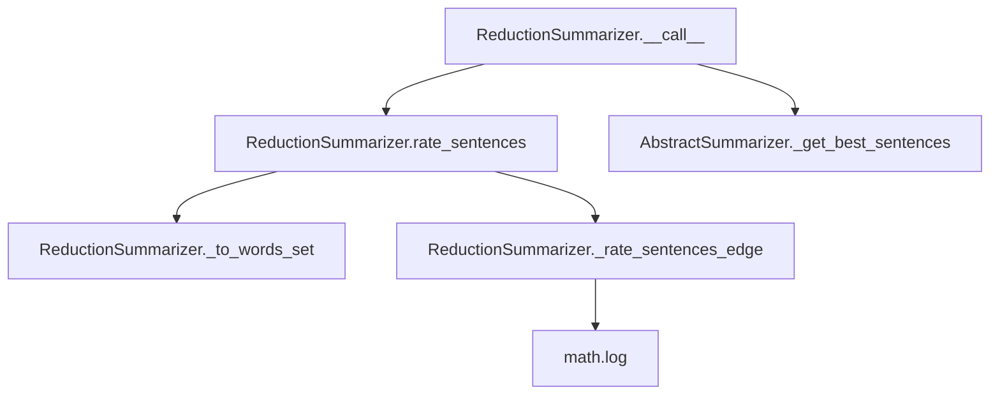

# `reduction.py`

## `sumy.summarizers.reduction.ReductionSummarizer` · *class*

## Summary:
ReductionSummarizer is a sentence-ranking summarizer that computes sentence similarities based on shared words and selects the most representative sentences to form a summary.

## Description:
This class implements a reduction-based text summarization algorithm that rates sentences based on their similarity to other sentences in the document. It works by comparing all pairs of sentences and calculating similarity scores based on common words, then selects the highest-rated sentences to form a summary. The summarizer is designed to work with documents containing sentences and can be configured with custom stop words.

## State:
- `_stop_words`: frozenset of normalized and stemmed words to exclude from sentence comparison
- `_stemmer`: stemming function inherited from AbstractSummarizer for word normalization

## Lifecycle:
- Creation: Instantiate with optional stemmer parameter (inherits from AbstractSummarizer)
- Usage: Call instance with a document object and desired number of sentences
- Destruction: No explicit cleanup required

## Method Map:


## Raises:
- ValueError: If stemmer is not callable (inherited from AbstractSummarizer constructor)

## Example:
```python
from sumy.summarizers.reduction import ReductionSummarizer
from sumy.nlp.tokenizers import Tokenizer
from sumy.parsers.plaintext import PlaintextParser

# Create summarizer
summarizer = ReductionSummarizer()

# Set custom stop words if needed
summarizer.stop_words = ["the", "and", "or"]

# Parse document
parser = PlaintextParser.from_file("document.txt", Tokenizer("english"))
document = parser.document

# Generate summary
summary = summarizer(document, sentences_count=3)
for sentence in summary:
    print(sentence)
```

### `sumy.summarizers.reduction.ReductionSummarizer.stop_words` · *method*

## Summary:
Sets the collection of stop words used to filter out common words during sentence processing in the reduction-based summarization algorithm.

## Description:
Configures the stop words that will be excluded from consideration when analyzing sentences for summarization. This method normalizes each provided word using the inherited `normalize_word` method before storing them as a frozenset in the `_stop_words` attribute. Stop words are typically common words like articles, prepositions, and conjunctions that don't contribute significantly to the meaning of sentences.

## Args:
    words (iterable): An iterable of words (strings) to be treated as stop words. These will be normalized to lowercase and stripped of Unicode characters.

## Returns:
    None: This method does not return a value.

## Raises:
    None explicitly raised.

## State Changes:
    Attributes READ: None
    Attributes WRITTEN: self._stop_words

## Constraints:
    Preconditions: The `words` argument must be iterable and contain string-like elements that can be processed by `normalize_word`.
    Postconditions: The `_stop_words` attribute is updated to contain a frozenset of normalized versions of all provided words.

## Side Effects:
    None: This method only modifies the internal state of the object and does not perform any I/O operations or external service calls.

### `sumy.summarizers.reduction.ReductionSummarizer.__call__` · *method*

## Summary:
Computes sentence ratings using a reduction-based similarity algorithm and returns the highest-rated sentences from a document.

## Description:
This method serves as the primary interface for the ReductionSummarizer class, implementing a sentence ranking algorithm that evaluates sentence similarity based on shared word content. It operates in two phases: first computing relevance scores for all sentences in the document using pairwise sentence comparison, then selecting the most representative sentences according to the specified count. This approach identifies sentences that contribute most to the overall document content by measuring their similarity to other sentences.

## Args:
    document (Document): The input document containing sentences to be summarized.
    sentences_count (int): The number of top-ranked sentences to return.

## Returns:
    tuple[Sentence]: A tuple containing the top-ranking sentences from the document, ordered by their original position.

## Raises:
    None explicitly raised by this method, though underlying methods may raise exceptions.

## State Changes:
    Attributes READ: None
    Attributes WRITTEN: None

## Constraints:
    Preconditions:
        - The document parameter must be a valid Document object with a sentences attribute
        - The sentences_count parameter must be a non-negative integer
    Postconditions:
        - Returns exactly sentences_count sentences (or fewer if document has insufficient sentences)
        - Sentences are returned in their original order within the document

## Side Effects:
    None

### `sumy.summarizers.reduction.ReductionSummarizer.rate_sentences` · *method*

## Summary:
Rates sentences in a document based on their pairwise similarity to other sentences in the document.

## Description:
This method computes similarity scores for each sentence by comparing it with every other sentence in the document. It's used internally by the ReductionSummarizer to determine which sentences are most representative of the document's content. The method implements a reduction-based approach where each sentence accumulates similarity scores from all other sentences it shares words with.

## Args:
    document (Document): The document object containing sentences to be rated. Must have a `sentences` attribute containing iterable of sentence objects.

## Returns:
    defaultdict[float]: A mapping from each sentence object to its accumulated similarity score. Scores are floating-point values representing the degree of similarity to other sentences in the document.

## Raises:
    None explicitly raised, but may raise exceptions from underlying methods:
    - AttributeError: If document doesn't have a sentences attribute
    - TypeError: If document.sentences contains non-sentence objects
    - AssertionError: If internal assumptions about word counts are violated (though this should not occur with normal usage)

## State Changes:
    - Attributes READ: self._stop_words, self._stemmer, self._to_words_set, self._rate_sentences_edge
    - Attributes WRITTEN: None

## Constraints:
    - Preconditions: 
      * document must be a valid Document object with a sentences attribute
      * Each item in document.sentences must be a sentence object with a words attribute
    - Postconditions:
      * Returns a defaultdict with all sentences from the document as keys
      * All returned scores are non-negative floating-point values
      * The total sum of all scores represents the cumulative pairwise similarity across all sentence pairs

## Side Effects:
    - Calls self._to_words_set() for each sentence to preprocess words
    - Calls self._rate_sentences_edge() for each pair of sentences to compute similarity
    - Uses itertools.combinations internally to iterate through sentence pairs
    - May perform string normalization and stemming operations via inherited methods

### `sumy.summarizers.reduction.ReductionSummarizer._to_words_set` · *method*

## Summary:
Converts a sentence into a normalized and stemmed word list, excluding stop words.

## Description:
Processes a sentence by normalizing each word to lowercase, stemming each word, and filtering out stop words. This method is used to create standardized word representations for sentence similarity calculations in the reduction-based summarization algorithm.

The method is called during the sentence rating phase where word sets are created for comparing sentence similarities. It ensures consistent text preprocessing across all sentences being compared.

## Args:
    sentence (Sentence): The sentence object containing words to process

## Returns:
    list[str]: A list of stemmed, normalized words from the sentence, excluding stop words

## Raises:
    None explicitly raised

## State Changes:
    Attributes READ: self._stop_words, self.normalize_word, self.stem_word
    Attributes WRITTEN: None

## Constraints:
    Preconditions: 
    - The sentence parameter must be a valid Sentence object with a words property
    - The sentence.words must be iterable
    - self._stop_words must be a collection supporting 'in' operation
    
    Postconditions:
    - Returns a list of strings (processed words)
    - All returned words are normalized to lowercase
    - All returned words are stemmed using the configured stemmer
    - No stop words from self._stop_words are included in the result

## Side Effects:
    None

### `sumy.summarizers.reduction.ReductionSummarizer._rate_sentences_edge` · *method*

## Summary:
Calculates a normalized similarity score between two sets of words representing sentence content.

## Description:
This private method computes a similarity rating between two word sets using a logarithmic normalization approach. It's designed to measure semantic similarity between sentences in the reduction-based summarization algorithm. The method is called internally by the `rate_sentences` method during the summarization process to determine sentence importance rankings.

## Args:
    words1 (list[str]): First set of words from a sentence after preprocessing (tokenization, stop-word removal, stemming)
    words2 (list[str]): Second set of words from another sentence after preprocessing

## Returns:
    float: Normalized similarity score between 0.0 and 1.0, where 0.0 indicates no common words and higher values indicate greater similarity. Returns 0.0 when there are no matching words.

## Raises:
    AssertionError: When either words1 or words2 has zero length, though this is internally guaranteed by the calling code.

## State Changes:
    Attributes READ: None
    Attributes WRITTEN: None

## Constraints:
    Preconditions: Both words1 and words2 must be non-empty lists of processed words
    Postconditions: Returns a float value in the range [0.0, 1.0], with 0.0 indicating no similarity and higher values indicating stronger similarity

## Side Effects:
    None

