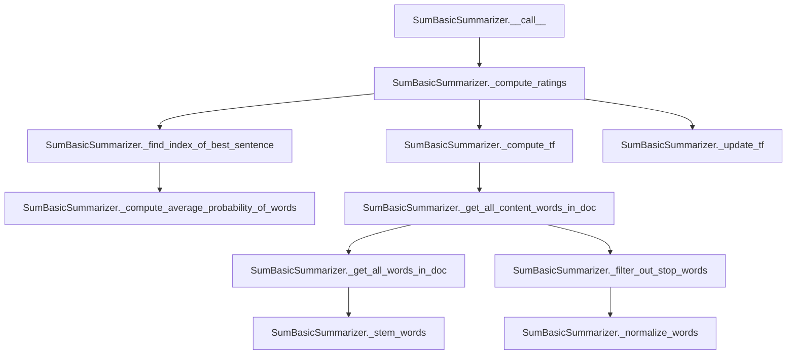

# `sum_basic.py`

## `sumy.summarizers.sum_basic.SumBasicSummarizer` · *class*

## Summary:
Implements the SumBasic algorithm for extractive text summarization by iteratively selecting sentences based on decreasing word frequency scores.

## Description:
The SumBasicSummarizer is a concrete implementation of the abstract summarizer interface that applies the SumBasic algorithm to generate text summaries. It operates by computing term frequency of content words in the document, then iteratively selects sentences with the highest average word frequency scores, updating word frequencies after each selection to avoid redundancy in the summary. This approach prioritizes sentences containing less frequent words, which tend to be more informative.

## State:
- _stop_words: frozenset - Set of stop words used to filter out common words during content word extraction. Default is empty frozenset.
- stop_words property: getter/setter for managing the stop words collection. When set, words are normalized using normalize_word before being stored as a frozenset.

## Lifecycle:
- Creation: Instantiate with default empty stop words or configure via stop_words property
- Usage: Call the instance with a document object and desired number of sentences to extract
- Destruction: No special cleanup required; uses standard Python garbage collection

## Method Map:


## Raises:
- No explicit exceptions are raised by the constructor or main methods
- Behavior depends on parent class implementation for document handling

## Example:
```python
from sumy.summarizers.sum_basic import SumBasicSummarizer
from sumy.parsers.plaintext import PlaintextParser
from sumy.nlp.tokenizers import Tokenizer

# Create summarizer
summarizer = SumBasicSummarizer()

# Configure stop words if needed
summarizer.stop_words = ["the", "and", "or"]

# Parse document
parser = PlaintextParser.from_string("Your long text here...", Tokenizer("english"))
document = parser.document

# Generate summary
summary = summarizer(document, sentences_count=3)
for sentence in summary:
    print(sentence)
```

### `sumy.summarizers.sum_basic.SumBasicSummarizer.stop_words` · *method*

## Summary:
Sets the collection of stop words used to filter content words during text summarization.

## Description:
Configures the stop words that will be excluded from consideration when identifying important content words for sentence ranking. This method normalizes each provided word using the inherited `normalize_word` method before storing them as an immutable frozenset in the `_stop_words` attribute. The stop words are used by the `_filter_out_stop_words` method to identify significant content words during the summarization process.

## Args:
    words (iterable): An iterable of word strings to be treated as stop words.

## Returns:
    None: This method does not return a value as it is a property setter.

## Raises:
    None: This method does not explicitly raise exceptions.

## State Changes:
    Attributes READ: None
    Attributes WRITTEN: self._stop_words

## Constraints:
    Preconditions: The `words` argument must be iterable and contain string-like elements.
    Postconditions: The `_stop_words` attribute is updated to contain a frozenset of normalized versions of the input words.

## Side Effects:
    None: This method performs no I/O operations or external service calls.

## Known Callers:
    - Property setter access: Called when setting the `stop_words` property on a SumBasicSummarizer instance
    - Internal usage: Used by the `_filter_out_stop_words` method during sentence processing

### `sumy.summarizers.sum_basic.SumBasicSummarizer.__call__` · *method*

## Summary:
Computes sentence ratings using the SumBasic algorithm and returns the highest-rated sentences from a document.

## Description:
This method implements the core summarization logic for the SumBasic algorithm. It processes the input document by computing term frequency-based ratings for each sentence, then selects the most informative sentences according to the SumBasic ranking strategy. This method serves as the primary interface for performing summarization with this algorithm.

## Args:
    document (Document): The input document containing sentences to summarize
    sentences_count (int): The number of top-ranked sentences to return

## Returns:
    tuple[Sentence]: A tuple of Sentence objects representing the most important sentences in the document, ordered by their importance

## Raises:
    None explicitly raised

## State Changes:
    Attributes READ: None
    Attributes WRITTEN: None

## Constraints:
    Preconditions: 
    - The document must contain at least one sentence
    - sentences_count must be a non-negative integer
    
    Postconditions:
    - Returns exactly sentences_count sentences (or fewer if document has fewer sentences)
    - Sentences are returned in order of importance according to SumBasic algorithm

## Side Effects:
    None

### `sumy.summarizers.sum_basic.SumBasicSummarizer._get_all_words_in_doc` · *method*

## Summary:
Extracts and stems all words from a collection of sentences into a single flattened list.

## Description:
This method processes a collection of sentence objects by extracting all words from each sentence, flattening them into a single list, and then applying stemming to normalize the words. It serves as a utility for preparing word collections for frequency analysis and summarization calculations.

The method is called during the summarization process when computing term frequencies and word distributions across documents. It's separated from inline processing to provide a reusable component for word extraction and normalization.

## Args:
    sentences (iterable): An iterable of sentence objects, each expected to have a `.words` attribute containing a list of word strings.

## Returns:
    list: A list of stemmed word strings extracted from all sentences in the input collection.

## Raises:
    AttributeError: If any sentence object in the input collection does not have a `.words` attribute.
    TypeError: If the input `sentences` parameter is not iterable or if individual sentences don't have a `.words` attribute that is iterable.

## State Changes:
    Attributes READ: None
    Attributes WRITTEN: None

## Constraints:
    Preconditions:
        - The `sentences` parameter must be iterable
        - Each item in `sentences` must have a `.words` attribute that is iterable
        - Each item in `sentences` must be a sentence-like object with a `.words` attribute containing strings
    
    Postconditions:
        - Returns a list of stemmed words with no duplicates (depending on stemming implementation)
        - All returned words are normalized through the stemmer

## Side Effects:
    None

### `sumy.summarizers.sum_basic.SumBasicSummarizer._get_content_words_in_sentence` · *method*

## Summary:
Processes a sentence's words by normalizing, filtering out stop words, and stemming them to extract content words for summarization.

## Description:
This private method transforms raw sentence words into a standardized form suitable for frequency-based summarization. It takes the raw words from a sentence and applies three processing steps: normalization (lowercasing), stop word removal, and stemming to create a clean set of content words. This method is part of the SumBasic algorithm's preprocessing pipeline where word frequencies are computed for sentence ranking.

The method is called during the sentence rating computation phase in the `_compute_ratings` method, where each sentence needs to be converted into its content word representation for frequency analysis.

## Args:
    sentence: A sentence object containing a `words` attribute with raw word tokens

## Returns:
    list[str]: A list of stemmed, normalized content words from the input sentence

## Raises:
    None explicitly raised

## State Changes:
    Attributes READ: self._normalize_words, self._filter_out_stop_words, self._stem_words
    Attributes WRITTEN: None

## Constraints:
    Preconditions: The sentence object must have a `words` attribute containing iterable word tokens
    Postconditions: Returns a list of processed words ready for frequency analysis

## Side Effects:
    None

### `sumy.summarizers.sum_basic.SumBasicSummarizer._stem_words` · *method*

## Summary:
Applies stemming to a list of words using the summarizer's stemmer.

## Description:
This method takes a collection of words and applies the stemming operation to each word in the list. It serves as a convenience function to avoid manual iteration when processing multiple words, leveraging the inherited `stem_word` method from the abstract base class.

## Args:
    words (list[str]): A list of words to be stemmed.

## Returns:
    list[str]: A list of stemmed words, maintaining the same order as the input.

## Raises:
    None explicitly raised, but may propagate exceptions from `self.stem_word()` if called with invalid input.

## State Changes:
    Attributes READ: self._stemmer, self.normalize_word
    Attributes WRITTEN: None

## Constraints:
    Preconditions: 
    - Input `words` should be iterable containing string elements
    - The summarizer instance must have a valid stemmer configured
    
    Postconditions:
    - Output list contains the same number of elements as input
    - Each word in output is stemmed using the configured stemmer

## Side Effects:
    None - this method is pure and doesn't cause any external I/O or state changes outside the object.

### `sumy.summarizers.sum_basic.SumBasicSummarizer._normalize_words` · *method*

## Summary:
Normalizes a list of words by applying lowercase transformation and Unicode conversion to each word.

## Description:
This method transforms a collection of words by normalizing each individual word using the inherited normalize_word method. It serves as a utility for preparing text data for further processing in the summarization algorithm. The normalization process ensures consistent text representation by converting all words to lowercase and handling Unicode characters properly.

## Args:
    words (list[str]): A list of words to be normalized.

## Returns:
    list[str]: A new list containing the normalized versions of the input words.

## Raises:
    None: This method does not explicitly raise any exceptions.

## State Changes:
    Attributes READ: self.normalize_word
    Attributes WRITTEN: None

## Constraints:
    Preconditions: The input 'words' parameter must be iterable and contain string elements.
    Postconditions: The returned list contains the same number of elements as the input list, with each element normalized.

## Side Effects:
    None: This method performs no I/O operations or external service calls. It only processes the input list and returns a new list.

### `sumy.summarizers.sum_basic.SumBasicSummarizer._filter_out_stop_words` · *method*

## Summary:
Filters out stop words from a collection of words, returning only those that are not in the predefined stop word set.

## Description:
This method removes common stop words (such as articles, prepositions, and conjunctions) from a list of words to isolate content words that are more meaningful for text summarization. It is used as part of the preprocessing pipeline to extract significant terms from sentences and documents.

The method is called during the content word extraction phase of the summarization process, specifically in `_get_content_words_in_sentence` and `_get_all_content_words_in_doc` methods.

## Args:
    words (list[str]): A list of words to filter, typically normalized and stemmed words from text processing

## Returns:
    list[str]: A filtered list containing only words that are not present in the stop word set

## Raises:
    None explicitly raised

## State Changes:
    Attributes READ: self.stop_words
    Attributes WRITTEN: None

## Constraints:
    Preconditions: 
    - Input `words` should be a list of strings
    - self.stop_words should be initialized as a frozenset (which it is in the class)
    
    Postconditions:
    - Returned list contains only words not present in self.stop_words
    - Order of words is preserved from the input list
    - Empty list is returned if all input words are stop words

## Side Effects:
    None

### `sumy.summarizers.sum_basic.SumBasicSummarizer._compute_word_freq` · *method*

## Summary:
Computes the frequency count of each word in a list of words.

## Description:
This static method takes a list of words and returns a dictionary mapping each unique word to its frequency count. It's used internally by the SumBasicSummarizer to calculate term frequencies for text summarization.

## Args:
    list_of_words (list[str]): A list of words for which to compute frequencies.

## Returns:
    dict[str, int]: A dictionary where keys are unique words and values are their respective frequency counts.

## Raises:
    None

## State Changes:
    None

## Constraints:
    Preconditions:
        - Input list should contain only string elements
        - Words can be duplicated in the input list
    Postconditions:
        - Output dictionary contains one entry per unique word in the input list
        - All frequency counts are non-negative integers

## Side Effects:
    None

### `sumy.summarizers.sum_basic.SumBasicSummarizer._get_all_content_words_in_doc` · *method*

## Summary:
Extracts and normalizes content words from a collection of sentences by filtering out stop words.

## Description:
Processes a list of sentences to retrieve all content words (non-stop words) and applies normalization to them. This method serves as a utility for text preprocessing in the SumBasic summarization algorithm, specifically used in term frequency calculations.

The method follows a three-step process:
1. Extracts all words from the input sentences
2. Filters out stop words using the summarizer's stop word list
3. Normalizes the remaining words (lowercase conversion)

This method is called by `_compute_tf` to calculate term frequencies for the summarization process.

## Args:
    sentences (list[ Sentence ]): A list of sentence objects containing words to process

## Returns:
    list[str]: A list of normalized content words extracted from the sentences

## Raises:
    None explicitly raised

## State Changes:
    Attributes READ: self.stop_words, self._stemmer
    Attributes WRITTEN: None

## Constraints:
    Preconditions: 
    - Input sentences must be a valid list of sentence objects
    - Each sentence must have a words attribute containing tokens
    
    Postconditions:
    - Returns a list of normalized words (lowercase strings)
    - All returned words are non-stop words according to the summarizer's stop word list

## Side Effects:
    None

### `sumy.summarizers.sum_basic.SumBasicSummarizer._compute_tf` · *method*

## Summary:
Computes term frequency for content words across all sentences in a document.

## Description:
This method calculates the term frequency (TF) of each content word in the document by counting occurrences and normalizing by total content word count. It serves as a foundational step in the SumBasic summarization algorithm, providing word importance weights for subsequent sentence ranking calculations. This method is called internally by `_compute_ratings` during the summarization process.

## Args:
    sentences (list): A collection of sentence objects containing words to process

## Returns:
    dict: A dictionary mapping content words to their term frequencies (normalized values between 0 and 1)

## Raises:
    None explicitly raised

## State Changes:
    Attributes READ: None
    Attributes WRITTEN: None

## Constraints:
    Preconditions: 
    - Input sentences must be iterable and contain word information
    - Content words must be properly filtered and normalized
    
    Postconditions:
    - Returns a dictionary with all unique content words from the document
    - All returned frequencies sum to approximately 1.0 (when considering all content words)
    - Each frequency value is between 0 and 1 inclusive

## Side Effects:
    None

## Implementation Details:
This method performs the following operations in sequence:
1. Extracts all content words from the document using `_get_all_content_words_in_doc(sentences)`
2. Counts the total number of content words using `len(content_words)`
3. Computes word frequencies using `_compute_word_freq(content_words)` 
4. Normalizes frequencies by dividing each count by the total content word count using dictionary comprehension

### `sumy.summarizers.sum_basic.SumBasicSummarizer._compute_average_probability_of_words` · *method*

## Summary:
Computes the average frequency probability of content words in a sentence.

## Description:
Calculates the mean frequency of content words within a sentence by averaging their individual frequencies from a document-wide word frequency distribution. This method is used during sentence ranking in the SumBasic summarization algorithm to determine sentence importance based on word frequency.

## Args:
    word_freq_in_doc (dict): Dictionary mapping words to their frequency counts in the entire document.
    content_words_in_sentence (list): List of content words (normalized and stemmed) found in the sentence being evaluated.

## Returns:
    float: Average frequency probability of content words in the sentence. Returns 0 if no content words are present.

## Raises:
    None explicitly raised.

## State Changes:
    None.

## Constraints:
    Preconditions:
    - word_freq_in_doc must be a dictionary with string keys representing words and numeric values representing frequencies
    - content_words_in_sentence must be a list of strings that are keys in word_freq_in_doc
    
    Postconditions:
    - Returns a non-negative float value representing average word frequency
    - If content_words_in_sentence is empty, returns 0

## Side Effects:
    None.

### `sumy.summarizers.sum_basic.SumBasicSummarizer._update_tf` · *method*

## Summary:
Updates term frequency values by squaring them for specified words in the frequency dictionary.

## Description:
This method implements the core mechanism for reducing the frequency of words that have already been selected in the summarization process. It squares the term frequency values for each word in the provided list, effectively decreasing their probability of being selected again in subsequent iterations of the SumBasic algorithm.

The method is called during the iterative sentence selection process in `_compute_ratings` where selected sentences' words have their frequencies reduced to prevent their repeated selection. This implements the "sum basic" algorithm's core principle of progressively reducing word frequencies.

## Args:
    word_freq (dict): Dictionary mapping words to their current term frequency values
    words_to_update (list): List of words whose frequency values should be updated

## Returns:
    dict: The updated word_freq dictionary with squared frequency values for specified words

## Raises:
    KeyError: If any word in words_to_update does not exist as a key in word_freq

## State Changes:
    Attributes READ: None
    Attributes WRITTEN: None

## Constraints:
    Preconditions: 
    - word_freq must be a dictionary with string keys and numeric values
    - words_to_update must be a list of strings that exist as keys in word_freq
    - All values in word_freq must be numeric (int or float)
    
    Postconditions:
    - All words in words_to_update will have their frequency values squared
    - The returned dictionary reference is identical to the input word_freq dictionary

## Side Effects:
    Mutates the input word_freq dictionary in-place by modifying the values of specified keys

### `sumy.summarizers.sum_basic.SumBasicSummarizer._find_index_of_best_sentence` · *method*

## Summary:
Finds the index of the sentence with the highest average word frequency probability in the SumBasic summarization algorithm.

## Description:
This method implements the core selection logic of the SumBasic algorithm by evaluating each sentence's average word frequency probability and returning the index of the sentence with the maximum value. It's used during the iterative sentence selection process to choose the most informative sentence at each step.

The method is called during the `_compute_ratings` process where sentences are ranked based on their word frequency probabilities, with probabilities being updated after each selection to avoid redundancy.

## Args:
    word_freq (dict): Dictionary mapping words to their frequency probabilities in the document
    sentences_as_words (list[list[str]]): List of sentences, each represented as a list of words

## Returns:
    int: Index of the sentence with the highest average word frequency probability

## Raises:
    None explicitly raised

## State Changes:
    Attributes READ: None
    Attributes WRITTEN: None

## Constraints:
    Preconditions:
    - word_freq must be a dictionary with words as keys and numeric probabilities as values
    - sentences_as_words must be a list of lists containing words
    - Each inner list represents a sentence as a collection of words
    
    Postconditions:
    - Returns an integer index within the bounds of sentences_as_words
    - The returned index corresponds to the sentence with maximum average word frequency

## Side Effects:
    None

### `sumy.summarizers.sum_basic.SumBasicSummarizer._compute_ratings` · *method*

## Summary:
Computes sentence ratings using a SumBasic algorithm by iteratively selecting sentences with the lowest word frequency and updating word frequencies accordingly.

## Description:
This method implements the core ranking algorithm of the SumBasic summarization technique. It computes initial word frequencies across all sentences, then repeatedly selects the sentence with the lowest average word frequency, assigns it a negative rating based on selection order, and updates word frequencies to reflect the selected sentence's content. This process continues until all sentences are rated.

The method is called during the summarization process by the `__call__` method when computing ratings for all sentences in a document before selecting the best ones.

## Args:
    sentences (iterable): Collection of sentence objects to rate

## Returns:
    dict: Mapping from sentence objects to negative integer ratings, where the rating value represents the order of selection (negative because higher-ranked sentences get more negative values)

## Raises:
    None explicitly raised

## State Changes:
    Attributes READ: None
    Attributes WRITTEN: None

## Constraints:
    Preconditions: 
    - Input sentences must be iterable
    - All sentences should have appropriate word content for processing
    - The class must have proper initialization of stop words and stemmer functionality
    
    Postconditions:
    - Returns a dictionary mapping each input sentence to a unique negative integer rating
    - The returned ratings are ordered such that the first selected sentence gets rating -0, second gets -1, etc.

## Side Effects:
    None

