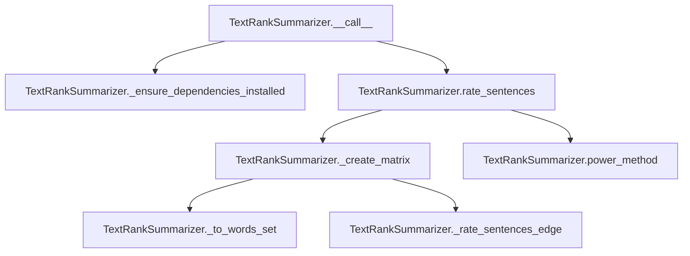

# `text_rank.py`

## `sumy.summarizers.text_rank.TextRankSummarizer` · *class*

## Summary:
TextRankSummarizer implements the TextRank algorithm for automatic text summarization by ranking sentences based on their importance in a weighted graph representation.

## Description:
This class provides a concrete implementation of the TextRank algorithm for extracting the most important sentences from a document to create a summary. It constructs a similarity graph between sentences and uses iterative ranking to determine sentence importance. The summarizer is typically used as a plug-in component in larger text processing pipelines where automatic summarization is required.

The class inherits from AbstractSummarizer, making it compatible with the sumy framework's summarization interface. It can be instantiated with custom stop words and configuration parameters, and used by calling it with a document and desired number of sentences.

## State:
- epsilon: float, convergence threshold for the power method (default: 1e-4)
- damping: float, damping factor for the PageRank-like algorithm (default: 0.85)
- _ZERO_DIVISION_PREVENTION: float, small value to prevent division by zero (default: 1e-7)
- _stop_words: frozenset, set of normalized stop words used for filtering (default: empty frozenset)
- stop_words property: getter/setter for managing the stop word collection

## Lifecycle:
- Creation: Instantiate with optional stop words configuration
- Usage: Call instance with (document, sentences_count) arguments to generate summary
- Destruction: No explicit cleanup required; relies on Python's garbage collection

## Method Map:


## Raises:
- ValueError: When NumPy dependency is not installed, raised by _ensure_dependencies_installed method

## Example:
```python
from sumy.summarizers.text_rank import TextRankSummarizer
from sumy.parsers.plaintext import PlaintextParser
from sumy.nlp.tokenizers import Tokenizer

# Create summarizer with custom stop words
summarizer = TextRankSummarizer()
summarizer.stop_words = ["the", "and", "or"]

# Parse document
parser = PlaintextParser.from_string("Your long text here...", Tokenizer("english"))
document = parser.document

# Generate summary with 3 sentences
summary = summarizer(document, 3)
for sentence in summary:
    print(sentence)
```

### `sumy.summarizers.text_rank.TextRankSummarizer.stop_words` · *method*

## Summary:
Sets the stop words collection for text processing by normalizing input words and storing them as an immutable frozenset.

## Description:
Configures the stop words that will be excluded from text analysis during summarization. This setter property normalizes each input word using the inherited `normalize_word` method before storing the collection as a frozenset in the instance variable `_stop_words`. The method is typically used during initialization or configuration of the summarizer to define which words should be ignored during sentence ranking and word frequency calculations.

## Args:
    words (iterable): An iterable of words (strings) to be treated as stop words.

## Returns:
    None: This method does not return a value.

## Raises:
    None: This method does not explicitly raise exceptions.

## State Changes:
    Attributes READ: None
    Attributes WRITTEN: self._stop_words

## Constraints:
    Preconditions: The input `words` parameter must be iterable and contain string-like elements that can be processed by `normalize_word`.
    Postconditions: The instance's `_stop_words` attribute will contain a frozenset of normalized words.

## Side Effects:
    None: This method performs no I/O operations or external service calls. It only modifies the instance's internal state.

### `sumy.summarizers.text_rank.TextRankSummarizer.__call__` · *method*

## Summary:
Executes the TextRank algorithm to summarize a document by ranking sentences and selecting the most important ones.

## Description:
This method serves as the primary interface for the TextRank summarization algorithm. It performs dependency checking, sentence rating using the TextRank algorithm, and returns the highest-ranked sentences according to the specified count. This method is designed to be called as part of the summarization pipeline where documents are processed through various stages including preprocessing, ranking, and selection.

## Args:
    document (Document): A document object containing sentences to be summarized
    sentences_count (int or callable): The number of top-ranked sentences to return, or a callable that determines the count

## Returns:
    tuple[Sentence]: A tuple of Sentence objects representing the most important sentences in the document, ordered by importance from highest to lowest rank

## Raises:
    ValueError: When required dependencies (NumPy) are not installed

## State Changes:
    Attributes READ: None
    Attributes WRITTEN: None

## Constraints:
    Preconditions:
        - The document object must have a sentences attribute containing a list of sentences
        - Sentences_count must be a non-negative integer or callable that returns a non-negative integer
    Postconditions:
        - Returns a tuple of sentences ordered by their TextRank importance scores
        - If document.sentences is empty, returns an empty tuple

## Side Effects:
    - May raise ValueError if NumPy is not installed
    - Calls external dependency checking method

### `sumy.summarizers.text_rank.TextRankSummarizer._ensure_dependencies_installed` · *method*

## Summary:
Ensures NumPy dependency is available for TextRank summarization operations.

## Description:
Validates that the NumPy library is properly imported and available before proceeding with text summarization. This method is called during the summarization process to prevent runtime errors due to missing dependencies.

## Args:
    None

## Returns:
    None

## Raises:
    ValueError: When NumPy is not available (numpy is None), indicating that the LexRank summarizer requires NumPy to be installed.

## State Changes:
    Attributes READ: None
    Attributes WRITTEN: None

## Constraints:
    Preconditions: The method assumes that the numpy module is imported at the module level
    Postconditions: Either the method completes successfully or raises a ValueError

## Side Effects:
    None

### `sumy.summarizers.text_rank.TextRankSummarizer.rate_sentences` · *method*

## Summary:
Computes TextRank-based importance scores for sentences in a document using iterative matrix operations.

## Description:
This method implements the TextRank algorithm to rate sentences based on their importance within a document. It constructs a similarity matrix between sentences and applies the power method to compute stationary probabilities representing sentence rankings. The resulting scores reflect how central each sentence is to the document's overall meaning.

## Args:
    document (Document): A document object containing sentences to be rated.

## Returns:
    dict[Sentence, float]: A dictionary mapping each sentence in the document to its computed TextRank score (between 0 and 1).

## Raises:
    None explicitly raised, but may propagate exceptions from underlying matrix operations or document processing.

## State Changes:
    Attributes READ: self.epsilon, self.damping, self._ZERO_DIVISION_PREVENTION
    Attributes WRITTEN: None

## Constraints:
    Preconditions: 
    - Document must contain at least one sentence
    - Document object must have a sentences attribute containing Sentence objects
    - Matrix operations require NumPy to be installed
    
    Postconditions:
    - Returns a dictionary with one entry for each sentence in the input document
    - All returned scores are non-negative floating-point numbers
    - Scores are normalized such that higher values indicate more important sentences

## Side Effects:
    None directly, but relies on external NumPy operations for matrix computations

### `sumy.summarizers.text_rank.TextRankSummarizer._create_matrix` · *method*

## Summary:
Creates a transition probability matrix for TextRank algorithm by computing sentence similarities and normalizing weights.

## Description:
This method constructs a square matrix representing the transition probabilities between sentences in a document. It computes pairwise sentence similarities using the TextRank edge rating function, normalizes the weights to form a stochastic matrix, and applies the TextRank damping factor to create the final transition matrix used in the power method for ranking sentences.

The method is called during the sentence rating phase of TextRank summarization, specifically in the `rate_sentences` method which is invoked by the main summarization process.

## Args:
    document (Document): The input document containing sentences to be processed

## Returns:
    numpy.ndarray: A square matrix of shape (n_sentences, n_sentences) where each row represents the transition probabilities from one sentence to all other sentences in the document

## Raises:
    None explicitly raised

## State Changes:
    Attributes READ: 
    - self.damping
    - self._ZERO_DIVISION_PREVENTION
    - self._to_words_set
    - self._rate_sentences_edge
    
    Attributes WRITTEN: None

## Constraints:
    Preconditions:
    - Document must contain at least one sentence
    - All sentences in document must be processable by _to_words_set method
    - Self must have damping and _ZERO_DIVISION_PREVENTION attributes properly initialized
    
    Postconditions:
    - Returned matrix is a valid stochastic matrix (each row sums to 1.0)
    - Matrix dimensions match number of sentences in document
    - Values are in range [0, 1]

## Side Effects:
    None

### `sumy.summarizers.text_rank.TextRankSummarizer._to_words_set` · *method*

## Summary:
Converts a sentence into a filtered list of stemmed words by normalizing, stemming, and removing stop words for text ranking calculations.

## Description:
Processes a sentence by normalizing each word, applying stemming, and filtering out stop words to create a clean set of words for text ranking calculations. This method is used internally by the TextRank algorithm to prepare sentence representations for similarity computations in the ranking process.

## Args:
    sentence: A sentence object with a `words` attribute containing word tokens to be processed

## Returns:
    list[str]: A list of stemmed words that are not stop words, where each word has been normalized and stemmed

## Raises:
    None explicitly raised

## State Changes:
    Attributes READ: self._stop_words, self.normalize_word, self.stem_word
    Attributes WRITTEN: None

## Constraints:
    Preconditions: The sentence object must have a `words` attribute containing word tokens
    Postconditions: Returns a list of processed words with no stop words and all words normalized and stemmed

## Side Effects:
    None

### `sumy.summarizers.text_rank.TextRankSummarizer._rate_sentences_edge` · *method*

## Summary:
Calculates the similarity rating between two sets of words using shared word count normalized by logarithmic sentence lengths.

## Description:
This method implements a similarity scoring mechanism for TextRank summarization that computes how similar two sentences are based on their shared vocabulary. It's used internally by the TextRank algorithm to build the sentence similarity matrix.

The method is called during the matrix creation phase of the TextRank algorithm, specifically in the `_create_matrix` method where pairwise similarities between all sentences are computed.

## Args:
    words1 (list[str]): First set of words representing a sentence
    words2 (list[str]): Second set of words representing another sentence

## Returns:
    float: Similarity rating between 0.0 and 1.0, where 0.0 indicates no similarity and higher values indicate greater similarity

## Raises:
    AssertionError: When either words1 or words2 has zero length (though this is handled by the caller)

## State Changes:
    Attributes READ: None
    Attributes WRITTEN: None

## Constraints:
    Preconditions: Both input lists must contain at least one word
    Postconditions: Returns a float value in the range [0.0, 1.0]

## Side Effects:
    None

### `sumy.summarizers.text_rank.TextRankSummarizer.power_method` · *method*

## Summary:
Computes the principal eigenvector of a transition matrix using the power iteration method.

## Description:
Implements the power iteration algorithm to find the dominant eigenvector of a square matrix. This method is commonly used in TextRank and similar graph-based ranking algorithms to compute sentence importance scores. The algorithm iteratively applies the matrix to an initial probability vector until convergence is achieved within the specified tolerance.

## Args:
    matrix (numpy.ndarray): Square transition matrix representing the graph connections between elements (typically sentences in summarization).
    epsilon (float): Convergence threshold below which the difference between successive iterations is considered negligible.

## Returns:
    numpy.ndarray: Probability vector containing the normalized eigenvector components, where each element represents the relative importance score of the corresponding matrix row/column.

## Raises:
    None explicitly raised, but may raise numpy-related exceptions if matrix operations fail.

## State Changes:
    None - This is a pure function that does not modify any object state.

## Constraints:
    Preconditions:
        - Matrix must be square (n x n)
        - Epsilon must be positive
        - Matrix should be stochastic (rows sum to 1) for proper convergence in TextRank applications
    
    Postconditions:
        - Returned vector is normalized (sum equals 1.0)
        - Vector contains non-negative values
        - Dimensions match the input matrix size

## Side Effects:
    None - This function is stateless and does not perform I/O or mutate external state.

