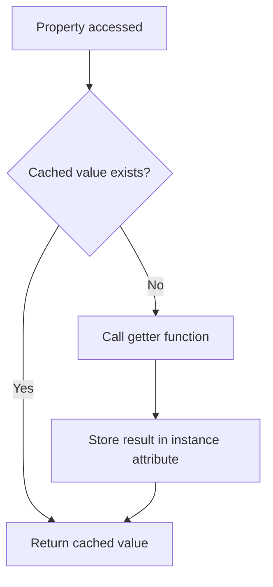
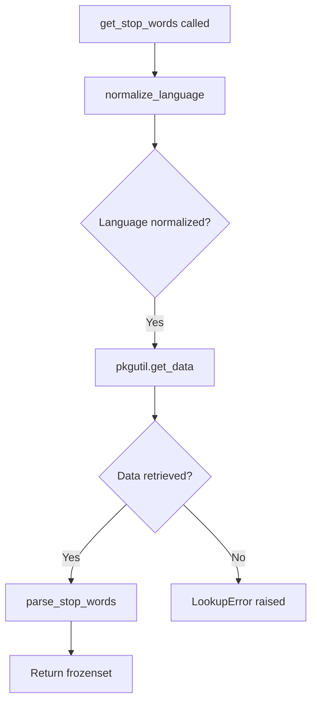
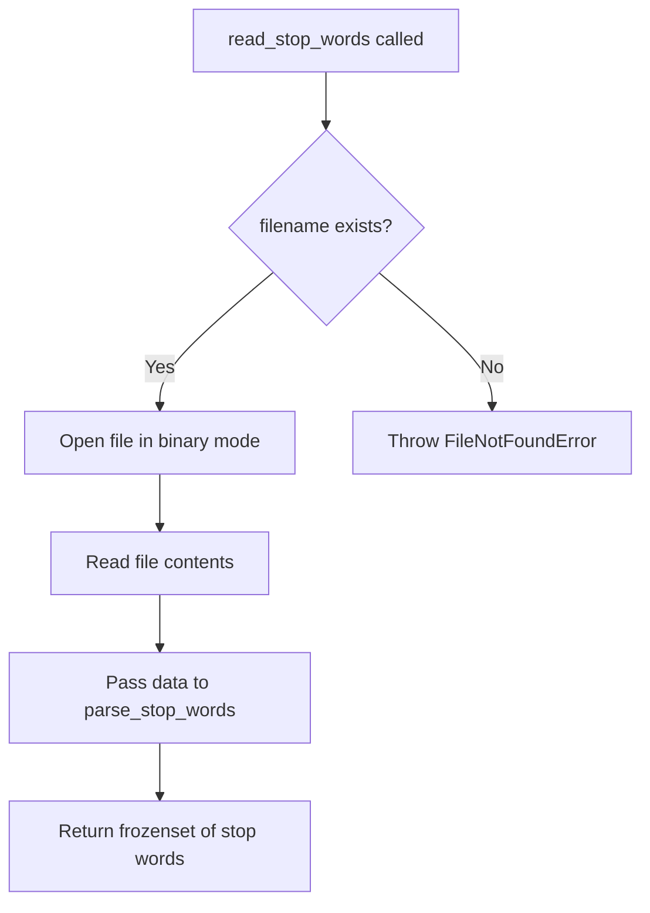
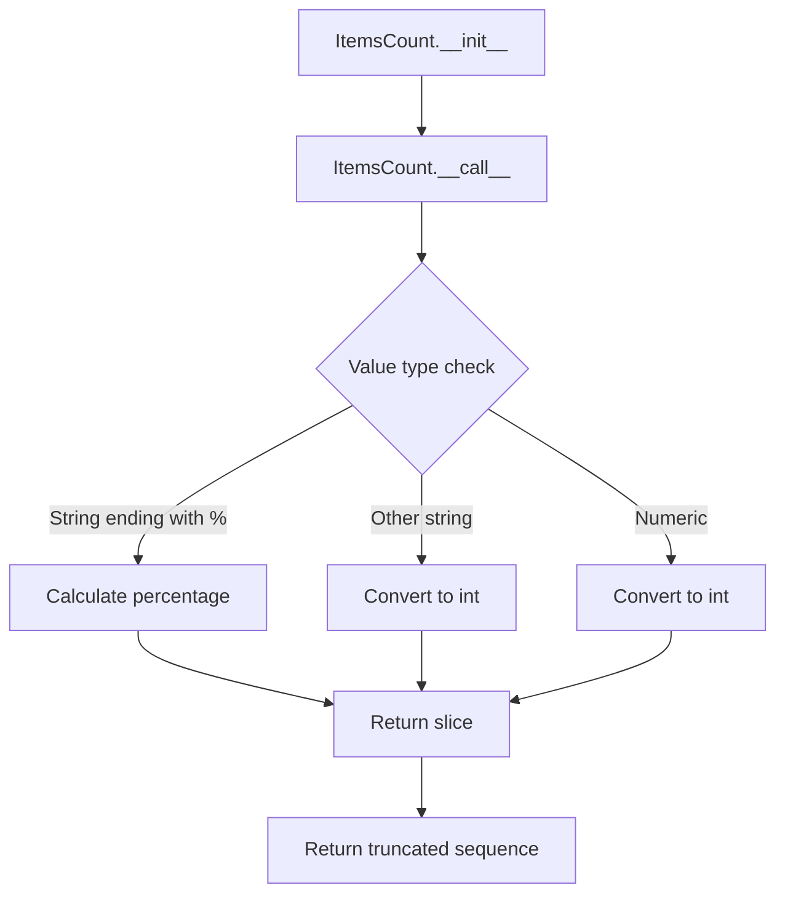

# `utils.py`

## `sumy.utils.normalize_language` · *function*

## Summary:
Normalizes language identifiers by resolving ISO language codes to standardized full language names.

## Description:
Attempts to convert language codes (ISO alpha-2 or alpha-3) into their corresponding full language names using the pycountry library. The function prioritizes alpha-2 code resolution over alpha-3 code resolution when both are available. If no matching language is found, the original input is returned unchanged.

## Args:
    language (str): Language identifier that may be an ISO alpha-2 code (e.g., "en"), alpha-3 code (e.g., "eng"), or a full language name (e.g., "English").

## Returns:
    str: The normalized language name in lowercase if the input matches a known language code, otherwise returns the original input unchanged.

## Raises:
    KeyError: May be raised internally by pycountry.languages.get() when the language code is not found, but is caught and handled gracefully.

## Constraints:
    Preconditions:
    - Input must be a string
    - The pycountry library must be properly installed and available
    
    Postconditions:
    - Returns a string representation of the language name or the original input
    - If input is not recognized, returns the original input unchanged

## Side Effects:
    None

## Control Flow:
```mermaid
flowchart TD
    A[Start normalize_language] --> B{Input is string?}
    B -- No --> C[Return language]
    B -- Yes --> D[Initialize lookup_keys = ("alpha_2", "alpha_3")]
    D --> E[For each lookup_key in lookup_keys]
    E --> F[Try languages.get(**{lookup_key: language})]
    F --> G{lang found?}
    G -- Yes --> H[Set language = lang.name.lower()]
    G -- No --> I[Continue to next lookup_key]
    H --> J[Continue to next lookup_key]
    I --> K{End of lookup_keys?}
    K -- No --> E
    K -- Yes --> L[Return language]
```

## Examples:
    >>> normalize_language("en")
    "english"
    >>> normalize_language("eng")
    "english"
    >>> normalize_language("English")
    "english"
    >>> normalize_language("xyz")
    "xyz"

## `sumy.utils.fetch_url` · *function*

## Summary:
Fetches raw binary content from a given URL using an HTTP GET request with predefined headers.

## Description:
Retrieves binary content from a specified web URL by making an HTTP GET request. This utility function encapsulates the HTTP request logic and handles basic error checking for successful responses. The function uses predefined HTTP headers for the request.

## Args:
    url (str): The URL to fetch content from. Must be a valid HTTP or HTTPS URL string.

## Returns:
    bytes: Raw binary content from the HTTP response body.

## Raises:
    requests.exceptions.HTTPError: When the HTTP request receives a 4xx or 5xx status code.
    requests.exceptions.RequestException: When network-related errors occur during the HTTP request.

## Constraints:
    Preconditions:
        - The input `url` must be a valid string representing a web address
        - The target server must be accessible over the network
        - The server must respond with a successful HTTP status code (2xx)
    
    Postconditions:
        - Returns the raw binary content of the HTTP response
        - The function will raise an exception for any HTTP error status codes

## Side Effects:
    - Makes an outbound network request to the specified URL
    - May trigger DNS resolution and TCP connection establishment
    - No local file I/O or state changes

## Control Flow:
```mermaid
flowchart TD
    A[Start fetch_url] --> B[Make HTTP GET request with headers]
    B --> C{Request Successful?}
    C -->|No| D[raise_for_status() raises HTTPError]
    C -->|Yes| E[Return response.content]
```

## Examples:
```python
# Basic usage
content = fetch_url("https://example.com/data.txt")

# Error handling
try:
    content = fetch_url("https://httpbin.org/status/404")
except requests.exceptions.RequestException as e:
    print(f"Failed to fetch URL: {e}")
```

## `sumy.utils.cached_property` · *function*

## Summary:
Creates a cached property descriptor that computes and stores the result of a getter function on first access.

## Description:
A decorator that transforms a method into a cached property. The computed value is stored in the instance and returned on subsequent accesses, avoiding repeated expensive computations. This implements a lazy evaluation pattern where the getter function is invoked only once per instance.

## Args:
    getter (callable): A function that takes a single argument (self) and returns a computed value.

## Returns:
    property: A property descriptor that manages the cached value storage and retrieval.

## Raises:
    None explicitly raised by this decorator.

## Constraints:
    Preconditions:
    - The getter function must accept exactly one argument (self)
    - The getter function should be idempotent (consistent results for same inputs)
    
    Postconditions:
    - The first access to the property triggers the getter function
    - Subsequent accesses return the cached value without re-invoking the getter
    - The cached value is stored as an instance attribute with name "_cached_property_{getter_name}"

## Side Effects:
    - Modifies the instance object by adding a new private attribute on first access
    - No external I/O operations or state mutations beyond instance attribute modification

## Control Flow:


## Examples:
```python
class MyClass:
    @cached_property
    def expensive_computation(self):
        # Simulate expensive operation
        return sum(range(1000))
    
    @cached_property  
    def data(self):
        return [i**2 for i in range(10)]

# Usage:
obj = MyClass()
result1 = obj.expensive_computation  # Computes and caches result
result2 = obj.expensive_computation  # Returns cached result immediately
```

## `sumy.utils.expand_resource_path` · *function*

## Summary:
Constructs an absolute file path for a resource within the sumy package's data directory.

## Description:
Expands a relative resource path to an absolute filesystem path by joining it with the sumy package's data directory. This utility function ensures consistent access to package resources regardless of the current working directory.

## Args:
    path (str): Relative path to a resource file within the sumy package's data directory. The path will be converted to a string if necessary.

## Returns:
    str: Absolute filesystem path to the requested resource file.

## Raises:
    None explicitly raised.

## Constraints:
    Preconditions:
    - The "sumy" module must be installed and importable
    - The requested resource path must be valid within the package's data directory
    
    Postconditions:
    - Returns an absolute path string
    - The returned path points to a location within the sumy package's data directory

## Side Effects:
    None.

## Control Flow:
```mermaid
flowchart TD
    A[expand_resource_path(path)] --> B{Get sumy module directory}
    B --> C{Convert to absolute path}
    C --> D{Join with "data/" and path}
    D --> E[Return absolute path]
```

## Examples:
    # Get path to a vocabulary file
    vocab_path = expand_resource_path("vocabulary.txt")
    
    # Get path to a model file
    model_path = expand_resource_path("models/english_model.pkl")
```

## `sumy.utils.get_stop_words` · *function*

## Summary:
Retrieves and parses stop words for a specified language from packaged data files.

## Description:
This function fetches stop word data for the given language from the package's embedded data files and converts it into a frozenset of stop words. It normalizes the language identifier before attempting to retrieve the data, and raises a LookupError if stop words are not available for the specified language.

## Args:
    language (str): Language identifier that can be a language code (e.g., 'en', 'fr') or name. Must be a valid language identifier recognized by the pycountry library.

## Returns:
    frozenset[str]: A frozenset containing all stop words for the specified language, with each word stripped of trailing whitespace.

## Raises:
    LookupError: When stop-word data is not available for the specified language.

## Constraints:
    Preconditions:
        - The language parameter must be a valid string representing a language
        - The language must have corresponding stop-word data files in the package's data directory
    Postconditions:
        - Returns a frozenset of strings representing stop words
        - All returned words are stripped of trailing whitespace

## Side Effects:
    - Accesses package data via pkgutil.get_data
    - May raise LookupError if stop-word data is missing

## Control Flow:


## Examples:
    >>> get_stop_words('english')
    frozenset({'the', 'a', 'an', 'and', 'or', 'but', ...})
    
    >>> get_stop_words('en')
    frozenset({'the', 'a', 'an', 'and', 'or', 'but', ...})
    
    >>> get_stop_words('unknown')
    LookupError: Stop-words are not available for language unknown.
```

## `sumy.utils.read_stop_words` · *function*

## Summary:
Reads and parses stop words from a file into a frozen set of words.

## Description:
Loads stop words from a text file and processes them into a frozenset for efficient lookup. This function handles the file I/O operation and delegates the parsing logic to `parse_stop_words`.

## Args:
    filename (str): Path to the file containing stop words, one per line.

## Returns:
    frozenset[str]: A frozen set of stop words with whitespace stripped and empty lines filtered out.

## Raises:
    FileNotFoundError: If the specified file does not exist.
    IOError: If there are issues reading the file.

## Constraints:
    Preconditions:
        - The filename parameter must be a valid path to an existing file
        - The file must be readable
    Postconditions:
        - Returns a frozenset containing all non-empty lines from the file with leading/trailing whitespace removed

## Side Effects:
    - Reads from the filesystem at the specified filename
    - May raise file I/O related exceptions

## Control Flow:


## Examples:
    >>> stop_words = read_stop_words("stopwords.txt")
    >>> "the" in stop_words
    True
    >>> len(stop_words)
    500

## `sumy.utils.parse_stop_words` · *function*

## Summary:
Converts text data containing stop words into a frozenset for efficient lookup and filtering.

## Description:
Parses input data containing stop words, normalizes it to Unicode, splits it into individual lines, strips trailing whitespace, filters out empty lines, and returns the result as an immutable frozenset. This function is commonly used to process stop word lists from various sources such as files, strings, or byte sequences.

## Args:
    data (str, bytes, or any object convertible to Unicode): Input data containing stop words, typically one word per line. Can be a string, bytes object, or any object that can be converted to Unicode.

## Returns:
    frozenset[str]: An immutable set of stop words with whitespace stripped and empty lines filtered out. Each element is a string representing a single stop word.

## Raises:
    None explicitly raised, but may raise exceptions from `to_unicode()` conversion if data cannot be properly converted to Unicode.

## Constraints:
    Preconditions:
    - Input data should contain stop words, one per line
    - Data should be convertible to Unicode (either string, bytes, or objects with proper string representation)
    
    Postconditions:
    - Returns a frozenset with no duplicates
    - All returned strings have trailing whitespace removed
    - Empty lines are excluded from the result

## Side Effects:
    None

## Control Flow:
```mermaid
flowchart TD
    A[Input data] --> B[to_unicode(data)]
    B --> C[splitlines()]
    C --> D{Line not empty?}
    D -->|Yes| E[rstrip() line]
    E --> F[Add to frozenset]
    D -->|No| G[Skip line]
    F --> H[Return frozenset]
```

## Examples:
    >>> parse_stop_words("the\\nand\\nor\\n")
    frozenset({'the', 'and', 'or'})
    
    >>> parse_stop_words("  hello  \\n\\nworld\\n")
    frozenset({'hello', 'world'})
    
    >>> parse_stop_words("")
    frozenset()
```

## `sumy.utils.ItemsCount` · *class*

## Summary:
Callable class that limits sequences to a specified number of items, either by absolute count or percentage.

## Description:
The ItemsCount class provides a flexible way to truncate sequences to a specific number of elements. It can accept either an absolute count (integer/float) or a percentage (string ending with "%"). This abstraction is useful for summarization and text processing applications where you need to limit output to a certain number of items.

## State:
- `_value`: The count specification, which can be a string (with optional "%" suffix) or numeric type (int/float)
  - Valid range: Any positive integer, float, or string representation of numbers
  - Invariant: Must be convertible to an integer count for slicing operations

## Lifecycle:
- Creation: Instantiate with a value parameter (string or numeric)
- Usage: Call the instance with a sequence (list, tuple, etc.) to get a truncated version
- Destruction: No special cleanup required; uses standard Python garbage collection

## Method Map:


## Raises:
- ValueError: When the value parameter is neither a supported string nor numeric type

## Example:
```python
# Create with absolute count
limit_5 = ItemsCount(5)
result = limit_5(['a', 'b', 'c', 'd', 'e', 'f'])  # Returns ['a', 'b', 'c', 'd', 'e']

# Create with percentage
limit_50_percent = ItemsCount("50%")
result = limit_50_percent(['a', 'b', 'c', 'd', 'e'])  # Returns ['a', 'b', 'c']

# Create with string count
limit_3 = ItemsCount("3")
result = limit_3(['a', 'b', 'c', 'd'])  # Returns ['a', 'b', 'c']
```

### `sumy.utils.ItemsCount.__init__` · *method*

## Summary:
Initializes an ItemsCount instance with a value specifying how many items to select from a sequence.

## Description:
The ItemsCount class is designed to be a callable that selects a specified number of items from a sequence. This constructor method stores the configuration value that determines the selection behavior. The value can be an integer, float, or string (including percentage strings ending with "%").

## Args:
    value (int, float, or str): The value determining how many items to select from a sequence. 
        - If numeric (int/float): Selects that many items from the beginning of the sequence
        - If string ending with "%": Interprets as percentage and selects that percentage of items
        - If string without "%": Interprets as absolute count

## Returns:
    None: This method initializes the object's internal state but does not return a value.

## Raises:
    None: This method does not raise exceptions directly, though invalid value types may cause exceptions in the __call__ method.

## State Changes:
    Attributes READ: None
    Attributes WRITTEN: self._value - stores the configuration value for item selection

## Constraints:
    Preconditions: The value parameter should be of a supported type (int, float, or string)
    Postconditions: The instance will store the provided value in self._value for later use in __call__ method

## Side Effects:
    None: This method performs no I/O operations or external service calls.

### `sumy.utils.ItemsCount.__call__` · *method*

## Summary:
Returns a slice of the input sequence limited by the configured count or percentage value.

## Description:
This method implements the callable interface of the ItemsCount class, allowing instances to be invoked like functions. It processes a sequence according to the configured `_value` attribute, which can specify either an absolute count or a percentage of items to return. The method is designed to be used in text summarization pipelines where limiting the number of sentences or words is required.

## Args:
    sequence (list, tuple, or str): The input sequence to be sliced. Can be any sequence type that supports indexing and slicing operations.

## Returns:
    Same type as sequence: A slice of the input sequence containing either the specified number of items or the specified percentage of items (rounded up to at least 1 item).

## Raises:
    ValueError: When the `_value` attribute is neither a string nor a numeric type (int or float).

## State Changes:
    Attributes READ: self._value
    Attributes WRITTEN: None

## Constraints:
    Preconditions:
        - The sequence parameter must support the len() function and slicing operations
        - The _value attribute must be either a string ending with "%" (for percentage), a string representing an integer, or a numeric value (int or float)
    Postconditions:
        - The returned sequence will contain at most the specified number or percentage of items from the input sequence
        - If the _value represents a percentage, the result will contain at least 1 item even if the calculated percentage is 0

## Side Effects:
    None

### `sumy.utils.ItemsCount.__repr__` · *method*

## Summary:
Returns a string representation of the ItemsCount object showing its internal value.

## Description:
This method provides a human-readable string representation of the ItemsCount instance for debugging and logging purposes. It displays the internal _value attribute in a formatted string that indicates the object type and its stored value.

## Args:
    None

## Returns:
    str: A string in the format "<ItemsCount: value_repr>" where value_repr is the repr() of the internal _value attribute.

## Raises:
    None

## State Changes:
    Attributes READ: self._value
    Attributes WRITTEN: None

## Constraints:
    Preconditions: The object must have a _value attribute that can be represented by repr().
    Postconditions: The returned string accurately represents the internal state of the object.

## Side Effects:
    None

