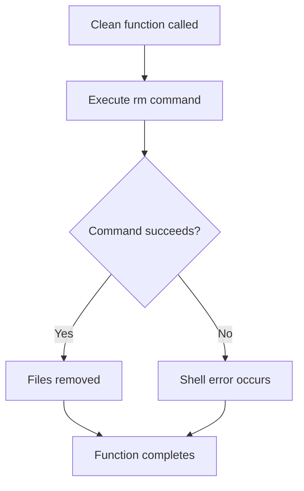
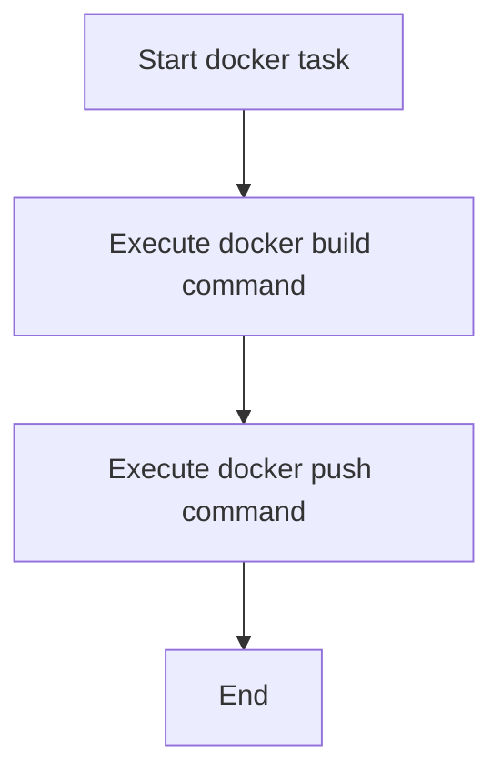

# `tasks.py`

## `clean` · *function*

## Summary:
Removes build artifacts, cache directories, and temporary files from the project workspace.

## Description:
This function serves as a cleanup task that removes various build artifacts, cache directories, and temporary files that accumulate during development and testing processes. It's designed to provide a clean slate for the project environment by deleting directories and files commonly created during builds, testing, and development workflows.

The function is part of an Invoke-based task runner system, where it would typically be invoked as a command-line task to clean up the project directory.

## Args:
    context: An invoke context object that provides execution environment and methods for running shell commands.

## Returns:
    None: This function doesn't return any value.

## Raises:
    None: This function doesn't explicitly raise exceptions, though underlying shell operations may fail.

## Constraints:
    Preconditions:
    - The function assumes the working directory contains the directories to be removed
    - The user executing this function must have appropriate permissions to delete files and directories
    
    Postconditions:
    - All specified directories and files are removed from the filesystem
    - The working directory is left in a clean state with no build artifacts

## Side Effects:
    - Filesystem modifications: Directories and files matching the specified paths are deleted permanently
    - No external services or global state changes

## Control Flow:


## Examples:
    # Typical usage in an Invoke-based task runner
    # invoke clean
    # or
    # python -m invoke clean

## `test` · *function*

## Summary:
Executes the pytest test suite using the invoke task runner.

## Description:
This function serves as an invoke task that executes the pytest testing framework. It is designed to be called through the invoke command-line interface and provides a standardized way to run tests in a project. The function leverages the context object's run method to execute the pytest command in the shell environment.

## Args:
    context: The invoke context object containing runtime information and methods for executing commands.

## Returns:
    The return value of the context.run() call, typically None or a result object indicating command execution status.

## Raises:
    Any exceptions that may occur during command execution through context.run(), such as CommandFailure if pytest fails.

## Constraints:
    Preconditions:
    - The pytest command must be available in the system PATH
    - The invoke library must be properly configured in the project
    - The context object must be properly initialized with appropriate configuration

    Postconditions:
    - The pytest command is executed in the current environment
    - Test results are displayed in the console

## Side Effects:
    - Executes shell command "pytest"
    - Outputs test results to standard output
    - May modify process state through test execution

## Control Flow:
```mermaid
flowchart TD
    A[Invoke task execution] --> B{Context available?}
    B -->|Yes| C[Execute context.run("pytest")]
    C --> D[Shell command "pytest" runs]
    D --> E[Test results displayed]
    B -->|No| F[Exception thrown]
```

## Examples:
    To run this task, execute: invoke test
    This will run pytest in the current working directory and display test results.

## `install` · *function*

## Summary:
Installs the current package in development mode using setuptools.

## Description:
This function serves as an Invoke task to install the project package in development mode. It executes the command `python setup.py develop` which installs the package in a way that allows for live code changes without requiring reinstallation after each modification.

## Args:
    context: The invoke context object containing runtime environment and execution utilities.

## Returns:
    The return value of the underlying `context.run()` call, typically None or a result object representing the command execution outcome.

## Raises:
    Any exceptions raised by `context.run()` when executing the shell command, such as CommandNotFound, UnexpectedExit, or OSError.

## Constraints:
    Preconditions:
    - The project must have a valid setup.py file in the root directory
    - The Python environment must have setuptools installed
    - The working directory must be the project root where setup.py resides
    
    Postconditions:
    - The package is installed in development mode in the current Python environment
    - Changes to the source code are immediately reflected without reinstalling

## Side Effects:
    - Executes a shell command (`python setup.py develop`) which may modify the Python environment
    - May create or modify files in the Python site-packages directory
    - Outputs command execution results to stdout/stderr

## Control Flow:
```mermaid
flowchart TD
    A[install function called] --> B{context.run called}
    B --> C[Execute "python setup.py develop"]
    C --> D[Return execution result]
```

## Examples:
```python
# Typical usage in an Invokefile
from invoke import task

@task
def install(context):
    context.run("python setup.py develop")

# This would be invoked as:
# $ invoke install
```

## `release` · *function*

## Summary:
Executes the complete release process for a Python package by building distributions and uploading them to PyPI.

## Description:
This function automates the release workflow for Python packages by executing two sequential shell commands: first building the package distribution files (source distribution and wheel), and then uploading those files to PyPI using twine. It serves as a convenience wrapper around standard Python packaging tools.

## Args:
    context: An Invoke context object containing execution environment and methods for running shell commands.

## Returns:
    None: This function does not return any value.

## Raises:
    Any exceptions raised by the underlying shell commands or context.run() method when executing the build/upload commands.

## Constraints:
    Preconditions:
    - The project must have a properly configured setup.py file
    - The project directory must contain a dist/ folder structure
    - Twine must be installed in the environment
    - The user must have appropriate credentials configured for PyPI access
    
    Postconditions:
    - Distribution files are created in the dist/ directory
    - Built packages are uploaded to PyPI

## Side Effects:
    - Creates distribution files in the local dist/ directory
    - Makes network requests to PyPI to upload package distributions
    - May modify global Python package index state

## Control Flow:
```mermaid
flowchart TD
    A[Start release()] --> B[Run setup.py register sdist bdist_wheel]
    B --> C{Command successful?}
    C -->|Yes| D[Run twine upload dist/*]
    C -->|No| E[Propagate error]
    D --> F[End release()]
    E --> F
```

## Examples:
```python
# Typical usage in an Invokefile
from invoke import task

@task
def release(context):
    context.run("python setup.py register sdist bdist_wheel")
    context.run("twine upload dist/*")
```

## `bump` · *function*

## Summary:
Updates project version and amends the latest git commit with the version change.

## Description:
This function automates the process of incrementing a project's version number and updating the git history with the change. It leverages the bumpversion tool to modify version files and then amends the most recent commit to include these changes.

## Args:
    context: The invoke context object containing the run method for executing shell commands.
    version (str): The version increment type (e.g., 'major', 'minor', 'patch'). Defaults to 'patch'.

## Returns:
    None: This function does not return any value.

## Raises:
    Any exceptions raised by the underlying `context.run()` calls when executing shell commands.

## Constraints:
    Preconditions:
    - The bumpversion tool must be installed and configured in the environment
    - Git repository must exist in the current working directory
    - The project must have a properly configured .bumpversion.cfg or pyproject.toml file
    - The user must have appropriate permissions to execute shell commands and modify git history
    
    Postconditions:
    - The version files are updated according to the specified version increment
    - The most recent git commit is amended to include the version changes
    - Git history is modified (commit is rewritten)

## Side Effects:
    - Modifies version files in the project directory
    - Amends the most recent git commit
    - Executes shell commands that may produce output to stdout/stderr
    - Changes git repository state by rewriting commit history

## Control Flow:
```mermaid
flowchart TD
    A[Start bump()] --> B[Run bumpversion command]
    B --> C{Command successful?}
    C -->|Yes| D[Run git commit --amend]
    D --> E[End]
    C -->|No| F[Propagate error]
    F --> E
```

## Examples:
```python
# Basic usage with default patch version
bump(context)

# Specific version increment
bump(context, version="minor")
bump(context, version="major")
```

## `docker` · *function*

## Summary:
Builds and pushes a Docker container image with latest and version tags to a remote registry.

## Description:
Executes Docker build and push commands to create a container image tagged with both 'latest' and '0.11.0' versions, then pushes these images to the misobelica/sumy repository.

## Args:
    context: An Invoke context object providing execution environment and run() method for executing shell commands.

## Returns:
    None

## Raises:
    Any exceptions raised by the underlying context.run() calls when executing shell commands.

## Constraints:
    Preconditions:
    - Docker daemon must be running and accessible
    - User must have appropriate permissions to build and push to the misobelica/sumy repository
    - Dockerfile must exist in the current working directory
    
    Postconditions:
    - Docker images with tags 'misobelica/sumy:latest' and 'misobelica/sumy:0.11.0' are built locally
    - Both images are pushed to the remote registry

## Side Effects:
    - Executes shell commands: 'docker build' and 'docker push'
    - Modifies local Docker daemon state by building new images
    - Communicates with remote Docker registry over network

## Control Flow:


## Examples:
```python
# Typical usage in an Invokefile
@task
def docker(context):
    context.run("docker build --no-cache --rm=true --tag misobelica/sumy:latest -t misobelica/sumy:0.11.0 .")
    context.run("docker push misobelica/sumy --all-tags")
```

