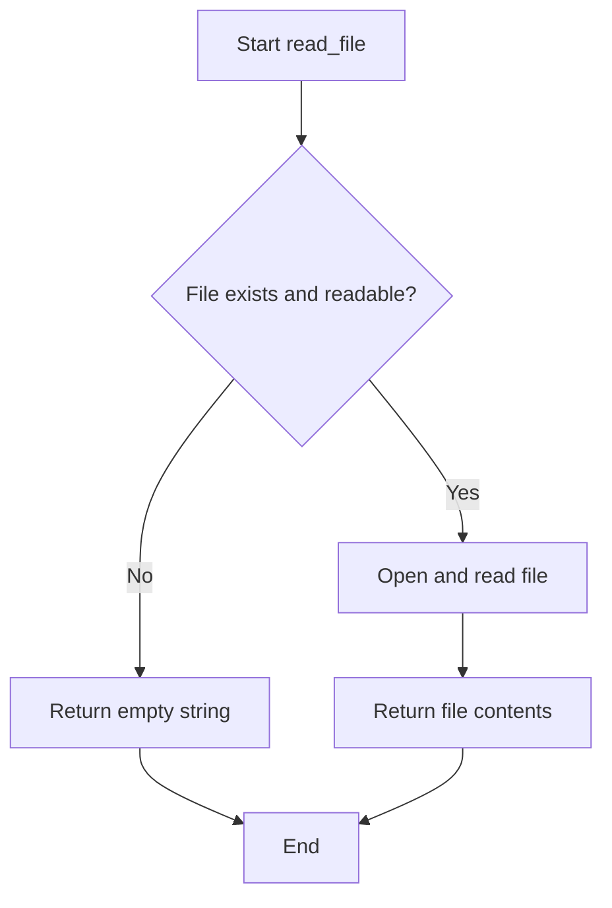

# `setup.py`

## `read_file` · *function*

## Summary:
Reads the contents of a file and returns it as a string, with graceful error handling for missing or inaccessible files.

## Description:
This utility function provides a safe way to read file contents in setup scripts. It attempts to open and read the specified file, returning its entire contents as a string. When the file cannot be accessed due to any reason (missing, permissions, etc.), it silently returns an empty string instead of propagating the exception.

## Args:
    filename (str): Path to the file to be read. This can be an absolute or relative path.

## Returns:
    str: The complete contents of the file as a string, or an empty string if the file cannot be read.

## Raises:
    None: This function catches all exceptions internally and returns an empty string.

## Constraints:
    Preconditions:
        - The filename parameter must be a valid string path
        - The file must be readable if it exists
    Postconditions:
        - Always returns a string value (never None)
        - Never raises file-related exceptions to the caller

## Side Effects:
    - Performs file I/O operations
    - May trigger file system access
    - No external state mutations

## Control Flow:


## Examples:
    # Reading a README file in setup configuration
    long_description = read_file('README.md')
    
    # Reading a license file
    license_text = read_file('LICENSE')
    
    # Handling missing files gracefully
    description = read_file('nonexistent.txt')  # Returns empty string
```

