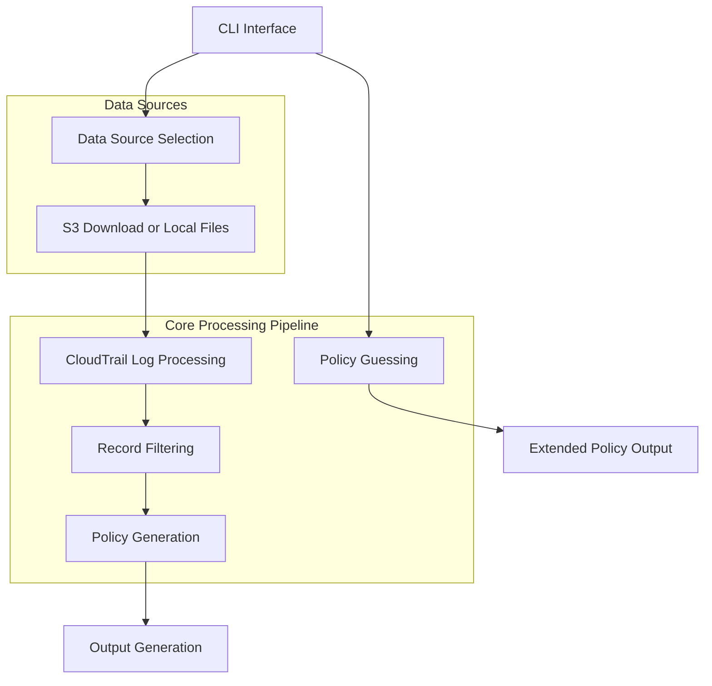

# `trailscraper`

## TrailScraper Repository Documentation

### Tree Structure
```
trailscraper/
├── trailscraper/
│   ├── __init__.py
│   ├── cli.py              # Command-line interface
│   ├── cloudtrail.py       # CloudTrail log parsing and processing
│   ├── iam.py              # IAM policy and statement handling
│   ├── policy_generator.py # Policy generation from CloudTrail records
│   ├── guess.py            # Policy guessing/generation
│   ├── record_sources/     # Data source implementations
│   │   ├── __init__.py
│   │   ├── cloudtrail_api_record_source.py
│   │   └── local_directory_record_source.py
│   ├── s3_download.py      # S3 CloudTrail log downloading
│   ├── time_utils.py       # Time parsing utilities
│   ├── collection_utils.py # Collection processing utilities
│   ├── boto_service_definitions.py  # AWS service definitions
│   └── known-iam-actions.txt  # Known IAM actions database
└── setup.py
```

### Purpose
TrailScraper is a command-line tool designed to process AWS CloudTrail logs for security analysis and IAM policy generation. It enables users to:

- Download CloudTrail logs from S3 buckets
- Parse and filter CloudTrail events
- Generate IAM policies based on actual AWS activity
- Guess and extend IAM policies from existing policies
- Analyze CloudTrail data through various filtering options

This tool is particularly valuable for security teams and cloud administrators who want to audit AWS permissions, implement least-privilege principles, or analyze actual usage patterns in their AWS environments.

### Target Users
- Security engineers analyzing AWS permissions
- Cloud administrators auditing access patterns
- DevOps teams implementing IAM policies
- Compliance professionals reviewing AWS activity logs

### Position in Ecosystem
TrailScraper operates as a standalone command-line utility that integrates with AWS services (S3, CloudTrail) and can be used as part of larger security automation pipelines. It serves as a bridge between raw CloudTrail data and actionable IAM policy definitions.

### Architecture


### Entry Points
1. **CLI Commands** (`trailscraper`):
   - `download`: Download CloudTrail logs from S3
   - `select`: Filter CloudTrail records from local files or CloudTrail API
   - `generate`: Generate IAM policy from filtered records
   - `guess`: Extend existing IAM policy with guessed actions
   - `last_event_timestamp`: Show latest event timestamp in logs

2. **Importable APIs**:
   - `trailscraper.cloudtrail`: Record parsing and filtering
   - `trailscraper.iam`: Policy document handling
   - `trailscraper.policy_generator`: Policy generation logic
   - `trailscraper.guess`: Policy guessing logic
   - `trailscraper.record_sources`: Data source interfaces

### Core Features
1. **CloudTrail Log Downloading**: Download CloudTrail logs from S3 buckets with support for organization trails
2. **Log Parsing**: Parse gzipped CloudTrail JSON logs into structured records
3. **Record Filtering**: Filter records by time range, assumed role ARNs, or other criteria
4. **Policy Generation**: Automatically generate IAM policies from actual CloudTrail activity
5. **Policy Guessing**: Extend existing policies with additional actions based on allowed prefixes
6. **Multi-source Support**: Work with local log files or real-time CloudTrail API data

### Dependencies
- `boto3`: AWS SDK for Python
- `click`: Command-line interface toolkit
- `pytz`: Timezone handling
- `botocore`: AWS service definitions
- `dateparser`: Human-readable time parsing
- `toolz`: Functional programming utilities
- `six`: Python 2/3 compatibility

### Configuration
- Environment variables for AWS credentials (via boto3)
- Command-line arguments for all operations
- Log directory paths for local storage
- Time ranges for filtering operations

### Extension Points
- Custom record sources can be implemented by extending `RecordSource` base class
- New policy generation strategies can be added by implementing custom generators
- Additional filtering criteria can be added to the filtering pipeline
- New data formats can be supported by implementing new parsers

---

## Modules

- [`trailscraper`](trailscraper.md)
- [`trailscraper/record_sources`](trailscraper/record_sources.md)

