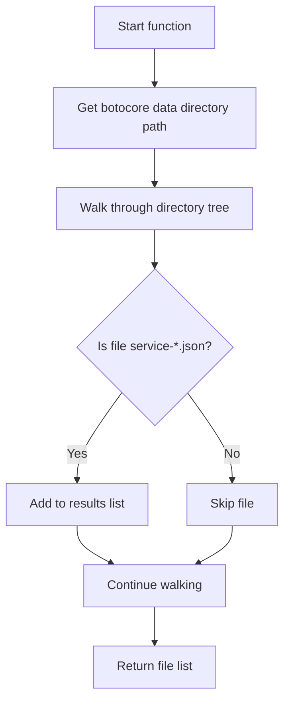
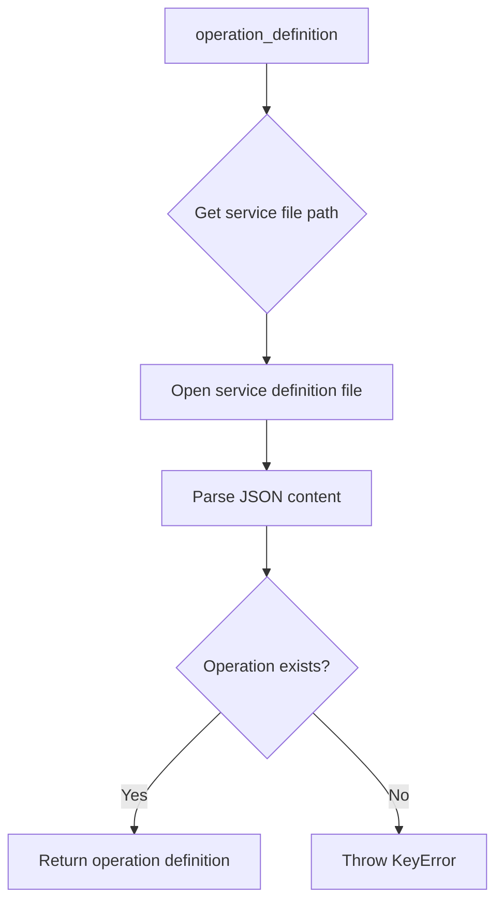

# `boto_service_definitions.py`

## `trailscraper.boto_service_definitions.boto_service_definition_files` · *function*

## Summary:
Returns a list of file paths to all AWS service definition JSON files bundled with botocore.

## Description:
This function discovers and collects all AWS service definition files from the botocore package data directory. These JSON files contain metadata about AWS services and their operations, which are used by the AWS SDKs for service discovery and API contract validation.

The function leverages pkg_resources to locate the botocore installation and recursively searches through its data directory for files matching the pattern 'service-*.json'. This pattern typically matches files like 'service-2.json', 'service-1.json', etc., which define AWS service APIs.

## Args:
    None

## Returns:
    list[str]: A list of absolute file paths pointing to AWS service definition JSON files distributed with botocore. Each path corresponds to a service definition file containing AWS API metadata.

## Raises:
    None explicitly raised

## Constraints:
    Preconditions:
    - The botocore package must be installed in the Python environment
    - The botocore package must contain service definition files in its data directory
    
    Postconditions:
    - Returns a list of file paths (possibly empty if no service files are found)
    - All returned paths are absolute file system paths

## Side Effects:
    - Reads from the file system to traverse botocore's data directory
    - May trigger package resource loading mechanism from pkg_resources

## Control Flow:


## Examples:
```python
# Basic usage
service_files = boto_service_definition_files()
print(f"Found {len(service_files)} service definition files")

# Process service files
for file_path in service_files[:5]:  # Process first 5 files
    with open(file_path, 'r') as f:
        service_data = json.load(f)
        print(f"Service: {service_data.get('serviceFullName', 'Unknown')}")
```

## `trailscraper.boto_service_definitions.service_definition_file` · *function*

## Summary:
Returns the most recent service definition file for a specified AWS service from the botocore data directory.

## Description:
This function retrieves all available AWS service definition files from botocore's data directory, filters them for the specified service, sorts them chronologically, and returns the most recent version. This is useful for accessing the latest AWS service metadata for a given service name.

## Args:
    servicename (str): The name of the AWS service to retrieve definition files for (e.g., 'ec2', 's3')

## Returns:
    str: Path to the most recent service definition JSON file for the specified service, or None if no matching files are found

## Raises:
    None explicitly raised, but may raise exceptions from underlying functions like os.walk() or fnmatch.filter()

## Constraints:
    Preconditions:
    - The botocore package must be installed and accessible
    - The servicename parameter must be a valid AWS service name that exists in botocore data
    
    Postconditions:
    - Returns a string path to a valid JSON file, or None if no matches found
    - The returned file path corresponds to the most recent version of the service definition

## Side Effects:
    - Calls resource_filename() to locate botocore data directory
    - Performs filesystem operations via os.walk() and os.path.join()
    - May trigger package loading of botocore resources

## Control Flow:
```mermaid
flowchart TD
    A[Start service_definition_file] --> B[Call boto_service_definition_files()]
    B --> C[Filter files with fnmatch pattern "**/servicename/*/service-*.json"]
    C --> D[Sort filtered files]
    D --> E{Are files found?}
    E -->|No| F[Return None]
    E -->|Yes| G[Return last file in sorted list]
```

## Examples:
    # Get the latest service definition for EC2
    ec2_definition = service_definition_file('ec2')
    # Returns something like '/path/to/botocore/data/ec2/2023-01-01/service-2.json'
    
    # Get the latest service definition for S3
    s3_definition = service_definition_file('s3')
    # Returns something like '/path/to/botocore/data/s3/2023-06-01/service-2.json'

## `trailscraper.boto_service_definitions.operation_definition` · *function*

## Summary:
Retrieves the definition of a specific AWS service operation from JSON service definition files.

## Description:
This function loads AWS service definition data from JSON files and extracts the specification for a particular operation within a given service. It serves as a lookup mechanism to access detailed operation metadata for AWS services.

The function is extracted into its own component to encapsulate the logic for retrieving operation definitions, separating concerns between file discovery and operation data extraction. This makes the code more modular and testable.

## Args:
    servicename (str): The name of the AWS service (e.g., 's3', 'ec2')
    operationname (str): The name of the specific operation within the service (e.g., 'ListObjects', 'RunInstances')

## Returns:
    dict: The operation definition dictionary containing metadata about the specified AWS operation

## Raises:
    FileNotFoundError: When the service definition file cannot be found
    json.JSONDecodeError: When the service definition file contains invalid JSON
    KeyError: When the specified operationname does not exist in the service definition operations dictionary

## Constraints:
    Preconditions:
    - The servicename must correspond to a valid AWS service that has definition files available
    - The operationname must exist within the service's operations dictionary
    - The service definition file must be accessible and readable
    
    Postconditions:
    - Returns a dictionary containing the operation definition
    - The returned dictionary will contain all metadata associated with the operation

## Side Effects:
    - Reads from the file system to load JSON service definition files
    - May trigger file system traversal operations when discovering service definition files

## Control Flow:


## Examples:
```python
# Retrieve S3 ListObjects operation definition
s3_list_objects_def = operation_definition('s3', 'ListObjects')

# Retrieve EC2 RunInstances operation definition  
ec2_run_instances_def = operation_definition('ec2', 'RunInstances')
```

