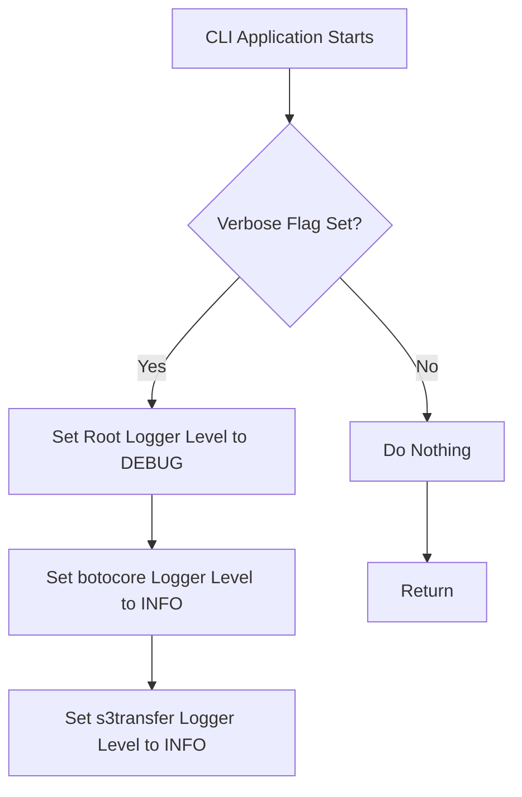
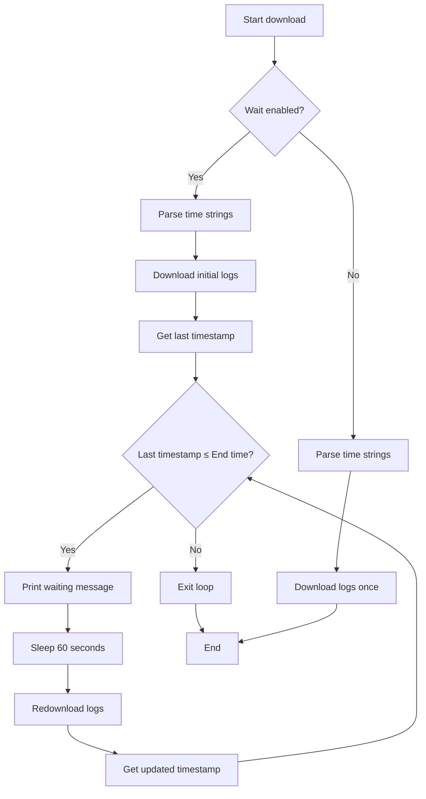
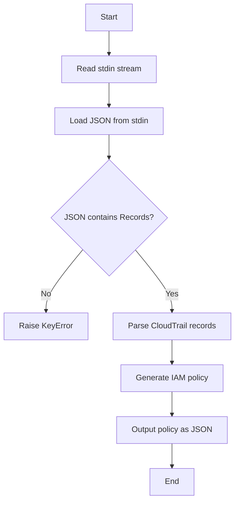

# `cli.py`

## `trailscraper.cli.root_group` · *function*

## Summary:
Configures logging verbosity for the CLI application based on the verbose flag.

## Description:
This function serves as a Click group callback that initializes logging configuration for the trailscraper CLI application. When invoked, it adjusts the logging levels for the root logger and specific third-party libraries to provide appropriate debug output based on user-specified verbosity.

## Args:
    verbose (bool): Flag indicating whether verbose logging should be enabled. When True, sets logging level to DEBUG for the root logger and INFO for botocore and s3transfer libraries.

## Returns:
    None: This function does not return any value.

## Raises:
    None: This function does not explicitly raise any exceptions.

## Constraints:
    Preconditions:
        - The logging module must be properly imported and available
        - The function should be called as a Click group callback
    Postconditions:
        - Logging configuration is updated according to the verbose flag
        - Third-party library logging levels are adjusted appropriately

## Side Effects:
    - Modifies global logging configuration via logging.getLogger()
    - Changes logging level of botocore logger to INFO
    - Changes logging level of s3transfer logger to INFO
    - Sets root logger level to DEBUG when verbose=True

## Control Flow:


## Examples:
```bash
# Run with verbose output
trailscraper --verbose describe-access

# Run with normal output
trailscraper describe-access
```

## `trailscraper.cli.download` · *function*

## Summary:
Downloads CloudTrail logs from S3 to a local directory with optional waiting for log completion.

## Description:
This function retrieves CloudTrail log files from AWS S3 and saves them locally to the specified directory. It supports filtering by organization ID, account ID, region, and time range. When the wait parameter is enabled, it continuously monitors the downloaded logs and retries downloads until the most recent log event timestamp reaches or exceeds the requested end time.

## Args:
    bucket (str): The S3 bucket name containing CloudTrail logs.
    prefix (str): The S3 object key prefix to filter logs by.
    org_id (list[str] or None): Organization IDs to filter logs by. Can be None.
    account_id (list[str]): Account IDs to filter logs by.
    region (list[str]): Regions to filter logs by.
    log_dir (str): Local directory path to save downloaded logs. Tilde (~) in path will be expanded to user home directory.
    from_s (str): Human-readable start time string for log filtering.
    to_s (str): Human-readable end time string for log filtering.
    wait (bool): Whether to wait for logs to catch up to the requested end time.
    parallelism (int): Number of concurrent download threads to use.

## Returns:
    None: This function does not return any value.

## Raises:
    None explicitly raised by this function. Exceptions from underlying functions (like S3 operations) may propagate.

## Constraints:
    Preconditions:
        - The bucket must be accessible with appropriate AWS credentials
        - The log_dir path must be writable
        - Time strings must be parseable by dateparser library
        - Account IDs must be valid AWS account identifiers
        - Region names must be valid AWS region identifiers

    Postconditions:
        - If wait=False: Logs are downloaded once, regardless of whether they cover the full time range
        - If wait=True: The local directory will contain logs covering events up to at least the requested end time

## Side Effects:
    - Creates directories in the filesystem as needed
    - Downloads files from S3 to the local filesystem
    - Writes log messages to standard logging output
    - Outputs progress messages to stdout via click.echo when wait=True
    - May block execution for extended periods when wait=True

## Control Flow:


## Examples:
    # Download logs for a specific account and time range
    download(
        bucket="my-cloudtrail-bucket",
        prefix="AWSLogs/",
        org_id=None,
        account_id=["123456789012"],
        region=["us-east-1"],
        log_dir="./cloudtrail-logs",
        from_s="2023-01-01 00:00:00",
        to_s="2023-01-01 01:00:00",
        wait=False,
        parallelism=4
    )

    # Download logs and wait for completion
    download(
        bucket="my-cloudtrail-bucket",
        prefix="AWSLogs/",
        org_id=["o-1234567890"],
        account_id=["123456789012", "210987654321"],
        region=["us-east-1", "us-west-2"],
        log_dir="~/cloudtrail-logs",
        from_s="2023-01-01 00:00:00",
        to_s="2023-01-01 01:00:00",
        wait=True,
        parallelism=8
    )

## `trailscraper.cli.select` · *function*

## Summary
Selects and filters CloudTrail records from either API or local directory sources based on time range and role ARN filtering, then outputs the results as JSON.

## Description
This function serves as a command-line interface component that retrieves CloudTrail records from either the AWS CloudTrail API or local log files, applies filtering based on assumed role ARNs and time ranges, and outputs the filtered records in JSON format to standard output. It abstracts the complexity of record sourcing and filtering into a reusable CLI operation.

The function is designed to be called from a Click-based CLI interface, likely as part of a larger tool for analyzing AWS CloudTrail logs. It provides flexibility in data source selection while maintaining consistent output formatting.

## Args
- log_dir (str): Path to local directory containing CloudTrail log files. Expanded using os.path.expanduser() to handle ~ notation.
- filter_assumed_role_arn (str or None): ARN of assumed role to filter out from records, or None to disable filtering.
- use_cloudtrail_api (bool): Flag indicating whether to fetch records from AWS CloudTrail API (True) or local directory (False).
- from_s (str): Human-readable start time string for filtering records.
- to_s (str): Human-readable end time string for filtering records.

## Returns
- None: This function does not return a value directly. Instead, it outputs JSON-formatted records via click.echo().

## Raises
- None explicitly raised: The function relies on underlying components that may raise exceptions (e.g., boto3 errors for API calls, file system errors for directory access), but these are not caught or re-raised by this function.

## Constraints
- Preconditions:
  - Time strings (from_s, to_s) must be parseable by dateparser library
  - If use_cloudtrail_api is True, appropriate AWS credentials must be configured
  - If use_cloudtrail_api is False, log_dir must be a valid directory path containing CloudTrail log files
- Postconditions:
  - Records are filtered to the specified time range
  - Records matching the filter_assumed_role_arn are excluded (when specified)
  - Output is formatted as valid JSON with "Records" key containing array of raw record sources

## Side Effects
- I/O operations: Reads from either AWS CloudTrail API or local filesystem
- Standard output: Writes JSON-formatted records to stdout using click.echo()
- Logging: May emit warning messages if no records match filters

## Control Flow
```mermaid
flowchart TD
    A[Start select()] --> B{use_cloudtrail_api?}
    B -- Yes --> C[Load from CloudTrail API]
    B -- No --> D[Load from local directory]
    C --> E[Filter records]
    D --> E
    E --> F[Extract raw sources]
    F --> G[Output as JSON via click.echo()]
```

## Examples
```bash
# Select records from local directory for a specific time range
trailscraper select ~/cloudtrail-logs --from "2023-01-01 00:00:00" --to "2023-01-01 01:00:00"

# Select records from CloudTrail API for a specific time range
trailscraper select /tmp/logs --use-cloudtrail-api --from "2023-01-01 00:00:00" --to "2023-01-01 01:00:00"

# Select records with assumed role filtering
trailscraper select ~/cloudtrail-logs --filter-assumed-role-arn "arn:aws:iam::123456789012:role/MyRole" --from "2023-01-01 00:00:00" --to "2023-01-01 01:00:00"
```

## `trailscraper.cli.generate` · *function*

## Summary:
Generates an IAM policy document from CloudTrail records provided via standard input.

## Description:
This function serves as the main command-line interface entry point for generating IAM policies from CloudTrail log records. It reads JSON-formatted CloudTrail records from standard input, parses them into structured records, generates an IAM policy based on the activities captured in those records, and outputs the resulting policy as JSON to standard output.

The function is designed to be used in command-line pipelines where CloudTrail logs are piped into the tool for policy generation. It encapsulates the entire workflow from input parsing to policy generation and output formatting.

## Args:
    None

## Returns:
    None (outputs directly to stdout via click.echo)

## Raises:
    json.JSONDecodeError: When the input from stdin is not valid JSON
    KeyError: When the JSON input does not contain the expected 'Records' key
    Exception: Any other exception that might occur during record parsing or policy generation

## Constraints:
    Preconditions:
    - Input must be valid JSON containing a 'Records' field with CloudTrail log entries
    - Each record in the 'Records' array must be properly formatted CloudTrail event data
    - Standard input must be readable and contain the expected CloudTrail data format
    
    Postconditions:
    - Function completes successfully only when valid CloudTrail records are processed
    - Output is valid JSON representing an IAM policy document
    - All CloudTrail events are converted to appropriate IAM actions and resources

## Side Effects:
    - Reads from standard input (stdin)
    - Writes to standard output (stdout) via click.echo
    - May raise exceptions if input validation fails

## Control Flow:


## Examples:
```bash
# Generate policy from CloudTrail logs stored in a file
cat cloudtrail-logs.json | trailscraper generate

# Generate policy from AWS CLI CloudTrail logs
aws cloudtrail lookup-events --start-time 2023-01-01T00:00:00Z --end-time 2023-01-01T01:00:00Z | trailscraper generate
```

## `trailscraper.cli.guess` · *function*

## Summary:
Enhances IAM policy statements by inferring additional actions based on allowed service prefixes from CloudTrail logs.

## Description:
This function serves as a command-line interface for enhancing IAM policy documents by inferring additional actions that should be included based on allowed prefixes. It's designed to work with CloudTrail log data to suggest more comprehensive permission sets.

The function reads an IAM policy document from standard input, processes it to extend existing statements with inferred actions matching the specified prefixes, and outputs the enhanced policy as JSON to standard output.

## Args:
    only (list[str]): A list of string prefixes defining which actions should be considered for inference. These typically correspond to AWS service prefixes from CloudTrail logs (e.g., "ec2", "s3").

## Returns:
    None: This function doesn't return a value directly, but outputs the enhanced policy JSON to stdout via click.echo.

## Raises:
    json.JSONDecodeError: When the input policy document from stdin is not valid JSON.
    KeyError: When the parsed policy document is missing required fields like 'Version' or 'Statement'.
    AttributeError: When the policy object doesn't have the expected attributes.
    Exception: Any other exception that may occur during parsing or processing.

## Constraints:
    Preconditions:
    - Input must be a valid JSON-formatted IAM policy document on stdin
    - The policy document must contain 'Version' and 'Statement' keys
    - The 'Statement' field must be a list of valid statement objects
    - The 'only' parameter must be a list of strings representing action prefixes

    Postconditions:
    - The output is a valid JSON representation of an enhanced IAM policy document
    - All statements in the output policy either match the original statements or are extended versions with additional inferred actions

## Side Effects:
    - Reads from standard input (stdin) using click.get_text_stream('stdin')
    - Writes to standard output (stdout) via click.echo
    - May raise parsing errors if stdin contains invalid JSON

## Control Flow:
```mermaid
flowchart TD
    A[Start] --> B[Get stdin stream via click]
    B --> C[Parsing policy document with parse_policy_document]
    C --> D[Process allowed prefixes (title case)]
    D --> E[Call guess_statements with policy and prefixes]
    E --> F[Generate enhanced policy statements]
    F --> G[Convert policy to JSON with to_json()]
    G --> H[Output JSON to stdout via click.echo]
    H --> I[End]
```

## Examples:
```bash
# Basic usage with pipe
cat policy.json | trailscraper guess --only ec2 s3

# Using with CloudTrail data
trailscraper fetch --bucket my-bucket --prefix logs/ | trailscraper guess --only ec2 s3
```

## `trailscraper.cli.last_event_timestamp` · *function*

## Summary:
Retrieves and displays the timestamp of the most recent CloudTrail event from a local directory of log files.

## Description:
This function serves as a command-line utility that identifies the latest event timestamp among all valid CloudTrail log files in a specified directory. It expands user paths, processes log files through the LocalDirectoryRecordSource, and outputs the most recent event time to standard output.

The function is extracted into its own component to encapsulate the logic for finding the last event timestamp, separating this concern from CLI argument parsing and command structure. This promotes reusability and testability of the timestamp discovery logic.

## Args:
    log_dir (str): Path to the directory containing CloudTrail log files. Can include shell expansion characters like ~ for home directory.

## Returns:
    None: This function does not return a value directly. Instead, it outputs the timestamp via click.echo.

## Raises:
    None explicitly raised: The function delegates to underlying components that may raise IOError or OSError when accessing files, but these are handled internally and logged as warnings.

## Constraints:
    Preconditions:
    - The log_dir must be a valid directory path containing CloudTrail log files
    - CloudTrail log files must follow the expected naming convention (pattern matching [0-9]+_CloudTrail_[a-z0-9-]+_[0-9TZ]+_[a-zA-Z0-9]+\.json\.gz)
    - Log files must be readable and decompressable (gzip format)

    Postconditions:
    - The function will output exactly one timestamp to stdout
    - If no valid log files exist, the function will output an error message or behave according to the underlying implementation

## Side Effects:
    - Writes to stdout via click.echo
    - Reads files from the filesystem
    - May log warning messages to stderr when encountering invalid filenames

## Control Flow:
```mermaid
flowchart TD
    A[Start last_event_timestamp] --> B[Expand user path]
    B --> C[Create LocalDirectoryRecordSource]
    C --> D[Call last_event_timestamp_in_dir()]
    D --> E{Valid log files exist?}
    E -->|No| F[Return empty result]
    E -->|Yes| G[Sort files by timestamp]
    G --> H[Get most recent file]
    H --> I[Extract records from file]
    I --> J[Sort records by event_time]
    J --> K[Get last record]
    K --> L[Return event_time]
```

## Examples:
    # Basic usage
    last_event_timestamp("~/cloudtrail/logs")
    
    # With absolute path
    last_event_timestamp("/var/log/cloudtrail/")
```

