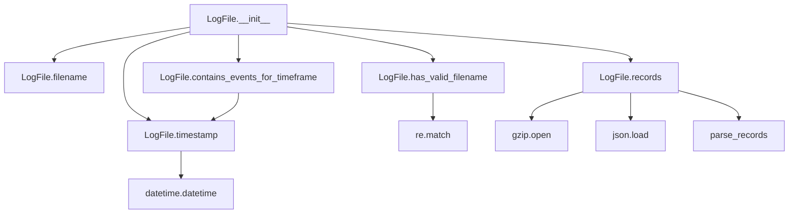
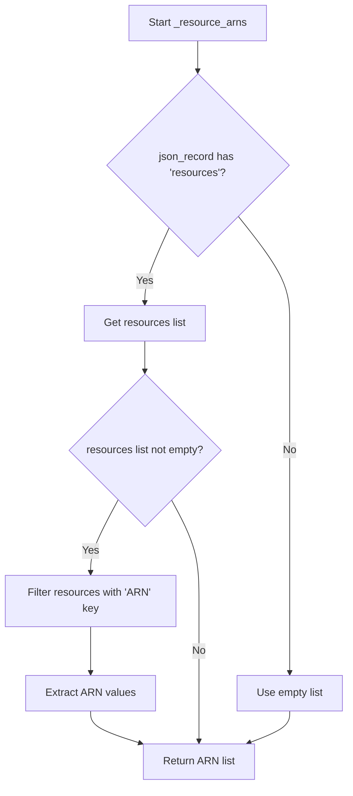
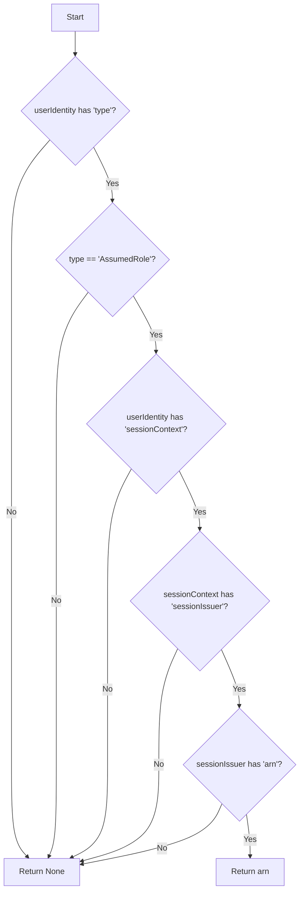
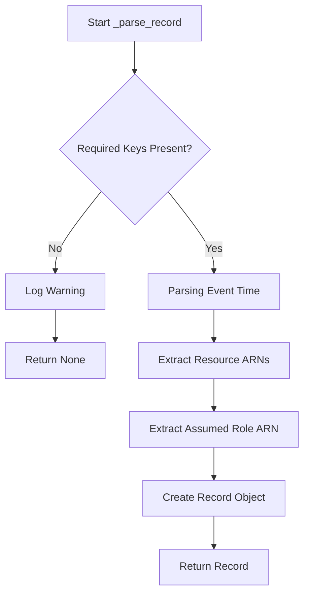
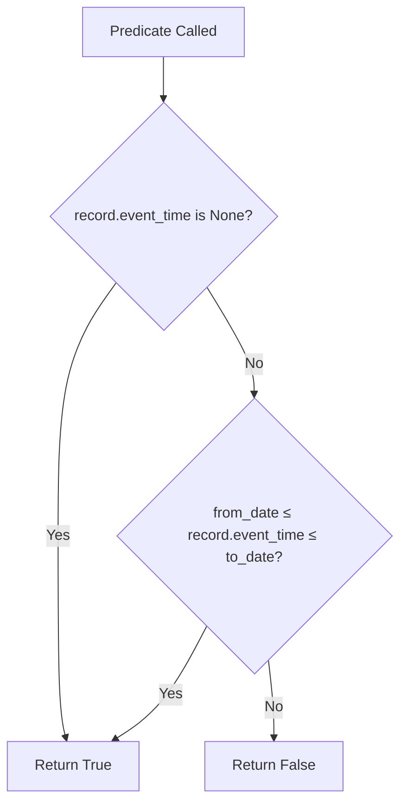
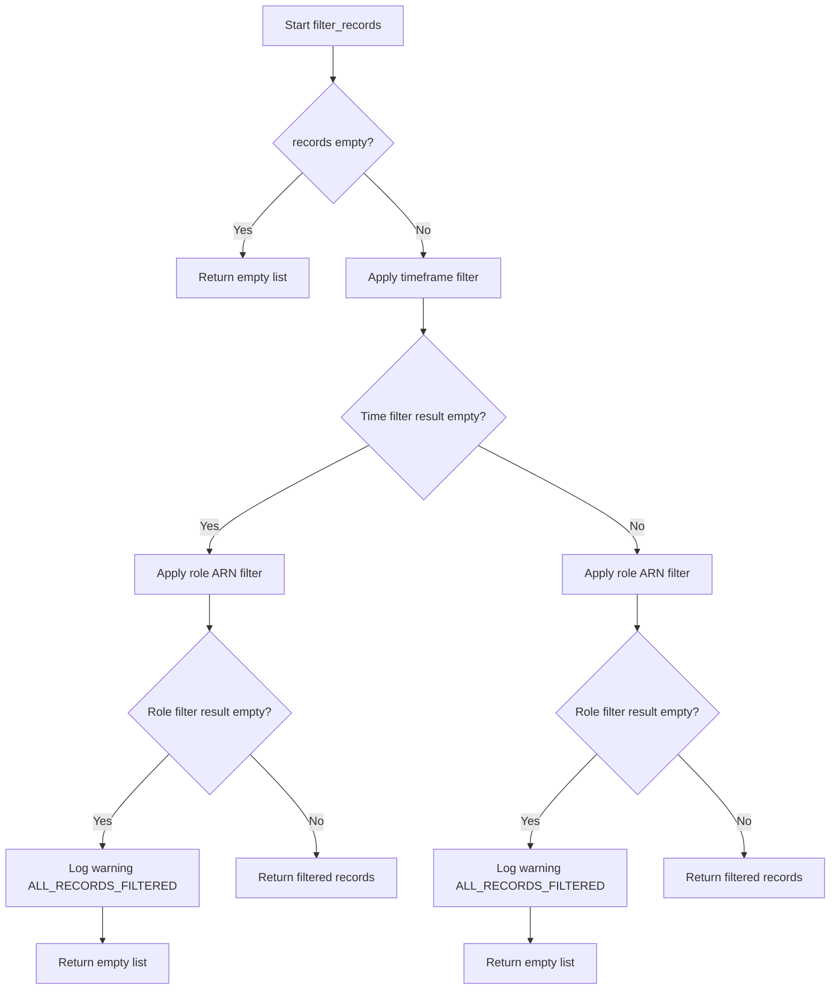

# `cloudtrail.py`

## `trailscraper.cloudtrail.Record` · *class*

## Summary:
Represents an AWS CloudTrail event record that can be converted into an IAM policy statement for access control analysis.

## Description:
The Record class encapsulates AWS CloudTrail event data and provides functionality to translate CloudTrail events into IAM policy statements. This abstraction enables security analysis by converting raw CloudTrail event information into structured IAM actions that can be evaluated against policies. The class handles special mappings for various AWS services like S3, KMS, API Gateway, and STS, providing normalized representations of CloudTrail events for IAM policy evaluation.

## State:
- event_source (str): The AWS service that generated the event (e.g., 's3.amazonaws.com')
- event_name (str): The specific operation performed (e.g., 'PutObject')
- raw_source (any): Original raw event data, if available
- event_time (datetime): Timestamp of when the event occurred
- resource_arns (list[str]): List of ARNs representing affected resources, defaults to ["*"]
- assumed_role_arn (str): ARN of the assumed role, if applicable

## Lifecycle:
Creation: Instantiate with event_source and event_name parameters. Optional parameters include resource_arns (defaults to ["*"]), assumed_role_arn, event_time, and raw_source.
Usage: Call to_statement() method to convert the record into an IAM Statement object. The conversion process handles special cases for different AWS services including:
- STS GetCallerIdentity events which return None
- API Gateway events which require special HTTP method and URI processing
- Service-specific event name normalization for S3, KMS, and other services
Destruction: No explicit cleanup required; uses standard Python garbage collection.

## Method Map:
```mermaid
graph TD
    A[Record.__init__] --> B[Record.to_statement]
    B --> C{event_source == "sts.amazonaws.com" AND event_name == "GetCallerIdentity"?}
    C -->|Yes| D[Return None]
    C -->|No| E{event_source == "apigateway.amazonaws.com"?}
    E -->|Yes| F[Record._to_api_gateway_statement]
    E -->|No| G[Record._source_to_iam_prefix + Record._event_name_to_iam_action]
    G --> H[Statement constructor]
```

## Raises:
- None explicitly raised by __init__
- The to_statement method may raise exceptions from underlying operations such as operation_definition() lookup or Statement construction when invalid parameters are provided

## Example:
```python
# Create a record for an S3 PutObject event
record = Record(
    event_source="s3.amazonaws.com",
    event_name="PutObject",
    resource_arns=["arn:aws:s3:::my-bucket/*"]
)

# Convert to IAM statement
statement = record.to_statement()
print(statement)

# Create a record for an API Gateway event
api_record = Record(
    event_source="apigateway.amazonaws.com",
    event_name="CreateRestApi"
)

# Convert to API Gateway specific statement
api_statement = api_record.to_statement()

# Create a record for STS GetCallerIdentity (returns None)
sts_record = Record(
    event_source="sts.amazonaws.com",
    event_name="GetCallerIdentity"
)

# This returns None as special case
sts_statement = sts_record.to_statement()
```

### `trailscraper.cloudtrail.Record.__init__` · *method*

## Summary:
Initializes a CloudTrail record with event metadata and resource information.

## Description:
Constructs a Record object representing an AWS CloudTrail event by setting instance attributes from provided parameters. This method serves as the primary constructor for creating CloudTrail record instances that capture event details for analysis and processing.

## Args:
    event_source (str): The AWS service that generated the event.
    event_name (str): The name of the CloudTrail event.
    resource_arns (list[str], optional): List of ARNs for resources involved in the event. Defaults to ["*"] if None.
    assumed_role_arn (str, optional): ARN of the IAM role assumed during the event. Defaults to None.
    event_time (datetime.datetime, optional): Timestamp when the event occurred. Defaults to None.
    raw_source (dict, optional): Raw CloudTrail event data. Defaults to None.

## Returns:
    None: This method initializes instance attributes and does not return a value.

## Raises:
    None: This method does not explicitly raise exceptions.

## State Changes:
    Attributes READ: None
    Attributes WRITTEN: event_source, event_name, raw_source, event_time, resource_arns, assumed_role_arn

## Constraints:
    Preconditions: All arguments must be of appropriate types as expected by the consuming code.
    Postconditions: The Record instance will have all specified attributes set, with resource_arns defaulting to ["*"] when None.

## Side Effects:
    None: This method performs no I/O operations or external service calls.

### `trailscraper.cloudtrail.Record.__repr__` · *method*

## Summary:
Returns a string representation of the CloudTrail record showing key identifying attributes.

## Description:
This method provides a standardized string representation of a CloudTrail Record object, primarily used for debugging and logging purposes. It displays the event source, event name, event time, and associated resource ARNs in a readable format. The method is automatically called by Python's built-in repr() function and when objects are printed in interactive sessions.

## Args:
    None

## Returns:
    str: A formatted string containing the record's identifying attributes in the format:
         "Record(event_source=<value> event_name=<value> event_time=<value> resource_arns=<value>)"

## Raises:
    None

## State Changes:
    Attributes READ: self.event_source, self.event_name, self.event_time, self.resource_arns
    Attributes WRITTEN: None

## Constraints:
    Preconditions: The Record object must be properly initialized with all required attributes
    Postconditions: The returned string accurately represents the object's current state

## Side Effects:
    None

### `trailscraper.cloudtrail.Record.__eq__` · *method*

## Summary:
Compares two Record objects for equality based on their core identifying attributes.

## Description:
This method implements the equality operator (`==`) for Record objects, enabling comparison between two instances based on their fundamental properties. It is called during equality checks such as `record1 == record2` and is used internally by Python's container types (like sets and dictionaries) when determining object identity.

## Args:
    other (object): Another object to compare with this Record instance.

## Returns:
    bool: True if the other object is a Record instance with identical values for event_source, event_name, event_time, resource_arns, and assumed_role_arn; False otherwise.

## Raises:
    None

## State Changes:
    Attributes READ: event_source, event_name, event_time, resource_arns, assumed_role_arn

## Constraints:
    Preconditions: The other object must be an instance of the same class (Record) for detailed attribute comparison to occur.
    Postconditions: Returns a boolean indicating whether all comparable attributes match between the two objects.

## Side Effects:
    None

### `trailscraper.cloudtrail.Record.__hash__` · *method*

## Summary:
Computes and returns a hash value for the CloudTrail record based on its identifying attributes, enabling use in hash-based collections.

## Description:
Implements Python's `__hash__` special method to support hashing of CloudTrail record objects. This enables instances of the Record class to be used as dictionary keys or set elements. The hash is computed consistently from the record's core identifying attributes, ensuring that semantically equivalent records produce identical hash values.

## Args:
    None: This is a special method that takes only the implicit `self` parameter.

## Returns:
    int: A hash value computed from a tuple of the record's identifying attributes.

## Raises:
    TypeError: If any of the attributes contain unhashable types, which would indicate an implementation error in the class.

## State Changes:
    Attributes READ: 
    - self.event_source (str): The AWS service that generated the event
    - self.event_name (str): The name of the API operation performed  
    - self.event_time (datetime): The timestamp when the event occurred
    - self.resource_arns (list/tuple): Collection of ARNs for resources involved in the event
    - self.assumed_role_arn (str): ARN of the IAM role assumed during the event

## Constraints:
    Preconditions:
    - All referenced attributes must be defined and hashable
    - The method assumes that if two records are equal (based on these attributes), they should have the same hash value
    
    Postconditions:
    - The returned hash value is consistent for the lifetime of the object
    - If two records compare equal, they must have the same hash value (hash consistency requirement)

## Side Effects:
    None: This method performs no I/O operations or external service calls. It only accesses internal object attributes.

### `trailscraper.cloudtrail.Record.__ne__` · *method*

*No documentation generated.*

### `trailscraper.cloudtrail.Record._source_to_iam_prefix` · *method*

## Summary
Converts an AWS event source to its corresponding IAM action prefix, handling special cases for specific services.

## Description
This private method transforms an AWS service event source string into the appropriate IAM action prefix used for constructing IAM policy statements. It handles special cases for certain AWS services that don't follow the standard naming convention and provides a default behavior for other services.

The method is called internally by the `to_statement()` method when creating IAM policy statements from CloudTrail records.

## Args
    None

## Returns
    str: The IAM action prefix derived from the event source. For example:
        - 'monitoring.amazonaws.com' becomes 'cloudwatch'
        - 's3.amazonaws.com' becomes 's3' 
        - 'ec2.amazonaws.com' becomes 'ec2'

## Raises
    None explicitly raised

## State Changes
    Attributes READ: self.event_source
    Attributes WRITTEN: None

## Constraints
    Preconditions: 
    - self.event_source must be a string representing a valid AWS service endpoint
    - The method assumes the event_source follows AWS standard naming conventions
    
    Postconditions:
    - Returns a valid IAM action prefix string
    - The returned string is suitable for use in IAM policy statement construction

## Side Effects
    None

### `trailscraper.cloudtrail.Record._event_name_to_iam_action` · *method*

*No documentation generated.*

### `trailscraper.cloudtrail.Record._to_api_gateway_statement` · *method*

## Summary:
Converts an API Gateway CloudTrail event into an IAM statement with Allow effect for the corresponding API Gateway action.

## Description:
This method transforms a CloudTrail record representing an API Gateway operation into an IAM Statement object. It retrieves the HTTP method and request URI from the API Gateway operation definition, processes the request URI to replace path parameters with wildcards, and constructs an appropriate IAM statement for API Gateway resources.

## Args:
    None - This is a method that operates on the instance attributes of the Record class

## Returns:
    Statement: An IAM Statement object with:
        - Effect: "Allow"
        - Action: A list containing a single Action object for the API Gateway HTTP method
        - Resource: A list containing a resource ARN with wildcard path parameters

## Raises:
    KeyError: If the operation definition for the event_name doesn't contain 'http' or 'method'/'requestUri' keys
    FileNotFoundError: If the service definition file for apigateway cannot be found
    Exception: Any other exception that might occur during JSON parsing or file operations in operation_definition

## State Changes:
    Attributes READ: self.event_name
    Attributes WRITTEN: None - This method is read-only

## Constraints:
    Preconditions:
        - self.event_name must correspond to a valid API Gateway operation
        - The operation definition for API Gateway must exist for this event_name
    Postconditions:
        - Returns a properly formatted Statement object for API Gateway operations
        - The returned statement has Effect="Allow" and appropriate Action/resource

## Side Effects:
    - Calls operation_definition function which may read from disk
    - May raise exceptions from operation_definition if service definition files are missing or malformed

### `trailscraper.cloudtrail.Record.to_statement` · *method*

## Summary:
Converts a CloudTrail record into an IAM Statement representation for policy evaluation.

## Description:
Transforms a CloudTrail event record into an IAM Statement object that can be used for policy analysis and permission evaluation. This method handles special cases for certain AWS services and translates CloudTrail event names into appropriate IAM actions. Specifically, it returns None for STS GetCallerIdentity events which are typically informational only, and delegates API Gateway events to a specialized handler.

## Args:
    self: The Record instance containing CloudTrail event data

## Returns:
    Statement or None: An IAM Statement object representing the permissions granted by this CloudTrail event, or None for STS GetCallerIdentity events.

## Raises:
    None explicitly raised

## State Changes:
    Attributes READ: self.event_source, self.event_name, self.resource_arns
    Attributes WRITTEN: None

## Constraints:
    Preconditions: The Record instance must have valid event_source and event_name attributes
    Postconditions: Returns either a Statement object with properly formatted IAM action or None for special cases

## Side Effects:
    None

## `trailscraper.cloudtrail.LogFile` · *class*

## Summary:
Represents a CloudTrail log file with methods to extract metadata and parse event records.

## Description:
The LogFile class encapsulates a CloudTrail log file stored in gzipped JSON format. It provides functionality to extract timestamp information from filenames, validate file naming conventions specific to CloudTrail, read and parse the JSON content into structured records, and determine if the log file contains events within a specified timeframe. This abstraction allows for consistent handling of CloudTrail log files throughout the trailscraper system.

## State:
- `_path` (str): Absolute or relative path to the CloudTrail log file. Must be a valid file path pointing to a gzipped JSON file with CloudTrail naming convention.

## Lifecycle:
- Creation: Instantiate with a file path string pointing to a valid CloudTrail log file
- Usage: Call methods to extract metadata (timestamp, filename) or parse records from the CloudTrail log file
- Destruction: No explicit cleanup required; relies on Python's garbage collection

## Method Map:


## Raises:
- None explicitly raised by __init__
- IOError/OSError may be raised during records() method when file cannot be opened/read

## Example:
```python
# Create a LogFile instance
log_file = LogFile("/path/to/CloudTrail_log.json.gz")

# Extract metadata
filename = log_file.filename()
timestamp = log_file.timestamp()

# Validate filename
is_valid = log_file.has_valid_filename()

# Parse CloudTrail records
records = log_file.records()

# Check if log file contains events in a timeframe
from datetime import datetime
timeframe_start = datetime(2023, 1, 1)
timeframe_end = datetime(2023, 1, 2)
in_range = log_file.contains_events_for_timeframe(timeframe_start, timeframe_end)
```

### `trailscraper.cloudtrail.LogFile.__init__` · *method*

## Summary:
Initializes a CloudTrail log file object with the specified file path.

## Description:
Constructs a LogFile instance that represents a CloudTrail log file stored at the given path. This constructor stores the file path internally for use by other methods that process the log file data.

## Args:
    path (str): The absolute or relative file path to the CloudTrail log file.

## Returns:
    None: This method initializes the object state but does not return a value.

## Raises:
    None: This method does not raise any exceptions.

## State Changes:
    Attributes READ: None
    Attributes WRITTEN: self._path

## Constraints:
    Preconditions: The path argument should be a valid string representing a file path.
    Postconditions: The LogFile instance will have its _path attribute set to the provided path value.

## Side Effects:
    None: This method performs no I/O operations or external service calls. It only stores the provided path in an instance variable.

### `trailscraper.cloudtrail.LogFile.timestamp` · *method*

## Summary:
Extracts and parses the timestamp from a CloudTrail log file's filename, returning it as a UTC-aware datetime object.

## Description:
This method parses the timestamp portion of a CloudTrail log file's filename and converts it into a timezone-aware datetime object in UTC. The filename format is expected to follow the AWS CloudTrail convention where the timestamp is located at the fourth position (index 3) when split by underscores.

## Args:
    None

## Returns:
    datetime.datetime: A timezone-aware datetime object representing the timestamp in UTC.

## Raises:
    ValueError: If the filename doesn't contain a properly formatted timestamp string at the expected position.
    IndexError: If the filename doesn't have enough underscore-separated components to access index 3.

## State Changes:
    Attributes READ: self._path (through self.filename())
    Attributes WRITTEN: None

## Constraints:
    Preconditions:
        - The LogFile instance must have a valid _path attribute set during initialization
        - The filename must follow the CloudTrail naming convention with timestamp at index 3 after splitting by '_'
        - The timestamp portion must be in format YYYYMMDDTHHMM (e.g., 20230115T1430)
    Postconditions:
        - Returns a datetime object with timezone info set to UTC
        - The returned datetime represents the creation time of the CloudTrail log file

## Side Effects:
    None

### `trailscraper.cloudtrail.LogFile.filename` · *method*

## Summary:
Returns the filename portion from the full file path stored in the LogFile instance.

## Description:
Extracts and returns only the filename component from the full file path stored in the LogFile's internal `_path` attribute. This method is used by other methods in the LogFile class to process CloudTrail log files, particularly for parsing timestamps and validating file formats.

## Args:
    None

## Returns:
    str: The filename portion of the full file path stored in `self._path`.

## Raises:
    None

## State Changes:
    Attributes READ: self._path
    Attributes WRITTEN: None

## Constraints:
    Preconditions: The LogFile instance must have been initialized with a valid path string in `self._path`
    Postconditions: The returned string is guaranteed to be the last component of the path after splitting by directory separators

## Side Effects:
    None

### `trailscraper.cloudtrail.LogFile.has_valid_filename` · *method*

## Summary:
Validates whether the CloudTrail log file has a proper naming convention format.

## Description:
Checks if the log file's filename matches the standard AWS CloudTrail log file naming pattern. This method is used during log file processing to ensure only properly formatted CloudTrail logs are processed further in the pipeline.

## Args:
    None

## Returns:
    bool: True if the filename matches the CloudTrail naming convention pattern, False otherwise.

## Raises:
    None

## State Changes:
    Attributes READ: self._path (via self.filename())
    Attributes WRITTEN: None

## Constraints:
    Preconditions: The LogFile instance must have a valid _path attribute set during initialization
    Postconditions: Returns a boolean indicating filename format validity without modifying object state

## Side Effects:
    None

### `trailscraper.cloudtrail.LogFile.records` · *method*

## Summary:
Loads and parses CloudTrail log records from a gzipped JSON file into structured Record objects.

## Description:
This method reads a gzipped CloudTrail log file, extracts the JSON data, and converts the log records into structured Record objects for further processing. The method handles file I/O errors gracefully by logging warnings and returning an empty list when the file cannot be loaded.

## Args:
    None

## Returns:
    list[Record]: A list of Record objects representing the parsed CloudTrail events, or an empty list if the file cannot be loaded.

## Raises:
    None explicitly raised, but IOError/OSError may occur internally during file operations.

## State Changes:
    Attributes READ: self._path
    Attributes WRITTEN: None

## Constraints:
    Preconditions: The LogFile instance must have a valid _path attribute pointing to an existing gzipped CloudTrail log file.
    Postconditions: Returns a list of Record objects or an empty list if file loading fails.

## Side Effects:
    I/O operations: Reads from the filesystem using gzip and json libraries.
    Logging: Writes debug messages when loading files and warning messages when file loading fails.

### `trailscraper.cloudtrail.LogFile.contains_events_for_timeframe` · *method*

## Summary:
Determines whether the log file contains events within a specified time range, including a one-hour grace period at the end of the range.

## Description:
This method evaluates if the timestamp of the CloudTrail log file falls within the provided date range. It's designed to help filter log files that may contain events occurring at the boundary of a time window, allowing for a one-hour tolerance at the upper bound to account for potential log processing delays or timing variations.

## Args:
    from_date (datetime.datetime): The start of the time range to check against.
    to_date (datetime.datetime): The end of the time range to check against.

## Returns:
    bool: True if the log file's timestamp is within the range [from_date, to_date + 1 hour), False otherwise.

## Raises:
    None

## State Changes:
    Attributes READ: self._path (via filename() and timestamp())
    Attributes WRITTEN: None

## Constraints:
    Preconditions: 
    - from_date must be a datetime.datetime object
    - to_date must be a datetime.datetime object
    - from_date should be less than or equal to to_date
    
    Postconditions:
    - Returns a boolean value indicating time range inclusion
    - The comparison uses the log file's timestamp and adds one hour to to_date for inclusive checking

## Side Effects:
    None

## `trailscraper.cloudtrail._resource_arns` · *function*

## Summary:
Extracts Amazon Resource Names (ARNs) from CloudTrail event resources.

## Description:
Processes a CloudTrail JSON record to extract ARN values from the resources section. This utility function isolates ARN extraction logic to support analysis of CloudTrail events and their associated AWS resources.

## Args:
    json_record (dict): A CloudTrail event record containing a 'resources' key that maps to a list of resource dictionaries.

## Returns:
    list[str]: A list of ARN strings extracted from resources that contain an 'ARN' field. Returns an empty list if no resources exist or none contain ARN information.

## Raises:
    None explicitly raised.

## Constraints:
    Preconditions:
    - The input `json_record` must be a dictionary-like object
    - The 'resources' key in `json_record` should map to a list of dictionaries
    
    Postconditions:
    - The returned list contains only strings that represent valid ARNs
    - The function never raises exceptions regardless of input

## Side Effects:
    None.

## Control Flow:


## Examples:
    >>> record = {'resources': [{'ARN': 'arn:aws:s3:::my-bucket'}, {'name': 'test'}]}
    >>> _resource_arns(record)
    ['arn:aws:s3:::my-bucket']
    
    >>> record = {'resources': []}
    >>> _resource_arns(record)
    []
    
    >>> record = {'other_field': 'value'}
    >>> _resource_arns(record)
    []
```

## `trailscraper.cloudtrail._assumed_role_arn` · *function*

## Summary:
Extracts the ARN of the session issuer from an assumed role CloudTrail record.

## Description:
This function processes a CloudTrail JSON record to identify if the event was generated by an assumed role and, if so, returns the ARN of the role that issued the session. This is commonly used to trace the origin of AWS operations performed via temporary credentials.

The function is extracted into its own component to encapsulate the logic for safely navigating potentially nested dictionary structures in CloudTrail records while handling missing keys gracefully. This promotes code reuse and makes the parsing logic more testable and maintainable.

## Args:
    json_record (dict): A CloudTrail JSON record containing user identity information

## Returns:
    str or None: The ARN of the session issuer if the record represents an AssumedRole event, otherwise None

## Raises:
    None explicitly raised

## Constraints:
    Preconditions:
    - The input `json_record` must be a dictionary
    - The dictionary must contain a 'userIdentity' key
    - When the user identity is of type 'AssumedRole', it must contain 'sessionContext' with 'sessionIssuer' containing an 'arn'

    Postconditions:
    - Returns either a string (ARN) or None
    - Does not modify the input `json_record`

## Side Effects:
    None

## Control Flow:


## Examples:
    # Example 1: AssumedRole event
    record = {
        "userIdentity": {
            "type": "AssumedRole",
            "sessionContext": {
                "sessionIssuer": {
                    "arn": "arn:aws:iam::123456789012:role/MyRole"
                }
            }
        }
    }
    result = _assumed_role_arn(record)
    # Returns: "arn:aws:iam::123456789012:role/MyRole"

    # Example 2: Non-AssumedRole event
    record = {
        "userIdentity": {
            "type": "IAMUser"
        }
    }
    result = _assumed_role_arn(record)
    # Returns: None

    # Example 3: Malformed record
    record = {
        "userIdentity": {
            "type": "AssumedRole"
        }
    }
    result = _assumed_role_arn(record)
    # Returns: None

## `trailscraper.cloudtrail._parse_record` · *function*

## Summary:
Parses a CloudTrail JSON record into a structured Record object for further processing.

## Description:
Converts a raw CloudTrail event JSON dictionary into a Record object containing key event metadata. This function handles the extraction of event source, name, timestamp, resource ARNs, and assumed role information while gracefully handling malformed records by returning None.

## Args:
    json_record (dict): A CloudTrail event record as a dictionary containing fields like 'eventSource', 'eventName', 'eventTime', 'resources', and 'userIdentity'.

## Returns:
    Record or None: A Record object populated with parsed event data, or None if the record is malformed and cannot be parsed due to missing required keys.

## Raises:
    None explicitly raised, but KeyError may occur internally when required fields are missing.

## Constraints:
    Preconditions:
    - The input json_record must be a dictionary containing the keys 'eventSource', 'eventName', and 'eventTime'
    - The 'eventTime' field must be in the format "%Y-%m-%dT%H:%M:%SZ"
    - The 'resources' field, if present, must be a list of dictionaries with 'ARN' keys
    - The 'userIdentity' field, if present, must follow AWS CloudTrail user identity structure

    Postconditions:
    - Returns a Record object containing parsed event metadata
    - Returns None for malformed records
    - All timestamps are timezone-aware UTC datetime objects

## Side Effects:
    - Writes warning messages to the logging module when parsing fails
    - No external state mutations or I/O operations beyond logging

## Control Flow:


## Examples:
    # Valid usage with complete record
    record_dict = {
        'eventSource': 's3.amazonaws.com',
        'eventName': 'PutObject',
        'eventTime': '2023-01-01T12:00:00Z',
        'resources': [{'ARN': 'arn:aws:s3:::my-bucket/my-object'}],
        'userIdentity': {'type': 'AssumedRole', 'sessionContext': {'sessionIssuer': {'arn': 'arn:aws:iam::123456789012:role/MyRole'}}}
    }
    result = _parse_record(record_dict)
    # Returns Record object that can be processed further (e.g., via to_statement() method)
    
    # Invalid usage with missing keys
    incomplete_record = {
        'eventSource': 's3.amazonaws.com',
        'eventName': 'PutObject'
        # Missing 'eventTime' field
    }
    result = _parse_record(incomplete_record)
    # Returns None and logs warning

## `trailscraper.cloudtrail.parse_records` · *function*

## Summary
Parses a list of CloudTrail JSON records into structured Record objects, filtering out any records that fail to parse correctly.

## Description
This function processes a collection of CloudTrail event records by attempting to parse each one using the internal `_parse_record` helper function. It handles parsing errors gracefully by logging warnings and excluding malformed records from the result set. This extraction into a separate function allows for clean error handling and separation of concerns between record parsing and validation logic.

## Args
    json_records (list[dict]): A list of CloudTrail event records in JSON format, each containing fields like 'eventSource', 'eventName', and 'eventTime'

## Returns
    list[Record]: A list of successfully parsed Record objects representing CloudTrail events. Malformed records are filtered out and not included in the returned list.

## Raises
    None explicitly raised - parsing errors are caught internally and logged as warnings

## Constraints
    Preconditions:
    - Input must be a list of dictionaries
    - Each dictionary must contain the required CloudTrail fields ('eventSource', 'eventName', 'eventTime')
    - All records in the list should be valid JSON objects
    
    Postconditions:
    - Returns a list of Record objects or empty list if no records parse successfully
    - Original input list is unchanged
    - Any parsing failures are logged via the standard logging module

## Side Effects
    - Writes warning messages to the logging module when individual records fail to parse
    - No external state mutations or I/O operations beyond logging

## Control Flow
```mermaid
flowchart TD
    A[Start parse_records] --> B{For each json_record}
    B --> C[Call _parse_record(record)]
    C --> D{Parse successful?}
    D -->|Yes| E[Add to parsed_records]
    D -->|No| F[Skip (return None)]
    B --> G[Return filtered parsed_records]
```

## Examples
    # Basic usage with valid records
    records = [
        {
            "eventSource": "s3.amazonaws.com",
            "eventName": "PutObject",
            "eventTime": "2023-01-01T12:00:00Z",
            "resources": [{"ARN": "arn:aws:s3:::my-bucket/my-object"}]
        }
    ]
    parsed = parse_records(records)
    # Returns list of Record objects
    
    # Usage with mixed valid/invalid records
    records = [
        {"eventSource": "s3.amazonaws.com", "eventName": "PutObject", "eventTime": "2023-01-01T12:00:00Z"},
        {"eventSource": "ec2.amazonaws.com", "eventName": "RunInstances"}  # Missing eventTime
    ]
    parsed = parse_records(records)
    # Returns only the first record, logs warning for second record
```

## `trailscraper.cloudtrail._by_timeframe` · *function*

## Summary:
Creates a timestamp-based filter predicate for CloudTrail records within a specified date range.

## Description:
Generates a predicate function that filters CloudTrail records based on their event timestamps. Records with no timestamp (event_time is None) are always included, while records with valid timestamps are included only if they fall within the specified inclusive date range. This function is typically used with functional filtering operations like toolz.filter or Python's built-in filter().

## Args:
    from_date (datetime.datetime): The beginning of the acceptable timestamp range (inclusive).
    to_date (datetime.datetime): The end of the acceptable timestamp range (inclusive).

## Returns:
    callable: A predicate function that accepts a record object with an event_time attribute and returns True if the record should be included in the filtered results.

## Raises:
    None explicitly raised by this function.

## Constraints:
    Preconditions:
    - Both from_date and to_date must be datetime.datetime objects
    - from_date should be less than or equal to to_date
    - Record objects passed to the returned predicate must have an event_time attribute
    
    Postconditions:
    - The returned predicate function always returns a boolean value
    - Records with event_time=None are always included (return True)
    - Records with valid timestamps are included only if from_date ≤ record.event_time ≤ to_date

## Side Effects:
    None

## Control Flow:


## Examples:
    # Filter CloudTrail records from January 1, 2023 to January 31, 2023
    date_filter = _by_timeframe(datetime.datetime(2023, 1, 1), datetime.datetime(2023, 1, 31))
    
    # Apply filter using toolz (recommended approach)
    from toolz import filter
    filtered_records = list(filter(date_filter, cloudtrail_records))
    
    # Apply filter using Python's built-in filter
    filtered_records = list(filter(date_filter, cloudtrail_records))
    
    # Apply filter using list comprehension
    filtered_records = [r for r in cloudtrail_records if date_filter(r)]
    
    # Handle records with missing timestamps (always included)
    # This is useful for processing partial logs or incomplete data
    all_records_with_missing_timestamps = list(filter(date_filter, all_cloudtrail_records))

## `trailscraper.cloudtrail._by_role_arns` · *function*

## Summary:
Creates a filter function that determines whether a CloudTrail record should be included based on assumed role ARN matching.

## Description:
This function generates a predicate function that can be used to filter CloudTrail records by checking if the record's assumed role ARN matches any of the specified role ARNs. It's designed to work with functional programming patterns, particularly with the toolz library's filter operations.

The function implements a common filtering pattern where records are accepted if either:
1. Their assumed role ARN is in the provided filter list, or
2. No filters are specified (empty filter list)

This extraction allows for reusable filtering logic that can be applied to different sets of role ARNs without recreating the filtering logic each time.

## Args:
    arns_to_filter_for (list[str] or None): A list of role ARN strings to filter for. If None, defaults to an empty list.

## Returns:
    callable: A predicate function that accepts a CloudTrail record and returns True if the record should be included in the filtered results, False otherwise.

## Raises:
    None explicitly raised

## Constraints:
    Preconditions:
    - The input parameter `arns_to_filter_for` should be a list of strings or None
    - Records passed to the returned function should have an `assumed_role_arn` attribute
    
    Postconditions:
    - The returned function will always return a boolean value
    - When `arns_to_filter_for` is empty, all records will be accepted
    - When `arns_to_filter_for` contains ARNs, only records with matching assumed_role_arn will be accepted

## Side Effects:
    None

## Control Flow:
```mermaid
flowchart TD
    A[Call _by_role_arns] --> B{arns_to_filter_for is None?}
    B -- Yes --> C[Set arns_to_filter_for = []]
    B -- No --> C
    C --> D[Return lambda function]
    D --> E[lambda(record): record.assumed_role_arn in arns_to_filter_for OR len(arns_to_filter_for) == 0]
    E --> F{Record assumed_role_arn in filter list OR no filters?}
    F -- Yes --> G[Return True]
    F -- No --> H[Return False]
```

## Examples:
```python
# Filter for specific roles
role_filters = ["arn:aws:iam::123456789012:role/AdminRole", "arn:aws:iam::123456789012:role/PowerUser"]
filter_func = _by_role_arns(role_filters)
# Usage with toolz.filter
filtered_records = list(filter(filter_func, cloudtrail_records))

# No filtering (accept all records)
all_records_filter = _by_role_arns(None)
# or
all_records_filter = _by_role_arns([])
```

## `trailscraper.cloudtrail.filter_records` · *function*

## Summary
Filters CloudTrail records by time range and role ARNs, returning only those matching the specified criteria.

## Description
This function applies two filtering operations to CloudTrail records: temporal filtering based on event timestamps and role-based filtering based on assumed role ARNs. It is designed to extract relevant CloudTrail events from a larger dataset according to configurable time windows and role restrictions.

The function is extracted from inline logic to provide reusable filtering capabilities across different parts of the CloudTrail processing pipeline, separating concerns between data retrieval and filtering logic.

## Args
- records (list): Collection of CloudTrail record objects to filter
- arns_to_filter_for (list[str], optional): List of role ARNs to include in results. If None or empty, all roles are included. Defaults to None
- from_date (datetime.datetime): Earliest timestamp to include (inclusive). Defaults to Unix epoch (1970-01-01 UTC)
- to_date (datetime.datetime): Latest timestamp to include (inclusive). Defaults to current UTC time

## Returns
- list: Filtered collection of CloudTrail records matching both time and role criteria. Returns empty list if no records match filters.

## Raises
- None explicitly raised

## Constraints
- Preconditions: Records must be iterable and contain event_time and assumed_role_arn attributes
- Postconditions: Returned records satisfy both time and role filtering criteria

## Side Effects
- Logs a warning message via Python's logging module when all input records are filtered out
- No external state mutations or I/O operations beyond logging

## Control Flow


## Examples
```python
# Filter records from last 24 hours for specific role
recent_records = filter_records(
    records=cloudtrail_events,
    arns_to_filter_for=["arn:aws:iam::123456789012:role/MyRole"],
    from_date=datetime.datetime.now(tz=pytz.utc) - datetime.timedelta(hours=24)
)

# Filter all records from specific time period
time_filtered = filter_records(
    records=cloudtrail_events,
    from_date=datetime.datetime(2023, 1, 1, tzinfo=pytz.utc),
    to_date=datetime.datetime(2023, 12, 31, tzinfo=pytz.utc)
)
```

