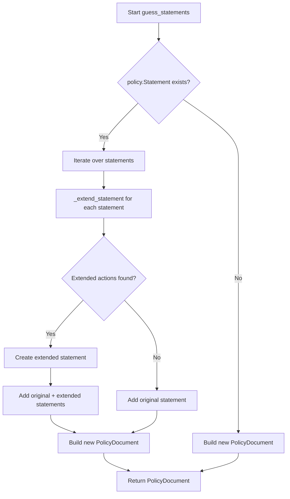

# `guess.py`

## `trailscraper.guess._guess_actions` · *function*

## Summary:
Expands action identifiers by finding matches against allowed prefixes using the matching_actions method.

## Description:
Processes a collection of action objects by invoking their matching_actions method with the provided allowed prefixes. This function flattens the results from multiple action objects into a single list of matching action identifiers.

## Args:
    actions (iterable): An iterable collection of action objects that implement a matching_actions method.
    allowed_prefixes (list): A list of string prefixes used to filter action identifiers.

## Returns:
    list: A flattened list containing all action identifiers that match the allowed prefixes across all input actions.

## Raises:
    AttributeError: If any item in the actions parameter does not have a matching_actions method.

## Constraints:
    Preconditions:
        - The actions parameter must be iterable
        - Each item in actions must have a matching_actions method
        - allowed_prefixes must be a list-like object
    Postconditions:
        - Returns a flat list of action identifiers
        - Order preserved from input actions

## Side Effects:
    None

## Control Flow:
```mermaid
flowchart TD
    A[Start _guess_actions] --> B[Iterate actions]
    B --> C[For each action, call action.matching_actions(allowed_prefixes)]
    C --> D[Flatten nested results]
    D --> E[Return flattened list]
```

## Examples:
    # Basic usage with action objects
    actions = [action1, action2, action3]
    allowed_prefixes = ['ec2:', 's3:']
    result = _guess_actions(actions, allowed_prefixes)
    # Returns list of action identifiers matching the prefixes

## `trailscraper.guess._extend_statement` · *function*

## Summary:
Returns either a single statement or a pair of statements based on whether additional actions can be matched for extension.

## Description:
This function evaluates whether the actions in a given statement can be extended with additional actions matching the allowed prefixes. When extensions are found, it returns a list containing both the original statement and a new statement with extended actions and wildcard resource. When no extensions are found, it returns a list containing only the original statement.

## Args:
    statement (Statement): The IAM statement to potentially extend
    allowed_prefixes (list): List of action prefixes that are allowed for extension

## Returns:
    list[Statement]: A list containing either one statement (the original) or two statements (original + extended)

## Raises:
    None explicitly raised

## Constraints:
    Preconditions:
    - statement must be a valid Statement object with Action, Effect, and Resource attributes
    - allowed_prefixes must be iterable containing string prefixes
    
    Postconditions:
    - Returns a list of Statement objects
    - If extended actions exist, the returned list contains exactly 2 statements
    - If no extended actions exist, the returned list contains exactly 1 statement

## Side Effects:
    None

## Control Flow:
```mermaid
flowchart TD
    A[Start _extend_statement] --> B{Are extended_actions found?}
    B -- Yes --> C[Create extended Statement]
    C --> D[Return [statement, extended_statement]]
    B -- No --> E[Return [statement]]
```

## Examples:
    # Example 1: No extensions found
    statement = Statement(Action=['s3:GetObject'], Effect='Allow', Resource=['arn:aws:s3:::bucket/*'])
    result = _extend_statement(statement, ['ec2:'])
    # Returns: [statement]

    # Example 2: Extensions found
    statement = Statement(Action=['s3:GetObject'], Effect='Allow', Resource=['arn:aws:s3:::bucket/*'])
    result = _extend_statement(statement, ['s3:'])
    # Returns: [statement, Statement(Action=[extended_actions], Effect='Allow', Resource=['*'])]
```

## `trailscraper.guess.guess_statements` · *function*

## Summary:
Extends IAM policy statements by discovering additional actions that match allowed prefixes and creating expanded statements.

## Description:
Processes each statement in a policy document to identify and add additional IAM actions that match the allowed action prefixes. When matching actions are discovered, it creates extended statements with wildcard resources to cover these additional permissions. This function enables policy expansion to capture broader permission sets while maintaining the original statement structure.

## Args:
    policy (PolicyDocument): The IAM policy document containing statements to process
    allowed_prefixes (list[str]): List of action prefixes to match against existing actions

## Returns:
    PolicyDocument: A new policy document with extended statements that include additional matching actions

## Raises:
    None explicitly raised by this function, though underlying methods may raise exceptions

## Constraints:
    Preconditions:
    - The policy parameter must be a valid PolicyDocument instance
    - The policy.Statement attribute must be iterable
    - The allowed_prefixes parameter should be a list of strings representing action prefixes
    
    Postconditions:
    - Returns a new PolicyDocument instance with potentially more statements than the input
    - All original statements are preserved in the returned document
    - Extended statements are created only when matching actions are found

## Side Effects:
    None

## Control Flow:


## Examples:
```python
# Basic usage
policy = PolicyDocument(
    Version="2012-10-17",
    Statement=[Statement(
        Action=[Action("s3", "GetObject")],
        Effect="Allow",
        Resource=["arn:aws:s3:::example-bucket/*"]
    )]
)
extended_policy = guess_statements(policy, ["s3:Get", "s3:List"])

# Result would include both the original statement and an extended statement
# for s3:GetObject and s3:ListObject actions
```

