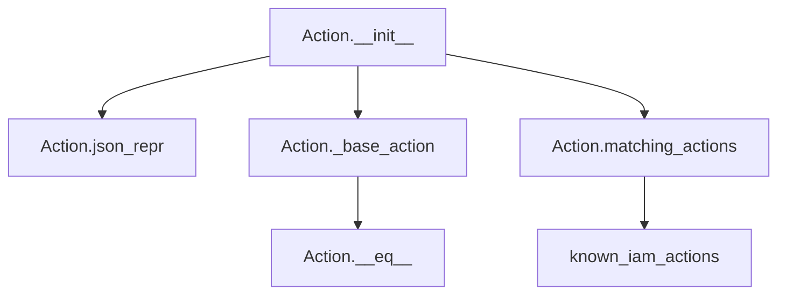
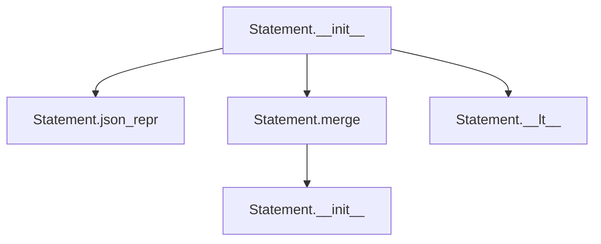
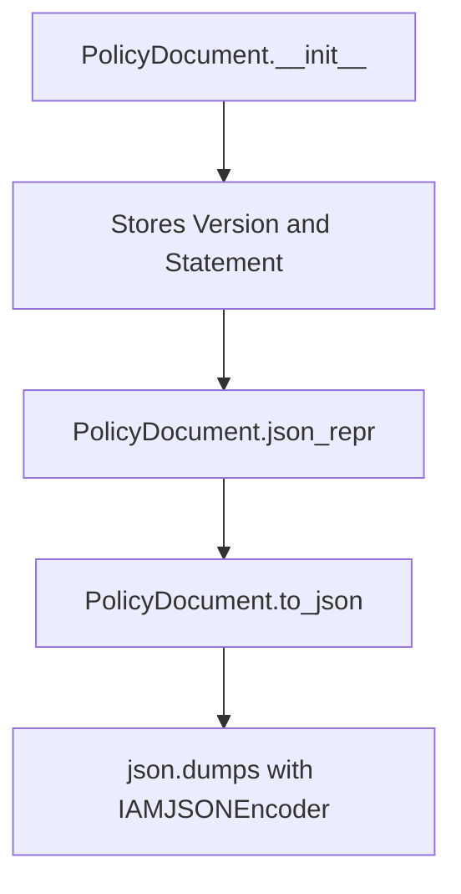
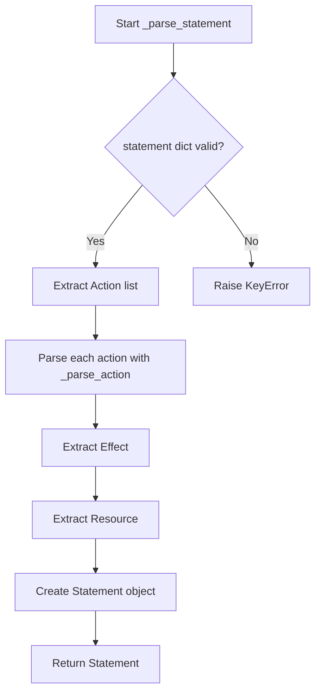
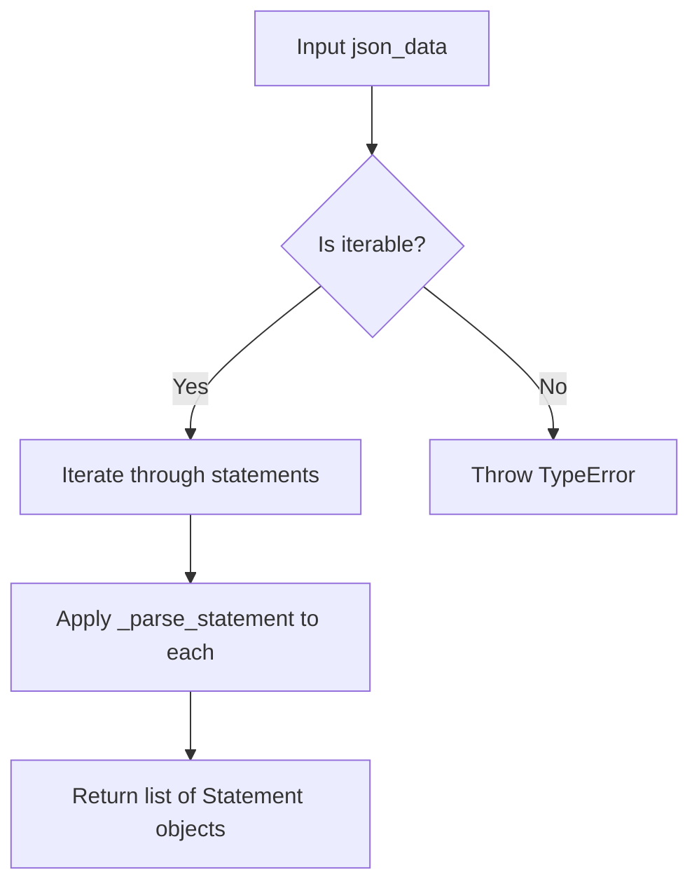

# `iam.py`

## `trailscraper.iam.BaseElement` · *class*

## Summary:
BaseElement is a base class that provides equality, hashing, and representation methods based on a JSON representation.

## Description:
BaseElement is a base class that implements standard Python magic methods (__eq__, __ne__, __hash__, __repr__) using a JSON representation of objects. Subclasses must implement the `json_repr()` method to provide a JSON-serializable representation that will be used by these methods for comparison, hashing, and string conversion.

The class enables consistent behavior across different object types by providing a common interface for equality testing, hashing, and string representation based on JSON data.

## State:
- json_repr(): Abstract method that must be implemented by subclasses to return a JSON-serializable representation
- All instance attributes are defined by subclasses through their json_repr() implementation

## Lifecycle:
- Creation: Instances are created through subclass constructors; BaseElement itself cannot be instantiated because json_repr() raises NotImplementedError
- Usage: Methods are called automatically during equality comparisons, hashing operations, and string conversions
- Destruction: No special cleanup required; follows standard Python object lifecycle

## Method Map:
```mermaid
graph TD
    A[BaseElement] --> B[json_repr()]
    A --> C[__eq__]
    A --> D[__hash__]
    A --> E[__repr__]
    B --> C
    B --> D
    B --> E
```

## Raises:
- NotImplementedError: Raised by json_repr() method when called directly on BaseElement (not implemented)
- TypeError: May be raised during equality comparison if other object doesn't support the comparison

## Example:
```python
# Typical usage pattern with a subclass
class User(BaseElement):
    def __init__(self, user_id, name):
        self.user_id = user_id
        self.name = name
    
    def json_repr(self):
        return {"user_id": self.user_id, "name": self.name}

# Create instances
user1 = User("123", "Alice")
user2 = User("123", "Alice")
user3 = User("456", "Bob")

# Equality comparison
assert user1 == user2  # True - same JSON representation
assert user1 != user3  # True - different JSON representation

# Hashing (for use in sets/dicts)
user_set = {user1, user2, user3}  # Will contain 2 unique users

# String representation
print(user1)  # Prints JSON representation
```

### `trailscraper.iam.BaseElement.json_repr` · *method*

## Summary:
Returns a JSON-serializable representation of the IAM element for use in equality comparisons, hashing, and string representation.

## Description:
This method provides a standardized way to represent IAM elements as JSON-compatible data structures. It is intended to be overridden by subclasses to return their specific JSON representation. The base implementation raises NotImplementedError to enforce subclass implementation.

## Args:
    None

## Returns:
    dict: A dictionary representation of the IAM element that is JSON serializable. This representation should capture all relevant identifying characteristics of the element.

## Raises:
    NotImplementedError: Always raised by the base implementation. Subclasses must override this method to provide a concrete implementation.

## State Changes:
    Attributes READ: None
    Attributes WRITTEN: None

## Constraints:
    Preconditions: None
    Postconditions: The returned value must be JSON serializable (dict, list, str, int, float, bool, or None) and should uniquely identify the element for equality purposes.

## Side Effects:
    None

### `trailscraper.iam.BaseElement.__eq__` · *method*

## Summary:
Compares two BaseElement instances for equality based on their JSON representations.

## Description:
Implements the equality operator (`==`) for BaseElement subclasses. This method ensures that two instances of the same class are considered equal if and only if their canonical JSON representations are identical. This approach provides a consistent way to compare IAM policy elements regardless of their internal structure.

The method is part of a broader design pattern where all BaseElement subclasses implement a `json_repr()` method that returns a canonical representation of the object. This enables consistent equality comparisons, hashing, and string representations across the entire IAM element hierarchy.

## Args:
    other (object): Another object to compare with this instance

## Returns:
    bool: True if `other` is an instance of the same class and has identical JSON representation; False otherwise

## Raises:
    None

## State Changes:
    Attributes READ: 
    - self.json_repr() (via method call)
    - self.__class__ (via isinstance check)

## Constraints:
    Preconditions:
    - Both instances must be of the same class for meaningful comparison
    - The `json_repr()` method must be implemented by subclasses and return comparable values
    
    Postconditions:
    - Returns boolean value indicating equality status
    - Does not modify either instance's state

## Side Effects:
    None

### `trailscraper.iam.BaseElement.__ne__` · *method*

## Summary:
Implements the "not equal" comparison operator for BaseElement instances, returning True when two elements are not equal.

## Description:
This method defines the behavior of the `!=` operator for BaseElement objects. It returns the logical negation of the equality comparison between this instance and another object. When comparing two BaseElement instances, it first checks if they are of the same class type, then compares their JSON representations for equality.

## Args:
    other (object): Another object to compare against this BaseElement instance

## Returns:
    bool: True if this element is not equal to the other object, False otherwise

## Raises:
    None explicitly raised

## State Changes:
    Attributes READ: None - this method only reads the object's own properties through the comparison chain
    Attributes WRITTEN: None - this method does not modify any attributes

## Constraints:
    Preconditions: The other object can be any type, but comparison is only meaningful between BaseElement instances of the same class
    Postconditions: The result is always a boolean value (True or False)

## Side Effects:
    None - this method performs only local comparisons and does not cause any I/O operations or external service calls

### `trailscraper.iam.BaseElement.__hash__` · *method*

## Summary:
Computes and returns a hash value based on the JSON representation of the IAM element.

## Description:
This method implements the standard `__hash__` protocol for IAM elements, enabling instances to be used in hash-based collections such as sets and dictionaries. It delegates to the `json_repr()` method to obtain a canonical string or dictionary representation of the object, then computes and returns its hash value. This ensures that semantically equivalent objects produce identical hash values, maintaining consistency with the equality comparison defined in `__eq__`.

## Args:
    None

## Returns:
    int: An integer hash value derived from the object's JSON representation.

## Raises:
    TypeError: If the result of `json_repr()` is not hashable (though this would be unusual for properly implemented subclasses).

## State Changes:
    Attributes READ: self (through `json_repr()` method call)
    Attributes WRITTEN: None

## Constraints:
    Preconditions: The object must have a valid `json_repr()` implementation that returns a hashable type.
    Postconditions: The returned hash value remains consistent for the lifetime of the object (assuming immutable state).

## Side Effects:
    None

### `trailscraper.iam.BaseElement.__repr__` · *method*

## Summary:
Returns a string representation of the object by converting its JSON representation to a string.

## Description:
This method implements Python's `__repr__` protocol to provide a string representation of the object. It delegates to the `json_repr()` method and converts the result to a string, enabling consistent object representation across the inheritance hierarchy.

The method is called automatically by Python when:
- Using `repr(obj)` directly
- Printing objects in interactive sessions
- Displaying objects in debuggers or logs
- Objects are used in string formatting contexts

This method exists as a standardized implementation that leverages the JSON representation pattern established by the class hierarchy, avoiding code duplication while ensuring consistent object representation for debugging and logging purposes.

## Args:
    None

## Returns:
    str: A string representation of the object, derived from its JSON representation.

## Raises:
    NotImplementedError: If called on a BaseElement instance before subclass implementation is provided.

## State Changes:
    Attributes READ: 
    - self.json_repr(): Called to obtain the JSON representation

## Constraints:
    Preconditions:
    - The object must have a valid `json_repr()` implementation in its subclass
    - The result of `json_repr()` must be convertible to string
    - This method should only be called on instances of subclasses that implement `json_repr()`

    Postconditions:
    - Returns a string representation of the object
    - The returned string should be unambiguous and useful for debugging

## Side Effects:
    None

## `trailscraper.iam.Action` · *class*

## Summary:
Represents an AWS IAM action with a prefix and action name, enabling action normalization and matching operations.

## Description:
The Action class encapsulates AWS IAM actions by storing a prefix (like "iam" or "ec2") and an action name (like "GetUser"). It provides functionality to normalize action names by removing common prefixes and plural forms, and to discover related actions that match a set of allowed prefixes. This class is used primarily for IAM policy analysis and action validation.

## State:
- action (str): The IAM action name without prefix, e.g., "GetUser"
- prefix (str): The service prefix for the action, e.g., "iam"

## Lifecycle:
- Creation: Instantiate with prefix and action string arguments
- Usage: Call json_repr() for JSON representation, _base_action() to normalize action name, or matching_actions() to find related actions
- Destruction: No special cleanup required; relies on Python garbage collection

## Method Map:


## Raises:
- None explicitly raised in __init__
- May raise exceptions from underlying file operations in known_iam_actions() if the IAM permissions file is inaccessible

## Example:
```python
# Create an action
action = Action("iam", "GetUser")

# Get JSON representation
json_repr = action.json_repr()  # Returns "iam:GetUser"

# Get base action name
base_action = action._base_action()  # Returns "GetUser"

# Find matching actions with allowed prefixes
matches = action.matching_actions(["Get", "List"])  # Returns related actions
```

### `trailscraper.iam.Action.__init__` · *method*

## Summary:
Initializes an IAM action with a prefix and action name, establishing the fundamental identity of the action within the IAM permission system.

## Description:
This constructor creates an Action instance by storing the provided prefix and action name as instance attributes. The prefix typically represents a service namespace (like "ec2" or "s3"), while the action represents a specific operation (like "DescribeInstances" or "GetObject"). This foundational method enables consistent representation and comparison of IAM permissions throughout the system, supporting operations like action matching and JSON serialization.

The Action class is designed to represent AWS-style IAM actions in a structured way, allowing for pattern matching, prefix manipulation, and comparison operations that are essential for IAM policy analysis and validation.

## Args:
    prefix (str): The service prefix or namespace for the IAM action (e.g., "ec2", "s3"). This identifies the AWS service to which the action belongs.
    action (str): The specific action name within the service namespace (e.g., "DescribeInstances", "GetObject"). This defines the operation being performed.

## Returns:
    None: This method initializes instance attributes but does not return a value.

## Raises:
    None: This method does not explicitly raise exceptions.

## State Changes:
    Attributes READ: None
    Attributes WRITTEN: 
        - self.action: Stores the action name as provided in the argument
        - self.prefix: Stores the prefix as provided in the argument

## Constraints:
    Preconditions: Both prefix and action arguments must be strings.
    Postconditions: The instance will have self.action and self.prefix attributes set to the provided values, enabling subsequent operations like JSON serialization and action matching.

## Side Effects:
    None: This method performs no I/O operations, external service calls, or mutations to objects outside self.

### `trailscraper.iam.Action.json_repr` · *method*

## Summary:
Returns a colon-separated string representation of an IAM action in the format "prefix:action".

## Description:
This method generates a standardized string representation of an IAM action by concatenating the action's prefix and action components with a colon separator. This representation is commonly used for serialization, comparison, and identification of IAM actions within the trailscraper system.

## Args:
    None

## Returns:
    str: A string in the format "prefix:action" representing the IAM action uniquely.

## Raises:
    None

## State Changes:
    Attributes READ: self.prefix, self.action
    Attributes WRITTEN: None

## Constraints:
    Preconditions: The Action instance must have both self.prefix and self.action attributes defined and non-empty.
    Postconditions: The returned string will always be in the format "prefix:action" with no additional processing or validation.

## Side Effects:
    None

### `trailscraper.iam.Action._base_action` · *method*

## Summary:
Removes common action prefixes and singularizes the action name for normalization.

## Description:
Processes the action string by stripping predefined prefixes and removing trailing 's' to create a normalized base action name. This method is used internally to standardize IAM action names for comparison and matching operations.

## Args:
    None (uses self.action)

## Returns:
    str: The normalized base action name with prefixes removed and plural form converted to singular.

## Raises:
    None explicitly raised

## State Changes:
    Attributes READ: self.action
    Attributes WRITTEN: None

## Constraints:
    Preconditions: 
    - self.action must be a string
    - BASE_ACTION_PREFIXES must be defined in the module scope
    
    Postconditions:
    - Returns a string with common prefixes stripped
    - Returns a string with trailing 's' removed if present

## Side Effects:
    None

### `trailscraper.iam.Action.matching_actions` · *method*

## Summary:
Generates a list of potential IAM action matches by combining allowed prefixes with the base action form, filtering against known IAM actions.

## Description:
This method creates potential variations of the current IAM action by prepending various action prefixes and adding plural forms, then filters these against known IAM actions for the same prefix. It's designed to help identify equivalent or related IAM actions that might be used in different contexts or formats.

The method is typically called during IAM policy analysis or validation when checking for equivalent action representations. It's separated from other logic to encapsulate the action matching algorithm and make it reusable.

## Args:
    allowed_prefixes (list[str], optional): List of action prefixes to test. If None or empty, defaults to BASE_ACTION_PREFIXES constant.

## Returns:
    list[Action]: List of Action objects representing valid IAM actions that match the pattern, excluding the current action itself.

## Raises:
    None explicitly raised

## State Changes:
    Attributes READ: self.prefix, self._base_action()
    Attributes WRITTEN: None

## Constraints:
    Preconditions: 
    - self.prefix must be a valid IAM service prefix
    - self._base_action() must return a valid base action string
    - allowed_prefixes, if provided, must be iterable
    
    Postconditions:
    - Returns only Actions that exist in known_iam_actions for the same prefix
    - Excludes the current action instance from results
    - All returned Actions have the same prefix as self.prefix

## Side Effects:
    None

## `trailscraper.iam.Statement` · *class*

## Summary:
Represents an AWS IAM policy statement with Action, Effect, and Resource components that can be merged and ordered.

## Description:
The Statement class encapsulates a single AWS IAM policy statement. It provides functionality for merging compatible statements, creating JSON representations, and ordering statements for consistent processing. This class is designed to work with AWS IAM policy elements and follows the pattern of immutable policy components that can be combined to form more complex policies.

## State:
- Action: Collection of action objects that support json_repr() method
- Effect: String value indicating the effect ('Allow' or 'Deny')
- Resource: Collection of resource identifiers

## Lifecycle:
- Creation: Instantiate with Action, Effect, and Resource parameters
- Usage: Call json_repr() for serialization, merge() to combine compatible statements (returns new instance), or use comparison operators for ordering
- Destruction: Managed automatically by Python garbage collector

## Method Map:


## Raises:
- ValueError: When attempting to merge two statements with different Effect values

## Example:
```python
# Create two statements with same Effect
stmt1 = Statement(Action=[action1], Effect="Allow", Resource=["arn:aws:s3:::bucket/*"])
stmt2 = Statement(Action=[action2], Effect="Allow", Resource=["arn:aws:s3:::bucket2/*"])

# Merge compatible statements (creates new instance)
merged = stmt1.merge(stmt2)

# Get JSON representation
json_repr = stmt1.json_repr()
```

### `trailscraper.iam.Statement.__init__` · *method*

## Summary:
Initializes an IAM statement with action, effect, and resource constraints for AWS policy definitions.

## Description:
Constructs an IAM statement object that defines permissions with specific actions, effects, and resource constraints. This constructor initializes a Statement instance that represents a single rule in AWS IAM policies, typically used in policy documents to specify what actions are allowed or denied on specific resources.

## Args:
    Action (list): A list of action objects defining the operations permitted or denied by this statement.
    Effect (str): The effect of the statement, typically either "Allow" or "Deny".
    Resource (list): A list of resource objects specifying which resources the actions apply to.

## Returns:
    None: This method initializes instance attributes and does not return a value.

## Raises:
    None: This method does not explicitly raise exceptions.

## State Changes:
    Attributes READ: None
    Attributes WRITTEN: 
    - self.Action: Set to the provided Action parameter
    - self.Effect: Set to the provided Effect parameter  
    - self.Resource: Set to the provided Resource parameter

## Constraints:
    Preconditions:
    - Action should be iterable containing action objects
    - Effect should be a string representing the permission effect ("Allow" or "Deny")
    - Resource should be iterable containing resource objects
    
    Postconditions:
    - All three attributes are initialized with the provided values
    - The object maintains the same identity after initialization

## Side Effects:
    None: This method performs no I/O operations or external service calls.

### `trailscraper.iam.Statement.json_repr` · *method*

## Summary:
Returns a dictionary representation of the IAM statement suitable for JSON serialization.

## Description:
Converts the statement's Action, Effect, and Resource attributes into a dictionary format that can be easily serialized to JSON. This method provides a standardized way to represent IAM statements as key-value pairs for storage, transmission, or further processing.

## Args:
    None

## Returns:
    dict: A dictionary containing three keys:
        - 'Action': The statement's action(s) (value from self.Action)
        - 'Effect': The statement's effect (value from self.Effect)  
        - 'Resource': The statement's resource(s) (value from self.Resource)

## Raises:
    None

## State Changes:
    Attributes READ: self.Action, self.Effect, self.Resource
    Attributes WRITTEN: None

## Constraints:
    Preconditions: The Statement object must have valid values for self.Action, self.Effect, and self.Resource attributes
    Postconditions: The returned dictionary contains exactly the three keys mentioned above with their corresponding attribute values

## Side Effects:
    None

### `trailscraper.iam.Statement.merge` · *method*

## Summary:
Merges two IAM statements by combining their actions and resources while ensuring compatibility of their effects.

## Description:
Combines two Statement objects into a single Statement with merged actions and resources. This method ensures both statements have identical Effect values before performing the merge operation. The merged statement maintains the same Effect while aggregating unique actions and resources from both input statements, with actions sorted by their json_repr() values and resources sorted lexicographically.

## Args:
    other (Statement): Another Statement object to merge with this instance

## Returns:
    Statement: A new Statement object containing merged actions and resources from both statements

## Raises:
    ValueError: When the Effect attribute of this statement differs from the other statement's Effect

## State Changes:
    Attributes READ: self.Effect, self.Action, self.Resource, other.Effect, other.Action, other.Resource
    Attributes WRITTEN: None (returns new object rather than modifying self)

## Constraints:
    Preconditions: Both statements must have identical Effect values
    Postconditions: Returned Statement has the same Effect as both input statements, with deduplicated and sorted actions/resources

## Side Effects:
    None

### `trailscraper.iam.Statement.__action_list_strings` · *method*

## Summary:
Converts a list of action objects into a hyphen-delimited string representation for efficient comparison and storage.

## Description:
This private method transforms the Action attribute of an IAM statement into a single string by joining individual action representations with hyphens. It's designed to create a compact, standardized representation of multiple actions that can be used for comparison operations, caching, or logging purposes within IAM policy processing workflows.

## Args:
    self: The Statement instance containing the Action attribute to process.

## Returns:
    str: A hyphen-delimited string containing the JSON representation of each action in the Action list. Returns empty string if Action is empty or None.

## Raises:
    AttributeError: If self.Action is None or does not support iteration.
    AttributeError: If any element in self.Action does not have a json_repr() method.
    TypeError: If any element's json_repr() method does not return a string.

## State Changes:
    Attributes READ: self.Action
    Attributes WRITTEN: None

## Constraints:
    Preconditions: 
    - self.Action must be iterable (list-like structure) or None
    - Each element in self.Action must have a json_repr() method that returns a string
    - Elements in self.Action should be compatible with json_repr() method
    
    Postconditions:
    - Returns a string representation of all actions joined by hyphens
    - The returned string preserves the order of actions in self.Action
    - Returns empty string when no actions are present

## Side Effects:
    None

### `trailscraper.iam.Statement.__lt__` · *method*

## Summary:
Implements lexicographic ordering for Statement objects based on Effect, Action, and Resource fields to enable sorting and comparison.

## Description:
This special method (dunder method) defines the less-than comparison behavior for Statement objects, enabling them to be sorted and compared using standard Python comparison operators. It's used primarily for organizing IAM policy statements in a consistent, deterministic order during processing and merging operations. The comparison follows a hierarchical precedence: Effect field, then Action field (using string representation via __action_list_strings), and finally Resource field.

## Args:
    other (Statement): Another Statement instance to compare against for ordering purposes

## Returns:
    bool: True if self is considered "less than" other according to the defined ordering criteria; False otherwise

## Raises:
    TypeError: If other is not an instance of Statement class (though this would be handled by Python's comparison mechanism)

## State Changes:
    Attributes READ: self.Effect, self.Action, self.Resource
    Attributes WRITTEN: None

## Constraints:
    Preconditions: 
    - other must be an instance of Statement class
    - self.Effect and other.Effect must be comparable (typically strings like "Allow" or "Deny")
    - self.Action and other.Action must be iterable with elements that support json_repr() method
    - self.Resource and other.Resource must be iterable with elements that support string conversion
    
    Postconditions:
    - Returns boolean indicating ordering relationship between self and other
    - Does not modify either Statement object's state

## Side Effects:
    None

## `trailscraper.iam.PolicyDocument` · *class*

## Summary:
Represents an AWS Identity and Access Management (IAM) policy document with version and statement components.

## Description:
The PolicyDocument class encapsulates the structure of an AWS IAM policy document, which consists of a Version identifier and one or more Statement objects. This class provides methods to serialize the policy document into JSON format suitable for AWS IAM operations. It inherits from BaseElement, which provides common equality, hashing, and representation behaviors.

This class serves as a structured representation of IAM policies that can be easily converted to JSON format for use with AWS services. It's designed to enforce the standard IAM policy document structure while providing convenient serialization capabilities.

## State:
- Version: str, AWS IAM policy version string (typically "2012-10-17" for the latest version)
- Statement: dict or list[dict], IAM policy statement(s) that define permissions

## Lifecycle:
- Creation: Instantiate with a Statement parameter and optional Version parameter
- Usage: Call to_json() method to serialize the policy document to JSON string
- Destruction: No special cleanup required; relies on Python's garbage collection

## Method Map:


## Raises:
- None explicitly raised by __init__
- json.dumps may raise TypeError if the data cannot be serialized by IAMJSONEncoder

## Example:
```python
# Create a basic policy document
statement = {
    "Effect": "Allow",
    "Action": "s3:GetObject",
    "Resource": "arn:aws:s3:::example-bucket/*"
}
policy = PolicyDocument(Statement=statement)

# Serialize to JSON
json_policy = policy.to_json()
print(json_policy)
```

### `trailscraper.iam.PolicyDocument.__init__` · *method*

## Summary:
Initializes a PolicyDocument object with a statement and version.

## Description:
This method constructs a PolicyDocument instance by setting the version and statement attributes. It serves as the primary constructor for creating policy document objects with AWS IAM policy structure requirements.

## Args:
    Statement (any): The statement or statements that define the policy permissions. This typically contains the policy rules and conditions.
    Version (str, optional): The AWS IAM policy version string. Defaults to "2012-10-17".

## Returns:
    None: This method initializes the object's state but does not return a value.

## Raises:
    None: This method does not explicitly raise any exceptions.

## State Changes:
    Attributes READ: None
    Attributes WRITTEN: 
        - self.Version: Set to the provided Version parameter or default value
        - self.Statement: Set to the provided Statement parameter

## Constraints:
    Preconditions: 
        - The Statement parameter should be compatible with AWS IAM policy structure requirements
        - Version should be a valid AWS IAM policy version string
    Postconditions:
        - The object will have self.Version set to the provided version or default
        - The object will have self.Statement set to the provided statement

## Side Effects:
    None: This method performs no I/O operations or external service calls.

### `trailscraper.iam.PolicyDocument.json_repr` · *method*

## Summary:
Returns a dictionary representation of the IAM policy document suitable for JSON serialization.

## Description:
This method provides a standardized dictionary format for IAM policy documents, extracting the Version and Statement attributes into a structured representation. It is primarily used internally by the `to_json` method to serialize policy documents to JSON format.

## Args:
    None

## Returns:
    dict: A dictionary containing 'Version' and 'Statement' keys with their respective attribute values from the PolicyDocument instance.

## Raises:
    None

## State Changes:
    Attributes READ: self.Version, self.Statement
    Attributes WRITTEN: None

## Constraints:
    Preconditions: The PolicyDocument instance must have both Version and Statement attributes initialized.
    Postconditions: The returned dictionary maintains the same structure regardless of the input data.

## Side Effects:
    None

### `trailscraper.iam.PolicyDocument.to_json` · *method*

## Summary:
Converts the policy document to a formatted JSON string representation.

## Description:
Transforms the policy document's internal representation into a human-readable JSON string. This method is used to serialize the policy document for storage, logging, or transmission purposes. The serialization process uses a custom JSON encoder that handles objects with custom `json_repr()` methods, ensuring proper conversion of complex policy elements.

## Args:
    None

## Returns:
    str: A formatted JSON string containing the policy document's serialized representation with 4-space indentation and sorted keys for consistent output.

## Raises:
    TypeError: If any object in the policy document hierarchy cannot be serialized by the IAMJSONEncoder.

## State Changes:
    Attributes READ: 
    - self.Version
    - self.Statement

## Constraints:
    Preconditions:
    - The PolicyDocument instance must have valid Version and Statement attributes
    - All objects in the Statement hierarchy must implement json_repr() method or be JSON serializable
    - The IAMJSONEncoder must be properly configured to handle the policy document's object types

    Postconditions:
    - The returned string is a valid JSON representation of the policy document
    - The JSON string is formatted with 4-space indentation and sorted keys for readability

## Side Effects:
    None

## `trailscraper.iam.IAMJSONEncoder` · *class*

## Summary:
Custom JSON encoder that handles objects with a json_repr() method by calling that method for serialization.

## Description:
The IAMJSONEncoder extends the standard json.JSONEncoder to provide custom serialization behavior for objects that implement a json_repr() method. This allows objects to define their own JSON representation without modifying the core serialization logic. The encoder is particularly useful for serializing domain-specific objects that need special handling during JSON conversion.

## State:
- No instance attributes maintained beyond those inherited from json.JSONEncoder
- The class inherits all standard JSON encoder functionality and state management

## Lifecycle:
- Creation: Instantiate normally as a standard json.JSONEncoder subclass
- Usage: Pass to json.dumps() as the cls parameter or use as a default encoder
- Destruction: Managed automatically by Python's garbage collection

## Method Map:
```mermaid
graph TD
    A[IAMJSONEncoder] --> B[default]
    B --> C{hasattr(o, 'json_repr')}
    C -->|True| D[o.json_repr()]
    C -->|False| E[json.JSONEncoder.default]
```

## Raises:
- No explicit exceptions raised by __init__
- Exceptions may be raised by underlying json.JSONEncoder methods during serialization

## Example:
```python
import json
from trailscraper.iam import IAMJSONEncoder

class User:
    def __init__(self, name, email):
        self.name = name
        self.email = email
    
    def json_repr(self):
        return {'name': self.name, 'email': self.email}

user = User("John Doe", "john@example.com")
json_string = json.dumps(user, cls=IAMJSONEncoder)
# Result: '{"name": "John Doe", "email": "john@example.com"}'
```

### `trailscraper.iam.IAMJSONEncoder.default` · *method*

## Summary:
Handles custom JSON serialization for objects with a json_repr() method by delegating to their custom representation.

## Description:
This method overrides the default JSON encoding behavior of the IAMJSONEncoder class. When serializing objects to JSON, if an object has a `json_repr()` method, this method will invoke that method to obtain the appropriate JSON representation instead of using the standard JSON encoder. This allows custom objects to define their own JSON serialization logic while maintaining compatibility with the standard JSON encoding process.

## Args:
    o (Any): The object to serialize to JSON. Can be any Python object.

## Returns:
    Any: The JSON-serializable representation of the object. If the object has a `json_repr()` method, returns the result of calling that method; otherwise, delegates to the parent JSONEncoder's default handling.

## Raises:
    None explicitly raised. May raise exceptions from the underlying JSON encoding process or from custom `json_repr()` implementations.

## State Changes:
    Attributes READ: None - this method only reads the object being serialized
    Attributes WRITTEN: None - this method doesn't modify any instance attributes

## Constraints:
    Preconditions: The object being serialized must be compatible with JSON serialization requirements, or its `json_repr()` method must return a JSON-serializable value.
    Postconditions: The returned value is either the result of calling `json_repr()` on the object or the standard JSON encoding behavior.

## Side Effects:
    None - this method performs no I/O operations or external service calls. It only processes objects in memory.

## `trailscraper.iam._parse_action` · *function*

## Summary:
Parses an IAM action string into its prefix and action components to create an Action object.

## Description:
This function takes a string representation of an IAM action (formatted as "prefix:action") and splits it into two components to instantiate an Action object. The function is designed to handle IAM action strings commonly used in AWS Identity and Access Management policies.

## Args:
    action (str): A string representing an IAM action in the format "prefix:action" where prefix identifies the service (e.g., "ec2") and action identifies the specific operation (e.g., "RunInstances").

## Returns:
    Action: An Action object with the prefix and action components parsed from the input string.

## Raises:
    None explicitly raised in the function body.

## Constraints:
    Preconditions:
    - The input action string must contain exactly one colon character separating prefix and action components
    - The input action string must not be empty
    
    Postconditions:
    - Returns an Action object with properly assigned prefix and action attributes
    - The returned Action object will have prefix set to the first part and action set to the second part after splitting by ":"

## Side Effects:
    None

## Control Flow:
```mermaid
flowchart TD
    A[Input action string] --> B{Contains colon?}
    B -- Yes --> C[Split by ":"]
    C --> D[Create Action(prefix, action)]
    D --> E[Return Action object]
    B -- No --> F[Return Action object with empty action]
```

## Examples:
    # Basic usage
    action_obj = _parse_action("ec2:RunInstances")
    # Returns Action object with prefix="ec2" and action="RunInstances"
    
    # Another example
    action_obj = _parse_action("s3:GetObject")
    # Returns Action object with prefix="s3" and action="GetObject"

## `trailscraper.iam._parse_statement` · *function*

## Summary:
Converts a raw IAM statement dictionary into a structured Statement object with parsed actions.

## Description:
Parses a raw IAM policy statement dictionary by converting each action string into an Action object and creating a Statement instance with the parsed components. This function serves as a bridge between raw JSON policy data and structured policy objects for further processing.

## Args:
    statement (dict): A dictionary representing an IAM policy statement containing 'Action', 'Effect', and 'Resource' keys.

## Returns:
    Statement: A Statement object with parsed Action objects, Effect string, and Resource list.

## Raises:
    KeyError: If the statement dictionary is missing required keys ('Action', 'Effect', or 'Resource'). This occurs when attempting to access non-existent keys in the input dictionary.

## Constraints:
    Preconditions:
        - The statement parameter must be a dictionary with 'Action', 'Effect', and 'Resource' keys
        - Each item in statement['Action'] must be a string that can be split by ':'
        - The statement['Effect'] value must be a valid effect identifier (e.g., 'Allow' or 'Deny')
    Postconditions:
        - Returns a properly initialized Statement object with Action objects that support json_repr() method
        - All actions in the statement are converted to Action objects via _parse_action

## Side Effects:
    None

## Control Flow:


## Examples:
```python
# Basic usage
raw_statement = {
    'Action': ['s3:GetObject', 's3:PutObject'],
    'Effect': 'Allow',
    'Resource': ['arn:aws:s3:::my-bucket/*']
}
parsed = _parse_statement(raw_statement)
# Returns Statement object with parsed actions
```

## `trailscraper.iam._parse_statements` · *function*

## Summary:
Parses a list of IAM policy statements from JSON data into structured Statement objects.

## Description:
This function processes a list of IAM policy statement dictionaries and converts them into Statement objects by applying the `_parse_statement` function to each individual statement. It serves as a wrapper that applies statement parsing logic consistently across multiple statements in a policy document.

The function is extracted into its own component to separate the concern of iterating over multiple statements from the logic of parsing individual statements, making the code more modular and testable.

## Args:
    json_data (list[dict]): A list of dictionaries representing IAM policy statements, where each dictionary contains keys like 'Action', 'Effect', and 'Resource'.

## Returns:
    list[Statement]: A list of Statement objects parsed from the input JSON data.

## Raises:
    KeyError: If any statement in json_data is missing required keys ('Action', 'Effect', or 'Resource').
    TypeError: If json_data is not iterable or if any statement is not a dictionary.

## Constraints:
    Preconditions:
    - json_data must be an iterable containing dictionaries
    - Each dictionary in json_data must contain 'Action', 'Effect', and 'Resource' keys
    - All values in the 'Action' field must be strings that can be parsed by `_parse_action`
    
    Postconditions:
    - Returns a list of Statement objects with properly parsed Action, Effect, and Resource fields
    - The order of statements in the returned list matches the order in json_data

## Side Effects:
    None

## Control Flow:


## Examples:
```python
# Basic usage
statements_json = [
    {
        "Action": ["s3:GetObject", "s3:PutObject"],
        "Effect": "Allow",
        "Resource": ["arn:aws:s3:::my-bucket/*"]
    }
]
parsed_statements = _parse_statements(statements_json)
# Returns: [Statement object with parsed actions, effect, and resource]
```

## `trailscraper.iam.parse_policy_document` · *function*

## Summary:
Parses a JSON-formatted IAM policy document into a structured PolicyDocument object.

## Description:
Converts a JSON policy document (provided as a string or file-like stream) into a structured PolicyDocument object containing parsed statements. This function serves as the entry point for processing AWS IAM policy documents, extracting version information and converting statement blocks into structured objects for further analysis and manipulation.

This logic is extracted into its own function rather than being inlined because it encapsulates the entire parsing workflow for IAM policy documents, providing a clean interface for consumers while hiding the complexity of handling both string and stream inputs, JSON parsing, and statement conversion.

## Args:
    stream (str or file-like object): Either a JSON string containing the policy document or a file-like object with a readable stream containing the JSON policy document.

## Returns:
    PolicyDocument: A structured PolicyDocument object containing the parsed policy version and statements.

## Raises:
    json.JSONDecodeError: When the input stream contains invalid JSON.
    KeyError: When the parsed JSON is missing required keys like 'Version' or 'Statement'.
    TypeError: When the input stream is neither a string nor a file-like object.

## Constraints:
    Preconditions:
    - Input must contain valid JSON with required 'Version' and 'Statement' keys
    - Statement value must be iterable (list or similar)
    - Each statement in the Statement array must contain 'Action', 'Effect', and 'Resource' keys
    
    Postconditions:
    - Returns a properly initialized PolicyDocument object
    - All statements are converted to Statement objects with proper Action, Effect, and Resource fields

## Side Effects:
    None

## Control Flow:
```mermaid
flowchart TD
    A[Start parse_policy_document] --> B{Is stream string?}
    B -- Yes --> C[json.loads(stream)]
    B -- No --> D[json.load(stream)]
    C --> E[Extract Version]
    D --> E
    E --> F[Extract Statement]
    F --> G[_parse_statements(Statement)]
    G --> H[Create PolicyDocument]
    H --> I[Return PolicyDocument]
```

## Examples:
```python
# Parsing from a JSON string
policy_string = '''
{
    "Version": "2012-10-17",
    "Statement": [
        {
            "Effect": "Allow",
            "Action": ["s3:GetObject"],
            "Resource": ["arn:aws:s3:::example-bucket/*"]
        }
    ]
}
'''
parsed_doc = parse_policy_document(policy_string)

# Parsing from a file stream
with open('policy.json', 'r') as f:
    parsed_doc = parse_policy_document(f)
```

## `trailscraper.iam.all_known_iam_permissions` · *function*

## Summary:
Returns a set of all known IAM permissions loaded from a static file.

## Description:
This function provides access to a predefined list of AWS IAM permissions by reading them from a text file. It's designed to centralize the management of known IAM permissions in a single location, making it easier to maintain and update the permission list without modifying the codebase directly. The function is typically used to validate IAM permissions or build permission sets for security analysis.

## Args:
    None

## Returns:
    set[str]: A set containing all IAM permission strings read from the 'known-iam-actions.txt' file, with trailing newlines removed from each line.

## Raises:
    FileNotFoundError: If the 'known-iam-actions.txt' file does not exist in the same directory as this module.
    UnicodeDecodeError: If the 'known-iam-actions.txt' file cannot be decoded using UTF-8 encoding.

## Constraints:
    Preconditions:
    - The file 'known-iam-actions.txt' must exist in the same directory as this module
    - The file must be readable and contain valid UTF-8 encoded text
    
    Postconditions:
    - Returns a set of unique permission strings (duplicates are automatically removed by the set constructor)
    - All returned strings have trailing newlines stripped

## Side Effects:
    - Reads from the filesystem (specifically from 'known-iam-actions.txt' in the same directory as this module)
    - May raise file I/O related exceptions if the file is inaccessible or malformed

## Control Flow:
```mermaid
flowchart TD
    A[Start all_known_iam_permissions()] --> B{File exists?}
    B -- Yes --> C[Open file with UTF-8 encoding]
    C --> D[Read all lines from file]
    D --> E[Strip newlines from each line]
    E --> F[Create set from lines]
    F --> G[Return set of permissions]
    B -- No --> H[Throw FileNotFoundError]
```

## Examples:
```python
# Basic usage
permissions = all_known_iam_permissions()
print(len(permissions))  # Prints number of known IAM permissions
print("s3:GetObject" in permissions)  # Checks if specific permission exists

# Usage in validation context
def is_valid_permission(permission):
    return permission in all_known_iam_permissions()
```

## `trailscraper.iam.known_iam_actions` · *function*

## Summary:
Returns a list of IAM actions for a specified service prefix by parsing and grouping all known IAM permissions.

## Description:
This function retrieves all known IAM permissions from a static file, parses them into structured Action objects, groups them by service prefix, and returns all actions associated with the specified prefix. It serves as a lookup mechanism for IAM actions by service prefix, enabling efficient querying of available permissions for specific AWS services.

The function is extracted into its own component to separate the concerns of data retrieval, parsing, and grouping from the business logic that consumes these permissions. This modularization allows for easier testing, maintenance, and reuse of the permission parsing and organization logic.

## Args:
    prefix (str): The AWS service prefix (e.g., "ec2", "s3", "lambda") to filter IAM actions for.

## Returns:
    list[Action]: A list of Action objects representing IAM actions for the specified prefix. Returns an empty list if no actions are found for the given prefix.

## Raises:
    None explicitly raised by this function.

## Constraints:
    Preconditions:
    - The function assumes that `all_known_iam_permissions()` returns a set of strings formatted as "service:action"
    - The `prefix` parameter must be a string that matches existing service prefixes in the IAM permissions data
    
    Postconditions:
    - The returned list contains only Action objects with the matching prefix
    - The function always returns a list, even if empty

## Side Effects:
    - Reads from a local file (`known-iam-actions.txt`) in the same directory as the module
    - May cause file I/O errors if the file doesn't exist or cannot be read

## Control Flow:
```mermaid
flowchart TD
    A[known_iam_actions called with prefix] --> B[all_known_iam_permissions()]
    B --> C[mapz(_parse_action) on each permission]
    C --> D[groupbyz by prefix attribute]
    D --> E[Return knowledge.get(prefix, [])]
```

## Examples:
    # Get all EC2 actions
    ec2_actions = known_iam_actions("ec2")
    
    # Get all S3 actions  
    s3_actions = known_iam_actions("s3")
    
    # Handle empty results
    unknown_actions = known_iam_actions("nonexistent")
    # Returns empty list []
```

