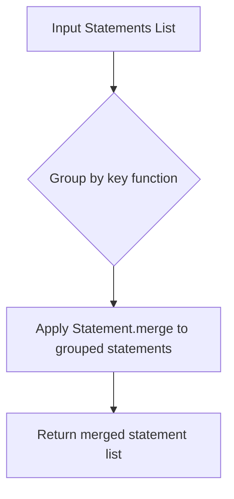

# `policy_generator.py`

## `trailscraper.policy_generator._combine_statements_by` · *function*

## Summary:
Creates a function that groups and merges IAM policy statements based on a specified attribute key.

## Description:
This is a higher-order function that generates a processor for combining IAM policy statements. The returned function takes a list of statements and groups them by the criteria defined in the key function, then merges statements within each group using Statement.merge. This is useful for consolidating similar policy statements into fewer, more general statements.

## Args:
    key (callable): A function that takes a Statement object and returns a hashable value (typically a tuple) used for grouping statements. The key function determines which statements are considered equivalent for merging purposes.

## Returns:
    callable: A function that accepts a list of Statement objects and returns a list of merged Statement objects, where statements with identical keys have been combined.

## Raises:
    ValueError: When attempting to merge two statements with different Effect values, as this would create an invalid policy statement.

## Constraints:
    Preconditions:
    - All statements passed to the returned function must be valid Statement objects
    - The key function must return hashable values that can be used for grouping
    - Statements with the same key should have compatible Effect values for successful merging
    
    Postconditions:
    - The returned list contains merged Statement objects
    - Statements with identical grouping keys have been consolidated
    - The order of statements in the result is not guaranteed to match input order

## Side Effects:
    None

## Control Flow:


## Examples:
```python
# Example usage for grouping by Effect
combine_by_effect = _combine_statements_by(lambda stmt: (stmt.Effect,))
merged_statements = combine_by_effect([stmt1, stmt2, stmt3])
# Groups statements by Effect and merges those with same Effect

# Example usage for grouping by Effect and Resource
combine_by_effect_resource = _combine_statements_by(lambda stmt: (stmt.Effect, tuple(stmt.Resource)))
merged_statements = combine_by_effect_resource([stmt1, stmt2, stmt3])
# Groups statements by both Effect and Resource and merges accordingly
```

## `trailscraper.policy_generator.generate_policy` · *function*

## Summary:
Generates an IAM policy document from a collection of CloudTrail records by converting them to statements and combining similar ones.

## Description:
Transforms selected CloudTrail records into IAM policy statements and consolidates equivalent statements by resource and action to produce a compact policy representation. This function serves as the core policy generation logic that aggregates permissions from multiple CloudTrail events into a single, coherent IAM policy.

## Args:
    selected_records (list[Record]): A list of CloudTrail Record objects containing event information to convert into policy statements.

## Returns:
    PolicyDocument: An IAM policy document containing consolidated statements derived from the input records, constructed with Version="2012-10-17".

## Raises:
    ValueError: When attempting to merge statements with different Effect values (though this would be caught by the Statement.merge method).

## Constraints:
    Preconditions:
        - Input records must be valid Record objects with proper event_source and event_name attributes
        - Each record's resource_arns should be properly initialized (defaults to ["*"] if None)
        
    Postconditions:
        - Output is a PolicyDocument object 
        - All statements in the policy are sorted according to their Effect, Action, and Resource properties
        - Statements with identical Resources and Actions are merged into single statements

## Side Effects:
    None

## Control Flow:
```mermaid
flowchart TD
    A[Start generate_policy] --> B[selected_records]
    B --> C[pipe(selected_records, ...)]
    C --> D[mapz(Record.to_statement)]
    D --> E[filterz(lambda statement: statement is not None)]
    E --> F[_combine_statements_by(Resource)]
    F --> G[_combine_statements_by(Action)]
    G --> H[sortedz()]
    H --> I[PolicyDocument(Version="2012-10-17", Statement=statements)]
    I --> J[Return PolicyDocument]
```

## Examples:
```python
# Basic usage with sample records
records = [
    Record(event_source="s3.amazonaws.com", event_name="PutObject", resource_arns=["arn:aws:s3:::bucket/*"]),
    Record(event_source="s3.amazonaws.com", event_name="GetObject", resource_arns=["arn:aws:s3:::bucket/*"])
]
policy = generate_policy(records)
# Returns a PolicyDocument with consolidated S3 permissions
```

