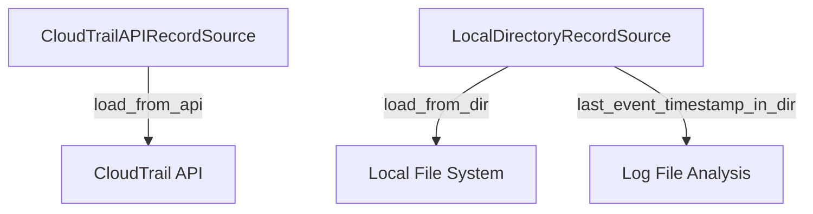

# `trailscraper.record_sources`

## Tree:
record_sources/
├── cloudtrail_api_record_source.py
└── local_directory_record_source.py

## Role:
Provides unified interfaces for sourcing AWS CloudTrail records from different origins

## Description:
This module encapsulates the logic for retrieving AWS CloudTrail event records from either the AWS CloudTrail API or local log files. It abstracts away the differences between these data sources while providing a consistent interface for consuming CloudTrail events.

The module is used by the main trailscraper application to fetch CloudTrail records for analysis and processing. It enables the application to work with CloudTrail data regardless of whether it comes from real-time API calls or stored log files.

## Components:
- CloudTrailAPIRecordSource: Loads CloudTrail records from the AWS CloudTrail API
- LocalDirectoryRecordSource: Loads CloudTrail records from local log files

## Public API:
- CloudTrailAPIRecordSource: Class for fetching records from AWS CloudTrail API
  - `__init__(self)` - Initializes the CloudTrail API client for API-based record retrieval
  - `load_from_api(self, from_date, to_date)` - Fetches records from CloudTrail API within date range
- LocalDirectoryRecordSource: Class for fetching records from local log directory  
  - `__init__(self, log_dir)` - Initializes with directory path containing CloudTrail log files
  - `load_from_dir(self, from_date, to_date)` - Fetches records from local log files within date range
  - `last_event_timestamp_in_dir(self)` - Returns timestamp of most recent event in directory

## Dependencies:
- Internal: trailscraper.cloudtrail._parse_record, trailscraper.cloudtrail.LogFile, trailscraper.cloudtrail.Record
- External: boto3 (for AWS API access), json, os, logging, pytz

## Constraints:
- CloudTrailAPIRecordSource requires valid AWS credentials with CloudTrail permissions
- LocalDirectoryRecordSource requires read access to the specified log directory
- Both sources require properly formatted CloudTrail log files or API responses

---

## Files

- [`cloudtrail_api_record_source.py`](record_sources/cloudtrail_api_record_source.md)
- [`local_directory_record_source.py`](record_sources/local_directory_record_source.md)

