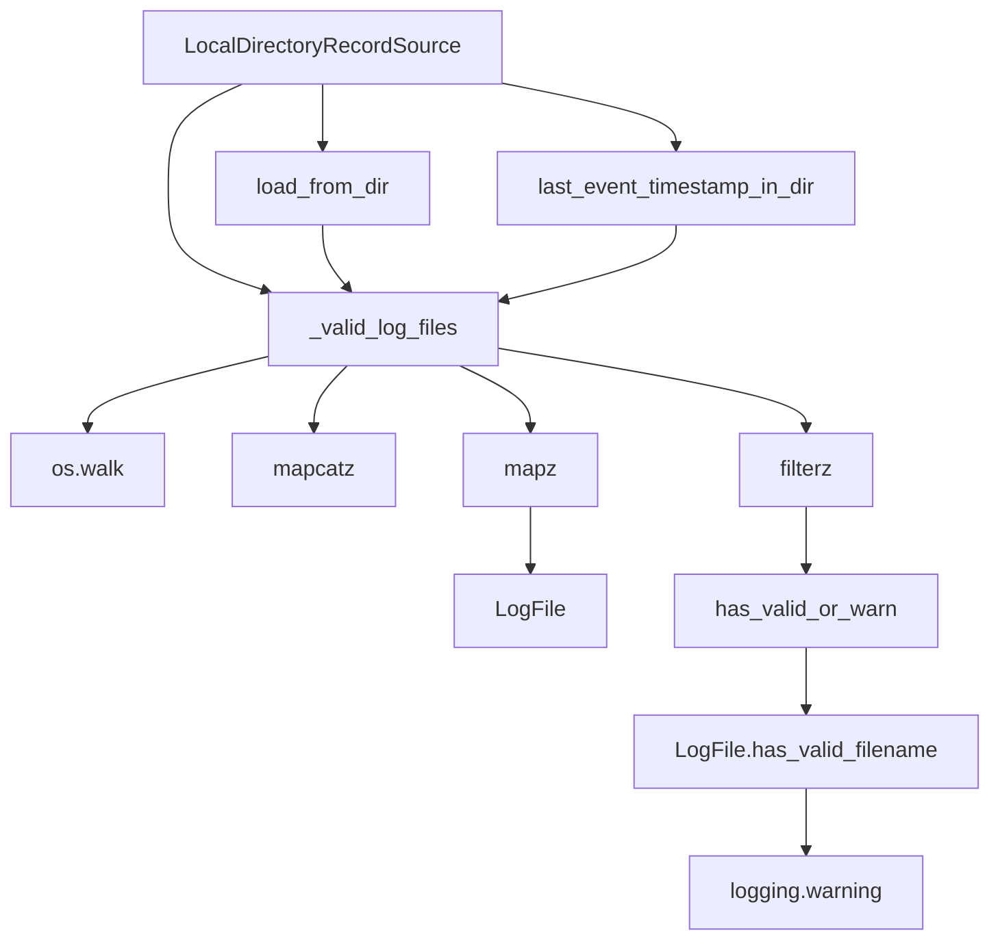

# `local_directory_record_source.py`

## `trailscraper.record_sources.local_directory_record_source.LocalDirectoryRecordSource` · *class*

## Summary:
A record source that loads AWS CloudTrail events from log files stored in a local directory.

## Description:
The LocalDirectoryRecordSource class provides functionality to read and filter AWS CloudTrail log files from a specified local directory. It enables loading events within a specific date range and determining the most recent event timestamp in the directory. This abstraction allows for consistent handling of local CloudTrail data regardless of the underlying file structure.

This class is typically instantiated by the application's configuration system or test fixtures when processing local CloudTrail log directories. It specifically handles gzipped JSON CloudTrail log files with standard naming conventions.

## State:
- `_log_dir` (str): Path to the local directory containing CloudTrail log files. Must be a valid directory path. This is set during initialization and never modified.

## Lifecycle:
- Creation: Instantiate with a valid directory path string
- Usage: Call `load_from_dir()` to retrieve events within a timeframe, or `last_event_timestamp_in_dir()` to get the latest event timestamp
- Destruction: No explicit cleanup required; relies on Python's garbage collection

## Method Map:


## Raises:
- `TypeError`: If `log_dir` is not a string
- `OSError`: If the directory path doesn't exist or isn't readable
- `KeyError`: When parsing CloudTrail records fails due to missing fields (indirectly through LogFile.records())

## Example:
```python
from datetime import datetime
from trailscraper.record_sources.local_directory_record_source import LocalDirectoryRecordSource

# Create instance with log directory
source = LocalDirectoryRecordSource("/path/to/cloudtrail/logs")

# Load records for a specific time period
from_date = datetime(2023, 1, 1)
to_date = datetime(2023, 1, 2)
records = source.load_from_dir(from_date, to_date)

# Get the timestamp of the most recent event
latest_timestamp = source.last_event_timestamp_in_dir()
```

### `trailscraper.record_sources.local_directory_record_source.LocalDirectoryRecordSource.__init__` · *method*

## Summary:
Initializes a LocalDirectoryRecordSource with a directory path for CloudTrail log files.

## Description:
This method sets up the instance with the directory path containing CloudTrail log files. It serves as the constructor that establishes the data source location for subsequent operations like loading records or determining timestamp ranges. The LocalDirectoryRecordSource is designed to read and process CloudTrail log files from a local directory structure.

## Args:
    log_dir (str): Path to the directory containing CloudTrail log files.

## Returns:
    None: This method initializes the object's internal state and does not return a value.

## Raises:
    None: This method does not explicitly raise exceptions.

## State Changes:
    Attributes READ: None
    Attributes WRITTEN: self._log_dir

## Constraints:
    Preconditions: The log_dir parameter should be a valid directory path string.
    Postconditions: The instance will have its _log_dir attribute set to the provided log_dir value.

## Side Effects:
    None: This method performs no I/O operations or external service calls.

### `trailscraper.record_sources.local_directory_record_source.LocalDirectoryRecordSource._valid_log_files` · *method*

## Summary:
Returns an iterator of valid CloudTrail log files from the configured directory, filtering out files with invalid filenames and logging warnings for invalid ones.

## Description:
This method traverses the configured log directory recursively and returns only those files that have valid CloudTrail filenames according to AWS naming conventions. Invalid filenames are logged as warnings but don't cause the method to fail. The method is designed to be reusable across different operations that need to process valid CloudTrail log files.

## Args:
    None

## Returns:
    Iterator[LogFile]: An iterator of LogFile objects representing valid CloudTrail log files in the directory tree.

## Raises:
    None explicitly raised

## State Changes:
    Attributes READ: self._log_dir
    Attributes WRITTEN: None

## Constraints:
    Preconditions: 
    - self._log_dir must be a valid directory path
    - The directory must be readable
    
    Postconditions:
    - All returned LogFile objects have valid filenames according to CloudTrail naming convention
    - Invalid filenames are logged as warnings but not included in the result

## Side Effects:
    - I/O operations: Reading directory structure via os.walk()
    - Logging: Warning messages for files with invalid filenames

### `trailscraper.record_sources.local_directory_record_source.LocalDirectoryRecordSource.load_from_dir` · *method*

## Summary:
Loads CloudTrail log records from valid log files within the specified date range.

## Description:
Retrieves all CloudTrail event records from log files in the configured directory that contain events within the given timeframe. This method serves as the primary interface for fetching historical CloudTrail data for analysis or processing within a specific temporal window.

## Args:
    from_date (datetime): Start of the date range to filter events
    to_date (datetime): End of the date range to filter events

## Returns:
    list: A list of CloudTrail event records that occurred within the specified timeframe

## Raises:
    None explicitly raised - handles IOError/OSError internally when loading log files

## State Changes:
    Attributes READ: self._log_dir (via _valid_log_files)
    Attributes WRITTEN: None

## Constraints:
    Preconditions: 
    - from_date and to_date must be datetime objects
    - self._log_dir must be properly initialized in the constructor
    - Log files must follow the CloudTrail naming convention
    
    Postconditions:
    - Returns a list of parsed CloudTrail records
    - Empty list is returned if no matching log files exist or if no records match the timeframe

## Side Effects:
    - Reads files from the local filesystem
    - May emit warning logs for invalid filename formats
    - May emit debug logs when loading log files

### `trailscraper.record_sources.local_directory_record_source.LocalDirectoryRecordSource.last_event_timestamp_in_dir` · *method*

## Summary:
Returns the timestamp of the most recent CloudTrail event across all valid log files in the configured directory.

## Description:
This method identifies the most recent CloudTrail log file by timestamp, then extracts the latest event timestamp from that file's records. It's used to determine the newest event available in the directory for synchronization purposes.

The method is designed as a separate utility to encapsulate the complex logic of finding the latest timestamp across potentially many log files, rather than inlining this pipeline logic throughout the codebase.

## Args:
    None

## Returns:
    datetime.datetime: The timestamp of the most recent CloudTrail event found in the directory.

## Raises:
    IndexError: If there are no valid log files in the directory.
    AttributeError: If the most recent log file has no records or if records don't have event_time attribute.

## State Changes:
    Attributes READ: self._log_dir (via _valid_log_files)
    Attributes WRITTEN: None

## Constraints:
    Preconditions: 
    - The directory configured in self._log_dir must exist and be readable
    - There must be at least one valid CloudTrail log file in the directory
    - Valid log files must contain records with event_time attributes
    
    Postconditions:
    - Returns a timezone-aware datetime object representing the latest event time
    - The returned timestamp corresponds to an actual event in the log files

## Side Effects:
    - Reads files from the local filesystem
    - May emit warning logs if invalid filenames are encountered
    - May perform decompression of gzipped JSON files

