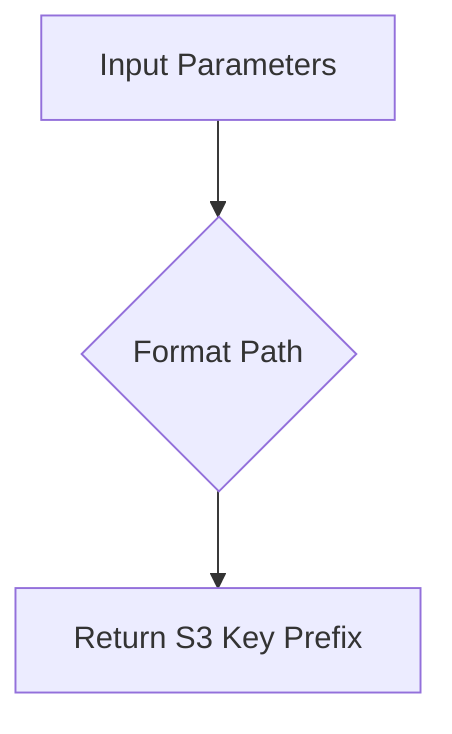
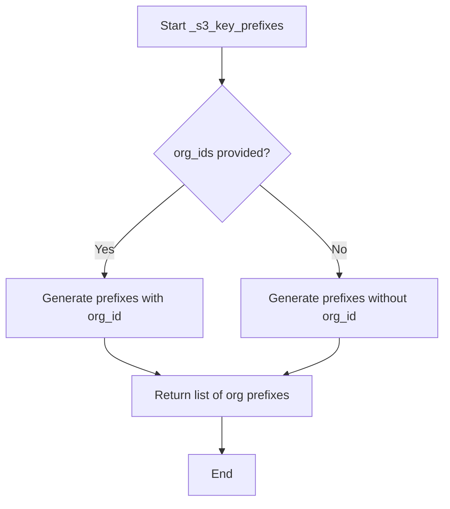
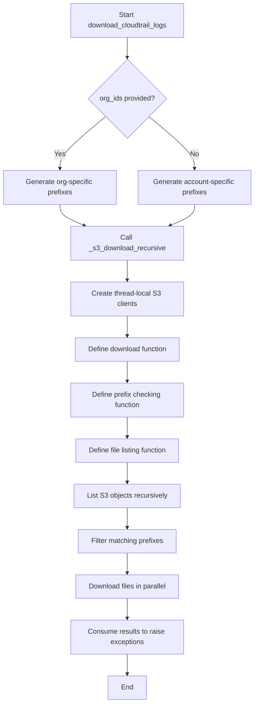

# `s3_download.py`

## `trailscraper.s3_download._s3_key_prefix` · *function*

## Summary:
Generates an S3 key prefix path for AWS CloudTrail logs based on account ID, region, and date.

## Description:
Formats a standardized S3 key prefix path following AWS CloudTrail log directory structure. This function extracts year, month, and day from the provided date object to construct the proper hierarchical path structure used by AWS CloudTrail logs in S3.

## Args:
    prefix (str): The base prefix to prepend to the S3 key path
    date (datetime.date): The date for which to generate the log path
    account_id (str): AWS account identifier
    region (str): AWS region name

## Returns:
    str: Formatted S3 key prefix in the pattern: {prefix}AWSLogs/{account_id}/CloudTrail/{region}/{year}/{month:02d}/{day:02d}/

## Raises:
    None explicitly raised

## Constraints:
    Preconditions:
        - date must be a valid datetime.date object
        - account_id must be a non-empty string
        - region must be a non-empty string
        - prefix should be a string (though no validation is performed)

    Postconditions:
        - Returns a properly formatted S3 key prefix string
        - All date components are zero-padded appropriately

## Side Effects:
    None

## Control Flow:


## Examples:
    >>> _s3_key_prefix("logs/", datetime.date(2023, 12, 25), "123456789012", "us-east-1")
    'logs/AWSLogs/123456789012/CloudTrail/us-east-1/2023/12/25/'
```

## `trailscraper.s3_download._s3_key_prefix_for_org_trails` · *function*

## Summary:
Constructs an S3 key prefix for AWS CloudTrail logs organized by organization, following AWS standard log path conventions.

## Description:
Generates a standardized S3 object key prefix for retrieving CloudTrail logs from AWS Organizations-based storage structures. This function formats the path according to AWS CloudTrail's organizational log directory structure, which organizes logs by organization ID, account ID, region, and date.

## Args:
    prefix (str): Base prefix to prepend to the S3 key path
    date (datetime.date): Date for which to generate the log path
    org_id (str): AWS Organization ID
    account_id (str): AWS Account ID
    region (str): AWS region name

## Returns:
    str: Formatted S3 key prefix in the pattern: {prefix}AWSLogs/{org_id}/{account_id}/CloudTrail/{region}/{year}/{month:02d}/{day:02d}/

## Raises:
    None explicitly raised

## Constraints:
    Preconditions:
        - date must be a valid datetime.date object
        - org_id and account_id must be non-empty strings
        - region must be a valid AWS region identifier
        - prefix should be a valid string (though no validation performed)

    Postconditions:
        - Returns a properly formatted S3 key prefix string
        - All date components are zero-padded to ensure consistent path formatting

## Side Effects:
    None

## Control Flow:


## Examples:
    >>> _s3_key_prefix_for_org_trails("logs/", datetime.date(2023, 12, 25), "o-1234567890", "123456789012", "us-east-1")
    "logs/AWSLogs/o-1234567890/123456789012/CloudTrail/us-east-1/2023/12/25/"
```

## `trailscraper.s3_download._s3_key_prefixes` · *function*

## Summary:
Generates S3 key prefixes for AWS CloudTrail log files over a date range, supporting both organization and account-based trail structures.

## Description:
This function constructs S3 key prefixes for retrieving CloudTrail log files from AWS S3 buckets. It handles two different AWS CloudTrail log structures: organization-based trails (which include organization IDs) and standard account-based trails. The function generates all required prefixes for a given date range, account IDs, and regions.

The function is extracted into its own component to separate the logic of generating S3 key prefixes from the actual downloading and processing logic, making the code more modular and testable.

## Args:
    prefix (str): The S3 bucket prefix or path where CloudTrail logs are stored
    org_ids (list[str] or None): Organization IDs for organization-based trails, or None for standard accounts
    account_ids (list[str]): List of AWS account IDs to generate prefixes for
    regions (list[str]): List of AWS regions to generate prefixes for
    from_date (datetime.datetime): Starting date (inclusive) for the date range
    to_date (datetime.datetime): Ending date (inclusive) for the date range

## Returns:
    list[str]: A list of S3 key prefixes for CloudTrail logs, one for each combination of date, account ID, and region. When org_ids is provided, each prefix includes the organization ID in the path structure.

## Raises:
    None explicitly raised in this function

## Constraints:
    Preconditions:
    - from_date must be earlier than or equal to to_date
    - account_ids must not be empty
    - regions must not be empty
    - All dates should be timezone-aware datetime objects
    
    Postconditions:
    - Returns a list of properly formatted S3 key prefixes
    - The returned list contains one prefix for each combination of date, account_id, and region
    - If org_ids is provided, each prefix follows the organization trail structure
    - If org_ids is None, each prefix follows the standard account trail structure

## Side Effects:
    None

## Control Flow:


## Examples:
    # Generate prefixes for organization-based trails
    prefixes = _s3_key_prefixes(
        prefix="my-bucket/",
        org_ids=["o-1234567890"],
        account_ids=["123456789012"],
        regions=["us-east-1"],
        from_date=datetime.datetime(2023, 1, 1),
        to_date=datetime.datetime(2023, 1, 3)
    )
    # Returns prefixes like: ["my-bucket/AWSLogs/o-1234567890/123456789012/CloudTrail/us-east-1/2023/01/01/"]

    # Generate prefixes for standard account-based trails
    prefixes = _s3_key_prefixes(
        prefix="my-bucket/",
        org_ids=None,
        account_ids=["123456789012"],
        regions=["us-east-1"],
        from_date=datetime.datetime(2023, 1, 1),
        to_date=datetime.datetime(2023, 1, 3)
    )
    # Returns prefixes like: ["my-bucket/AWSLogs/123456789012/CloudTrail/us-east-1/2023/01/01/"]
``

## `trailscraper.s3_download._s3_download_recursive` · *function*

## Summary:
Downloads files from an S3 bucket recursively based on specified prefixes using parallel processing.

## Description:
This function recursively lists and downloads files from an S3 bucket that match the provided prefixes. It uses thread-local S3 clients for thread safety and downloads files in parallel to improve performance. The function handles directory creation for downloaded files and skips files that already exist locally.

## Args:
    bucket (str): The name of the S3 bucket to download from.
    prefixes (list[str]): List of prefixes to filter S3 object keys. Only objects whose keys start with these prefixes will be downloaded.
    target_dir (str): Local directory path where downloaded files will be saved.
    parallelism (int): Maximum number of concurrent download threads to use.

## Returns:
    None: This function does not return any value.

## Raises:
    None explicitly raised: The function relies on boto3's download_file method which may raise various AWS-related exceptions such as ClientError, NoSuchBucket, AccessDenied, etc., but these are not caught or re-raised by this function.

## Constraints:
    Preconditions:
        - The bucket must exist and be accessible with appropriate credentials
        - The target_dir must be writable
        - The prefixes list should contain valid S3 key prefixes
        - The parallelism parameter should be a positive integer
    
    Postconditions:
        - Files matching the prefixes will be downloaded to target_dir
        - Directories will be created as needed for downloaded files
        - Existing files in target_dir will be skipped

## Side Effects:
    - Creates directories in the local filesystem under target_dir as needed
    - Downloads files from S3 to the local filesystem
    - Writes log messages at INFO level for download progress and skipping decisions
    - Creates thread-local S3 clients for each thread

## Control Flow:
```mermaid
flowchart TD
    A[Start _s3_download_recursive] --> B[Initialize thread_local]
    B --> C[Call _list_files_to_download("")]
    C --> D{ListObjects result has CommonPrefixes?}
    D -->|Yes| E[Iterate CommonPrefixes]
    E --> F{Prefix matches any in prefixes?}
    F -->|Yes| G[Recursively call _list_files_to_download]
    G --> H[Extend files_to_download]
    F -->|No| I[Skip prefix]
    D -->|No| J[Continue to Contents check]
    J --> K{ListObjects result has Contents?}
    K -->|Yes| L[Iterate Contents]
    L --> M{Current prefix in prefixes?}
    M -->|Yes| N[Check if target directory exists]
    N --> O{Directory exists?}
    O -->|No| P[Create directory]
    P --> Q[Check if target file exists]
    Q --> R{File exists?}
    R -->|No| S[Add key to files_to_download]
    R -->|Yes| T[Log skip message]
    M -->|No| U[Skip content]
    K -->|No| V[End iteration]
    V --> W[files_to_download ready]
    W --> X[Execute parallel downloads]
    X --> Y[Download files using ThreadPoolExecutor]
    Y --> Z[Consume results]
    Z --> AA[End]
```

## Examples:
    # Download all files from S3 bucket 'my-bucket' with prefixes 'logs/' and 'data/', 
    # saving to '/tmp/downloads' with maximum 10 concurrent downloads
    _s3_download_recursive('my-bucket', ['logs/', 'data/'], '/tmp/downloads', 10)
    
    # Download all files from S3 bucket 'my-bucket' with prefix 'reports/2023/',
    # saving to './downloads' with maximum 5 concurrent downloads
    _s3_download_recursive('my-bucket', ['reports/2023/'], './downloads', 5)

## `trailscraper.s3_download.download_cloudtrail_logs` · *function*

## Summary:
Downloads CloudTrail log files from S3 to a local directory based on specified filters and date ranges.

## Description:
This function orchestrates the downloading of CloudTrail logs from an S3 bucket by generating appropriate S3 key prefixes based on organizational IDs, account IDs, regions, and date ranges, then recursively downloads matching files to the target directory using parallel processing.

## Args:
    target_dir (str): Local directory path where downloaded CloudTrail logs will be stored.
    bucket (str): Name of the S3 bucket containing CloudTrail logs.
    cloudtrail_prefix (str): Base prefix for CloudTrail log keys in S3.
    org_ids (list[str] or None): List of AWS organization IDs to filter logs by. If None, uses account-based filtering.
    account_ids (list[str]): List of AWS account IDs to filter logs by.
    regions (list[str]): List of AWS regions to filter logs by.
    from_date (datetime.datetime): Start date for log filtering (inclusive).
    to_date (datetime.datetime): End date for log filtering (inclusive).
    parallelism (int): Maximum number of concurrent download threads to use.

## Returns:
    None: This function performs I/O operations but does not return any value.

## Raises:
    Exception: Propagates any exceptions raised during S3 operations or file system operations.

## Constraints:
    Preconditions:
        - The target_dir must be writable.
        - The S3 bucket must be accessible with appropriate credentials.
        - Date range must be valid (from_date <= to_date).
        - Account IDs and regions must be valid AWS identifiers.
    Postconditions:
        - All matching CloudTrail log files within the specified date range will be downloaded to target_dir.
        - Directory structure will be preserved according to S3 key paths.

## Side Effects:
    - Creates directories in target_dir as needed to preserve S3 object paths.
    - Downloads files from S3 to local filesystem.
    - Writes log messages to the application's logging system.
    - Uses boto3 client for S3 operations.
    - Creates threads for parallel downloading.

## Control Flow:


## Examples:
```python
# Download CloudTrail logs for specific accounts and regions over a date range
from datetime import datetime
download_cloudtrail_logs(
    target_dir="/tmp/cloudtrail",
    bucket="my-cloudtrail-bucket",
    cloudtrail_prefix="AWSLogs/",
    org_ids=None,
    account_ids=["123456789012", "210987654321"],
    regions=["us-east-1", "us-west-2"],
    from_date=datetime(2023, 1, 1),
    to_date=datetime(2023, 1, 31),
    parallelism=10
)

# Download CloudTrail logs for specific organizations
download_cloudtrail_logs(
    target_dir="/tmp/cloudtrail",
    bucket="my-cloudtrail-bucket",
    cloudtrail_prefix="AWSLogs/",
    org_ids=["o-1234567890"],
    account_ids=["123456789012"],
    regions=["us-east-1"],
    from_date=datetime(2023, 1, 1),
    to_date=datetime(2023, 1, 31),
    parallelism=5
)
```

