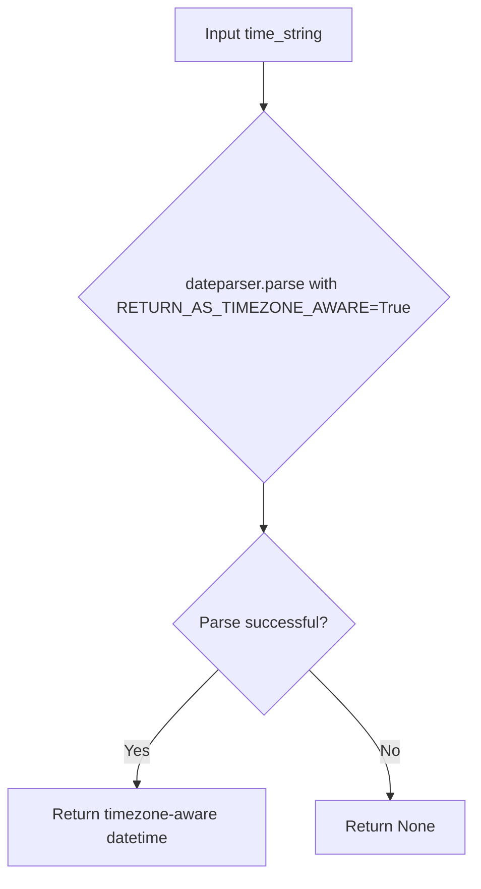

# `time_utils.py`

## `trailscraper.time_utils.parse_human_readable_time` · *function*

## Summary:
Parses human-readable time strings into timezone-aware datetime objects.

## Description:
Converts various human-readable time formats (like "today", "yesterday", "2 hours ago", "Jan 1, 2023") into timezone-aware datetime objects. This function extracts parsing logic to ensure consistent timezone handling throughout the application.

## Args:
    time_string (str): A human-readable time string that dateparser can interpret.

## Returns:
    datetime.datetime or None: A timezone-aware datetime object representing the parsed time, or None if the input string cannot be parsed.

## Raises:
    None explicitly raised - depends on dateparser.parse behavior for invalid inputs.

## Constraints:
    Preconditions:
        - Input must be a string that dateparser can parse
        - Input should represent a valid time expression
    
    Postconditions:
        - Returned datetime object will have timezone information attached
        - The returned datetime will be timezone-aware due to the RETURN_AS_TIMEZONE_AWARE setting

## Side Effects:
    None

## Control Flow:

## Examples:
    >>> parse_human_readable_time("today")
    datetime.datetime(2023, 10, 15, 0, 0, tzinfo=<UTC>)
    
    >>> parse_human_readable_time("2 hours ago")
    datetime.datetime(2023, 10, 14, 22, 0, tzinfo=<UTC>)
    
    >>> parse_human_readable_time("invalid date")
    None

