# `src`

## Tree:
```
src/
└── ydata_profiling/
    ├── __init__.py
    ├── __main__.py
    ├── config.py
    ├── profile_report.py
    ├── report/
    │   ├── __init__.py
    │   ├── structure/
    │   │   ├── __init__.py
    │   │   ├── base.py
    │   │   └── variables/
    │   │       ├── __init__.py
    │   │       ├── render_categorical.py
    │   │       ├── render_complex.py
    │   │       ├── render_date.py
    │   │       ├── render_datetime.py
    │   │       ├── render_file.py
    │   │       ├── render_generic.py
    │   │       ├── render_image.py
    │   │       ├── render_path.py
    │   │       ├── render_real.py
    │   │       ├── render_text.py
    │   │       ├── render_timeseries.py
    │   │       └── render_url.py
    │   └── presentation/
    │       ├── __init__.py
    │       └── flavours/
    │           └── html/
    │               ├── __init__.py
    │               ├── templates/
    │               └── utils.py
    ├── serialize_report.py
    ├── utils/
    │   ├── __init__.py
    │   ├── cache.py
    │   ├── common.py
    │   ├── compat.py
    │   ├── dataframe.py
    │   ├── paths.py
    │   ├── progress_bar.py
    │   ├── versions.py
    │   └── notebook/
    │       └── __init__.py
    └── visualisation/
        ├── __init__.py
        ├── context.py
        ├── missing.py
        ├── plot.py
        └── utils/
            ├── __init__.py
            └── base64_image.py
```

## Role:
Provides comprehensive data profiling capabilities for analyzing datasets and generating detailed statistical reports with visualizations.

## Description:
The ydata_profiling module serves as the core engine for creating statistical profiles of datasets. It analyzes data characteristics, detects anomalies, and generates interactive HTML reports with various visualizations and statistical summaries. This module is designed to help data scientists and analysts quickly understand their datasets through automated profiling.

The module is organized around several key subsystems:
- Data profiling and analysis components
- Report generation and templating
- Visualization utilities for creating charts and plots
- Data handling and preprocessing utilities
- Serialization support for saving/loading profiles

Primary consumers include:
- The main ProfileReport class (in profile_report.py)
- HTML report generation system
- Visualization rendering components
- Data processing utilities

## Components:
* `ProfileReport` - Main class for creating and managing data profiles
* `Settings` - Configuration class for customizing profiling behavior
* `SerializeReport` - Handles serialization/deserialization of profile reports
* `render_categorical`, `render_complex`, `render_date`, etc. - Variable-specific rendering functions for different data types
* `plot_missing_bar`, `plot_missing_heatmap`, etc. - Missing data visualization functions
* `cache_file`, `read_pandas` - Data loading and caching utilities
* `hash_dataframe` - Data hashing for comparison purposes

```mermaid
graph TD
    A[ProfileReport] --> B[Settings]
    A --> C[SerializeReport]
    A --> D[Variable Renderers]
    D --> E[render_categorical]
    D --> F[render_complex]
    D --> G[render_date]
    D --> H[render_datetime]
    D --> I[render_file]
    D --> J[render_generic]
    D --> K[render_image]
    D --> L[render_path]
    D --> M[render_real]
    D --> N[render_text]
    D --> O[render_timeseries]
    D --> P[render_url]
    A --> Q[Visualization Functions]
    Q --> R[plot_missing_bar]
    Q --> S[plot_missing_heatmap]
    Q --> T[plot_missing_matrix]
    Q --> U[histogram]
    Q --> V[mini_histogram]
    Q --> W[mini_ts_plot]
    A --> X[Data Utilities]
    X --> Y[cache_file]
    X --> Z[read_pandas]
    X --> AA[hash_dataframe]
    A --> AB[Context Management]
    AB --> AC[manage_matplotlib_context]
```



## Public API:
* `ProfileReport` - Main class for creating data profiles
* `Settings` - Configuration class for profiling settings
* `serialize_report.SerializeReport` - Serialization interface for profile reports
* `render_categorical`, `render_complex`, `render_date`, etc. - Variable-specific rendering functions
* `plot_missing_bar`, `plot_missing_heatmap`, `plot_missing_matrix` - Missing data visualization functions
* `cache_file`, `cache_zipped_file` - File caching utilities
* `read_pandas` - Pandas DataFrame reader with automatic format detection
* `hash_dataframe` - Hashing utility for data comparison

## Dependencies:
* Internal imports:
  * `src.ydata_profiling.config` - Configuration management
  * `src.ydata_profiling.profile_report` - Main profiling class
  * `src.ydata_profiling.report.structure.variables` - Variable rendering logic
  * `src.ydata_profiling.visualisation.plot` - Plotting utilities
  * `src.ydata_profiling.utils.dataframe` - Data manipulation utilities
* External imports:
  * `pandas` - Core data manipulation library
  * `numpy` - Numerical computing library
  * `matplotlib` - Plotting library
  * `seaborn` - Statistical data visualization library
  * `scipy` - Scientific computing library
  * `wordcloud` - Word cloud generation library
  * `tqdm` - Progress bar library

## Constraints:
* All data processing operations assume pandas DataFrames as input
* Visualization functions require matplotlib backend to be available
* Serialization requires pickle compatibility between versions
* Memory usage scales with dataset size and complexity of visualizations
* Thread safety is not guaranteed for concurrent operations on the same ProfileReport instance
* Configuration settings must be validated before use

