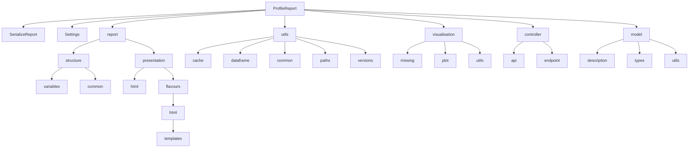

# `src.ydata_profiling`

## Tree:
    - ydata_profiling/
      - controller/
      - model/
      - report/
      - utils/
      - visualisation/
      - compare_reports.py
      - config.py
      - expectations_report.py
      - profile_report.py
      - serialize_report.py

## Role:
    - Provides comprehensive data profiling capabilities for datasets, generating detailed statistical summaries, visualizations, and insights about data quality and characteristics.

## Description:
    - This module serves as the core data profiling engine, analyzing datasets to provide statistical summaries, data quality assessments, and visualization of data distributions and patterns.
    - It is used throughout the ydata-profiling library to generate comprehensive reports about datasets, identifying issues like missing values, data types, outliers, and correlations.
    - The module is organized around the concept of data profiling, grouping together all components responsible for analyzing, summarizing, and presenting data characteristics in a structured manner.

## Components:
    - ProfileReport (class): Main interface for creating data profiling reports
    - SerializeReport (class): Handles serialization and deserialization of profiling reports
    - Settings (class): Configuration settings for profiling behavior
    - compare_reports (function): Function to compare two profiling reports
    - expectations_report (function): Function to generate expectation-based reports
    - profile_report (function): Function to create a profile report from a DataFrame
    - serialize_report (function): Function to serialize a report to bytes

## Public API:
    - ProfileReport: Main class for creating data profiling reports
      - Signature: ProfileReport(df, config=None, title="Profile Report", explorative=True)
      - Brief description: Core class that orchestrates data profiling operations and manages report generation
      - Usage note: Initialize with a pandas DataFrame to generate detailed statistical analysis and visualizations
    - SerializeReport: Class for serializing/deserializing profiling reports
      - Signature: SerializeReport()
      - Brief description: Base class providing methods for persisting and loading profiling reports
      - Usage note: Used internally by ProfileReport for saving/loading report data
    - Settings: Configuration class for profiling behavior
      - Signature: Settings(**kwargs)
      - Brief description: Configuration object controlling various aspects of profiling behavior and report generation
      - Usage note: Passed to ProfileReport constructor to customize analysis parameters and report formatting
    - compare_reports: Function to compare two profiling reports
      - Signature: compare_reports(report1, report2)
      - Brief description: Compares two profiling reports and generates a comparison report
      - Usage note: Useful for tracking changes in data characteristics over time
    - expectations_report: Function to generate expectation-based reports
      - Signature: expectations_report(df, expectations)
      - Brief description: Generates reports based on predefined data expectations
      - Usage note: Used for validating data against business rules or constraints
    - profile_report: Function to create a profile report from a DataFrame
      - Signature: profile_report(df, config=None, title="Profile Report", explorative=True)
      - Brief description: Convenience function that creates a ProfileReport instance for a DataFrame
      - Usage note: Direct alternative to instantiating ProfileReport class directly
    - serialize_report: Function to serialize a report to bytes
      - Signature: serialize_report(report)
      - Brief description: Serializes a ProfileReport to bytes for storage or transmission
      - Usage note: Used internally for saving reports to disk or network

## Dependencies:
    - Internal imports:
      - controller/: Contains API endpoints and controllers for report generation
      - model/: Data models and description sets for profiling results
      - report/: Core report generation logic and structure definitions
      - utils/: Utility functions for data processing, caching, and common operations
      - visualisation/: Visualization components and plotting utilities
    - External imports:
      - pandas: Core data manipulation library
      - numpy: Numerical computing library
      - matplotlib: Plotting library
      - seaborn: Statistical data visualization library
      - jinja2: Template rendering engine
      - requests: HTTP client for downloading resources
      - pillow: Image processing library
      - wordcloud: Word cloud generation library
      - scikit-learn: Machine learning utilities
      - scipy: Scientific computing library

## Constraints:
    - All data passed to ProfileReport must be compatible with pandas DataFrame structure
    - Configuration settings can be initialized via Settings() constructor or from file
    - Reports should be generated in environments with sufficient memory for large datasets
    - Serialization requires pickle compatibility between versions
    - Thread safety: Not guaranteed for concurrent report generation operations
    - Initialization: Settings can be configured before ProfileReport instantiation through constructor parameters

---

## Files

- [`compare_reports.py`](ydata_profiling/compare_reports.md)
- [`config.py`](ydata_profiling/config.md)
- [`expectations_report.py`](ydata_profiling/expectations_report.md)
- [`profile_report.py`](ydata_profiling/profile_report.md)
- [`serialize_report.py`](ydata_profiling/serialize_report.md)

