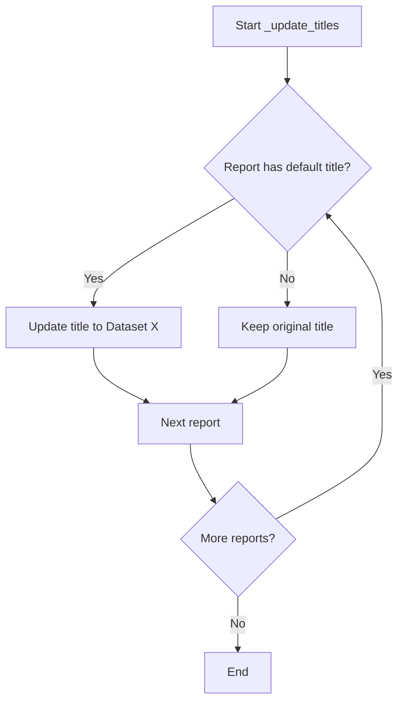
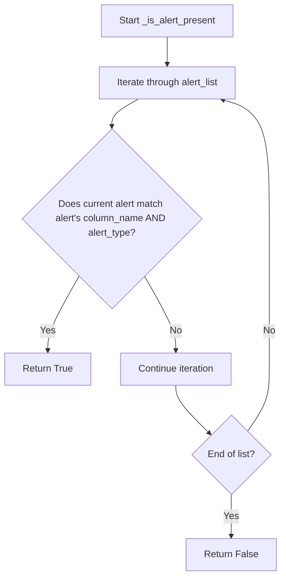
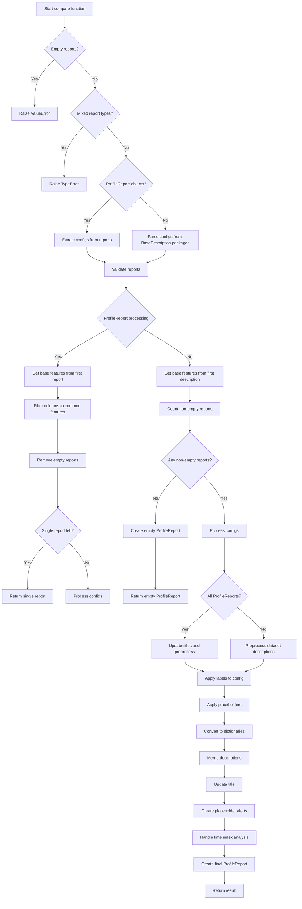

# `compare_reports.py`

## `src.ydata_profiling.compare_reports._should_wrap` · *function*

## Summary:
Determines whether two values should be considered equal for comparison purposes, with special handling for pandas DataFrames, Series, lists, and dictionaries.

## Description:
This utility function implements custom equality logic for comparing values in report comparison operations. It handles different data types appropriately, returning False for list and dictionary types regardless of content, and using specialized comparison methods for pandas DataFrame and Series objects.

## Args:
    v1 (Any): First value to compare
    v2 (Any): Second value to compare

## Returns:
    bool: True if the values are considered equal according to the comparison logic, False otherwise

## Raises:
    None explicitly raised - handles ValueError internally by returning False

## Constraints:
    Preconditions:
    - Both arguments can be of any type (Any)
    - The function assumes pandas DataFrame and Series objects are available through the pandas import
    
    Postconditions:
    - Always returns a boolean value
    - For list or dict inputs, always returns False regardless of content
    - For DataFrame comparisons, uses DataFrame.equals() method
    - For Series comparisons, uses Series.equals() method
    - For other types, uses standard equality operator with graceful error handling

## Side Effects:
    None

## Control Flow:
```mermaid
flowchart TD
    A[Start _should_wrap] --> B{isinstance(v1, (list, dict))}
    B -- Yes --> C[Return False]
    B -- No --> D{isinstance(v1, pandas.DataFrame) AND isinstance(v2, pandas.DataFrame)}
    D -- Yes --> E[v1.equals(v2)]
    D -- No --> F{isinstance(v1, pandas.Series) AND isinstance(v2, pandas.Series)}
    F -- Yes --> G[v1.equals(v2)]
    F -- No --> H[Try v1 == v2]
    H -- Success --> I[Return v1 == v2]
    H -- ValueError --> J[Return False]
```

## Examples:
    # Comparing identical DataFrames
    df1 = pandas.DataFrame({'a': [1, 2], 'b': [3, 4]})
    df2 = pandas.DataFrame({'a': [1, 2], 'b': [3, 4]})
    result = _should_wrap(df1, df2)  # Returns True
    
    # Comparing different DataFrames
    df1 = pandas.DataFrame({'a': [1, 2], 'b': [3, 4]})
    df2 = pandas.DataFrame({'a': [1, 2], 'b': [3, 5]})
    result = _should_wrap(df1, df2)  # Returns False
    
    # Comparing lists (always returns False)
    result = _should_wrap([1, 2, 3], [1, 2, 3])  # Returns False
    
    # Comparing simple values
    result = _should_wrap(5, 5)  # Returns True
    result = _should_wrap("hello", "world")  # Returns False
```

## `src.ydata_profiling.compare_reports._update_merge_dict` · *function*

## Summary:
Merges two dictionaries with intelligent conflict resolution for overlapping keys.

## Description:
This function combines two dictionaries (`d1` and `d2`) by first applying standard dictionary unpacking, then resolving conflicts for keys that exist in both dictionaries. When conflicts occur, it uses helper functions to determine whether to wrap conflicting values in a list or merge them recursively based on their types and content. This function is primarily used in the comparison of profile reports to handle conflicting configuration or metadata values.

## Args:
    d1 (Any): First dictionary to merge
    d2 (Any): Second dictionary to merge

## Returns:
    dict: A merged dictionary containing all keys from both input dictionaries. For overlapping keys, values are either wrapped in a list (when _should_wrap returns True) or recursively merged using _update_merge_mixed.

## Raises:
    None explicitly raised

## Constraints:
    Preconditions:
    - Both arguments must support dictionary unpacking operations (** operator)
    - The function assumes that the input dictionaries can be unpacked with the ** operator
    
    Postconditions:
    - The returned dictionary contains all keys from both input dictionaries
    - Conflicting keys are handled according to the logic in _should_wrap and _update_merge_mixed functions
    - Values from d1 and d2 are preserved in the result

## Side Effects:
    None

## Control Flow:
```mermaid
flowchart TD
    A[Start _update_merge_dict] --> B{d1 and d2 are dicts?}
    B -- Yes --> C[Unpack d1 and d2]
    B -- No --> D[Handle non-dict inputs]
    C --> E{Overlapping keys exist?}
    E -- Yes --> F[Process overlapping keys]
    E -- No --> G[Return merged dict]
    F --> H{Should wrap values?}
    H -- Yes --> I[Wrap in list: [d1[k], d2[k]]]
    H -- No --> J[Use _update_merge_mixed]
    I --> K[Merge result]
    J --> K
    K --> L[Return merged dictionary]
    D --> L
```

## Examples:
```python
# Basic usage with simple dictionaries
d1 = {"a": 1, "b": 2}
d2 = {"c": 3, "d": 4}
result = _update_merge_dict(d1, d2)
# Returns: {"a": 1, "b": 2, "c": 3, "d": 4}

# Usage with overlapping keys that should be wrapped
d1 = {"a": 1, "b": 2}
d2 = {"b": 3, "c": 4}
result = _update_merge_dict(d1, d2)
# Returns: {"a": 1, "b": [2, 3], "c": 4} (assuming _should_wrap returns True for b)

# Usage with nested dictionaries
d1 = {"a": {"x": 1}, "b": 2}
d2 = {"a": {"y": 2}, "c": 3}
result = _update_merge_dict(d1, d2)
# Returns: {"a": {...merged nested dict...}, "b": 2, "c": 3}
```

## `src.ydata_profiling.compare_reports._update_merge_seq` · *function*

## Summary:
Merges two sequence-like objects into a consistent format for further processing.

## Description:
This utility function handles different combinations of list and tuple inputs to produce a standardized output format. It's designed to merge two sequence-like objects while preserving their structural integrity and ensuring consistent return types for downstream processing.

## Args:
    d1 (Any): First sequence-like object, can be list, tuple, or other types
    d2 (Any): Second sequence-like object, can be list, tuple, or other types

## Returns:
    Union[list, tuple]: 
    - If both d1 and d2 are lists: returns (d1, d2) as a tuple
    - If d1 is tuple and d2 is list: returns (*d1, d2) as a tuple
    - Otherwise: returns a list containing both elements (each wrapped in a list if not already a list)

## Raises:
    None explicitly raised

## Constraints:
    Preconditions:
    - Both arguments can be of any type (though behavior varies based on type)
    - Function assumes inputs are compatible with list/tuple operations
    
    Postconditions:
    - Returns either a list or tuple as specified by the logic branches
    - Input objects are not modified (they are copied or referenced appropriately)

## Side Effects:
    None

## Control Flow:
```mermaid
flowchart TD
    A[Input d1, d2] --> B{isinstance(d1, list) AND isinstance(d2, list)?}
    B -- Yes --> C[Return (d1, d2)]
    B -- No --> D{isinstance(d1, tuple) AND isinstance(d2, list)?}
    D -- Yes --> E[Return (*d1, d2)]
    D -- No --> F[Return [*(d1 if list else [d1]), *(d2 if list else [d2])]]
```

## Examples:
    # Both are lists
    result = _update_merge_seq([1, 2], [3, 4])
    # Returns: ([1, 2], [3, 4])
    
    # First is tuple, second is list  
    result = _update_merge_seq((1, 2), [3, 4])
    # Returns: (1, 2, [3, 4])
    
    # Other combinations
    result = _update_merge_seq("hello", "world")
    # Returns: ['hello', 'world']
```

## `src.ydata_profiling.compare_reports._update_merge_mixed` · *function*

## Summary:
Merges two data structures (dict, list, or tuple) by choosing the appropriate merge strategy based on their types.

## Description:
This function serves as a dispatcher that determines whether to merge two data structures as dictionaries or sequences (lists/tuples). It is part of a recursive merging system used for comparing and combining profile reports. When both inputs are dictionaries, it delegates to `_update_merge_dict` which handles key-value merging with special handling for conflicting keys. Otherwise, it delegates to `_update_merge_seq` which handles sequence merging.

## Args:
    d1 (Any): First data structure to merge (dict, list, tuple, or other type)
    d2 (Any): Second data structure to merge (dict, list, tuple, or other type)

## Returns:
    Union[dict, list, tuple]: The merged result. When both inputs are dictionaries, returns a merged dictionary. When inputs are not both dictionaries, returns a sequence representation (list or tuple) that combines the elements appropriately.

## Raises:
    None explicitly raised - relies on underlying functions for any exceptions

## Constraints:
    Preconditions:
    - Both arguments can be any type (though behavior varies based on type)
    - Function assumes proper handling of nested structures by parent functions
    
    Postconditions:
    - Returns a merged data structure of the appropriate type
    - When both inputs are dicts, returns a dict with merged content
    - When inputs are not both dicts, returns a sequence representation

## Side Effects:
    None

## Control Flow:
```mermaid
flowchart TD
    A[_update_merge_mixed] --> B{isinstance(d1, dict) AND isinstance(d2, dict)}
    B -- True --> C[_update_merge_dict(d1, d2)]
    B -- False --> D[_update_merge_seq(d1, d2)]
    C --> E[Return merged dict]
    D --> F[Return merged sequence]
```

## Examples:
    # Merging two dictionaries
    result = _update_merge_mixed({"a": 1, "b": 2}, {"b": 3, "c": 4})
    # Returns: {"a": 1, "b": [2, 3], "c": 4} (assuming _should_wrap returns True for b)
    
    # Merging two lists
    result = _update_merge_mixed([1, 2], [3, 4])
    # Returns: ([1, 2], [3, 4]) - tuple of the two lists
    
    # Merging a dict with a list
    result = _update_merge_mixed({"a": 1}, [2, 3])
    # Returns: [1, [2, 3]] - list containing dict value and list

## `src.ydata_profiling.compare_reports._update_merge` · *function*

## Summary:
Merges two dictionary objects with special handling for None values and type validation.

## Description:
This function serves as a wrapper for dictionary merging operations, providing type safety and handling edge cases where one or both arguments might be None. It validates that both inputs are dictionaries before proceeding to the actual merge operation via `_update_merge_dict`.

## Args:
    d1 (Optional[dict]): First dictionary to merge, can be None
    d2 (dict): Second dictionary to merge, must be a dictionary

## Returns:
    dict: A merged dictionary containing keys from both input dictionaries, with special handling for overlapping keys

## Raises:
    TypeError: When either argument is not of type dictionary (dict)

## Constraints:
    Precondition: d2 must be a dictionary
    Precondition: If d1 is provided, it must be a dictionary or None
    Postcondition: The returned dictionary contains all keys from both input dictionaries

## Side Effects:
    None

## Control Flow:
```mermaid
flowchart TD
    A[Start _update_merge] --> B{d1 is None?}
    B -- Yes --> C[Return d2]
    B -- No --> D{d1 is dict AND d2 is dict?}
    D -- No --> E[Raise TypeError]
    D -- Yes --> F[Call _update_merge_dict(d1, d2)]
    F --> G[Return merged result]
```

## Examples:
```python
# Basic usage with two dictionaries
result = _update_merge({"a": 1}, {"b": 2})
# Returns: {"a": 1, "b": 2}

# Usage with None as first argument
result = _update_merge(None, {"a": 1})
# Returns: {"a": 1}

# Error case - invalid types
_update_merge("not_a_dict", {"a": 1})
# Raises TypeError
```

## `src.ydata_profiling.compare_reports._placeholders` · *function*

## Summary:
Populates missing keys in scatter plot and table type data structures across multiple profile reports to ensure structural consistency.

## Description:
This internal utility function ensures that all BaseDescription objects in a list have consistent data structures for scatter plots and table type counts. It prevents KeyError exceptions during report comparisons by pre-filling missing keys with appropriate default values. This function is typically used as part of the report comparison workflow to standardize data formats before analysis.

## Args:
    reports (List[BaseDescription]): A list of BaseDescription objects representing profile reports that need structural consistency

## Returns:
    None: This function modifies the input reports in-place and does not return anything

## Raises:
    None explicitly raised

## Constraints:
    Preconditions:
    - Input reports must be a list of BaseDescription objects
    - Each BaseDescription object must have a 'scatter' attribute that supports dictionary operations
    - Each BaseDescription object must have a 'table' attribute with a 'types' sub-dictionary
    - All reports should be compatible in structure for the normalization process
    
    Postconditions:
    - All reports will have consistent scatter plot key structures
    - All reports will have consistent table type key structures
    - No reports will have missing keys that would cause KeyError during comparison operations

## Side Effects:
    - Modifies the input reports in-place by adding missing keys to their scatter and table data structures
    - No external I/O operations or state mutations beyond modifying the input objects

## Control Flow:
```mermaid
flowchart TD
    A[Start _placeholders] --> B{reports list not empty?}
    B -- Yes --> C[Collect all scatter keys from reports]
    B -- No --> F[Return]
    C --> D[Collect all type keys from reports]
    D --> E[Process each report in reports]
    E --> G[For each scatter key k1 in collected keys]
    G --> H[Ensure report.scatter[k1] exists as dict]
    H --> I[For each scatter key k2 in collected keys]
    I --> J[Ensure report.scatter[k1][k2] exists as empty string]
    J --> K[Process type keys for report]
    K --> L[For each type_key in collected type keys]
    L --> M[Ensure report.table["types"][type_key] exists as integer 0]
    M --> N[Continue to next report]
    N --> O[Next report?]
    O -- Yes --> E
    O -- No --> P[End]
```

## Examples:
```python
# Example usage in a report comparison context
from ydata_profiling.model import BaseDescription

# Create sample reports with inconsistent data structures
report1 = BaseDescription()
report1.scatter = {"A": {"B": "value1"}}
report1.table["types"] = {"int": 5}

report2 = BaseDescription()
report2.scatter = {"A": {"C": "value2"}}  # Missing B key
report2.table["types"] = {"float": 3}    # Missing int key

reports = [report1, report2]
_placeholders(reports)

# After processing, both reports will have consistent structures:
# report1.scatter will have {"A": {"B": "value1", "C": ""}}
# report2.scatter will have {"A": {"B": "", "C": "value2"}}
# Both will have table["types"] with both "int" and "float" keys
```

## `src.ydata_profiling.compare_reports._update_titles` · *function*

## Summary:
Updates the titles of ProfileReport objects in a list to distinguish between different datasets being compared.

## Description:
This function modifies the title attribute of ProfileReport objects that have the default title "Pandas Profiling Report" by replacing them with dataset labels (e.g., "Dataset A", "Dataset B"). This is used in the comparison functionality to provide meaningful identification of individual datasets in multi-dataset comparisons.

The function is extracted into its own utility function to separate the concern of title management from the core comparison logic, making the code more modular and testable.

## Args:
    reports (List[ProfileReport]): A list of ProfileReport objects whose titles need to be updated

## Returns:
    None: This function modifies the ProfileReport objects in-place and does not return anything

## Raises:
    None: This function does not explicitly raise any exceptions

## Constraints:
    Preconditions:
    - The input `reports` must be a list of ProfileReport objects
    - Each ProfileReport object must have a `config` attribute with a `title` attribute
    
    Postconditions:
    - ProfileReport objects with the default title "Pandas Profiling Report" will have their titles updated to dataset labels
    - Other ProfileReport objects retain their original titles
    - All modifications happen in-place

## Side Effects:
    None: This function only modifies the internal state of the ProfileReport objects passed to it

## Control Flow:


## Examples:
```python
# Basic usage in comparison context
from ydata_profiling import ProfileReport

# Create multiple reports with default titles
report1 = ProfileReport(df1)
report2 = ProfileReport(df2)
reports = [report1, report2]

# Update titles for comparison
_update_titles(reports)
# report1.title becomes "Dataset A"
# report2.title becomes "Dataset B"
```

## `src.ydata_profiling.compare_reports._compare_title` · *function*

## Summary:
Formats a list of report titles for display in comparison views, handling both identical and varying title cases.

## Description:
This utility function processes a list of report titles to create a properly formatted display string for comparison reports. When all titles are identical, it returns that single title. When titles differ, it formats them in a readable "Comparing A, B and C" pattern suitable for UI display.

## Args:
    titles (List[str]): A list of title strings to be compared and formatted. Must contain at least one title.

## Returns:
    str: A formatted string representing the comparison. If all titles are identical, returns the single title. Otherwise, returns a formatted string like "<em>Comparing</em> title1, title2 <em>and</em> title3".

## Raises:
    IndexError: Raised when the input list is empty, as accessing titles[0] would fail.

## Constraints:
    Preconditions:
        - The input list must contain at least one string element
        - All elements in the list must be strings
    
    Postconditions:
        - Always returns a string
        - If all titles are identical, returns exactly that title string
        - If titles differ, returns a formatted HTML string with em tags

## Side Effects:
    None

## Control Flow:
```mermaid
flowchart TD
    A[Input: List[str] titles] --> B{All titles equal?}
    B -->|Yes| C[Return titles[0]]
    B -->|No| D[Join all but last with commas]
    D --> E[Return formatted string]
```

## Examples:
    >>> _compare_title(["Report A", "Report A", "Report A"])
    'Report A'
    
    >>> _compare_title(["Report A", "Report B"])
    '<em>Comparing</em> Report A <em>and</em> Report B'
    
    >>> _compare_title(["Report A", "Report B", "Report C"])
    '<em>Comparing</em> Report A, Report B <em>and</em> Report C'

## `src.ydata_profiling.compare_reports._compare_profile_report_preprocess` · *function*

## Summary:
Preprocesses multiple profile reports for comparison by normalizing configurations, synchronizing typesets, and preparing descriptions with appropriate titles.

## Description:
This function prepares a collection of ProfileReport objects for comparison operations by standardizing their configurations, ensuring consistent type information across reports, and formatting their descriptions with appropriate labels. It serves as a preprocessing step that ensures all reports are in a compatible state before being compared.

The function is typically called as part of the report comparison workflow when multiple profile reports need to be analyzed side-by-side or when generating comparative visualizations.

## Args:
    reports (List[ProfileReport]): A list of ProfileReport objects to be preprocessed for comparison. Must contain at least one report.
    config (Optional[Settings], optional): An optional global configuration object that may override individual report configurations. If None, uses the first report's configuration for primary colors. Defaults to None.

## Returns:
    Tuple[List[str], List[BaseDescription]]: A tuple containing:
        - labels (List[str]): A list of titles extracted from each report's configuration
        - descriptions (List[BaseDescription]): A list of description objects from each report, with their analysis.title attribute updated to match the corresponding labels

## Raises:
    None explicitly raised

## Constraints:
    - Preconditions: 
      * The reports list must contain at least one ProfileReport object
      * Each ProfileReport in the list must have a valid config attribute with title and html.style.primary_colors attributes
      * Each ProfileReport must have a valid typeset attribute
      * Each ProfileReport must have a valid get_description() method
    - Postconditions:
      * All reports in the list will have their primary_colors configuration normalized
      * All reports except the first will have their _typeset attribute set to match the first report's typeset
      * All description objects will have their analysis.title attribute updated to match the corresponding label

## Side Effects:
    - Modifies the primary_colors configuration of the ProfileReport objects in-place
    - Modifies the _typeset attribute of ProfileReport objects (except the first one) in-place
    - Updates the analysis.title attribute of BaseDescription objects in-place

## Control Flow:
```mermaid
flowchart TD
    A[Start preprocess] --> B{config is None?}
    B -- Yes --> C{reports[0].config.html.style.primary_colors length > 1?}
    B -- No --> D{config.html.style.primary_colors length > 1?}
    C -- Yes --> E[Set primary_colors for all reports from reports[0]]
    C -- No --> F[Skip primary_colors processing]
    D -- Yes --> G[Set primary_colors for all reports from config]
    D -- No --> H[Skip primary_colors processing]
    E --> I[Process remaining reports]
    F --> I
    G --> I
    H --> I
    I --> J[Copy typeset from first report to others]
    J --> K[Get descriptions from all reports]
    K --> L[Update description titles with corresponding labels]
    L --> M[Return labels and descriptions]
```

## Examples:
```python
# Basic usage with multiple reports
from ydata_profiling import ProfileReport
from ydata_profiling.compare_reports import _compare_profile_report_preprocess

# Assuming we have two profile reports
labels, descriptions = _compare_profile_report_preprocess([report1, report2])

# Usage with custom configuration
labels, descriptions = _compare_profile_report_preprocess([report1, report2], config=my_config)
```

## `src.ydata_profiling.compare_reports._compare_dataset_description_preprocess` · *function*

## Summary:
Extracts dataset titles from profile report descriptions for comparison visualization.

## Description:
Processes a list of dataset profile descriptions to extract human-readable titles while preserving the original report objects. This function serves as a preprocessing step for comparing multiple dataset profiles by creating meaningful labels for each dataset in the comparison view. The function is designed to be a lightweight utility that prepares data for visualization purposes without modifying the original report objects.

## Args:
    reports (List[BaseDescription]): A list of dataset profile descriptions containing analysis metadata including titles. Each item in the list must be a valid BaseDescription object with an analysis attribute.

## Returns:
    Tuple[List[str], List[BaseDescription]]: A tuple containing:
        - labels (List[str]): List of dataset titles extracted from each report's analysis.title attribute
        - reports (List[BaseDescription]): The original list of report objects unchanged, maintaining reference to the input list

## Raises:
    AttributeError: Raised when any report in the input list does not have an analysis attribute, or when analysis does not have a title attribute.

## Constraints:
    Preconditions:
        - Input reports list must not be None
        - Each report in the list must have an analysis attribute that is not None
        - Each report's analysis must have a title attribute that is not None
    
    Postconditions:
        - The returned labels list will have the same length as the input reports list
        - The original reports list is preserved unchanged (same object references)
        - All returned labels are strings extracted from report.analysis.title

## Side Effects:
    None

## Control Flow:
```mermaid
flowchart TD
    A[Input reports list] --> B{Reports exist?}
    B -- Yes --> C[Extract title from each report.analysis]
    C --> D[Return (labels, reports)]
    B -- No --> D
```

## Examples:
```python
# Basic usage with valid reports
from ydata_profiling.model import BaseDescription
from ydata_profiling.compare_reports import _compare_dataset_description_preprocess

# Assuming we have profile reports with proper analysis titles
labels, processed_reports = _compare_dataset_description_preprocess([report1, report2])
print(labels)  # ['Dataset 1', 'Dataset 2']

# Edge case: empty list
empty_labels, empty_reports = _compare_dataset_description_preprocess([])
print(empty_labels)  # []
```

## `src.ydata_profiling.compare_reports.validate_reports` · *function*

## Summary
Validates that a collection of profile reports are compatible for comparison operations.

## Description
This function performs essential validation checks to ensure that profile reports can be safely compared. It verifies that reports meet the requirements for comparison, including having the appropriate number of reports, matching report types (all timeseries or all tabular), and consistent feature sets across reports. The validation occurs before comparison operations to prevent errors and unexpected behavior.

Known callers within the codebase:
- `compare()` in `src.ydata_profiling.compare_reports` - This function is called during the comparison process to validate reports before proceeding with the comparison logic. The validation ensures that the comparison operation will work correctly with the provided reports.

This logic is extracted into its own function rather than being inlined because it encapsulates the core validation requirements for report comparison, providing a clear separation of concerns between the validation phase and the comparison implementation. This makes the comparison logic cleaner and allows for reuse of validation logic in different contexts.

## Args
- reports: A list of either ProfileReport objects or BaseDescription objects that need to be validated for comparison
- configs: A list of configuration dictionaries corresponding to each report, used to determine report types (timeseries vs tabular)

## Returns
None - This function raises exceptions when validation fails rather than returning a value

## Raises
- ValueError: Raised when fewer than two reports are provided, or when timeseries and tabular reports are mixed in the same comparison
- ValueError: Raised when ProfileReport instances are not initialized with DataFrames

## Constraints
Preconditions:
- Reports list must contain at least two elements
- All reports must be of the same type (either all ProfileReport or all BaseDescription)
- Configs list must have the same length as reports list

Postconditions:
- If the function completes successfully, all reports are valid for comparison
- All reports have consistent column/features sets (when applicable)
- All reports are properly initialized (for ProfileReport instances)

## Side Effects
None - This function performs only validation checks and does not modify any external state or perform I/O operations

## Control Flow
```mermaid
flowchart TD
    A[Start validate_reports] --> B{len(reports) < 2?}
    B -- Yes --> C[Raise ValueError: "At least two reports are required for this comparison"]
    B -- No --> D{len(reports) > 2?}
    D -- Yes --> E[Warn about >2 reports]
    D -- No --> F{All report_types equal?}
    F -- No --> G[Raise ValueError: "Comparison between timeseries and tabular reports is not supported."]
    F -- Yes --> H{isinstance(reports[0], ProfileReport)?}
    H -- Yes --> I{All reports have df?}
    I -- No --> J[Raise ValueError: "Reports where not initialized with a DataFrame."]
    H -- No --> K[Get features from variables keys]
    I -- Yes --> L[Get features from df.columns]
    L --> M{All features equal?}
    K --> M
    M -- No --> N[Warn about different columns]
    M -- Yes --> O[End validation]
```

## Examples
Example 1: Valid usage with two tabular reports
```python
# Assuming report1 and report2 are valid ProfileReport instances
configs = [report1.config, report2.config]
validate_reports([report1, report2], configs)
# No exception raised - validation passes
```

Example 2: Invalid usage with insufficient reports
```python
# This would raise ValueError
try:
    validate_reports([report1], configs)
except ValueError as e:
    print(e)  # "At least two reports are required for this comparison"
```

Example 3: Mixed report types (timeseries and tabular)
```python
# This would raise ValueError
try:
    validate_reports([timeseries_report, tabular_report], configs)
except ValueError as e:
    print(e)  # "Comparison between timeseries and tabular reports is not supported."
```

Example 4: ProfileReport without DataFrames
```python
# This would raise ValueError
try:
    report_without_df = ProfileReport(None)  # No DataFrame provided
    validate_reports([report_without_df], [config])
except ValueError as e:
    print(e)  # "Reports where not initialized with a DataFrame."
```

## `src.ydata_profiling.compare_reports._apply_config` · *function*

## Summary:
Filters and modifies a BaseDescription object based on configuration settings

## Description:
Applies configuration settings to filter and modify various components of a BaseDescription object. This function is responsible for selectively retaining or removing elements like missing diagrams, correlations, samples, duplicates, and scatter plots based on the provided Settings configuration. The function acts as a configuration filter that ensures only enabled features are retained in the description.

## Args:
    description (BaseDescription): The base description object containing profiling results and metadata
    config (Settings): Configuration object containing settings that control which elements should be included

## Returns:
    BaseDescription: The modified description object with filtered elements according to the configuration

## Raises:
    None explicitly raised

## Constraints:
    Preconditions:
    - description must be a valid BaseDescription instance
    - config must be a valid Settings instance
    - description.missing must be a dictionary
    - description.correlations must be a dictionary
    - description.sample must be iterable
    - description.duplicates must be iterable or None
    - description.scatter must be dict-like or empty

    Postconditions:
    - description.missing keys are filtered based on config.missing_diagrams
    - description.correlations keys are filtered based on config.correlations
    - description.sample is either preserved or emptied based on sample configuration
    - description.duplicates is either preserved or set to None based on duplicates configuration
    - description.scatter is either preserved or emptied based on interactions configuration

## Side Effects:
    None

## Control Flow:
    ```mermaid
    flowchart TD
        A[Start _apply_config] --> B{config.missing_diagrams}
        B --> C[Filter description.missing]
        C --> D{config.correlations}
        D --> E[Filter description.correlations]
        E --> F{Sample config values}
        F --> G[Check if any samples enabled]
        G --> H{any(samples) == True}
        H -->|Yes| I[Keep description.sample]
        H -->|No| J[Set description.sample = []]
        J --> K{config.duplicates.head > 0}
        K -->|Yes| L[Keep description.duplicates]
        K -->|No| M[Set description.duplicates = None]
        M --> N{config.interactions.continuous}
        N -->|True| O[Keep description.scatter]
        N -->|False| P[Set description.scatter = {}]
        P --> Q[Return description]
    ```

## Examples:
    # Basic usage
    filtered_description = _apply_config(base_description, settings)
    
    # With specific configuration
    settings = Settings()
    settings.missing_diagrams["bar"] = False
    settings.correlations["spearman"].calculate = False
    filtered_description = _apply_config(base_description, settings)
    # This would remove bar missing diagram and spearman correlation from the description

## `src.ydata_profiling.compare_reports._is_alert_present` · *function*

## Summary:
Determines whether an alert with the same column name and alert type already exists in a list of alerts.

## Description:
This helper function performs deduplication logic for alerts by checking if a given alert's combination of column name and alert type matches any existing alert in a provided list. It is used during report comparison operations to avoid including duplicate alerts in the comparison results.

## Args:
    alert (Alert): The alert object to check for duplication
    alert_list (list): A list of Alert objects to search through for duplicates

## Returns:
    bool: True if an alert with the same column_name and alert_type exists in alert_list, False otherwise

## Raises:
    None explicitly raised

## Constraints:
    Preconditions:
    - alert parameter must be an instance of Alert class
    - alert_list parameter must be iterable (list-like structure)
    
    Postconditions:
    - Function returns a boolean value indicating presence of duplicate
    - Original alert and alert_list are not modified

## Side Effects:
    None

## Control Flow:


## Examples:
    # Example 1: Alert not found in list
    alert1 = Alert(alert_type="MISSING_VALUES", column_name="age")
    alerts_list = [Alert(alert_type="HIGH_CORRELATION", column_name="income")]
    result = _is_alert_present(alert1, alerts_list)  # Returns False
    
    # Example 2: Alert found in list
    alert1 = Alert(alert_type="MISSING_VALUES", column_name="age")
    alerts_list = [Alert(alert_type="MISSING_VALUES", column_name="age")]
    result = _is_alert_present(alert1, alerts_list)  # Returns True
    
    # Example 3: Empty list
    alert1 = Alert(alert_type="MISSING_VALUES", column_name="age")
    alerts_list = []
    result = _is_alert_present(alert1, alerts_list)  # Returns False

## `src.ydata_profiling.compare_reports._create_placehoder_alerts` · *function*

## Summary:
Creates placeholder alerts for comparison reports by ensuring consistent alert structure across multiple profile reports.

## Description:
This function normalizes alert data across multiple profile reports for comparison purposes. When comparing reports, it ensures that each report contains all alert types that appear in any of the reports, filling missing alerts with empty placeholders that maintain structural consistency.

The function is called during report comparison operations to align alert structures between different profile reports, making it easier to display and analyze differences across multiple datasets. It works by iterating through each report's alerts and ensuring that any alert that doesn't exist in another report gets a placeholder copy with `_is_empty = True`.

## Args:
    report_alerts (tuple): A tuple containing lists of Alert objects from different profile reports. Each element in the tuple represents alerts from one report.

## Returns:
    tuple: A tuple of lists where each list contains Alert objects for the corresponding report. Each report will have the same number of alert entries, with missing alerts filled with empty placeholder alerts.

## Raises:
    None explicitly raised, but may raise exceptions from underlying operations like copy() or list operations.

## Constraints:
    Preconditions:
    - report_alerts must be a tuple of lists containing Alert objects
    - Each Alert object must have column_name and alert_type attributes
    
    Postconditions:
    - The returned tuple will have the same length as the input tuple
    - Each list in the returned tuple will contain at least as many Alert objects as the input lists
    - All Alert objects in the result will have consistent structural positioning across reports
    - For any alert that appears in one report but not another, a placeholder copy with _is_empty=True will be added to the other report

## Side Effects:
    None

## Control Flow:
```mermaid
flowchart TD
    A[Start _create_placehoder_alerts] --> B[Initialize fixed list with empty lists]
    B --> C[For each report (idx) and its alerts]
    C --> D[For each alert in report]
    D --> E[Add alert to fixed[idx]]
    E --> F[For each other report (i)]
    F --> G{Is alert present in report i?}
    G -->|No| H[Create copy of alert]
    H --> I[Set _is_empty = True]
    I --> J[Add to fixed[i]]
    G -->|Yes| K[Continue to next alert]
    J --> L[Continue to next report]
    K --> L
    L --> M[Return tuple of fixed lists]
```

## Examples:
    # Basic usage with two reports
    report1_alerts = [Alert(alert_type="MISSING_VALUES", column_name="col1")]
    report2_alerts = [Alert(alert_type="HIGH_CORRELATION", column_name="col2")]
    
    result = _create_placehoder_alerts((report1_alerts, report2_alerts))
    # Result will contain both reports with placeholder alerts added where needed
    # report1 will have MISSING_VALUES alert + placeholder for HIGH_CORRELATION
    # report2 will have HIGH_CORRELATION alert + placeholder for MISSING_VALUES

## `src.ydata_profiling.compare_reports.compare` · *function*

## Summary
Creates a merged profiling report by comparing multiple existing profiling reports or dataset summaries.

## Description
This function takes a list of profiling reports (either ProfileReport objects or BaseDescription objects) and combines them into a single comparative report. It handles both ProfileReport objects and dataset summaries obtained from the get_description() method, ensuring consistent data types are compared. The function performs validation, column alignment, configuration merging, and creates a unified report structure that displays differences and similarities across the compared datasets.

The function is designed to be called internally by ProfileReport.compare() method or directly by users wanting to compare multiple datasets. It ensures proper handling of different data types, configuration inheritance, and maintains consistency in reporting structure.

## Args
- reports (Union[List[ProfileReport], List[BaseDescription]]): A list of profiling reports to compare. All elements must be of the same type (either all ProfileReport or all BaseDescription objects).
- config (Optional[Settings]): Configuration settings to override the default settings from the input reports. If None, uses the first report's configuration.
- compute (bool): When True, forces recomputation of the description set for ProfileReport objects. Defaults to False.

## Returns
- ProfileReport: A new ProfileReport object containing the merged comparison results. This report contains aggregated statistics and visualizations that highlight differences and similarities between the input datasets.

## Raises
- ValueError: Raised when no reports are provided or when reports don't have the same data type (ProfileReport vs BaseDescription).
- TypeError: Raised when trying to compare mixed types of reports (ProfileReport and BaseDescription objects).

## Constraints
- Preconditions:
  - At least one report must be provided in the reports list
  - All reports in the list must be of the same type (either all ProfileReport or all BaseDescription)
  - For ProfileReport objects, all must be initialized with DataFrames
  - For BaseDescription objects, all must have compatible configurations
- Postconditions:
  - Returns a valid ProfileReport object with merged data
  - The returned report contains properly formatted comparison data
  - Configuration settings are correctly applied to the merged result

## Side Effects
- Modifies the dataframes of ProfileReport objects in-place by filtering columns to common features
- Updates configuration settings of ProfileReport objects when config parameter is provided
- May modify the _description_set attribute of ProfileReport objects when compute=True
- Creates new ProfileReport instances with merged configurations

## Control Flow


## Examples
```python
# Compare two ProfileReport objects
report1 = ProfileReport(df1)
report2 = ProfileReport(df2)
comparison = compare([report1, report2])

# Compare with custom configuration
custom_config = Settings(title="Custom Comparison")
comparison = compare([report1, report2], config=custom_config)

# Compare BaseDescription objects (from get_description())
desc1 = report1.get_description()
desc2 = report2.get_description()
comparison = compare([desc1, desc2])
```

