# `config.py`

## `src.ydata_profiling.config._merge_dictionaries` · *function*

## Summary:
Merges two dictionaries recursively, preserving existing keys in the second dictionary while adding new keys from the first.

## Description:
Recursively merges two dictionaries where values from dict1 are added to dict2 only if they don't already exist in dict2. When encountering nested dictionaries, the function performs a deep merge operation. This utility function is commonly used for combining configuration settings, allowing default configurations to be overridden by user-defined settings without losing existing values.

## Args:
    dict1 (dict): Source dictionary containing values to be merged
    dict2 (dict): Target dictionary that will be modified and returned with merged values

## Returns:
    dict: The modified dict2 with values from dict1 merged in, maintaining existing keys and performing deep merging for nested dictionaries

## Raises:
    None explicitly raised

## Constraints:
    Preconditions:
    - Both arguments must be dictionaries
    - dict1 should not be None
    - dict2 should not be None
    
    Postconditions:
    - dict2 is modified in-place and returned
    - All keys from dict1 that don't exist in dict2 are added to dict2
    - Nested dictionaries are merged recursively
    - Existing keys in dict2 remain unchanged

## Side Effects:
    None

## Control Flow:
```mermaid
flowchart TD
    A[Start _merge_dictionaries] --> B{key in dict1?}
    B -->|Yes| C[Get value val]
    C --> D{isinstance(val, dict)?}
    D -->|Yes| E[dict2.setdefault(key, {})]
    E --> F[_merge_dictionaries(val, dict2_node)]
    D -->|No| G{key not in dict2?}
    G -->|Yes| H[dict2[key] = val]
    G -->|No| I[Skip key]
    F --> J[Return dict2]
    H --> J
    I --> J
    B -->|No| K[Return dict2]
```

## Examples:
```python
# Basic merge
dict1 = {'a': 1, 'b': 2}
dict2 = {'c': 3}
result = _merge_dictionaries(dict1, dict2)
# result = {'a': 1, 'b': 2, 'c': 3}

# Deep merge
dict1 = {'a': {'x': 1}, 'b': 2}
dict2 = {'a': {'y': 2}}
result = _merge_dictionaries(dict1, dict2)
# result = {'a': {'x': 1, 'y': 2}, 'b': 2}

# Existing keys preserved
dict1 = {'a': 1, 'b': 2}
dict2 = {'a': 10, 'c': 3}
result = _merge_dictionaries(dict1, dict2)
# result = {'a': 10, 'b': 2, 'c': 3}
```

## `src.ydata_profiling.config.Dataset` · *class*

## Summary:
Configuration class for dataset metadata properties including description, creator, author, copyright information, and URL.

## Description:
The Dataset class represents metadata configuration for a dataset, storing descriptive and administrative information about the dataset such as its description, creator, author, copyright details, and associated URL. This class is designed to be used as a configuration object within the ydata-profiling library to capture and manage dataset metadata.

## State:
- description: str = "" - Human-readable description of the dataset
- creator: str = "" - Name of the person or organization that created the dataset
- author: str = "" - Author or maintainer of the dataset
- copyright_holder: str = "" - Name of the copyright holder
- copyright_year: str = "" - Year of copyright
- url: str = "" - URL where the dataset can be accessed

All fields are string type with empty string defaults. There are no constraints on the values beyond being strings.

## Lifecycle:
- Creation: Instantiate with optional keyword arguments for any of the metadata fields
- Usage: Access fields directly as attributes
- Destruction: Managed automatically by Python's garbage collection

## Method Map:
```mermaid
graph TD
    A[Dataset.__init__] --> B[Initialize fields]
    B --> C[Dataset.__init__]
    C --> D[Dataset.__repr__]
    D --> E[Dataset.dict()]
    E --> F[Dataset.json()]
```

## Raises:
No exceptions are raised during initialization as all fields have default values and are simple string types.

## Example:
```python
# Create a dataset configuration
dataset_config = Dataset(
    description="Sales data for Q1 2023",
    creator="Data Science Team",
    author="John Doe",
    copyright_holder="Acme Corp",
    copyright_year="2023",
    url="https://example.com/sales-data"
)

# Access configuration values
print(dataset_config.description)  # "Sales data for Q1 2023"
print(dataset_config.creator)      # "Data Science Team"
```

## `src.ydata_profiling.config.NumVars` · *class*

*No documentation generated.*

## `src.ydata_profiling.config.TextVars` · *class*

## Summary:
TextVars is a configuration class that defines text analysis variables for profiling text data.

## Description:
This class represents a set of boolean flags that control which text statistics should be computed during data profiling. It is used to configure text variable analysis in the ydata-profiling library. The class inherits from Pydantic's BaseModel, providing validation and serialization capabilities.

## State:
- length: bool - Flag indicating whether to compute text length. Default is True.
- words: bool - Flag indicating whether to compute word count. Default is True.
- characters: bool - Flag indicating whether to compute character count. Default is True.
- redact: bool - Flag indicating whether to redact sensitive information. Default is False.

All fields are boolean values with no additional constraints beyond their type.

## Lifecycle:
- Creation: Instantiate with optional keyword arguments for each field. All fields have sensible defaults.
- Usage: Used as a configuration object to control text analysis behavior in profiling operations.
- Destruction: No special cleanup required; standard Python garbage collection applies.

## Method Map:


## Raises:
No exceptions are explicitly raised by the constructor. Pydantic validation may raise ValueError or TypeError if invalid values are provided, but the default values ensure safe instantiation.

## Example:
```python
# Create with default settings
config = TextVars()

# Create with custom settings
config = TextVars(length=False, redact=True)

# Access values
print(config.length)  # True
print(config.redact)  # True
```

## `src.ydata_profiling.config.CatVars` · *class*

## Summary:
Configuration class for categorical variable analysis settings in data profiling.

## Description:
The CatVars class defines a set of configurable parameters that control how categorical variables are processed and analyzed during data profiling. This class inherits from Pydantic's BaseModel, providing validation and serialization capabilities for categorical variable configuration options. It is typically used within data profiling systems to customize the behavior of categorical variable analysis, such as determining when to apply specific statistical measures or visualization techniques.

## State:
- length: bool = True - Enable/disable length analysis of categorical variables
- characters: bool = True - Enable/disable character-based analysis of categorical variables  
- words: bool = True - Enable/disable word-based analysis of categorical variables
- cardinality_threshold: int = 50 - Threshold for determining high cardinality categorical variables
- percentage_cat_threshold: float = 0.5 - Threshold for determining if a variable is mostly categorical
- imbalance_threshold: float = 0.5 - Threshold for detecting class imbalance in categorical variables
- n_obs: int = 5 - Minimum number of observations required for certain analyses
- chi_squared_threshold: float = 0.999 - Chi-squared test significance threshold for categorical associations
- coerce_str_to_date: bool = False - Enable/disable automatic string-to-date conversion
- redact: bool = False - Enable/disable redaction of sensitive categorical data
- histogram_largest: int = 50 - Maximum number of categories to display in histograms
- stop_words: List[str] = [] - List of words to exclude from text analysis

## Lifecycle:
Creation: Instantiate with optional keyword arguments to override default values
Usage: Typically accessed as a configuration object within data profiling pipelines
Destruction: Managed automatically by Python's garbage collection; no explicit cleanup required

## Method Map:
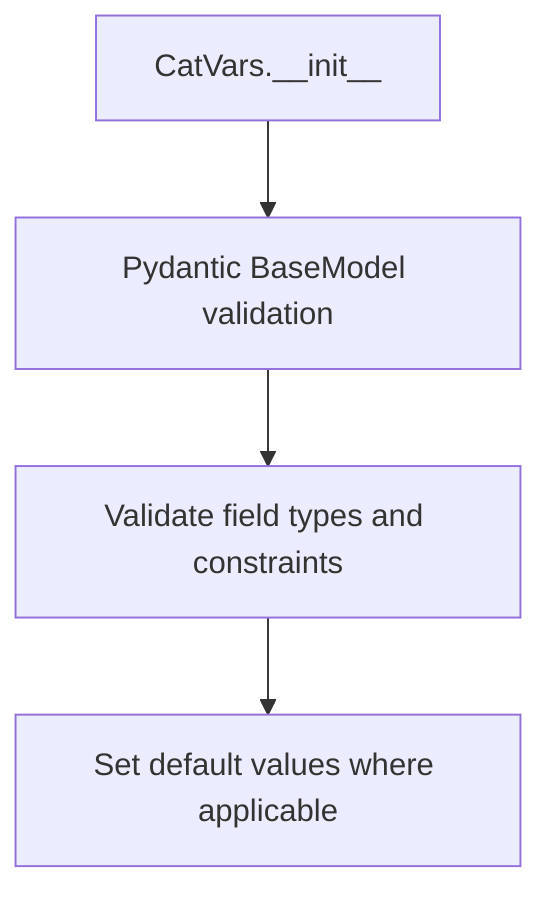

## Raises:
- ValidationError: Raised by Pydantic BaseModel when invalid values are provided during instantiation

## Example:
```python
# Create default configuration
config = CatVars()

# Create custom configuration
custom_config = CatVars(
    cardinality_threshold=100,
    chi_squared_threshold=0.95,
    redact=True
)

# Access configuration values
print(config.length)  # True
print(custom_config.cardinality_threshold)  # 100
```

## `src.ydata_profiling.config.BoolVars` · *class*

## Summary:
Configuration class for boolean-related settings and string-to-boolean mappings used in data profiling.

## Description:
BoolVars is a Pydantic BaseModel subclass that provides configuration settings for boolean handling within the ydata profiling library. It defines default values for observation counts, imbalance thresholds, and common string representations of boolean values that are used throughout the profiling process.

This class serves as a centralized configuration point for boolean-related parameters, ensuring consistent handling of boolean values across different components of the profiling system.

## State:
- n_obs: int = 3
  - Type: integer
  - Valid range: positive integers
  - Purpose: Number of observations to consider for certain boolean evaluations
- imbalance_threshold: float = 0.5
  - Type: floating-point number
  - Valid range: 0.0 to 1.0
  - Purpose: Threshold for determining data imbalance in boolean distributions
- mappings: Dict[str, bool]
  - Type: dictionary mapping strings to boolean values
  - Valid keys: "t", "f", "yes", "no", "y", "n", "true", "false"
  - Valid values: True or False
  - Purpose: Standard string representations for boolean conversion

## Lifecycle:
- Creation: Instantiated automatically by Pydantic when needed, typically as part of a larger configuration object
- Usage: Fields are accessed directly for configuration values; no explicit method calls required
- Destruction: Managed by Python's garbage collection; no special cleanup required

## Method Map:
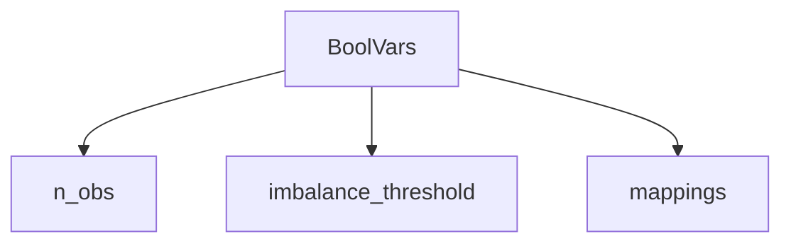

## Raises:
- No explicit exceptions raised by __init__ as it uses Pydantic's built-in validation
- Validation errors may occur if invalid values are provided during instantiation (handled by Pydantic)

## Example:
```python
# Default instantiation
config = BoolVars()

# Accessing configuration values
print(config.n_obs)  # Output: 3
print(config.imbalance_threshold)  # Output: 0.5
print(config.mappings["true"])  # Output: True

# Using custom values (though typically not done directly)
custom_config = BoolVars(n_obs=5, imbalance_threshold=0.7)
```

## `src.ydata_profiling.config.FileVars` · *class*

## Summary:
Represents file configuration variables with an active flag for enabling/disabling file processing.

## Description:
The FileVars class is a Pydantic BaseModel designed to manage configuration settings related to file processing capabilities. It provides a structured way to represent whether file operations should be active or inactive, with a default state of inactive (False). This class serves as a configuration container that can be used throughout the profiling system to control file-related functionality.

## State:
- active: bool
  - Type: boolean
  - Default value: False
  - Valid values: True or False
  - Purpose: Controls whether file processing operations are enabled

## Lifecycle:
- Creation: Instantiate with optional 'active' parameter (defaults to False)
- Usage: Access the 'active' attribute to check if file operations should be enabled
- Destruction: Managed automatically by Python's garbage collection

## Method Map:
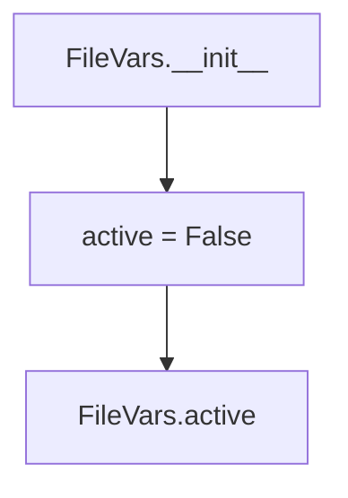

## Raises:
- No exceptions are raised by the constructor since it uses Pydantic's built-in validation
- Any validation errors would be raised by Pydantic's BaseModel validation mechanism

## Example:
```python
# Create a new FileVars instance with default settings
file_config = FileVars()

# Check if file operations are active
if file_config.active:
    # Perform file processing
    pass

# Create a FileVars instance with active set to True
file_config_active = FileVars(active=True)
```

## `src.ydata_profiling.config.PathVars` · *class*

## Summary:
Configuration class for managing path-related variables in the profiling system.

## Description:
The PathVars class represents a configuration model that manages path-related settings, specifically controlling whether path-related functionality is active. It serves as a structured way to store and validate path configuration parameters within the ydata-profiling framework.

This class is typically instantiated as part of larger configuration objects and is used to enable or disable path-specific features during data profiling operations.

## State:
- active: bool
  - Type: boolean
  - Default value: False
  - Valid values: True or False
  - Purpose: Controls whether path-related functionality is enabled
  - Invariant: This is a simple configuration flag with no complex invariants

## Lifecycle:
- Creation: Instantiate with optional 'active' parameter (defaults to False)
- Usage: Typically accessed as part of a larger configuration object during profiling operations
- Destruction: Managed automatically by Python's garbage collection

## Method Map:
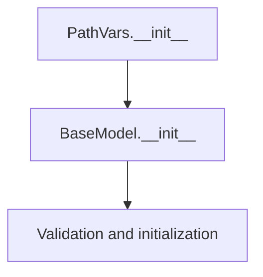

## Raises:
- No explicit exceptions raised by __init__
- Validation errors may occur during instantiation if invalid values are provided (inherited from BaseModel)

## Example:
```python
# Create a PathVars instance with default settings
path_config = PathVars()

# Create a PathVars instance with active set to True
path_config = PathVars(active=True)

# Access the active flag
print(path_config.active)  # Output: True
```

## `src.ydata_profiling.config.ImageVars` · *class*

## Summary:
Represents configuration settings for image variable processing in data profiling.

## Description:
The ImageVars class defines a configuration model for controlling various aspects of image data handling during profiling. It specifies whether image processing is active, whether EXIF metadata should be extracted, and whether image hashing should be performed. This class is used to configure image-related operations in the profiling pipeline.

## State:
- active: bool, default=False - Controls whether image processing is enabled
- exif: bool, default=True - Determines if EXIF metadata extraction is performed
- hash: bool, default=True - Specifies whether image hashing should be computed

All fields are boolean flags with no additional constraints or valid ranges beyond their type.

## Lifecycle:
- Creation: Instantiate with optional keyword arguments for any field values
- Usage: Access field values directly as attributes
- Destruction: Managed automatically by Python's garbage collection

## Method Map:
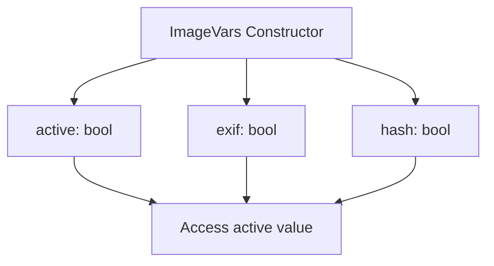

## Raises:
No exceptions are raised during initialization as all fields have default values and are simple boolean types.

## Example:
```python
# Create with default values
config = ImageVars()

# Create with custom values
config = ImageVars(active=True, exif=False, hash=True)

# Access values
print(config.active)  # False
print(config.exif)    # True
print(config.hash)    # True
```

## `src.ydata_profiling.config.UrlVars` · *class*

## Summary:
Configuration class for URL-related variables, specifically controlling whether URL processing is active.

## Description:
The UrlVars class is a Pydantic-based configuration model that manages URL processing settings. It provides a structured way to define and validate URL-related configuration parameters, currently with a single boolean flag to control URL activity. This class is designed to be part of a larger configuration system for profiling tools.

## State:
- active: bool - Controls whether URL processing is enabled. Defaults to False.
  - Valid values: True or False
  - Invariant: This is a simple boolean flag with no complex constraints

## Lifecycle:
- Creation: Instantiate with optional active parameter (defaults to False)
- Usage: Typically accessed as part of a configuration object to control URL processing behavior
- Destruction: Managed automatically by Python's garbage collection

## Method Map:
```mermaid
graph TD
    A[UrlVars.__init__] --> B[BaseModel.__init__]
    B --> C[Field validation]
    C --> D[active = False (default)]
```

## Raises:
- ValidationError: May be raised during instantiation if invalid values are provided for fields (though this is unlikely for a simple boolean field)

## Example:
```python
# Create instance with default settings
url_config = UrlVars()

# Create instance with explicit setting
url_config = UrlVars(active=True)

# Access the configuration
if url_config.active:
    # Process URLs
    pass
```

## `src.ydata_profiling.config.TimeseriesVars` · *class*

## Summary:
Configures settings for time series analysis operations within the profiling framework.

## Description:
The TimeseriesVars class encapsulates configuration parameters for time series data analysis. It is used to define how time series features should be processed, including activation flags, sorting criteria, correlation thresholds, and analysis parameters. This class is typically instantiated by the profiling system when time series analysis is enabled, and serves as a centralized configuration object for time series-specific computations.

## State:
- active: bool, default=False - Flag indicating whether time series analysis is enabled
- sortby: Optional[str], default=None - Column name to sort time series data by, or None for default sorting
- autocorrelation: float, default=0.7 - Threshold for autocorrelation analysis (typically between 0 and 1)
- lags: List[int], default=[1, 7, 12, 24, 30] - Time lags to examine for autocorrelation and partial autocorrelation analysis
- significance: float, default=0.05 - Statistical significance threshold for hypothesis testing (typically between 0 and 1)
- pacf_acf_lag: int, default=100 - Maximum lag to consider for partial autocorrelation and autocorrelation functions

## Lifecycle:
- Creation: Instances are created automatically by the profiling system when time series analysis is configured, or manually by passing keyword arguments to the constructor
- Usage: The instance is passed to time series analysis functions as a configuration object, where its attributes control various analytical parameters
- Destruction: No special cleanup required; standard Python garbage collection handles destruction

## Method Map:
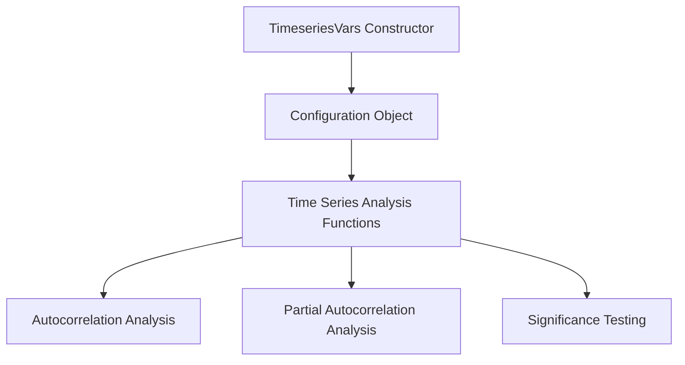

## Raises:
- No explicit exceptions are raised by the constructor itself, though Pydantic validation may raise ValueError or TypeError if invalid values are provided during instantiation

## Example:
```python
# Create a timeseries configuration with custom parameters
config = TimeseriesVars(
    active=True,
    sortby="timestamp",
    autocorrelation=0.8,
    lags=[1, 3, 7, 14],
    significance=0.01
)

# Use the configuration in time series analysis
# (Typical usage would be passed to analysis functions)
```

## `src.ydata_profiling.config.Univariate` · *class*

## Summary:
Configuration class for univariate analysis settings grouped by variable types.

## Description:
The Univariate class serves as a centralized configuration container that aggregates settings for analyzing different variable types in data profiling. It provides a structured way to define analysis parameters for numerical, textual, categorical, image, boolean, path, file, URL, and time series variables. This class is typically instantiated by the profiling system to configure analysis behavior for different data types.

## State:
- num: NumVars - Configuration for numerical variable analysis with quantiles, skewness thresholds, and categorical thresholds
- text: TextVars - Configuration for text variable analysis with length, word, and character analysis options
- cat: CatVars - Configuration for categorical variable analysis with cardinality, imbalance, and chi-squared thresholds
- image: ImageVars - Configuration for image variable analysis with active flag and metadata extraction options
- bool: BoolVars - Configuration for boolean variable analysis with observation count and mapping definitions
- path: PathVars - Configuration for path variable analysis with active flag
- file: FileVars - Configuration for file variable analysis with active flag
- url: UrlVars - Configuration for URL variable analysis with active flag
- timeseries: TimeseriesVars - Configuration for time series variable analysis with sorting, autocorrelation, and lag parameters

All attributes are initialized with default values defined in their respective classes, making this a complete configuration object ready for use.

## Lifecycle:
- Creation: Instantiated automatically by the profiling system or manually with default values
- Usage: Used as a configuration object passed to analysis functions and components
- Destruction: Managed by Python's garbage collection; no explicit cleanup required

## Method Map:
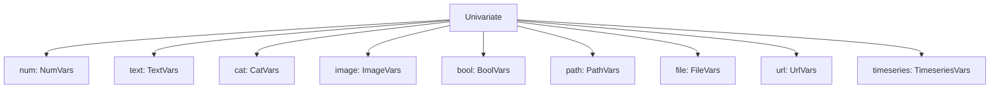

## Raises:
- No explicit exceptions raised during initialization
- Validation errors may occur if Pydantic validation fails on any nested configuration objects

## Example:
```python
# Create a default univariate configuration
config = Univariate()

# Access specific variable type configurations
num_config = config.num
text_config = config.text
cat_config = config.cat

# Modify settings for specific variable types
config.num.skewness_threshold = 10
config.text.redact = True
```

## `src.ydata_profiling.config.MissingPlot` · *class*

## Summary:
Configuration class for missing data plot settings in ydata-profiling.

## Description:
The MissingPlot class defines configuration parameters for visualizing missing data patterns in datasets. It is designed to be used as part of a larger configuration system within the ydata-profiling library to control how missing data is displayed in visual reports.

## State:
- force_labels: bool, default=True
  - Controls whether axis labels should be forced to appear on missing data plots
  - Valid values: True or False
- cmap: str, default="RdBu"
  - Specifies the colormap to use for missing data visualization
  - Valid values: String representing a matplotlib colormap name
  - Invariant: Must be a valid matplotlib colormap identifier

## Lifecycle:
- Creation: Instantiate directly with optional keyword arguments for force_labels and cmap
- Usage: Typically accessed as part of a larger configuration object
- Destruction: Managed automatically by Python's garbage collection

## Method Map:
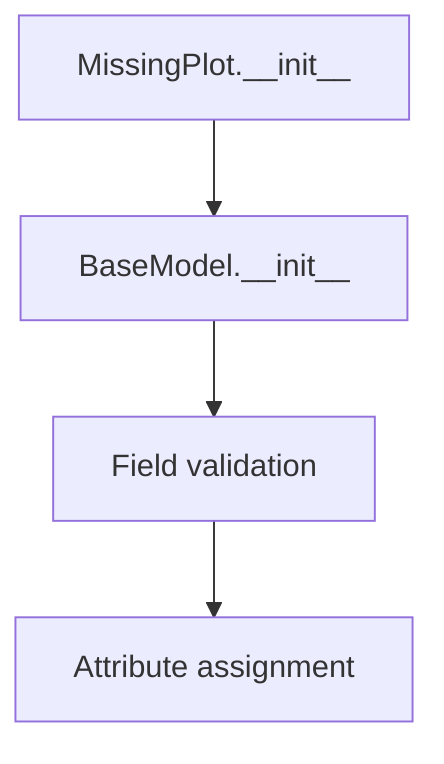

## Raises:
- ValidationError: May be raised during instantiation if provided values don't conform to field definitions (though unlikely with the simple types used here)

## Example:
```python
from src.ydata_profiling.config import MissingPlot

# Create with default settings
missing_config = MissingPlot()

# Create with custom settings
custom_config = MissingPlot(force_labels=False, cmap="viridis")

# Access configuration values
print(missing_config.force_labels)  # True
print(missing_config.cmap)          # "RdBu"
```

## `src.ydata_profiling.config.ImageType` · *class*

## Summary:
Represents supported image formats for profile reports in the ydata-profiling library.

## Description:
ImageType is an enumeration that defines the supported image formats for generating visualizations in profiling reports. It provides a type-safe way to specify whether SVG or PNG images should be generated for visual elements in the profiling output. This enum is used throughout the configuration system to control report visualization output formats.

## State:
- svg: Enum member representing Scalable Vector Graphics format (value: "svg")
- png: Enum member representing Portable Network Graphics format (value: "png")

The enum values are string representations of the image formats, making them suitable for serialization and configuration purposes.

## Lifecycle:
- Creation: Instantiated automatically when referenced; no explicit construction required
- Usage: Used as a type hint or direct reference in configuration objects
- Destruction: Managed automatically by Python's garbage collection

## Method Map:
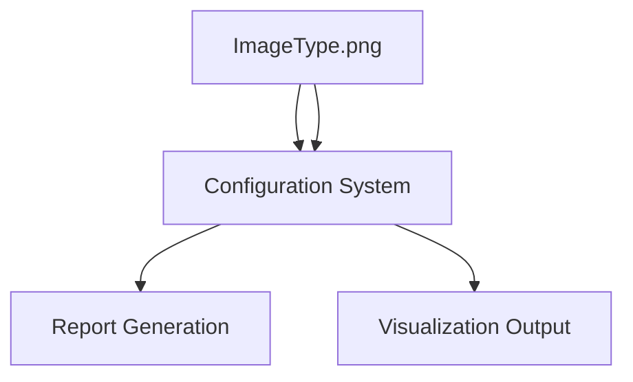

## Raises:
No exceptions are raised during instantiation as this is a simple enum definition.

## Example:
```python
from src.ydata_profiling.config import ImageType

# Using the enum values
image_format = ImageType.svg  # or ImageType.png
config = {
    "image_format": image_format,
    "output_format": "html"
}

# Enum values can be compared and used in conditional logic
if image_format == ImageType.svg:
    print("Generating SVG images")
elif image_format == ImageType.png:
    print("Generating PNG images")
```

## `src.ydata_profiling.config.CorrelationPlot` · *class*

## Summary:
Configuration class for correlation plot visualization settings.

## Description:
The CorrelationPlot class defines configuration parameters for rendering correlation heatmaps. It specifies color mapping and handling of invalid data values in correlation visualizations. This class is typically used as part of a larger configuration object to customize the appearance of correlation plots in data profiling tools.

## State:
- cmap: str, default="RdBu"
  - Color map name for the correlation heatmap
  - Valid values depend on matplotlib color maps
  - Represents the color scheme used to visualize correlation coefficients
- bad: str, default="#000000"
  - Color code for invalid/missing data points
  - Should be a valid hex color code
  - Represents how to display NaN or invalid correlation values

## Lifecycle:
- Creation: Instantiate with optional cmap and bad parameters
- Usage: Used as a configuration object to pass visualization settings
- Destruction: Managed automatically by Python's garbage collection

## Method Map:
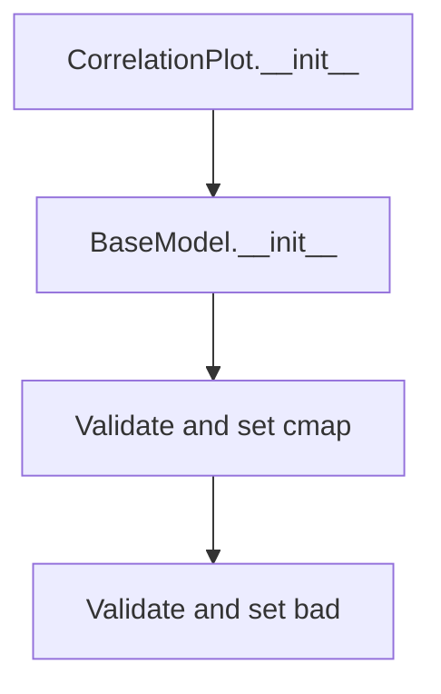

## Raises:
- ValidationError: If provided values don't conform to Pydantic validation rules (though unlikely with simple string defaults)

## Example:
```python
# Create default configuration
config = CorrelationPlot()

# Create custom configuration
custom_config = CorrelationPlot(cmap="viridis", bad="#FF0000")

# Access configuration values
print(config.cmap)  # Output: "RdBu"
print(config.bad)   # Output: "#000000"
```

## `src.ydata_profiling.config.Histogram` · *class*

## Summary:
Configuration class for histogram visualization settings.

## Description:
The Histogram class defines a set of configuration parameters used to control the appearance and behavior of histogram visualizations. This class is designed to be used as a configuration object that can be passed to histogram generation functions or methods. It provides sensible defaults for common histogram parameters while allowing customization.

## State:
- bins: int, default value 50, controls the number of bins in the histogram
- max_bins: int, default value 250, sets the maximum allowed bins for the histogram
- x_axis_labels: bool, default value True, determines whether x-axis labels are displayed
- density: bool, default value False, controls whether the histogram is normalized

All fields are simple configuration parameters with no complex invariants or constraints beyond their basic type requirements.

## Lifecycle:
- Creation: Instantiate with optional keyword arguments to override defaults
- Usage: Access field values directly as attributes
- Destruction: Managed automatically by Python's garbage collection

## Method Map:
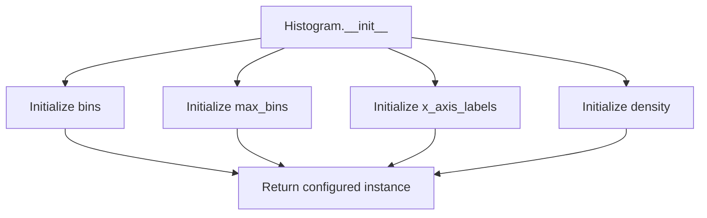

## Raises:
No exceptions are raised during initialization as this is a simple Pydantic model with default values for all fields.

## Example:
```python
# Create default histogram configuration
hist_config = Histogram()

# Create custom histogram configuration
custom_hist = Histogram(bins=100, max_bins=500, density=True)

# Access configuration values
print(hist_config.bins)  # Output: 50
print(custom_hist.density)  # Output: True
```

## `src.ydata_profiling.config.CatFrequencyPlot` · *class*

## Summary:
Configures display settings for categorical frequency plots in data profiling reports.

## Description:
The CatFrequencyPlot class defines configuration parameters for rendering category frequency visualizations. It controls whether plots are displayed, what type of plot to render, the maximum number of unique categories to show, and optional color customization. This configuration is used by data profiling tools to customize categorical data visualization output.

## State:
- show: bool, default=True - Controls whether the category frequency plot is displayed. When False, the plot is disabled.
- type: str, default="bar" - Specifies the plot type. Valid values are "bar" or "pie".
- max_unique: int, default=10 - Maximum number of unique categories to display in the plot.
- colors: Optional[List[str]], default=None - Optional list of color codes to use for plot elements. When None, default colors are used.

## Lifecycle:
- Creation: Instantiate with keyword arguments to set desired configuration values
- Usage: Pass instance to data profiling functions that support categorical visualization
- Destruction: No special cleanup required; standard Python garbage collection applies

## Method Map:
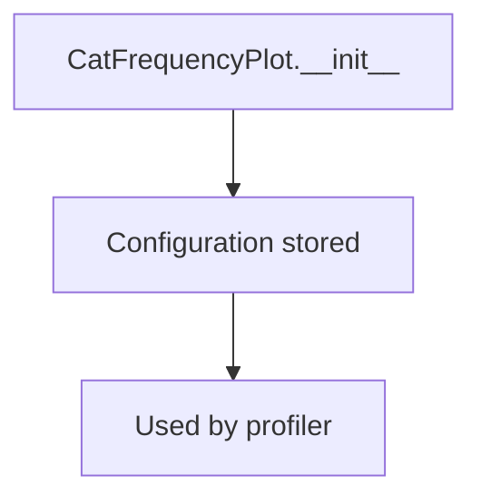

## Raises:
- ValidationError: Raised by Pydantic if invalid values are provided for any field (e.g., invalid type for max_unique, unsupported plot type)

## Example:
```python
# Create default configuration
config = CatFrequencyPlot()

# Customize configuration
custom_config = CatFrequencyPlot(
    show=True,
    type="pie",
    max_unique=15,
    colors=["#FF0000", "#00FF00", "#0000FF"]
)

# Disable plot
disabled_config = CatFrequencyPlot(show=False)
```

## `src.ydata_profiling.config.Plot` · *class*

## Summary:
Configuration class for plot-related settings in the ydata-profiling library.

## Description:
The Plot class encapsulates all configurable parameters related to visualization generation within the ydata-profiling library. It serves as a centralized configuration object that controls various aspects of plot rendering including missing data visualization, correlation plots, histograms, and categorical frequency displays. This class is typically instantiated by the profiling configuration system and used internally by the reporting components to ensure consistent visualization settings throughout the profiling process.

## State:
- missing: MissingPlot instance, default value is MissingPlot() with force_labels=True and cmap="RdBu"
- image_format: ImageType enum value, default value is ImageType.svg (SVG format)
- correlation: CorrelationPlot instance, default value is CorrelationPlot() with cmap="RdBu" and bad="#000000"
- dpi: int value, default value is 800 (PNG resolution setting)
- histogram: Histogram instance, default value is Histogram() with bins=50, max_bins=250, x_axis_labels=True, and density=False
- scatter_threshold: int value, default value is 1000 (maximum number of points for scatter plots)
- cat_freq: CatFrequencyPlot instance, default value is CatFrequencyPlot() with show=True, type="bar", max_unique=10, and colors=None

## Lifecycle:
- Creation: Instantiated automatically by the profiling configuration system; typically created through the main Config class
- Usage: Used internally by visualization components to retrieve plot configuration settings
- Destruction: Managed by Python's garbage collection; no explicit cleanup required

## Method Map:
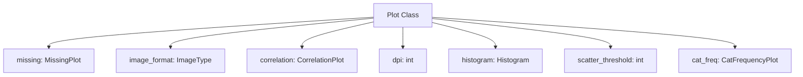

## Raises:
- No explicit exceptions raised during initialization
- Validation errors may occur if invalid values are provided for Pydantic fields (inherited from BaseModel)

## Example:
```python
# Typical usage would be through the main configuration
from ydata_profiling.config import Plot

# Create a plot configuration with default settings
plot_config = Plot()

# Access individual plot settings
print(plot_config.image_format)  # Output: ImageType.svg
print(plot_config.dpi)           # Output: 800
print(plot_config.scatter_threshold)  # Output: 1000

# Modify specific settings
plot_config.image_format = ImageType.png
plot_config.dpi = 300
```

## `src.ydata_profiling.config.Theme` · *class*

## Summary:
Defines a set of available themes for report styling in the profiling configuration.

## Description:
The Theme enum provides a standardized collection of CSS themes that can be applied to generated profiling reports. This abstraction ensures consistent theme selection across the application and prevents invalid theme values from being used. It is typically used in configuration objects where report styling needs to be customized.

## State:
- united (str): The "united" theme identifier
- flatly (str): The "flatly" theme identifier  
- cosmo (str): The "cosmo" theme identifier
- simplex (str): The "simplex" theme identifier

All values are string constants representing CSS theme names that correspond to Bootstrap-based themes.

## Lifecycle:
- Creation: Instantiated automatically when imported; no explicit instantiation required
- Usage: Used as an enumeration member in configuration objects
- Destruction: Managed by Python's garbage collector

## Method Map:
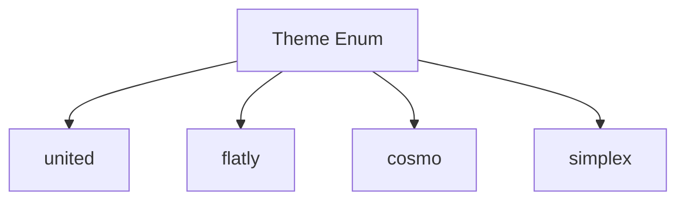

## Raises:
None - This is a simple Enum class with no constructor or methods that raise exceptions.

## Example:
```python
from src.ydata_profiling.config import Theme

# Using the theme in configuration
theme = Theme.united
print(theme.value)  # Output: "united"

# Iterating through available themes
for theme in Theme:
    print(theme.value)
```

## `src.ydata_profiling.config.Style` · *class*

## Summary:
Configuration class for styling report elements including color schemes, themes, and logos.

## Description:
The Style class serves as a configuration container for visual styling parameters used in report generation. It encapsulates color palettes, themes, and branding elements that define the visual appearance of generated reports. This class is typically instantiated as part of the configuration system and provides access to styling parameters through its attributes and properties.

## State:
- primary_colors: List[str], default=["#377eb8", "#e41a1c", "#4daf4a"]
  - Valid values: List of hex color codes
  - Invariant: Must contain at least one color for the primary_color property to work
- logo: str, default=""
  - Valid values: String representing logo path or URL
  - Invariant: Empty string by default, can be set to any string
- theme: Optional[Theme], default=None
  - Valid values: None or one of the Theme enum values (united, flatly, cosmo, simplex)
  - Invariant: When set, must be a valid Theme enum value
- _labels: List[str], private attribute, default=["_"]
  - Valid values: List of strings
  - Invariant: Private attribute managed internally

## Lifecycle:
- Creation: Instantiate directly with optional parameters or use default constructor
- Usage: Access properties and attributes to retrieve styling configuration values
- Destruction: Managed automatically by Python garbage collection

## Method Map:
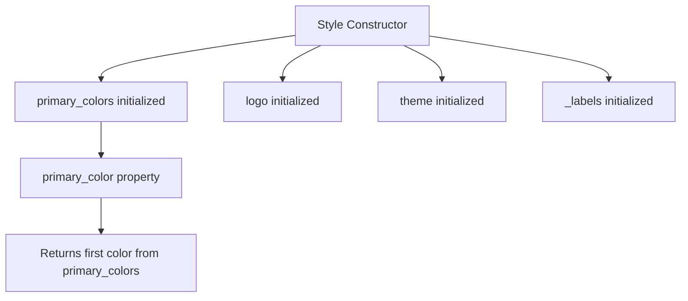

## Raises:
- No explicit exceptions raised during initialization
- Accessing primary_color property when primary_colors is empty would raise IndexError (inherited behavior from list access)

## Example:
```python
from src.ydata_profiling.config import Style, Theme

# Create default style
style = Style()

# Create style with custom settings
custom_style = Style(
    primary_colors=["#ff0000", "#00ff00", "#0000ff"],
    logo="path/to/logo.png",
    theme=Theme.flatly
)

# Access properties
print(style.primary_color)  # "#377eb8"
print(custom_style.logo)    # "path/to/logo.png"
print(custom_style.theme)   # Theme.flatly
```

### `src.ydata_profiling.config.Style.primary_color` · *method*

## Summary:
Returns the primary color from the style configuration's color palette.

## Description:
Provides convenient access to the first color in the primary color palette. This property is designed to simplify access to the main brand color while maintaining consistency with the configuration's color scheme.

## Args:
    None

## Returns:
    str: The first color in the primary_colors list, typically used as the main brand color.

## Raises:
    IndexError: If primary_colors list is empty (though this shouldn't occur due to default values).

## State Changes:
    Attributes READ: self.primary_colors
    Attributes WRITTEN: None

## Constraints:
    Preconditions: 
    - self.primary_colors must be a list-like object
    - self.primary_colors should contain at least one element (defaults to 3 colors)
    
    Postconditions:
    - Returns a string representing a color in hex format
    - The returned value is always the first element of primary_colors

## Side Effects:
    None

## `src.ydata_profiling.config.Html` · *class*

## Summary:
Configuration class for HTML report generation settings in ydata-profiling.

## Description:
The Html class defines configuration options for generating HTML reports. It controls various aspects of HTML output including styling, asset handling, and display properties. This class is typically used as part of a larger configuration object to customize the appearance and behavior of generated HTML reports.

## State:
- style: Style - Configuration for visual styling including colors, logo, and themes. Defaults to a new Style instance.
- navbar_show: bool - Whether to display the navigation bar in the HTML report. Defaults to True.
- minify_html: bool - Whether to minify the generated HTML output. Defaults to True.
- use_local_assets: bool - Whether to use local copies of assets instead of CDN references. Defaults to True.
- inline: bool - Whether to inline CSS and JavaScript in the HTML output. Defaults to True.
- assets_prefix: Optional[str] - Prefix to add to asset paths. Defaults to None.
- assets_path: Optional[str] - Custom path for assets. Defaults to None.
- full_width: bool - Whether to render the report in full width mode. Defaults to False.

## Lifecycle:
- Creation: Instantiate with optional parameters to configure HTML report generation
- Usage: Used as part of a configuration object to control HTML report rendering
- Destruction: No special cleanup required as it's a simple data container

## Method Map:
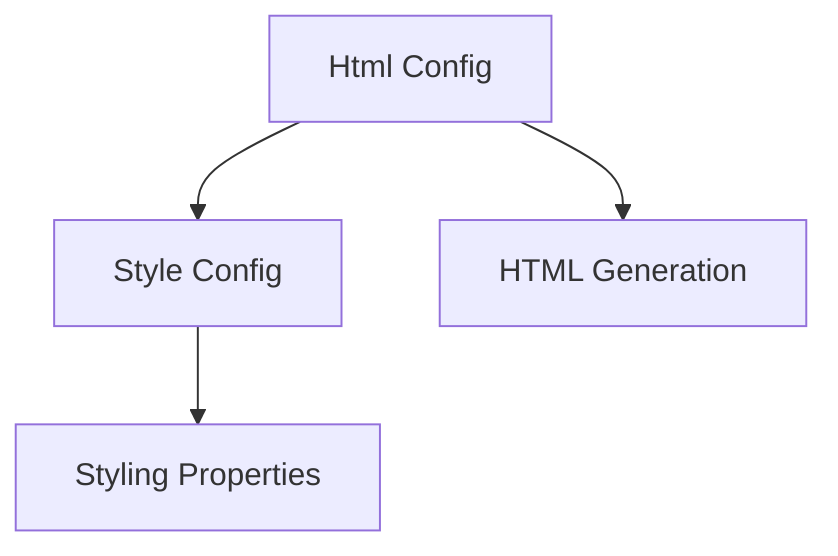

## Raises:
- No explicit exceptions raised during initialization
- Validation errors may occur if invalid values are provided to Pydantic fields

## Example:
```python
from src.ydata_profiling.config import Html, Style

# Create HTML configuration with custom settings
html_config = Html(
    navbar_show=False,
    minify_html=False,
    style=Style(theme="flatly", primary_colors=["#ff0000", "#00ff00"])
)

# Use in report generation
# report = ProfileReport(df, config={"html": html_config})
```

## `src.ydata_profiling.config.Duplicates` · *class*

## Summary:
Configuration class for managing duplicate value detection settings in data profiling.

## Description:
The Duplicates class defines configuration parameters for handling duplicate values during data profiling operations. It specifies how many duplicate entries to display and what key to use for identifying duplicates in the profiling results.

## State:
- head: int, default value 10
  - Represents the number of duplicate entries to display in reports
  - Valid range: positive integers
  - Invariant: must be a non-negative integer
- key: str, default value "# duplicates"
  - The identifier key used to label duplicate count information in profiling output
  - Valid values: any string value
  - Invariant: must be a string type

## Lifecycle:
- Creation: Instantiate with optional head and key parameters
- Usage: Used as a configuration object passed to profiling functions
- Destruction: Managed automatically by Python's garbage collection

## Method Map:
```mermaid
graph TD
    A[Duplicates.__init__] --> B[Duplicates]
    B --> C[Duplicates.dict()]
    B --> D[Duplicates.json()]
```

## Raises:
- No explicit exceptions raised during initialization
- Pydantic validation may raise ValueError for invalid field types

## Example:
```python
from src.ydata_profiling.config import Duplicates

# Create default configuration
config = Duplicates()

# Create custom configuration
custom_config = Duplicates(head=5, key="# dupes")

# Access configuration values
print(config.head)  # Output: 10
print(config.key)   # Output: "# duplicates"
```

## `src.ydata_profiling.config.Correlation` · *class*

## Summary:
Configuration settings for correlation analysis in data profiling.

## Description:
The Correlation class defines configurable parameters for computing and analyzing correlations between variables in a dataset. It is used to control various aspects of correlation calculations such as whether to compute correlations, warning thresholds, and binning parameters. This configuration is typically used in data profiling tools to customize correlation analysis behavior.

## State:
- key: str - Identifier for the correlation configuration, defaults to empty string
- calculate: bool - Flag indicating whether to perform correlation calculations, defaults to True
- warn_high_correlations: int - Number of high correlations to warn about, defaults to 10
- threshold: float - Minimum correlation coefficient threshold for considering correlations significant, defaults to 0.5
- n_bins: int - Number of bins to use when discretizing continuous variables for correlation analysis, defaults to 10

## Lifecycle:
Creation: Instantiate with optional keyword arguments for any of the fields. All fields have sensible defaults, so instantiation requires no arguments.
Usage: Typically used as part of a larger configuration object for data profiling operations. Fields are accessed directly for configuration purposes.
Destruction: No special cleanup required as it's a simple data container.

## Method Map:
```mermaid
graph TD
    A[Correlation Config] --> B{Access Fields}
    B --> C[calculate]
    B --> D[key]
    B --> E[warn_high_correlations]
    B --> F[threshold]
    B --> G[n_bins]
```

## Raises:
No explicit exceptions are raised during initialization as this is a Pydantic BaseModel with default values for all fields.

## Example:
```python
# Create correlation configuration with defaults
corr_config = Correlation()

# Create correlation configuration with custom settings
custom_corr = Correlation(
    key="my_correlation_analysis",
    calculate=True,
    warn_high_correlations=5,
    threshold=0.7,
    n_bins=20
)

# Access configuration values
print(corr_config.calculate)  # True
print(custom_corr.threshold)  # 0.7
```

## `src.ydata_profiling.config.Correlations` · *class*

## Summary:
Configuration container for correlation analysis settings in pandas profiling reports.

## Description:
The Correlations class defines the correlation computation settings used by the ydata-profiling library. It provides predefined configurations for different correlation methods (Pearson, Spearman, and automatic selection) that can be customized through the Settings class. This class is typically instantiated as part of the broader Settings configuration object.

## State:
- pearson: Correlation - Configuration for Pearson correlation analysis with key="pearson"
- spearman: Correlation - Configuration for Spearman correlation analysis with key="spearman"  
- auto: Correlation - Configuration for automatic correlation selection with key="auto"

All Correlation objects are initialized with default values and cannot be modified after instantiation through this class interface.

## Lifecycle:
- Creation: Automatically instantiated as part of Settings class initialization
- Usage: Accessed via Settings.correlations property to configure correlation analysis
- Destruction: Managed by Python garbage collection when parent Settings object is destroyed

## Method Map:
```mermaid
graph TD
    A[Settings] --> B[Correlations]
    B --> C[Correlation(pearson)]
    B --> D[Correlation(spearman)] 
    B --> E[Correlation(auto)]
```

## Raises:
- None explicitly raised by Correlations.__init__
- Correlation-specific validation errors may occur during correlation computation if invalid values are set

## Example:
```python
# Accessing correlation settings from Settings
from ydata_profiling.config import Settings

settings = Settings()
correlations_config = settings.correlations

# Access individual correlation configurations
pearson_config = correlations_config.pearson
spearman_config = correlations_config.spearman
auto_config = correlations_config.auto

# These configurations can be modified through the Settings object
settings.correlations.pearson.threshold = 0.7
```

## `src.ydata_profiling.config.Interactions` · *class*

## Summary:
Configuration module for ydata-profiling that manages all system settings and preferences.

## Description:
The config module provides centralized configuration management for the ydata-profiling system. It defines the core configuration classes that control various aspects of data profiling, visualization, and analysis behavior. This module enables flexible configuration through constructor arguments, environment variables, and configuration files.

## Design:
- Uses Pydantic's BaseModel and BaseSettings for robust configuration validation and parsing
- Separates concerns with dedicated configuration classes (Interactions, Settings)
- Supports hierarchical configuration where Settings contains Interactions
- Enables environment variable and file-based configuration loading through BaseSettings inheritance
- Provides sensible defaults for all configuration options

## Components:
- Interactions: Configuration class for variable interaction analysis settings
- Settings: Main configuration container aggregating all profiling settings

## Data Structures:
- Interactions: Simple configuration object with continuous flag and target variables
- Settings: Comprehensive configuration container with multiple sub-configurations and parameters

## Examples:
```python
from src.ydata_profiling.config import Settings, Interactions

# Create default configuration
config = Settings()

# Create custom configuration
custom_config = Settings(
    title="Custom Report",
    n_samples=500,
    dark_mode=True,
    interactions=Interactions(continuous=False)
)

# Access configuration values
print(config.title)  # "Profile Report"
print(config.interactions.continuous)  # True
```

## `src.ydata_profiling.config.Samples` · *class*

## Summary:
Configuration class for specifying sample data points to include in reports.

## Description:
The Samples class defines the number of head, tail, and random samples to display in profiling reports. It serves as a configuration object that controls how many sample rows are shown from the beginning, end, and randomly selected portions of a dataset.

## State:
- head: int = 10
  - Number of rows to show from the beginning of the dataset
  - Valid range: non-negative integers
  - Default value: 10
- tail: int = 10  
  - Number of rows to show from the end of the dataset
  - Valid range: non-negative integers
  - Default value: 10
- random: int = 0
  - Number of random rows to show from the dataset
  - Valid range: non-negative integers
  - Default value: 0

## Lifecycle:
- Creation: Instantiate with optional arguments for head, tail, and random values
- Usage: Access field values directly; typically used as part of a larger configuration object
- Destruction: Managed automatically by Python's garbage collection

## Method Map:
```mermaid
graph TD
    A[Samples.__init__] --> B[head=10]
    A --> C[tail=10]
    A --> D[random=0]
    B --> E[Samples Instance]
    C --> E
    D --> E
```

## Raises:
- No exceptions are raised during initialization as all fields have default values
- Pydantic validation may raise ValueError for invalid input types (though defaults prevent this)

## Example:
```python
# Create default samples configuration
samples = Samples()

# Create custom samples configuration
samples = Samples(head=5, tail=5, random=3)

# Access sample counts
print(samples.head)   # Output: 10
print(samples.tail)   # Output: 10
print(samples.random) # Output: 0
```

## `src.ydata_profiling.config.Variables` · *class*

## Summary:
Configuration class for variable descriptions in data profiling.

## Description:
The Variables class is a Pydantic BaseModel subclass that provides a structured container for variable descriptions and metadata. It is used internally within the ydata_profiling library to manage configuration related to dataset variables. The class inherits all standard Pydantic BaseModel behaviors including data validation, serialization, and deserialization.

## State:
- descriptions: dict
  - Type: dict
  - Default value: {}
  - Purpose: Stores variable descriptions or metadata as key-value pairs
  - Valid range: Any dictionary object, though typically contains string keys mapping to descriptive values

## Lifecycle:
- Creation: Instantiated with optional descriptions parameter or defaults to empty dict
- Usage: Direct access and modification of the descriptions attribute
- Destruction: Managed by Python's garbage collection

## Method Map:
```mermaid
graph TD
    A[Variables.__init__] --> B[BaseModel.__init__]
    B --> C[Initialize descriptions field with default {}]
    C --> D[Return configured instance]
```

## Raises:
- ValidationError: May be raised by Pydantic's validation system during initialization if validation fails (inherited behavior from BaseModel)
- No explicit exceptions defined in the class itself

## Example:
```python
# Create with default empty descriptions
config = Variables()

# Create with initial descriptions
config = Variables(descriptions={"age": "Age of participant"})

# Access descriptions
print(config.descriptions)  # {"age": "Age of participant"}

# Modify descriptions
config.descriptions["income"] = "Annual income"

# Access via attribute access (Pydantic feature)
print(config.descriptions["age"])  # "Age of participant"
```

## `src.ydata_profiling.config.IframeAttribute` · *class*

## Summary:
An enumeration representing valid iframe HTML attributes for embedding content.

## Description:
The IframeAttribute enum defines the allowed values for iframe attributes that can be used when generating embedded content in reports. This abstraction ensures type safety and provides a clear set of valid options for iframe configuration in the profiling report generation process.

This class is typically used by components responsible for generating HTML output or configuring iframe elements within the profiling report interface. It serves as a contract for valid iframe attribute names that can be safely used in HTML generation.

## State:
- src: str value representing the "src" iframe attribute
- srcdoc: str value representing the "srcdoc" iframe attribute

The enum values are immutable constants with fixed string representations. There are no instance variables or mutable state in this class.

## Lifecycle:
- Creation: Instantiated automatically when referenced by the enum values
- Usage: Used as a type-safe way to specify iframe attributes in configuration or HTML generation
- Destruction: Managed automatically by Python's garbage collection

## Method Map:
```mermaid
graph TD
    A[Configuration] --> B[IframeAttribute.src]
    A --> C[IframeAttribute.srcdoc]
    B --> D[HTML Generation]
    C --> D
```

## Raises:
This class does not raise exceptions during initialization as it's a simple enum definition.

## Example:
```python
from src.ydata_profiling.config import IframeAttribute

# Usage in configuration
iframe_attr = IframeAttribute.src
# or
iframe_attr = IframeAttribute.srcdoc

# These can be used to set iframe attributes in HTML generation
attribute_name = iframe_attr.value  # Returns "src" or "srcdoc"
```

## `src.ydata_profiling.config.Iframe` · *class*

## Summary:
Represents configuration settings for an HTML iframe element used in report generation.

## Description:
The Iframe class defines the visual and behavioral properties of an HTML iframe that is embedded in generated reports. It specifies dimensions and the attribute used to set the iframe content source. This class is typically instantiated by report generation components when configuring how embedded content should be displayed.

## State:
- height: str, default "800px" - The vertical dimension of the iframe
- width: str, default "100%" - The horizontal dimension of the iframe  
- attribute: IframeAttribute - The HTML attribute used to specify iframe content source, with valid values of "src" or "srcdoc"

## Lifecycle:
- Creation: Instantiate with optional height, width, and attribute parameters
- Usage: Used primarily as a configuration object passed to report generation components
- Destruction: Managed automatically by Python's garbage collection

## Method Map:
```mermaid
graph TD
    A[Iframe.__init__] --> B[Iframe validation]
    B --> C[Iframe instantiation complete]
```

## Raises:
- ValidationError: Raised by Pydantic base class when invalid values are provided for height, width, or attribute fields

## Example:
```python
from src.ydata_profiling.config import Iframe, IframeAttribute

# Create default iframe configuration
iframe_config = Iframe()

# Create custom iframe configuration
custom_iframe = Iframe(
    height="600px",
    width="80%",
    attribute=IframeAttribute.src
)
```

## `src.ydata_profiling.config.Notebook` · *class*

## Summary:
Represents configuration settings for notebook environment display options.

## Description:
The Notebook class encapsulates configuration parameters for rendering reports in notebook environments, specifically controlling iframe display properties. It serves as a configuration container that ensures consistent reporting behavior across different notebook platforms.

## State:
- iframe: Iframe
  - Type: Iframe
  - Default value: Iframe() (creates an iframe with height="800px", width="100%", attribute="srcdoc")
  - Valid values: Instance of Iframe class with height, width, and attribute properties

## Lifecycle:
- Creation: Instantiate with optional iframe parameter or use default Iframe()
- Usage: Typically accessed as part of a larger configuration object to control report rendering in notebooks
- Destruction: Managed by Pydantic's built-in cleanup mechanisms

## Method Map:
```mermaid
graph TD
    A[Notebook.__init__] --> B[Iframe()]
    B --> C[Iframe.height]
    B --> D[Iframe.width]
    B --> E[Iframe.attribute]
```

## Raises:
- None explicitly raised by __init__
- Pydantic validation errors may occur if invalid values are provided for Iframe attributes

## Example:
```python
# Create default notebook configuration
notebook_config = Notebook()

# Create with custom iframe settings
custom_iframe = Iframe(height="600px", width="90%")
notebook_config = Notebook(iframe=custom_iframe)
```

## `src.ydata_profiling.config.Report` · *class*

## Summary:
Configuration class for report generation settings, specifically controlling numerical precision.

## Description:
The Report class is a Pydantic BaseModel that defines configuration parameters for report generation. It serves as a structured way to manage report settings, particularly controlling the numerical precision used in output values. This class is typically instantiated by the profiling system to configure how numerical results are displayed in generated reports.

## State:
- precision: int = 8
  - Type: int
  - Valid range: Positive integers (typically 1-17 for standard floating-point precision)
  - Purpose: Controls the number of significant digits displayed in numerical report values
  - Invariant: Must be a positive integer value

## Lifecycle:
- Creation: Instantiate with optional precision parameter (defaults to 8)
- Usage: Used as a configuration object passed to report generation functions
- Destruction: Managed automatically by Python's garbage collection

## Method Map:
```mermaid
graph TD
    A[Report.__init__] --> B[BaseModel.__init__]
    B --> C[Validate precision field]
    C --> D[Store precision value]
```

## Raises:
- ValidationError: Raised by Pydantic if precision is not a valid integer type

## Example:
```python
# Create default report configuration
report_config = Report()

# Create report configuration with custom precision
report_config = Report(precision=10)

# Use in report generation context
# (Usage would depend on how this config is consumed by other components)
```

## `src.ydata_profiling.config.Settings` · *class*

## Summary:
Configuration settings class for pandas profiling that manages all aspects of report generation including dataset metadata, variable handling, visualization options, and analysis parameters.

## Description:
The Settings class serves as the central configuration manager for the ydata-profiling library. It aggregates various configuration objects that control different aspects of the profiling process such as dataset metadata, variable-specific settings, correlation analysis, plotting options, and report formatting. This class provides methods to programmatically update settings and load configurations from YAML files.

The class inherits from Pydantic's BaseSettings, which allows it to automatically load configuration from environment variables (prefixed with "profile_") and validate all configuration values.

## State:
- title: str - Report title, defaults to "Pandas Profiling Report"
- dataset: Dataset - Dataset metadata configuration
- variables: Variables - Variable-level configuration settings  
- infer_dtypes: bool - Whether to infer data types, defaults to True
- show_variable_description: bool - Whether to show variable descriptions, defaults to True
- pool_size: int - Number of worker processes for parallel processing, defaults to 0 (no parallelization)
- progress_bar: bool - Whether to display progress bars, defaults to True
- vars: Univariate - Univariate variable analysis configuration
- sort: Optional[str] - Sorting option for results, defaults to None
- missing_diagrams: Dict[str, bool] - Controls visibility of missing value diagrams (bar, matrix, heatmap), all enabled by default
- correlation_table: bool - Whether to include correlation table in report, defaults to True
- correlations: Dict[str, Correlation] - Configuration for different correlation methods (auto, spearman, pearson, phi_k, cramers, kendall)
- interactions: Interactions - Interaction analysis configuration
- categorical_maximum_correlation_distinct: int - Maximum distinct values for categorical correlation, defaults to 100
- memory_deep: bool - Whether to use deep memory optimization, defaults to False
- plot: Plot - Visualization and plotting configuration
- duplicates: Duplicates - Duplicate detection configuration
- samples: Samples - Sample data configuration
- reject_variables: bool - Whether to reject variables with issues, defaults to True
- n_obs_unique: int - Number of unique observations to display, defaults to 10
- n_freq_table_max: int - Maximum number of rows in frequency tables, defaults to 10
- n_extreme_obs: int - Number of extreme observations to show, defaults to 10
- report: Report - Report formatting and precision settings
- html: Html - HTML report generation settings
- notebook: Notebook - Jupyter notebook integration settings

## Lifecycle:
Creation: Instantiate with default values or load from file using `Settings.from_file()` method. Can also be created with custom parameters.
Usage: Typically instantiated once at the beginning of a profiling session and passed to profiling functions. The `update()` method allows runtime modification of settings.
Destruction: No explicit cleanup required; follows standard Python object lifecycle.

## Method Map:
```mermaid
graph TD
    A[Settings.__init__] --> B[Settings.from_file]
    A --> C[Settings.update]
    B --> D[Settings.parse_obj]
    C --> E[Settings.copy]
    E --> F[Settings.parse_obj]
```

## Raises:
- yaml.YAMLError: When parsing fails due to invalid YAML in config file
- pydantic.ValidationError: When loaded configuration contains invalid values that don't conform to expected types

## Example:
```python
# Create default settings
settings = Settings()

# Load settings from YAML file
settings = Settings.from_file("config.yaml")

# Update settings programmatically
settings.update({"title": "Custom Report Title", "pool_size": 4})

# Access nested configuration
print(settings.report.precision)  # 8
print(settings.plot.image_format)  # ImageType.svg
```

## `src.ydata_profiling.config.Config` · *class*

## Summary:
Configuration class with environment prefix setting for profiling parameters.

## Description:
The Config class is a minimal configuration container that sets an environment variable prefix for profiling configurations. It serves as a base class that likely extends Pydantic's BaseSettings functionality to enable environment variable-based configuration management.

## State:
- `env_prefix` (str): Environment variable prefix set to "profile_" for configuration variables

## Lifecycle:
- Creation: Instantiated as a configuration object
- Usage: Used to manage environment variable prefixes for configuration parameters
- Destruction: Managed automatically by Python's garbage collection

## Method Map:
```mermaid
graph TD
    A[Config Class] --> B[env_prefix]
```

## Raises:
- None explicitly defined in the provided code

## Example:
```python
# Create configuration instance
config = Config()

# Access the environment prefix
print(config.env_prefix)  # Output: "profile_"
```

### `src.ydata_profiling.config.Settings.update` · *method*

*No documentation generated.*

### `src.ydata_profiling.config.Settings.from_file` · *method*

## Summary:
Creates a Settings object by loading configuration from a YAML file.

## Description:
Loads configuration data from a YAML file and constructs a Settings object using Pydantic's parsing mechanism. This method provides a convenient way to initialize settings from external configuration files rather than programmatically.

## Args:
    config_file (Union[Path, str]): Path to the YAML configuration file. Can be a string or pathlib.Path object.

## Returns:
    Settings: A new Settings instance populated with data from the YAML file.

## Raises:
    FileNotFoundError: If the specified config_file does not exist.
    yaml.YAMLError: If the YAML file contains invalid syntax.
    ValidationError: If the loaded data does not conform to the Settings model structure.

## State Changes:
    Attributes READ: None
    Attributes WRITTEN: None (creates new instance)

## Constraints:
    Preconditions: 
    - The config_file must exist and be readable
    - The YAML file must contain valid YAML syntax
    - The data structure must match the Settings model schema
    
    Postconditions:
    - Returns a valid Settings instance
    - All fields in the returned Settings object are properly initialized according to the YAML data

## Side Effects:
    I/O: Reads from the filesystem at the specified config_file path

## `src.ydata_profiling.config.SparkSettings` · *class*

## Summary:
Configuration settings class for Spark data profiling with optimized defaults for distributed computing environments.

## Description:
SparkSettings is a specialized configuration class that extends the base Settings class to provide optimized defaults and configurations specifically tailored for Apache Spark data processing. This class overrides various default settings from the parent Settings class to ensure efficient profiling of large-scale datasets in distributed computing environments while maintaining compatibility with the standard profiling configuration interface.

The class is designed to be used when profiling data that resides in Spark DataFrames, providing sensible defaults that account for the distributed nature of Spark processing, such as reduced correlation calculations and specific sample configurations. It inherits all configuration options from Settings but modifies key parameters to optimize performance for Spark environments.

## State:
- vars: Univariate - Configuration for variable-specific settings, with low_categorical_threshold set to 0 (overriding parent default of 5)
- infer_dtypes: bool - Flag to enable/disable automatic dtype inference, defaults to False (overriding parent default of True)
- correlations: Dict[str, Correlation] - Dictionary mapping correlation method names to their configurations, with spearman and pearson enabled by default (overriding parent with all correlations disabled except auto)
- correlation_table: bool - Flag to enable/disable correlation table generation, defaults to True (same as parent)
- interactions: Interactions - Configuration for interaction analysis, with continuous set to False (overriding parent default of True)
- missing_diagrams: Dict[str, bool] - Dictionary controlling which missing value diagrams to display, all disabled by default (overriding parent with all enabled)
- samples: Samples - Configuration for sample data display, with tail and random set to 0 (overriding parent default of 10 each)

## Lifecycle:
- Creation: Instantiate directly or via Settings.from_file() method
- Usage: Typically used as a configuration object passed to profiling functions
- Destruction: No special cleanup required, uses standard Pydantic model lifecycle

## Method Map:
```mermaid
graph TD
    A[SparkSettings] --> B[Settings]
    B --> C[BaseSettings]
    C --> D[BaseModel]
```

## Raises:
- ValidationError: When invalid configuration values are provided during instantiation
- TypeError: When incompatible types are assigned to configuration fields

## Example:
```python
from src.ydata_profiling.config import SparkSettings

# Create SparkSettings instance with default values
spark_config = SparkSettings()

# Modify specific settings
spark_config.infer_dtypes = True
spark_config.vars.num.low_categorical_threshold = 5

# Use in profiling
# profile_report = ProfileReport(df, config=spark_config)
```

### `src.ydata_profiling.config.Config.get_arg_groups` · *method*

## Summary:
Retrieves shorthand argument mappings for a given configuration group key.

## Description:
This method retrieves the argument groups configuration associated with the specified key and processes it to extract shorthand argument mappings. It's used to resolve configuration groups into their corresponding shorthand representations.

## Args:
    key (str): The configuration group key used to lookup arguments in the arg_groups dictionary.

## Returns:
    dict: A dictionary containing the shorthand argument mappings for the specified configuration group.

## Raises:
    KeyError: When the specified key does not exist in Config.arg_groups.

## State Changes:
    Attributes READ: 
        - Config.arg_groups
        - Config._shorthands

## Constraints:
    Preconditions:
        - The key parameter must be a valid string that exists as a key in Config.arg_groups
        - Config.arg_groups must be initialized and populated with appropriate data
        - Config._shorthands must be initialized and populated with appropriate data

    Postconditions:
        - Returns a dictionary mapping shorthand arguments to their expanded forms
        - The returned dictionary contains only the shorthand arguments for the specified group

## Side Effects:
    None: This method performs no I/O operations or external service calls. It only operates on class-level attributes.

### `src.ydata_profiling.config.Config.shorthands` · *method*

## Summary:
Processes keyword arguments to replace None values with shorthand configurations from the Config class.

## Description:
This function handles configuration shorthand processing by checking if any keyword arguments are set to None and replacing them with predefined shorthand values from Config._shorthands. It's designed to support flexible configuration where users can specify None as a placeholder for common configuration patterns.

## Args:
    kwargs (dict): Dictionary of configuration parameters where some values may be None
    split (bool): Flag indicating whether to separate processed arguments from unprocessed ones. Defaults to True.

## Returns:
    Tuple[dict, dict]: When split=True, returns (processed_args, remaining_args) where processed_args contains replacements for None values and remaining_args contains the rest; when split=False, returns (processed_args, {}) where all kwargs are processed into processed_args.

## Raises:
    None explicitly raised

## State Changes:
    Attributes READ: Config._shorthands
    Attributes WRITTEN: None

## Constraints:
    Preconditions: 
    - kwargs must be a dictionary
    - Config._shorthands must be a dictionary-like object with keys that match potential kwargs keys
    Postconditions:
    - If split=True, returned dictionaries are disjoint (no overlapping keys)
    - If split=False, all kwargs are included in processed_args

## Side Effects:
    None

