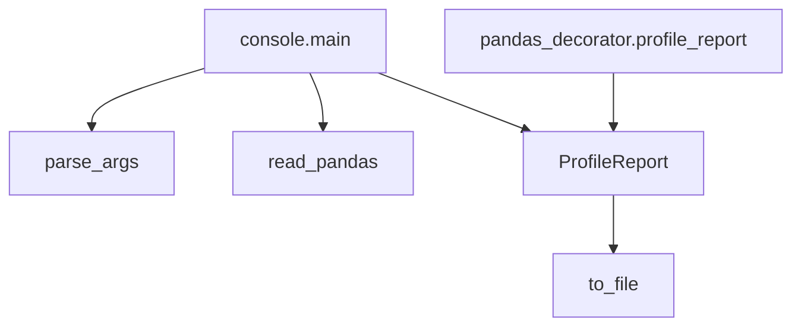

# `src.ydata_profiling.controller`

## Tree:
controller/
├── console.py
└── pandas_decorator.py

## Role:
Coordinates the command-line interface and pandas DataFrame processing for the profiling workflow

## Description:
The controller module serves as the entry point and coordination layer for the ydata-profiling system. It handles command-line argument parsing, file I/O operations, and orchestrates the creation and export of profiling reports. This module provides both CLI functionality and a decorator-based interface for programmatic profiling.

This module is grouped separately because it represents the presentation layer that bridges user interaction with the core profiling functionality, maintaining clean separation between the command-line interface and the underlying data analysis components.

## Components:
- **console.py**: Contains the main CLI entry point that generates statistical profiling reports from data files
  - `main(args: Optional[List[Any]] = None) -> None`: Main entry point for command-line execution that generates and saves profiling reports
  - `parse_args(args: Optional[List[Any]] = None) -> argparse.Namespace`: Parses command-line arguments for profiling configuration

- **pandas_decorator.py**: Provides a decorator interface for profiling pandas DataFrames
  - `profile_report(df: DataFrame, **kwargs) -> ProfileReport`: Decorator function that creates a ProfileReport from a pandas DataFrame

## Public API:
- **main(args: Optional[List[Any]] = None) -> None**: Entry point for command-line profiling. Accepts optional command-line arguments and generates HTML or JSON reports from input files.
- **parse_args(args: Optional[List[Any]] = None) -> argparse.Namespace**: Parses command-line arguments into a namespace object for configuring the profiling process.
- **profile_report(df: DataFrame, **kwargs) -> ProfileReport**: Decorator function that wraps a pandas DataFrame in a ProfileReport for analysis.

## Dependencies:
- **Internal imports**:
  - `src.ydata_profiling.profile_report.ProfileReport`: Core profiling class that performs the actual analysis
  - `src.ydata_profiling.utils.dataframe.read_pandas`: Utility for reading various file formats into pandas DataFrames
  - `src.ydata_profiling.controller.pandas_decorator`: Provides decorator interface for profiling
  - `argparse`: Standard library for command-line argument parsing
  - `pathlib.Path`: Standard library for path manipulation
  - `tqdm`: Progress bar library for reporting operations
  - `warnings`: Standard library for issuing warnings

- **External imports**:
  - `pandas`: Core data analysis library
  - `numpy`: Numerical computing library
  - `yaml`: YAML parsing library for configuration files

## Constraints:
- The `main` function expects valid file paths and will raise exceptions for invalid inputs
- Command-line arguments must follow the defined schema; invalid arguments will cause parsing errors
- The `profile_report` decorator requires a pandas DataFrame as its first argument
- All file operations must have appropriate read/write permissions
- Thread safety is not guaranteed for concurrent use of the same ProfileReport instance
- The CLI interface requires proper terminal/console environment for output display

---

## Files

- [`console.py`](controller/console.md)
- [`pandas_decorator.py`](controller/pandas_decorator.md)

