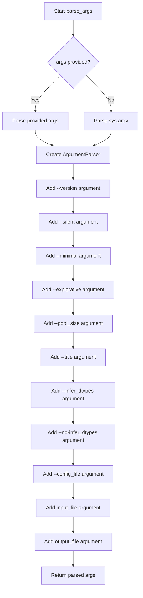

# `console.py`

## `src.ydata_profiling.controller.console.parse_args` · *function*

## Summary:
Parses command-line arguments for the ydata-profiling tool to configure report generation settings.

## Description:
This function creates and configures an argument parser for the profiling tool, defining all available command-line options and positional arguments. It handles various configuration parameters such as output behavior, profiling modes, performance settings, and file paths. The function is designed to be called from the main entry point of the console application to process user-provided command-line arguments.

## Args:
    args (Optional[List[Any]], optional): List of command-line arguments to parse. If None, uses sys.argv. Defaults to None.

## Returns:
    argparse.Namespace: Parsed arguments namespace containing all configured options and parameters with the following attributes:
        - silent (bool): Enable silent mode to only generate report without opening
        - minimal (bool): Enable minimal configuration for large datasets
        - explorative (bool): Enable explorative mode with unicode, file, and image analysis
        - pool_size (int): Number of CPU cores to use (default: 0)
        - title (str): Title for the report (default: "Pandas Profiling Report")
        - infer_dtypes (bool): Enable dtype inference (default: False)
        - config_file (str): Path to YAML configuration file (default: None)
        - input_file (str): CSV file (or other file type supported by pandas) to profile
        - output_file (str): Output report file path (optional, default: None)

## Raises:
    SystemExit: Raised by argparse when invalid arguments are provided, --help is used, or --version is used.

## Constraints:
    Preconditions:
        - The function expects valid command-line arguments or None to use default sys.argv
        - Input file must exist and be readable if provided
        - Output file path must be writable if specified
    
    Postconditions:
        - Returns a populated argparse.Namespace with all parsed arguments
        - All required arguments are validated by argparse
        - Default values are applied for unspecified optional arguments

## Side Effects:
    - May print help/version information to stdout/stderr
    - Exits the program with SystemExit when invalid arguments are provided
    - Reads input file if provided (but doesn't process its contents)

## Control Flow:


## Examples:
    # Basic usage with default arguments
    parsed_args = parse_args()
    
    # Usage with specific arguments
    parsed_args = parse_args(['--silent', '--minimal', 'input.csv', 'output.html'])
    
    # Usage with configuration file
    parsed_args = parse_args(['--config_file', 'my_config.yaml', 'data.csv'])
    
    # Usage with dtype inference disabled
    parsed_args = parse_args(['--no-infer_dtypes', 'input.csv'])
```

## `src.ydata_profiling.controller.console.main` · *function*

## Summary
Generates a statistical profiling report for a data file and saves it as HTML or JSON.

## Description
Serves as the primary command-line interface for generating data profiling reports. It processes command-line arguments to configure the profiling process, reads data from a specified input file, generates a comprehensive statistical report, and saves it to an output file. This function encapsulates the complete workflow from input parsing to report generation and persistence.

## Args
    args (Optional[List[Any]]): Command-line arguments to parse. If None, uses sys.argv.

## Returns
    None: This function does not return any value.

## Raises
    None explicitly raised, but may propagate exceptions from:
    - `read_pandas`: When the input file cannot be read or parsed
    - `ProfileReport.__init__`: When invalid configuration parameters are provided
    - `Path.write_text`: When the output file cannot be written
    - `webbrowser.open_new_tab`: When opening the browser fails (in non-silent mode)

## Constraints
    Preconditions:
    - Input file must exist and be readable
    - Input file must be in a format supported by pandas (CSV, Excel, JSON, etc.)
    - Output directory must be writable if specified
    
    Postconditions:
    - A profiling report file is created at the specified output location
    - The report contains statistical summaries and visualizations of the input data

## Side Effects
    - Reads from the filesystem (input file)
    - Writes to the filesystem (output report file)
    - May open a web browser tab (when not in silent mode)
    - May print progress information to stdout (via tqdm)

## Control Flow
```mermaid
flowchart TD
    A[Start main()] --> B[Parse command-line args]
    B --> C[Convert args to dict]
    C --> D[Extract input_file, output_file, silent]
    D --> E[Validate input_file exists]
    E --> F[Read data with read_pandas]
    F --> G[Create ProfileReport with kwargs]
    G --> H[Save report to output_file]
    H --> I[End]
```

## Examples
```python
# Basic usage with default output filename
main(["data.csv"])

# With explicit output file
main(["data.csv", "report.html"])

# Silent mode (no browser opening)
main(["--silent", "data.csv", "report.html"])

# Minimal configuration for large datasets
main(["--minimal", "large_data.csv"])
```

