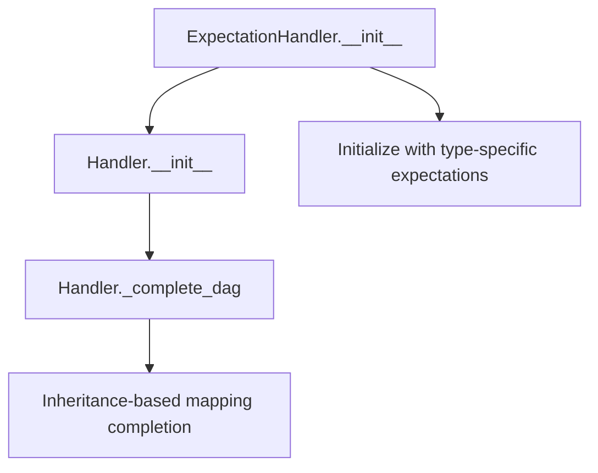
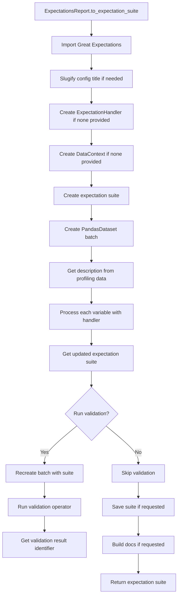

# `expectations_report.py`

## `src.ydata_profiling.expectations_report.ExpectationHandler` · *class*

## Summary:
Maps data types to expectation algorithms for automated data validation in profiling reports.

## Description:
The ExpectationHandler class extends the base Handler class to provide type-specific expectation algorithm mapping for data validation. It is responsible for associating different data types with appropriate expectation algorithms that can validate data characteristics. This class is used internally by the profiling system to generate automated data quality expectations for different column types.

The handler implements a mapping strategy where each data type is associated with one or more expectation algorithm modules. The mapping follows a hierarchical approach where child types inherit expectations from parent types through the type system's inheritance graph.

## State:
- mapping: dict[str, list[Callable]] - Maps data type names to lists of expectation algorithm functions. Keys include "Unsupported", "Text", "Categorical", "Boolean", "Numeric", "URL", "File", "Path", "DateTime", "Image". Each key maps to a list containing one or more expectation algorithm modules.
- typeset: VisionsTypeset - The typeset object that defines the data type hierarchy and relationships, used for completing the type mapping DAG.

## Lifecycle:
- Creation: Instantiated with a VisionsTypeset object; the parent Handler.__init__ method processes the mapping and completes type relationships through _complete_dag()
- Usage: Called internally by the profiling system to apply appropriate expectations based on column data types via the inherited handle() method
- Destruction: No special cleanup required; relies on Python's garbage collection

## Method Map:


## Raises:
- None explicitly raised in __init__
- Exceptions may be raised by parent Handler class methods if invalid arguments are passed during initialization

## Example:
```python
# Typical instantiation (done internally by profiling system)
from visions import VisionsTypeset
handler = ExpectationHandler(typeset)

# Usage occurs internally when processing data columns:
# result = handler.handle("Numeric", data_column, config)
# This would apply numeric-specific expectations to validate the data
```

### `src.ydata_profiling.expectations_report.ExpectationHandler.__init__` · *method*

## Summary:
Initializes an ExpectationHandler with type-specific expectation algorithm mappings and configures the handler's type mapping based on the provided typeset.

## Description:
This constructor sets up the expectation handler by creating a mapping between data types and their corresponding expectation algorithms, then delegates initialization to the parent Handler class. The mapping defines which expectation algorithms should be applied to different data type categories such as Text, Categorical, Numeric, DateTime, etc.

## Args:
    typeset (VisionsTypeset): A typeset object that defines the data type hierarchy and relationships
    *args: Additional positional arguments passed to the parent Handler constructor
    **kwargs: Additional keyword arguments passed to the parent Handler constructor

## Returns:
    None: This method initializes the instance and doesn't return a value

## Raises:
    None explicitly raised: The method relies on the parent Handler.__init__ which may raise exceptions if arguments are invalid

## State Changes:
    Attributes READ: None
    Attributes WRITTEN: 
    - self.mapping: Set to the type-to-algorithm mapping dictionary
    - self.typeset: Set to the provided typeset parameter

## Constraints:
    Preconditions:
    - typeset must be a valid VisionsTypeset instance
    - The typeset should define the expected data type categories that match the keys in the mapping
    
    Postconditions:
    - self.mapping contains the complete mapping from data types to expectation algorithms
    - self.typeset is properly assigned to the provided typeset instance
    - The handler is initialized with the appropriate expectation algorithm mappings

## Side Effects:
    None: This method performs no I/O operations or external service calls. It only initializes internal state.

## `src.ydata_profiling.expectations_report.ExpectationsReport` · *class*

## Summary:
The ExpectationsReport class generates Great Expectations validation suites from profiling data, enabling automated data quality validation based on statistical summaries.

## Description:
This class serves as a bridge between ydata-profiling's statistical analysis and Great Expectations validation framework. It allows users to automatically generate data validation expectations from profiling reports, making it easier to establish data quality standards. The class is designed to be inherited by ProfileReport, which provides the actual profiling data through the `get_description()` method.

The main motivation for this abstraction is to separate the concerns of data profiling from data validation generation, allowing for clean integration with Great Expectations while maintaining the profiling capabilities of ydata-profiling.

## State:
- `config`: Settings object containing configuration parameters for the profiling process
- `df`: Optional pandas DataFrame containing the data being profiled, defaults to None
- `typeset`: Property returning None (placeholder for future implementation)

## Lifecycle:
- Creation: Instantiated as part of ProfileReport, requiring a config and optional DataFrame
- Usage: Typically called via `to_expectation_suite()` method to generate Great Expectations suites
- Destruction: No explicit cleanup required; relies on Great Expectations context managers

## Method Map:


## Raises:
- ImportError: When Great Expectations is not installed, with message "Please install great expectations before using the expectation functionality"

## Example:
```python
# Assuming a ProfileReport instance exists
profile = ProfileReport(df)

# Generate expectation suite
suite = profile.to_expectation_suite(
    suite_name="my_data_suite",
    save_suite=True,
    run_validation=True,
    build_data_docs=True
)

# The suite can then be used for validation
```

### `src.ydata_profiling.expectations_report.ExpectationsReport.typeset` · *method*

## Summary:
Returns None as a placeholder for the Visions typeset property.

## Description:
This property is intended to return a Visions typeset that describes the data types present in the DataFrame. Currently, it returns None as a placeholder implementation. In a complete implementation, this would compute and return a VisionsTypeset object that defines the data types and their relationships for expectation generation.

The typeset property is used by the expectation generation system to determine appropriate validation rules for each column based on its inferred data type. Specifically, it's accessed in the `to_expectation_suite` method where it's passed to `ExpectationHandler`.

## Args:
    None

## Returns:
    Optional[VisionsTypeset]: Currently returns None, but should return a VisionsTypeset when properly implemented.

## Raises:
    None explicitly raised

## State Changes:
    Attributes READ: None
    Attributes WRITTEN: None

## Constraints:
    Preconditions: None
    Postconditions: Always returns None

## Side Effects:
    None

### `src.ydata_profiling.expectations_report.ExpectationsReport.to_expectation_suite` · *method*

## Summary:
Converts the profiling report into a Great Expectations expectation suite with validation and documentation generation.

## Description:
This method transforms the statistical profile of a dataset into a Great Expectations expectation suite. It creates expectations for each variable in the dataset based on the data types and statistical characteristics identified during profiling. The method can optionally run validation, save the suite to disk, and build data documentation.

## Args:
    suite_name (Optional[str]): Name for the expectation suite. Defaults to slugified title from config.
    data_context (Optional[Any]): Great Expectations data context. Creates a default DataContext if None.
    save_suite (bool): Whether to save the expectation suite to disk. Defaults to True.
    run_validation (bool): Whether to run validation on the dataset. Defaults to True.
    build_data_docs (bool): Whether to build and open data documentation. Defaults to True.
    handler (Optional[Handler]): Custom expectation handler. Creates default ExpectationHandler if None.

## Returns:
    Any: The created expectation suite object from Great Expectations.

## Raises:
    ImportError: When Great Expectations is not installed in the environment.

## State Changes:
    Attributes READ: self.config, self.typeset, self.df, self.get_description()
    Attributes WRITTEN: None (modifies external state via Great Expectations operations)

## Constraints:
    Preconditions: 
    - Great Expectations must be installed
    - self.df must be a valid pandas DataFrame
    - self.config.title must be a valid string
    - self.get_description() must return a valid BaseDescription object
    Postconditions:
    - An expectation suite is created with expectations for all variables
    - If run_validation is True, validation results are available
    - If save_suite is True, the suite is persisted to storage
    - If build_data_docs is True, documentation is built and opened

## Side Effects:
    - Creates and modifies Great Expectations DataContext
    - Saves expectation suite to persistent storage if save_suite=True
    - Runs validation on the dataset if run_validation=True
    - Builds and opens data documentation if build_data_docs=True
    - May open browser window to display documentation

