# `alerts.py`

## `src.ydata_profiling.model.alerts.fmt_percent` · *function*

## Summary:
Formats floating-point values as percentages with special handling for edge cases near 0% and 100%.

## Description:
Converts a decimal value to a percentage string representation, applying special formatting for values that are very close to 0% or 100% to prevent misleading precision. This function is used in data profiling reports to display percentage values in a human-readable format.

## Args:
    value (float): The decimal value to format as a percentage (should be between 0 and 1).
    edge_cases (bool): Whether to apply special edge case handling. When True, values that round to 0 (but are > 0) become "< 0.1%", and values that round to 1 (but are < 1) become "> 99.9%". Defaults to True.

## Returns:
    str: A formatted percentage string. Returns "< 0.1%" for values that round to 0 but are > 0, "> 99.9%" for values that round to 1 but are < 1, or standard formatted percentage (e.g., "50.0%") otherwise.

## Raises:
    None: This function does not raise any exceptions.

## Constraints:
    Preconditions:
    - The input value should be a float between 0 and 1 (inclusive)
    - The edge_cases parameter should be a boolean
    
    Postconditions:
    - The returned string will always be in the format of a percentage (with % suffix)
    - Special edge case strings "< 0.1%" and "> 99.9%" are returned only when edge_cases=True and the conditions are met

## Side Effects:
    None: This function has no side effects.

## Control Flow:
```mermaid
flowchart TD
    A[Start fmt_percent] --> B{edge_cases is True?}
    B -- No --> E[Return formatted percentage]
    B -- Yes --> C{round(value,3) == 0 AND value > 0?}
    C -- Yes --> D[Return "< 0.1%"]
    C -- No --> F{round(value,3) == 1 AND value < 1?}
    F -- Yes --> G[Return "> 99.9%"]
    F -- No --> E
    E --> H[Return formatted percentage]
```

## Examples:
    >>> fmt_percent(0.0005)
    '< 0.1%'
    >>> fmt_percent(0.9995)
    '> 99.9%'
    >>> fmt_percent(0.5)
    '50.0%'
    >>> fmt_percent(0.0005, edge_cases=False)
    '0.1%'
```

## `src.ydata_profiling.model.alerts.AlertType` · *class*

## Summary:
Defines a set of alert types used by the ydata-profiling system to categorize data quality issues and anomalies detected in datasets.

## Description:
The AlertType enum serves as a standardized classification system for various data quality problems identified during automated data profiling. This enumeration provides a consistent way to categorize and handle different types of data anomalies, enabling the profiling system to generate meaningful insights about dataset characteristics and potential issues that may affect analysis or modeling.

The enum values represent common data quality concerns such as constant values, missing data patterns, correlation issues, cardinality problems, and distributional anomalies. These alerts help users understand the structure and quality of their data, making it easier to identify preprocessing needs or data integrity issues.

## State:
- This is an immutable Enum class with no instance attributes
- Each enum member represents a distinct alert category with no associated data
- All enum values are automatically assigned integer constants via the `auto()` function
- The enum follows standard Python Enum conventions with no custom methods or properties

## Lifecycle:
- Creation: Instantiated automatically when referenced by the enum name (e.g., AlertType.CONSTANT)
- Usage: Used as identifiers in alert generation and categorization processes throughout the profiling pipeline
- Destruction: Managed automatically by Python's garbage collection

## Method Map:
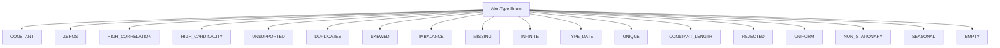

## Raises:
- No exceptions are raised during enum instantiation or usage
- The enum itself is a pure data structure with no constructor logic

## Example:
```python
# Creating an alert of a specific type
alert_type = AlertType.HIGH_CORRELATION

# Using in conditional logic
if alert_type == AlertType.MISSING:
    print("Data contains missing values")

# Iterating over all alert types
for alert in AlertType:
    print(f"Alert type: {alert.name}")
```

## `src.ydata_profiling.model.alerts.Alert` · *class*

## Summary:
Represents an alert or warning generated during data profiling, containing metadata about the alert type, associated column, and relevant values.

## Description:
The Alert class serves as a data structure for storing and representing various types of alerts that can occur during data profiling operations. These alerts typically indicate issues or anomalies detected in the dataset such as high correlations, missing values, or data quality problems. The class provides formatting capabilities for displaying alerts in user interfaces and maintains references to the specific column(s) involved in the alert.

## State:
- alert_type: AlertType enum value indicating the type of alert
- values: Optional dictionary containing additional alert-specific data
- column_name: Optional string identifying the column associated with the alert
- fields: Optional set of field names related to the alert
- _is_empty: Boolean flag indicating if the alert is empty
- _anchor_id: Optional string used for linking alerts to UI elements

## Lifecycle:
- Creation: Instantiate with alert_type and optional parameters
- Usage: Access properties like alert_type_name, anchor_id, or call fmt() for formatted display
- Destruction: Automatic cleanup via Python garbage collection

## Method Map:
```mermaid
graph TD
    A[Alert.__init__] --> B[alert_type]
    A --> C[values]
    A --> D[column_name]
    A --> E[fields]
    A --> F[_is_empty]
    B --> G[alert_type_name]
    D --> H[anchor_id]
    G --> I[fmt()]
    H --> J[__repr__]
```

## Raises:
- No explicit exceptions raised by __init__
- The class assumes AlertType is a valid enum and handles None values gracefully

## Example:
```python
# Create an alert instance
alert = Alert(
    alert_type=AlertType.HIGH_CORRELATION,
    values={"fields": ["col1", "col2"], "corr": "positive"},
    column_name="target_column"
)

# Get formatted display
formatted_alert = alert.fmt()  # Returns formatted string

# Get anchor ID for UI linking
anchor = alert.anchor_id

# String representation
print(alert)  # "[HIGH_CORRELATION] alert on column target_column"
```

### `src.ydata_profiling.model.alerts.Alert.__init__` · *method*

## Summary:
Initializes an Alert object with type, values, column name, fields, and empty status flags.

## Description:
Constructs an Alert instance to represent data quality issues or findings during profiling. This method sets up the core attributes that define what kind of alert this is, what data triggered it, and associated metadata. The Alert class is used throughout the profiling system to track and report various data quality concerns.

## Args:
    alert_type (AlertType): The type of alert being created, indicating the nature of the data quality issue.
    values (Optional[Dict], default: None): Dictionary containing additional data values related to the alert, such as correlation details.
    column_name (Optional[str], default: None): Name of the column that triggered this alert.
    fields (Optional[Set], default: None): Set of field names related to this alert, particularly useful for correlation alerts.
    is_empty (bool, default: False): Boolean flag indicating if the alert represents an empty state.

## Returns:
    None: This method initializes instance attributes but does not return a value.

## Raises:
    None explicitly raised: This method doesn't raise any exceptions directly.

## State Changes:
    Attributes READ: None
    Attributes WRITTEN: 
    - self.fields: Set of related fields for this alert
    - self.alert_type: The type of alert being created
    - self.values: Dictionary of additional alert data
    - self.column_name: Name of the column triggering the alert
    - self._is_empty: Flag indicating if alert is in empty state

## Constraints:
    Preconditions:
    - alert_type must be a valid member of the AlertType enum
    - fields should be a set or None
    - values should be a dictionary or None
    - column_name should be a string or None
    
    Postconditions:
    - All instance attributes are initialized with provided values or appropriate defaults
    - self.fields is always a set (empty set if None provided)
    - self.values is always a dict (empty dict if None provided)

## Side Effects:
    None: This method performs only local initialization and has no external side effects.

### `src.ydata_profiling.model.alerts.Alert.alert_type_name` · *method*

## Summary:
Returns a human-readable title-cased version of the alert type name by converting underscores to spaces and applying title capitalization.

## Description:
This property transforms the internal enum representation of an alert type into a more readable format suitable for display in user interfaces. It takes the enum's name attribute, replaces underscores with spaces, converts to lowercase, and then applies title capitalization to create a clean, readable string.

The method is used primarily for generating user-facing labels and descriptions for different types of data quality alerts detected during profiling.

## Args:
    None

## Returns:
    str: A formatted string representation of the alert type name, e.g., "High Correlation" for the enum value HIGH_CORRELATION.

## Raises:
    AttributeError: If self.alert_type is None or does not have a name attribute.

## State Changes:
    Attributes READ: self.alert_type
    Attributes WRITTEN: None

## Constraints:
    Preconditions: self.alert_type must be a valid enum member with a name attribute
    Postconditions: Returns a string with proper title casing (first letter of each word capitalized)

## Side Effects:
    None

### `src.ydata_profiling.model.alerts.Alert.anchor_id` · *method*

## Summary:
Returns a cached hash-based identifier for the alert, derived from the column name, for consistent referencing.

## Description:
This method provides a stable identifier for alerts that can be used for linking or referencing in reports. It implements a lazy caching mechanism where the anchor ID is computed once from the column name and stored for subsequent accesses. This approach avoids recomputing the hash on every access while ensuring consistency.

The method is typically called during report generation or when creating links to specific alerts in the profiling output. It's part of the Alert class's interface for providing stable identifiers that remain consistent throughout the lifetime of an alert instance.

## Args:
    None

## Returns:
    Optional[str]: A string representation of the hash of the column name, or None if column_name is None. The returned value is cached after the first access.

## Raises:
    None

## State Changes:
    Attributes READ: self.column_name, self._anchor_id
    Attributes WRITTEN: self._anchor_id (only on first access when None)

## Constraints:
    Preconditions: The Alert instance must be properly initialized with a column_name attribute
    Postconditions: After first access, self._anchor_id will contain a string value representing the hash of column_name

## Side Effects:
    None

### `src.ydata_profiling.model.alerts.Alert.fmt` · *method*

## Summary:
Formats an alert name for display, creating HTML tooltips for high correlation alerts.

## Description:
Transforms the alert type enum name into a human-readable format by replacing underscores with spaces. For HIGH_CORRELATION alerts, generates an HTML abbr element with detailed correlation information in the title attribute. This method is used to create user-friendly display names for alerts in reports.

## Args:
    None

## Returns:
    str: Formatted alert name, with special HTML formatting for HIGH_CORRELATION alerts.
         For HIGH_CORRELATION alerts, returns an HTML abbr element with tooltip containing correlation details.
         For other alerts, returns the alert type name with underscores replaced by spaces.

## Raises:
    KeyError: When processing HIGH_CORRELATION alerts and self.values does not contain required keys "fields" or "corr".

## State Changes:
    Attributes READ: self.alert_type, self.values
    Attributes WRITTEN: None

## Constraints:
    Preconditions: 
    - self.alert_type must be a valid AlertType enum member
    - For HIGH_CORRELATION alerts, self.values must contain "fields" and "corr" keys when not None
    Postconditions:
    - Returns a string representation of the alert name
    - For HIGH_CORRELATION alerts, returns HTML formatted string with tooltip

## Side Effects:
    None

### `src.ydata_profiling.model.alerts.Alert._get_description` · *method*

## Summary:
Returns a formatted string description of the alert including its type and associated column name.

## Description:
Formats a descriptive string that identifies the alert type and the column it relates to. This method is used to provide human-readable representations of alerts for display purposes. It's called during the string representation of Alert objects via the `__repr__` method.

## Args:
    None

## Returns:
    str: A formatted string in the pattern "[ALERT_TYPE] alert on column COLUMN_NAME" where ALERT_TYPE is the name of the alert type enum value and COLUMN_NAME is the name of the column associated with the alert.

## Raises:
    None

## State Changes:
    Attributes READ: self.alert_type, self.column_name
    Attributes WRITTEN: None

## Constraints:
    Preconditions: The Alert instance must have valid values for self.alert_type and self.column_name attributes.
    Postconditions: The returned string will always follow the format "[alert_type] alert on column column_name".

## Side Effects:
    None

### `src.ydata_profiling.model.alerts.Alert.__repr__` · *method*

## Summary:
Returns a string representation of the alert showing its type and associated column.

## Description:
This method implements Python's `__repr__` magic method to provide a human-readable string representation of Alert objects. It is primarily used for debugging and logging purposes to quickly identify what type of alert was generated and on which column it applies.

## Args:
    None

## Returns:
    str: A formatted string in the pattern "[ALERT_TYPE] alert on column COLUMN_NAME"

## Raises:
    None

## State Changes:
    Attributes READ: self.alert_type, self.column_name
    Attributes WRITTEN: None

## Constraints:
    Preconditions: The Alert instance must have been initialized with valid alert_type and column_name values
    Postconditions: The returned string follows a consistent format for all Alert instances

## Side Effects:
    None

## `src.ydata_profiling.model.alerts.ConstantLengthAlert` · *class*

## Summary:
Represents an alert indicating that a column has a constant length across all its values.

## Description:
The ConstantLengthAlert class is used to signal when a data column contains values that all have the same length. This is typically used in data profiling to identify columns where all entries share identical string or sequence lengths, which might indicate data quality issues or specific data patterns.

This class is instantiated by the data profiling system when analyzing column characteristics and detecting uniform length patterns in the data.

## State:
- alert_type: AlertType.CONSTANT_LENGTH (inherited from Alert parent class)
- values: Optional[Dict] - Additional metadata about the alert, defaults to None
- column_name: Optional[str] - Name of the column triggering the alert, defaults to None
- fields: Set containing {"composition_min_length", "composition_max_length"} (inherited from Alert parent class)
- is_empty: bool - Flag indicating if the column is empty, defaults to False

## Lifecycle:
- Creation: Instantiate with optional values, column_name, and is_empty parameters
- Usage: Typically called internally by the profiling system; the _get_description() method provides the alert message
- Destruction: No special cleanup required; relies on Python's garbage collection

## Method Map:
```mermaid
graph TD
    A[ConstantLengthAlert.__init__] --> B[Alert.__init__]
    B --> C[Sets alert_type=CONSTANT_LENGTH]
    C --> D[Sets fields={"composition_min_length", "composition_max_length"}]
    D --> E[ConstantLengthAlert._get_description]
    E --> F[Returns formatted description]
```

## Raises:
- No explicit exceptions raised by __init__
- Inherits all exceptions from Alert.__init__ if invalid parameters are passed

## Example:
```python
# Create a constant length alert for a column named "phone_number"
alert = ConstantLengthAlert(
    values={"composition_min_length": 10, "composition_max_length": 10},
    column_name="phone_number",
    is_empty=False
)

# Get the alert description
description = alert._get_description()  # Returns "[phone_number] has a constant length"
```

### `src.ydata_profiling.model.alerts.ConstantLengthAlert.__init__` · *method*

## Summary:
Initializes a ConstantLengthAlert instance that indicates a column has constant length values.

## Description:
Creates a new ConstantLengthAlert instance by calling the parent Alert class constructor with specific alert type and field information. This alert is triggered when a column contains values of consistent length, such as strings or arrays with uniform size.

## Args:
    values (Optional[Dict], default=None): Additional metadata about the alert, typically containing length statistics
    column_name (Optional[str], default=None): Name of the column that triggered this alert
    is_empty (bool, default=False): Flag indicating if the alert was generated for an empty dataset

## Returns:
    None: This method initializes the object state but does not return a value

## Raises:
    None: This method does not explicitly raise exceptions

## State Changes:
    Attributes READ: None
    Attributes WRITTEN: 
    - self.fields: Set containing {"composition_min_length", "composition_max_length"}
    - self.alert_type: Set to AlertType.CONSTANT_LENGTH
    - self.values: Set to the provided values parameter or empty dict
    - self.column_name: Set to the provided column_name parameter
    - self._is_empty: Set to the provided is_empty parameter

## Constraints:
    Preconditions: None
    Postconditions: The instance will have its alert_type set to CONSTANT_LENGTH and fields set to {"composition_min_length", "composition_max_length"}

## Side Effects:
    None: This method performs no I/O operations or external service calls

### `src.ydata_profiling.model.alerts.ConstantLengthAlert._get_description` · *method*

## Summary:
Returns a formatted description indicating that a column has a constant length.

## Description:
This method provides a human-readable description for alerts of type CONSTANT_LENGTH. It is part of the alert system that identifies various data quality issues in profiling reports. The method overrides the base implementation to provide a more specific message about columns with constant length values.

This method is called during report generation when displaying alert information to users, helping them understand what data quality issue was detected.

## Args:
    None

## Returns:
    str: A formatted string in the pattern "[column_name] has a constant length" indicating which column has constant length values.

## Raises:
    None

## State Changes:
    Attributes READ: self.column_name
    Attributes WRITTEN: None

## Constraints:
    Preconditions: The object must have a valid column_name attribute set during initialization
    Postconditions: Returns a properly formatted string describing the constant length alert

## Side Effects:
    None

## `src.ydata_profiling.model.alerts.ConstantAlert` · *class*

## Summary:
Represents an alert indicating that a column contains a constant value throughout all rows.

## Description:
The ConstantAlert class is used to signal when a data column has identical values in every row, which may indicate data quality issues or uninformative features in data analysis. This alert type is part of the ydata-profiling system's automated data quality checking framework. It is typically created by data profiling routines that detect constant-value columns during dataset analysis.

## State:
- alert_type: AlertType.CONSTANT - identifies this as a constant value alert
- values: Optional[Dict] - additional metadata about the constant value detection (default: None)
- column_name: Optional[str] - name of the column with constant values (default: None)
- fields: Set - set containing "n_distinct" field identifier (hardcoded)
- is_empty: bool - flag indicating if the column is empty (default: False)
- _anchor_id: Optional[str] - internal ID for linking alerts to UI elements (computed lazily)

## Lifecycle:
- Creation: Instantiate with optional values, column_name, and is_empty parameters
- Usage: Typically called internally by profiling routines; accessed via _get_description() method
- Destruction: No special cleanup required; relies on Python garbage collection

## Method Map:
```mermaid
graph TD
    A[ConstantAlert.__init__] --> B[Alert.__init__]
    B --> C[Initialize alert with CONSTANT type]
    A --> D[Set fields = {"n_distinct"}]
    E[ConstantAlert._get_description] --> F[Return formatted description]
```

## Raises:
- No explicit exceptions raised by __init__
- Inherits initialization behavior from Alert base class

## Example:
```python
# Create a constant alert for a column named "status"
alert = ConstantAlert(
    values={"constant_value": "active"},
    column_name="status",
    is_empty=False
)

# Get the alert description
description = alert._get_description()  # Returns "[status] has a constant value"
```

### `src.ydata_profiling.model.alerts.ConstantAlert.__init__` · *method*

## Summary:
Initializes a ConstantAlert instance that indicates a column has a constant value across all rows.

## Description:
Creates a new ConstantAlert object that signals when a column contains identical values throughout all observations. This alert type is used during data profiling to identify columns that don't contribute meaningful variation to the dataset. The alert is specifically designed to track columns with a single distinct value.

## Args:
    values (Optional[Dict], default=None): Dictionary containing alert-specific data, typically including statistical information about the column.
    column_name (Optional[str], default=None): Name of the column that triggered this alert.
    is_empty (bool, default=False): Flag indicating whether the column is empty or contains no data.

## Returns:
    None: This method initializes the object's state but does not return a value.

## Raises:
    None: This method does not explicitly raise exceptions.

## State Changes:
    Attributes READ: None
    Attributes WRITTEN: 
    - self.fields: Set containing field names, initialized to {"n_distinct"} (hardcoded)
    - self.alert_type: Set to AlertType.CONSTANT
    - self.values: Set to the provided values parameter or empty dict
    - self.column_name: Set to the provided column_name parameter
    - self._is_empty: Set to the provided is_empty parameter

## Constraints:
    Preconditions: None
    Postconditions: The ConstantAlert instance is properly initialized with alert_type=CONSTANT and fields={"n_distinct"}

## Side Effects:
    None: This method performs no I/O operations or external service calls.

### `src.ydata_profiling.model.alerts.ConstantAlert._get_description` · *method*

## Summary:
Returns a human-readable description indicating that a column contains only constant values.

## Description:
This method provides a formatted string description for constant value alerts. It is called during the data profiling process when the system detects that a column has identical values across all rows. The method overrides the base Alert class implementation to provide a more specific message about constant values.

Known callers:
- The method is typically called internally by the alert reporting system when displaying alerts
- It's invoked during report generation when formatting alert descriptions for presentation

This logic is separated into its own method to allow for consistent formatting of constant value alerts while maintaining flexibility for other alert types to override the description format differently.

## Returns:
    str: A formatted string in the pattern "[column_name] has a constant value"

## State Changes:
    Attributes READ: self.column_name
    Attributes WRITTEN: None

## Constraints:
    Preconditions: The method assumes self.column_name is properly initialized (can be None)
    Postconditions: Always returns a string with the constant value alert format

## Side Effects:
    None

## `src.ydata_profiling.model.alerts.DuplicatesAlert` · *class*

## Summary:
Represents an alert indicating the presence of duplicate rows in a dataset.

## Description:
The DuplicatesAlert class is used to signal when a dataset contains duplicate rows. It extends the base Alert class to provide specific functionality for detecting and describing duplicate row issues. This alert is typically generated during data profiling when duplicate rows are identified in the dataset.

## State:
- alert_type: AlertType.DUPLICATES - The type of alert indicating duplicates
- values: Optional[Dict] - Dictionary containing duplicate statistics including 'n_duplicates' and 'p_duplicates'
- column_name: Optional[str] - Name of the column this alert relates to (can be None for dataset-level alerts)
- fields: Set - Contains {"n_duplicates"} indicating the field names used in the alert
- is_empty: bool - Flag indicating if the dataset is empty
- _is_empty: bool - Internal flag tracking empty state

## Lifecycle:
- Creation: Instantiate with optional values dictionary, column_name, and is_empty flag
- Usage: Call _get_description() to retrieve formatted alert message
- Destruction: No special cleanup required, relies on Python garbage collection

## Method Map:
```mermaid
graph TD
    A[DuplicatesAlert.__init__] --> B[Alert.__init__]
    B --> C[Sets alert_type=DUPLICATES]
    C --> D[Sets fields={"n_duplicates"}]
    D --> E[Returns]
    
    F[DuplicatesAlert._get_description] --> G[Formats duplicate count and percentage]
    G --> H[Returns descriptive string]
```

## Raises:
- No explicit exceptions raised by __init__
- May raise exceptions from parent Alert.__init__ if invalid parameters are passed

## Example:
```python
# Create alert with duplicate statistics
alert = DuplicatesAlert(
    values={'n_duplicates': 150, 'p_duplicates': 0.15},
    column_name='user_id',
    is_empty=False
)

# Get formatted description
description = alert._get_description()
# Returns: "Dataset has 150 (15.0%) duplicate rows"

# Create alert without statistics
empty_alert = DuplicatesAlert()
description = empty_alert._get_description()
# Returns: "Dataset has duplicated values"
```

### `src.ydata_profiling.model.alerts.DuplicatesAlert.__init__` · *method*

## Summary:
Initializes a DuplicatesAlert instance with duplicate detection configuration and metadata.

## Description:
Constructs a DuplicatesAlert object that represents an alert for detecting duplicate rows in a dataset. This method serves as the constructor for the DuplicatesAlert class, setting up the alert with appropriate type identification and field specifications for duplicate counting.

## Args:
    values (Optional[Dict], default=None): Dictionary containing duplicate statistics such as 'n_duplicates' and 'p_duplicates'
    column_name (Optional[str], default=None): Name of the column being analyzed for duplicates (if applicable)
    is_empty (bool, default=False): Flag indicating whether the dataset is empty

## Returns:
    None: This method initializes the object's state but does not return a value

## Raises:
    None explicitly raised: This method delegates to the parent Alert class constructor which may raise exceptions if invalid parameters are passed

## State Changes:
    Attributes READ: None
    Attributes WRITTEN: 
    - self.alert_type: Set to AlertType.DUPLICATES
    - self.fields: Set to {"n_duplicates"}
    - self.values: Set to the provided values parameter or empty dict
    - self.column_name: Set to the provided column_name parameter
    - self._is_empty: Set to the provided is_empty parameter

## Constraints:
    Preconditions:
    - The alert_type parameter must be a valid AlertType enum value (specifically AlertType.DUPLICATES)
    - The fields parameter must be a set containing at least "n_duplicates" for duplicate detection
    - All other parameters should conform to their respective type annotations

    Postconditions:
    - The object will have its alert_type attribute set to AlertType.DUPLICATES
    - The object will have its fields attribute set to {"n_duplicates"}
    - The object will have its values, column_name, and is_empty attributes initialized according to the provided parameters

## Side Effects:
    None: This method performs only object initialization and does not cause any I/O operations, external service calls, or mutations to objects outside self

### `src.ydata_profiling.model.alerts.DuplicatesAlert._get_description` · *method*

## Summary:
Generates a human-readable description of duplicate row counts in a dataset.

## Description:
Returns a formatted string describing duplicate rows in the dataset. This method is part of the DuplicatesAlert class and overrides the base Alert class's _get_description method to provide specific information about duplicate rows. It is called during report generation when displaying alerts about duplicate data.

When duplicate values are detected, the method provides detailed information including the count of duplicate rows and their percentage. When no duplicate values exist, it returns a general message indicating duplicated values.

## Args:
    None

## Returns:
    str: A formatted description string. When duplicate values exist, returns a detailed message including count and percentage of duplicates using fmt_percent formatting. When no duplicate values exist, returns a general message indicating duplicated values.

## Raises:
    None

## State Changes:
    Attributes READ: self.values, self.values['n_duplicates'], self.values['p_duplicates']
    Attributes WRITTEN: None

## Constraints:
    Preconditions: The method assumes self.values is either None or contains dictionary with 'n_duplicates' and 'p_duplicates' keys when not None
    Postconditions: Always returns a string describing duplicate rows in the dataset

## Side Effects:
    None

## `src.ydata_profiling.model.alerts.EmptyAlert` · *class*

## Summary:
Represents an alert indicating that a dataset is empty, inheriting from the base Alert class.

## Description:
The EmptyAlert class is specifically designed to signal when a dataset contains no data. It inherits from the Alert base class and sets its alert type to AlertType.EMPTY during initialization. This alert type is used to communicate to users that their dataset has zero rows, which may affect subsequent analysis operations.

## State:
- alert_type: AlertType.EMPTY - An enum member representing the empty dataset alert type
- values: Optional[Dict] - Additional metadata about the alert, defaults to None
- column_name: Optional[str] - Name of the column this alert relates to, defaults to None  
- fields: Set - Set containing field names, initialized with {"n"} as a constant
- _is_empty: bool - Boolean flag indicating if the dataset is empty, defaults to False

## Lifecycle:
- Creation: Instantiate with optional values, column_name, and is_empty parameters
- Usage: Typically created by analysis functions when detecting empty datasets
- Destruction: No special cleanup required, relies on standard Python garbage collection

## Method Map:
```mermaid
graph TD
    A[EmptyAlert.__init__] --> B[Alert.__init__]
    B --> C[Initialize alert_type=AlertType.EMPTY]
    C --> D[Set fields={"n"}]
    D --> E[Set other attributes]
    A --> F[EmptyAlert._get_description]
    F --> G[Return "Dataset is empty"]
```

## Raises:
- No explicit exceptions raised by __init__
- Inherits initialization behavior from Alert parent class

## Example:
```python
# Create an empty alert instance
alert = EmptyAlert(
    values={"count": 0},
    column_name="my_column",
    is_empty=True
)

# Get the alert description
description = alert._get_description()  # Returns "Dataset is empty"
```

### `src.ydata_profiling.model.alerts.EmptyAlert.__init__` · *method*

## Summary:
Initializes an EmptyAlert instance with specified properties for empty dataset detection.

## Description:
Configures an alert instance specifically designed to detect when a dataset is empty. This method serves as the constructor for EmptyAlert objects, setting up the alert with appropriate metadata and configuration for empty dataset validation.

## Args:
    values (Optional[Dict], optional): Additional data values associated with the alert. Defaults to None.
    column_name (Optional[str], optional): Name of the column being analyzed. Defaults to None.
    is_empty (bool, optional): Flag indicating if the dataset is empty. Defaults to False.

## Returns:
    None: This method initializes the object state and does not return a value.

## Raises:
    None: This method does not explicitly raise exceptions.

## State Changes:
    Attributes READ: None
    Attributes WRITTEN: 
    - self.fields: Set to {"n"} (hardcoded field identifier)
    - self.alert_type: Set to AlertType.EMPTY
    - self.values: Set to provided values or empty dict
    - self.column_name: Set to provided column_name or None
    - self._is_empty: Set to provided is_empty flag

## Constraints:
    Preconditions: None
    Postconditions: 
    - The alert instance is properly initialized with alert_type=AlertType.EMPTY
    - The fields attribute is set to {"n"}
    - All provided parameters are stored in the instance

## Side Effects:
    None: This method performs no I/O operations or external service calls.

### `src.ydata_profiling.model.alerts.EmptyAlert._get_description` · *method*

## Summary:
Returns a standardized description string indicating that the dataset is empty.

## Description:
This method provides a human-readable description for empty dataset alerts. It is part of the alert system that identifies various data quality issues in datasets during profiling. The method overrides the base class implementation to provide a specific message for empty datasets.

The `_get_description` method is called during the formatting and display phase of alert processing, typically when generating reports or user-facing notifications about data quality issues. This method ensures consistency in how empty dataset conditions are communicated to users.

## Args:
    self: The EmptyAlert instance containing alert metadata

## Returns:
    str: A fixed description string "Dataset is empty"

## Raises:
    None: This method does not raise any exceptions

## State Changes:
    Attributes READ: 
    - self.alert_type (inherited from Alert base class)
    - self.column_name (inherited from Alert base class)
    
    Attributes WRITTEN: None

## Constraints:
    Preconditions:
    - The method should only be called on instances of EmptyAlert class
    - The method does not depend on any specific state of the object beyond what's available in the base Alert class
    
    Postconditions:
    - Always returns the exact string "Dataset is empty"
    - Does not modify any instance attributes

## Side Effects:
    None: This method performs no I/O operations, external service calls, or mutations to objects outside self

## `src.ydata_profiling.model.alerts.HighCardinalityAlert` · *class*

## Summary:
Represents an alert indicating that a column has high cardinality, meaning it contains many distinct values.

## Description:
The HighCardinalityAlert class is used to signal when a dataset column exhibits high cardinality, which can impact analysis and modeling decisions. It inherits from the base Alert class and specializes in reporting on the number of distinct values in a column. This alert is particularly useful for identifying columns that may require special handling due to their high number of unique values.

## State:
- alert_type: AlertType.HIGH_CARDINALITY (inherited from Alert)
- values: Optional[Dict] - Dictionary containing statistics about the column, including 'n_distinct' and 'p_distinct' keys
- column_name: Optional[str] - Name of the column triggering the alert
- fields: Set - Contains {"n_distinct"} (inherited from Alert)
- _is_empty: bool - Flag indicating if the column is empty (inherited from Alert)
- _anchor_id: Optional[str] - Unique identifier for the alert (inherited from Alert)

## Lifecycle:
- Creation: Instantiate with optional values dictionary, column_name, and is_empty flag
- Usage: Call _get_description() to retrieve formatted alert message
- Destruction: No special cleanup required, relies on Python garbage collection

## Method Map:
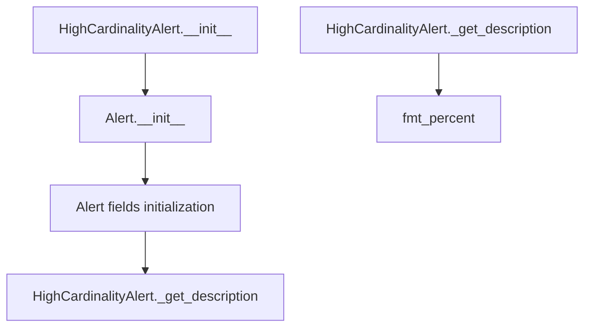

## Raises:
- No explicit exceptions raised by __init__
- The parent Alert.__init__ may raise exceptions if invalid arguments are passed

## Example:
```python
# Create an alert for a column with high cardinality
alert = HighCardinalityAlert(
    values={'n_distinct': 1000, 'p_distinct': 0.85},
    column_name='user_id'
)

# Get the formatted description
description = alert._get_description()
# Returns: "[user_id] has 1000 (85.0%) distinct values"

# Create an alert without detailed values
simple_alert = HighCardinalityAlert(column_name='category')
description = simple_alert._get_description()
# Returns: "[category] has a high cardinality"
```

### `src.ydata_profiling.model.alerts.HighCardinalityAlert.__init__` · *method*

## Summary:
Initializes a HighCardinalityAlert instance with the specified parameters, setting the alert type to HIGH_CARDINALITY and configuring the fields to track distinct value counts.

## Description:
This constructor creates a high cardinality alert instance that inherits from the base Alert class. It configures the alert to specifically monitor for columns with high cardinality by passing the HIGH_CARDINALITY alert type to the parent constructor along with other alert configuration parameters. This method is designed to be called during the profiling process when high cardinality conditions are detected in data columns.

## Args:
    values (Optional[Dict], default: None): Dictionary containing alert-specific data, typically including the count of distinct values ('n_distinct') and percentage of distinct values ('p_distinct').
    column_name (Optional[str], default: None): Name of the column that triggered this alert.
    is_empty (bool, default: False): Flag indicating whether the column being analyzed is empty.

## Returns:
    None: This method initializes the object's state but does not return a value.

## Raises:
    None: This method does not explicitly raise exceptions, though parent class initialization may raise exceptions for invalid parameters.

## State Changes:
    Attributes READ: None
    Attributes WRITTEN: 
    - self.alert_type: Set by parent class constructor to AlertType.HIGH_CARDINALITY
    - self.fields: Set by parent class constructor to {"n_distinct"}
    - self.values: Set by parent class constructor to the provided values parameter or empty dict
    - self.column_name: Set by parent class constructor to the provided column_name parameter
    - self._is_empty: Set by parent class constructor to the provided is_empty parameter

## Constraints:
    Preconditions: 
    - The alert_type parameter must be a valid AlertType enum value
    - The fields parameter should be a set containing field names to track
    - Values should be a dictionary or None
    
    Postconditions:
    - The alert instance will have its alert_type attribute set to HIGH_CARDINALITY
    - The fields attribute will contain exactly {"n_distinct"}
    - All provided parameters will be stored in their respective instance attributes

## Side Effects:
    None: This method performs no I/O operations or external service calls. It only initializes object attributes.

### `src.ydata_profiling.model.alerts.HighCardinalityAlert._get_description` · *method*

## Summary:
Generates a human-readable description of a high cardinality alert for a specific column.

## Description:
Returns a formatted string describing the high cardinality condition detected for a column. This method overrides the parent Alert class's generic description method to provide specific information about distinct values and their percentage when data is available, or a general high cardinality message when data is not available.

## Args:
    None

## Returns:
    str: A formatted description string in one of two formats:
        - When self.values is not None: "[{column_name}] has {n_distinct} ({formatted_percentage}) distinct values"
        - When self.values is None: "[{column_name}] has a high cardinality"

## Raises:
    None explicitly raised

## State Changes:
    Attributes READ: self.values, self.column_name
    Attributes WRITTEN: None

## Constraints:
    Preconditions:
        - self.column_name must be a valid string or None
        - When self.values is not None, it must contain keys 'n_distinct' and 'p_distinct'
    Postconditions:
        - Returns a properly formatted string describing the high cardinality alert
        - The returned string follows a consistent format for reporting purposes

## Side Effects:
    None

## `src.ydata_profiling.model.alerts.HighCorrelationAlert` · *class*

## Summary:
Represents an alert for detecting high correlation between variables in a dataset.

## Description:
The HighCorrelationAlert class is used to identify and report when variables in a dataset exhibit high correlation, which may indicate multicollinearity issues in statistical modeling. This class extends the base Alert class to provide specific handling for correlation-related warnings.

## State:
- alert_type: AlertType.HIGH_CORRELATION - The type of alert being generated (enum value)
- values: Optional[Dict] - Dictionary containing correlation information with keys 'corr' (correlation value) and 'fields' (list of correlated field names)
- column_name: Optional[str] - Name of the column triggering the alert
- fields: Set - Set of field names involved in the correlation (inherited from Alert parent class)
- is_empty: bool - Flag indicating if the alert relates to empty data

## Lifecycle:
- Creation: Instantiate with values dictionary containing 'corr' and 'fields' keys, and column_name
- Usage: Call _get_description() to retrieve formatted alert message
- Destruction: No special cleanup required, inherits standard object destruction

## Method Map:
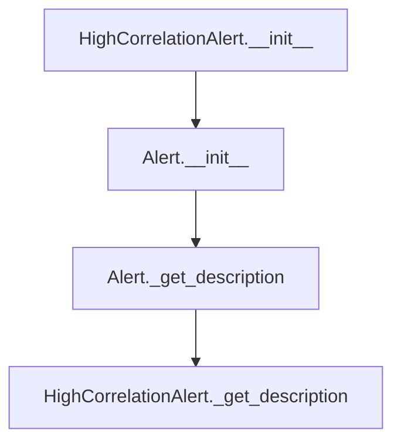

## Raises:
- No explicit exceptions raised by __init__
- The parent Alert class may raise exceptions during initialization if invalid parameters are passed

## Example:
```python
# Create a high correlation alert with detailed values
alert = HighCorrelationAlert(
    values={'corr': 'positive', 'fields': ['feature1', 'feature2']},
    column_name='feature3'
)

# Get the formatted description
description = alert._get_description()
# Returns: "[feature3] is highly positive correlated with [feature1] and 1 other fields"

# Create an alert with minimal information
alert2 = HighCorrelationAlert(
    column_name='feature4'
)

# Get the fallback description
description2 = alert2._get_description()
# Returns: "[feature4] has a high correlation with one or more colums"
```

### `src.ydata_profiling.model.alerts.HighCorrelationAlert.__init__` · *method*

## Summary:
Initializes a HighCorrelationAlert instance with correlation-specific metadata and configuration.

## Description:
Creates a new HighCorrelationAlert object that represents a high correlation warning between variables in a dataset. This method serves as the constructor for the HighCorrelationAlert class, which inherits from the base Alert class. It sets up the alert with the specific HIGH_CORRELATION alert type and initializes the alert's metadata including correlation values, column names, and empty state flags.

## Args:
    values (Optional[Dict], default=None): Dictionary containing correlation information including 'corr' (correlation coefficient) and 'fields' (related field names).
    column_name (Optional[str], default=None): Name of the column triggering the correlation alert.
    is_empty (bool, default=False): Flag indicating whether the alert relates to an empty dataset or column.

## Returns:
    None: This method initializes the object's state but does not return a value.

## Raises:
    None: This method does not explicitly raise exceptions, though parent class initialization may raise exceptions for invalid parameters.

## State Changes:
    Attributes READ: None
    Attributes WRITTEN: 
    - self.alert_type: Set to AlertType.HIGH_CORRELATION
    - self.values: Set to the provided values parameter
    - self.column_name: Set to the provided column_name parameter
    - self._is_empty: Set to the provided is_empty parameter
    - self.fields: Set via parent class initialization

## Constraints:
    Preconditions: 
    - The alert_type parameter must be a valid AlertType enum value (specifically HIGH_CORRELATION)
    - Values dictionary should contain appropriate keys ('corr', 'fields') if not None
    - Column name should be a valid string identifier if provided
    
    Postconditions:
    - The object is properly initialized with alert_type set to HIGH_CORRELATION
    - All provided parameters are stored in the corresponding instance attributes
    - The object maintains proper inheritance from Alert base class

## Side Effects:
    None: This method performs only object initialization and does not cause any I/O operations, external service calls, or mutations to objects outside self.

### `src.ydata_profiling.model.alerts.HighCorrelationAlert._get_description` · *method*

*No documentation generated.*

## `src.ydata_profiling.model.alerts.ImbalanceAlert` · *class*

## Summary:
ImbalanceAlert represents a specific type of alert indicating that a column in a dataset has a highly imbalanced distribution of values.

## Description:
This class is used to signal when a dataset column exhibits significant imbalance in its value distribution, which could impact model performance or analysis results. It inherits from the base Alert class and specializes in handling imbalance detection scenarios. The alert is typically generated during data profiling when statistical analysis reveals that certain categories or values appear far more frequently than others.

## State:
- alert_type: AlertType.IMBALANCE (inherited from Alert parent class)
- values: Optional[Dict] - Dictionary containing imbalance statistics, defaults to None
- column_name: Optional[str] - Name of the column that triggered the alert, defaults to None  
- fields: Set - Contains "imbalance" field, inherited from Alert parent class
- is_empty: bool - Flag indicating if the column is empty, defaults to False

## Lifecycle:
- Creation: Instantiate with optional values, column_name, and is_empty parameters
- Usage: Typically called during data profiling when imbalance is detected
- Destruction: No special cleanup required, relies on Python's garbage collection

## Method Map:
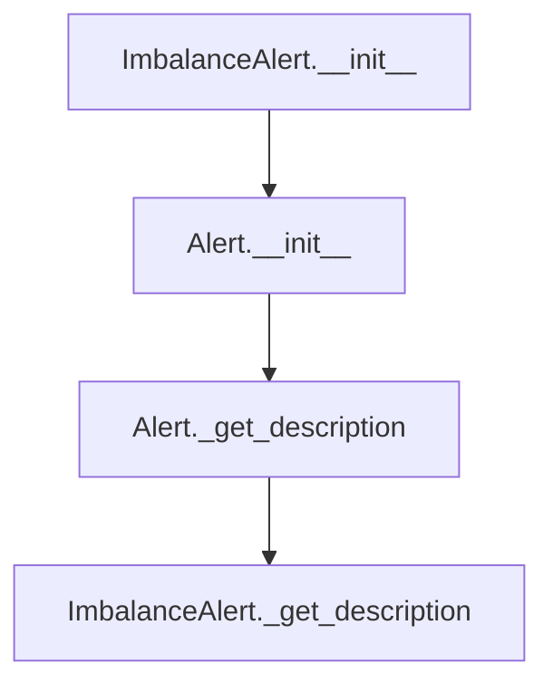

## Raises:
- No explicit exceptions raised by __init__ method
- Inherits initialization behavior from Alert parent class

## Example:
```python
# Create an imbalance alert for a column with imbalance statistics
alert = ImbalanceAlert(
    values={"imbalance": "85% of values are in category A"},
    column_name="product_category"
)

# Get the formatted description
description = alert._get_description()  # "[product_category] is highly imbalanced (85% of values are in category A)"
```

### `src.ydata_profiling.model.alerts.ImbalanceAlert.__init__` · *method*

## Summary:
Initializes an ImbalanceAlert instance with specific configuration for imbalance detection.

## Description:
Constructs an ImbalanceAlert object that extends the base Alert class to represent imbalance detection warnings. This method serves as the constructor for imbalance-specific alerts, setting up the alert type to IMBALANCE and configuring the required fields for imbalance analysis.

## Args:
    values (Optional[Dict], optional): Dictionary containing imbalance-related statistics. Defaults to None.
    column_name (Optional[str], optional): Name of the column being analyzed for imbalance. Defaults to None.
    is_empty (bool, optional): Flag indicating if the column is empty. Defaults to False.

## Returns:
    None: This method initializes the object state but does not return a value.

## Raises:
    None: This method does not explicitly raise exceptions.

## State Changes:
    Attributes READ: None
    Attributes WRITTEN: 
    - self.alert_type: Set to AlertType.IMBALANCE
    - self.fields: Set to {"imbalance"}
    - self.values: Set to provided values or empty dict
    - self.column_name: Set to provided column_name or None
    - self._is_empty: Set to provided is_empty flag

## Constraints:
    Preconditions: 
    - The alert_type parameter in the parent constructor must accept AlertType.IMBALANCE
    - The fields parameter must accept a set containing "imbalance"
    Postconditions:
    - The created object will have alert_type set to AlertType.IMBALANCE
    - The object will have fields set to {"imbalance"}

## Side Effects:
    None: This method performs no I/O operations or external service calls.

### `src.ydata_profiling.model.alerts.ImbalanceAlert._get_description` · *method*

## Summary:
Generates a human-readable description of a highly imbalanced column alert.

## Description:
Creates a descriptive string indicating that a specific column has a high imbalance ratio. This method is called during the alert reporting phase to provide meaningful information about data distribution issues in the dataset. The method is overridden from the parent Alert class to provide more specific messaging for imbalance detection.

## Args:
    None

## Returns:
    str: A formatted description string in the format "[column_name] is highly imbalanced" or "[column_name] is highly imbalanced (imbalance_value)" when imbalance data is available.

## Raises:
    None

## State Changes:
    Attributes READ: self.column_name, self.values
    Attributes WRITTEN: None

## Constraints:
    Preconditions: The method assumes self.column_name is properly initialized and self.values is either None or contains an 'imbalance' key
    Postconditions: Returns a properly formatted string describing the imbalance alert

## Side Effects:
    None

## `src.ydata_profiling.model.alerts.InfiniteAlert` · *class*

## Summary:
Represents an alert for detecting infinite values in data columns.

## Description:
The InfiniteAlert class is a specialized alert type that identifies and reports columns containing infinite values (positive or negative infinity). It extends the base Alert class to provide specific handling for infinite value detection scenarios. This alert is typically generated during data profiling when analyzing numerical columns for problematic values that could affect statistical computations or model training.

## State:
- alert_type: AlertType.INFINITE - The alert type identifier
- values: Optional[Dict] - Dictionary containing statistics about infinite values with keys 'n_infinite' (count) and 'p_infinite' (percentage)
- column_name: Optional[str] - Name of the column being analyzed
- fields: Set - Contains {"p_infinite", "n_infinite"} indicating required statistic fields
- _is_empty: bool - Flag indicating if the column is empty

## Lifecycle:
- Creation: Instantiate with optional values dictionary, column name, and empty flag
- Usage: Typically called by data profiling routines when analyzing numerical columns for infinite values
- Destruction: No special cleanup required, inherits standard object destruction

## Method Map:
```mermaid
graph TD
    A[InfiniteAlert.__init__] --> B[Alert.__init__]
    B --> C[Initialize alert_type=INFINITE]
    C --> D[Set fields={"p_infinite", "n_infinite"}]
    D --> E[Set values, column_name, is_empty]
    
    F[InfiniteAlert._get_description] --> G[Format description string]
    G --> H[Return formatted message with infinite count and percentage]
```

## Raises:
- No explicit exceptions raised by __init__
- Inherits initialization behavior from Alert base class

## Example:
```python
# Create an InfiniteAlert for a column with infinite values
alert = InfiniteAlert(
    values={'n_infinite': 5, 'p_infinite': 0.02},
    column_name='feature_x'
)

# Get the formatted description
description = alert._get_description()  # "[feature_x] has 5 (2.0%) infinite values"

# Create an alert without detailed values
simple_alert = InfiniteAlert(column_name='feature_y')
description = simple_alert._get_description()  # "[feature_y] has infinite values"
```

### `src.ydata_profiling.model.alerts.InfiniteAlert.__init__` · *method*

## Summary:
Initializes an InfiniteAlert instance to detect infinite values in data columns.

## Description:
Constructs an InfiniteAlert object that identifies when a column contains infinite values (positive or negative infinity). This alert type is specifically designed to monitor numerical data for extreme values that could indicate data quality issues or problematic calculations.

## Args:
    values (Optional[Dict]): Dictionary containing statistics about infinite values, including 'n_infinite' (count) and 'p_infinite' (percentage). Defaults to None.
    column_name (Optional[str]): Name of the column being analyzed. Defaults to None.
    is_empty (bool): Flag indicating if the column is empty. Defaults to False.

## Returns:
    None: This method initializes the object's state but does not return a value.

## Raises:
    None: This method does not explicitly raise exceptions.

## State Changes:
    Attributes READ: None
    Attributes WRITTEN: 
    - self.fields: Set containing {"p_infinite", "n_infinite"}
    - self.alert_type: Set to AlertType.INFINITE
    - self.values: Set to the provided values parameter or empty dict
    - self.column_name: Set to the provided column_name parameter
    - self._is_empty: Set to the provided is_empty parameter

## Constraints:
    Preconditions: 
    - The values dictionary, if provided, must contain 'n_infinite' and 'p_infinite' keys
    - The column_name should be a valid string identifier for the data column
    
    Postconditions:
    - The alert instance will have fields set to {"p_infinite", "n_infinite"}
    - The alert_type will be properly set to AlertType.INFINITE
    - All provided parameters will be stored in the appropriate instance attributes

## Side Effects:
    None: This method performs no I/O operations or external service calls.

### `src.ydata_profiling.model.alerts.InfiniteAlert._get_description` · *method*

## Summary:
Generates a human-readable description of infinite values detected in a data column.

## Description:
Returns a formatted string describing the presence of infinite values in a column. This method is part of the InfiniteAlert class and overrides the base Alert class's _get_description method to provide specific information about infinite values. It is typically called during report generation when analyzing data quality issues.

## Args:
    None

## Returns:
    str: A formatted description string indicating the number and percentage of infinite values in the column, or a general message if detailed statistics are not available.

## Raises:
    None

## State Changes:
    Attributes READ: self.values, self.column_name
    Attributes WRITTEN: None

## Constraints:
    Preconditions: The method assumes self.column_name is properly initialized and self.values is either None or contains 'n_infinite' and 'p_infinite' keys.
    Postconditions: Returns a properly formatted string describing infinite values in the column.

## Side Effects:
    None

## `src.ydata_profiling.model.alerts.MissingAlert` · *class*

## Summary:
Represents an alert for missing values in a data column, inheriting from the base Alert class.

## Description:
The MissingAlert class is specifically designed to report on missing data within columns of a dataset. It extends the base Alert class to provide specialized handling for missing value detection and reporting. This class is typically instantiated by profiling components that analyze data quality and identify columns with missing values.

## State:
- alert_type: AlertType.MISSING - The type of alert, specifically indicating missing values
- values: Optional[Dict] - Dictionary containing missing value statistics with keys 'n_missing' (number) and 'p_missing' (percentage)
- column_name: Optional[str] - Name of the column that contains missing values
- fields: Set - Set containing field names 'p_missing' and 'n_missing' that are expected in the values dictionary
- is_empty: bool - Flag indicating if the column is empty (default: False)
- _is_empty: bool - Internal flag tracking empty status
- _anchor_id: Optional[str] - Unique identifier for the alert used in HTML anchors

## Lifecycle:
- Creation: Instantiate with optional values dict, column_name, and is_empty flag
- Usage: Typically called by data profiling components that detect missing values
- Destruction: No special cleanup required, relies on Python's garbage collection

## Method Map:
```mermaid
graph TD
    A[MissingAlert.__init__] --> B[Alert.__init__]
    B --> C[Initialize fields, alert_type, values, column_name, is_empty]
    A --> D[Set alert_type to AlertType.MISSING]
    A --> E[Set fields to {"p_missing", "n_missing"}]
    D --> F[MissingAlert._get_description]
    F --> G[Format missing value description]
```

## Raises:
- No explicit exceptions raised by MissingAlert.__init__
- Inherits initialization behavior from Alert parent class

## Example:
```python
# Create a missing alert for a column with missing values
alert = MissingAlert(
    values={'n_missing': 10, 'p_missing': 0.05},
    column_name='age'
)

# Get the formatted description
description = alert._get_description()  # "[age] 10 (5.0%) missing values"

# Create an alert for a column with missing values but no statistics
alert2 = MissingAlert(column_name='income')
description2 = alert2._get_description()  # "[income] has missing values"
```

### `src.ydata_profiling.model.alerts.MissingAlert.__init__` · *method*

## Summary:
Initializes a MissingAlert object to represent missing value detection in a dataset column.

## Description:
Constructs a MissingAlert instance that inherits from the base Alert class, specifically configured to identify and report missing values in a dataset column. This method sets up the alert with the appropriate alert type, column information, and expected field names for missing value statistics.

## Args:
    values (Optional[Dict]): Dictionary containing missing value statistics with keys 'n_missing' (number of missing values) and 'p_missing' (percentage of missing values). Defaults to None.
    column_name (Optional[str]): Name of the column being analyzed for missing values. Defaults to None.
    is_empty (bool): Flag indicating if the alert applies to an empty dataset. Defaults to False.

## Returns:
    None: This method initializes the object's state but does not return a value.

## Raises:
    None: This method does not explicitly raise exceptions, though parent class initialization may raise exceptions if invalid parameters are passed.

## State Changes:
    Attributes READ: None
    Attributes WRITTEN: 
    - self.fields: Set containing field names {"p_missing", "n_missing"}
    - self.alert_type: Set to AlertType.MISSING
    - self.values: Set to the provided values parameter or empty dict
    - self.column_name: Set to the provided column_name parameter
    - self._is_empty: Set to the provided is_empty parameter

## Constraints:
    Preconditions:
    - The values dictionary, if provided, must contain the keys 'n_missing' and 'p_missing' for proper functionality of _get_description method
    - column_name should be a valid string identifier for the column
    
    Postconditions:
    - The object is properly initialized as a MissingAlert with alert_type set to AlertType.MISSING
    - The fields attribute is initialized to {"p_missing", "n_missing"}

## Side Effects:
    None: This method performs no I/O operations or external service calls. It only initializes object attributes.

### `src.ydata_profiling.model.alerts.MissingAlert._get_description` · *method*

*No documentation generated.*

## `src.ydata_profiling.model.alerts.NonStationaryAlert` · *class*

## Summary:
Represents an alert indicating that a column in a dataset exhibits non-stationary behavior, typically used in time series analysis or statistical profiling.

## Description:
The NonStationaryAlert class is a specialized alert type that signals when a dataset column does not maintain consistent statistical properties over time or across observations. This alert is typically generated during data profiling when statistical tests detect that the distribution or behavior of a variable changes significantly across different segments of the data.

This class extends the base Alert class and specifically identifies non-stationary patterns in data, which is important for time series analysis, financial data monitoring, and statistical modeling where stationarity is often an assumption.

## State:
- alert_type: AlertType.NON_STATIONARY (inherited from Alert base class)
- values: Optional[Dict] - Additional metadata about the non-stationary pattern, defaults to None
- column_name: Optional[str] - Name of the column exhibiting non-stationary behavior, defaults to None
- is_empty: bool - Flag indicating if the column is empty, defaults to False
- fields: Set - Set of field names associated with the alert, inherited from Alert base class

## Lifecycle:
- Creation: Instantiate with optional values, column_name, and is_empty parameters
- Usage: Typically created by data profiling routines that detect non-stationary patterns in data
- Destruction: No special cleanup required, relies on standard Python garbage collection

## Method Map:
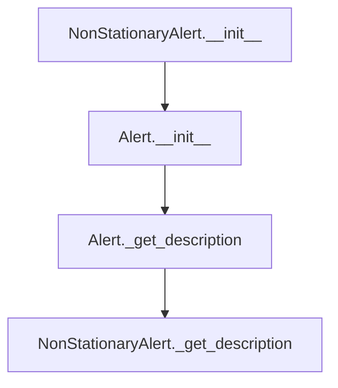

## Raises:
- No explicit exceptions raised by __init__
- Inherits initialization behavior from Alert base class

## Example:
```python
# Create a non-stationary alert for a column named "sales"
alert = NonStationaryAlert(
    values={"test_result": "stationarity_test_failed"},
    column_name="sales",
    is_empty=False
)

# Get the alert description
description = alert._get_description()  # Returns "[sales] is non stationary"
```

### `src.ydata_profiling.model.alerts.NonStationaryAlert.__init__` · *method*

*No documentation generated.*

### `src.ydata_profiling.model.alerts.NonStationaryAlert._get_description` · *method*

## Summary:
Returns a formatted description string indicating that a specific column exhibits non-stationary behavior.

## Description:
This method provides a human-readable description of a non-stationary alert for a particular data column. It is part of the alert system that identifies problematic patterns in datasets, specifically detecting when time series or sequential data lacks stationarity properties.

The method is called during the reporting phase when generating user-facing descriptions of detected issues in the data profile. It's overridden from the base Alert class to provide a more specific message tailored to non-stationary data patterns.

## Args:
    None

## Returns:
    str: A formatted string in the pattern "[{column_name}] is non stationary" where column_name is the name of the affected data column.

## Raises:
    None

## State Changes:
    Attributes READ: self.column_name
    Attributes WRITTEN: None

## Constraints:
    Preconditions: The object must have a valid column_name attribute set during initialization
    Postconditions: The returned string follows a consistent format for all non-stationary alerts

## Side Effects:
    None

## `src.ydata_profiling.model.alerts.SeasonalAlert` · *class*

## Summary:
Represents an alert indicating that a column exhibits seasonal patterns or periodic behavior.

## Description:
The SeasonalAlert class is a specialized alert type that identifies columns in a dataset that display seasonal characteristics or recurring patterns over time. It inherits from the base Alert class and provides specific behavior for seasonal data detection. This alert is typically generated during data profiling when statistical analysis reveals periodic patterns in the data.

## State:
- alert_type: AlertType.SEASONAL (inherited from Alert base class)
- values: Optional[Dict] - Additional metadata about the seasonal pattern, defaults to None
- column_name: Optional[str] - Name of the column exhibiting seasonal behavior, defaults to None
- is_empty: bool - Flag indicating if the column is empty, defaults to False
- fields: Set - Set of related fields, inherited from Alert base class

## Lifecycle:
- Creation: Instantiate with optional values, column_name, and is_empty parameters
- Usage: Typically created by data profiling routines that detect seasonal patterns
- Destruction: No special cleanup required, relies on standard Python garbage collection

## Method Map:
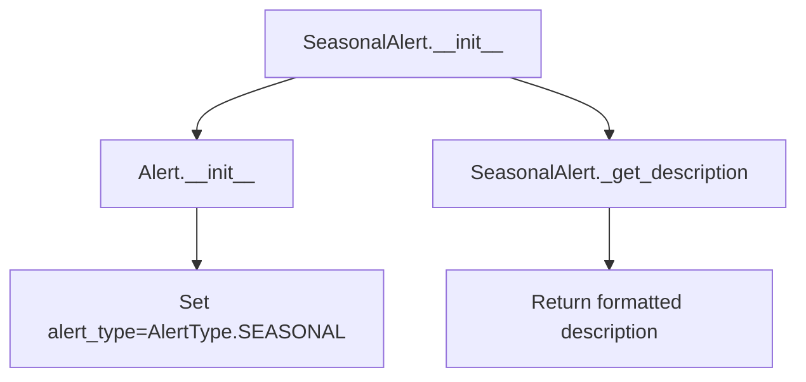

## Raises:
- No explicit exceptions raised by __init__
- Inherits all exceptions from Alert.__init__

## Example:
```python
# Create a seasonal alert for a time series column
alert = SeasonalAlert(
    values={"period": 12, "cycle": "monthly"},
    column_name="sales_data",
    is_empty=False
)

# Get the alert description
description = alert._get_description()  # Returns "[sales_data] is seasonal"
```

### `src.ydata_profiling.model.alerts.SeasonalAlert.__init__` · *method*

## Summary:
Initializes a SeasonalAlert instance with the SEASONAL alert type.

## Description:
Constructs a SeasonalAlert object by calling the parent Alert class constructor with the SEASONAL alert type. This method sets up the alert with the specified values, column name, and empty status flags.

## Args:
    values (Optional[Dict], optional): Dictionary containing alert-specific data. Defaults to None.
    column_name (Optional[str], optional): Name of the column associated with this alert. Defaults to None.
    is_empty (bool, optional): Flag indicating if the alert relates to an empty dataset. Defaults to False.

## Returns:
    None: This method initializes the object state but does not return a value.

## Raises:
    None: This method does not explicitly raise exceptions.

## State Changes:
    Attributes READ: None
    Attributes WRITTEN: 
    - self.alert_type: Set to AlertType.SEASONAL
    - self.values: Set to the provided values parameter or empty dict
    - self.column_name: Set to the provided column_name parameter
    - self._is_empty: Set to the provided is_empty parameter
    - self.fields: Set to an empty set (inherited from parent)

## Constraints:
    Preconditions: None
    Postconditions: The SeasonalAlert instance is properly initialized with alert_type=AlertType.SEASONAL

## Side Effects:
    None: This method performs no I/O operations or external service calls.

### `src.ydata_profiling.model.alerts.SeasonalAlert._get_description` · *method*

## Summary:
Returns a formatted string describing that a column exhibits seasonal patterns.

## Description:
This method provides a human-readable description for seasonal alerts, indicating which column has been identified as seasonal. It overrides the parent Alert class's generic description method to provide more specific information about seasonal data patterns.

The method is called during the alert reporting phase when generating user-facing descriptions of detected data issues. It's part of the alert system that helps users understand statistical patterns in their datasets.

## Args:
    None

## Returns:
    str: A formatted string in the pattern "[{column_name}] is seasonal" indicating the column name that exhibits seasonal behavior.

## Raises:
    None

## State Changes:
    Attributes READ: self.column_name
    Attributes WRITTEN: None

## Constraints:
    Preconditions: The object must have been initialized with a valid column_name attribute
    Postconditions: Returns a string with the exact format "[{column_name}] is seasonal"

## Side Effects:
    None

## `src.ydata_profiling.model.alerts.SkewedAlert` · *class*

## Summary:
Represents an alert indicating that a column in a dataset has a highly skewed distribution.

## Description:
The SkewedAlert class is used to signal when a dataset column exhibits significant skewness in its distribution. This alert is typically generated during data profiling when statistical analysis reveals that a column's values are not normally distributed. The alert provides information about the skewness coefficient to help users understand the degree of skewness in the data.

## State:
- alert_type: AlertType.SKEWED (inherited from Alert parent class)
- values: Optional[Dict] - Contains skewness information with key 'skewness'
- column_name: Optional[str] - Name of the column that is skewed
- fields: Set - Always contains {"skewness"} (inherited from Alert parent class)
- is_empty: bool - Indicates if the column is empty (inherited from Alert parent class)

## Lifecycle:
- Creation: Instantiate with column_name and optional values dictionary containing skewness data
- Usage: Typically created by data profiling routines when skewness is detected
- Destruction: No special cleanup required; uses standard object lifecycle

## Method Map:
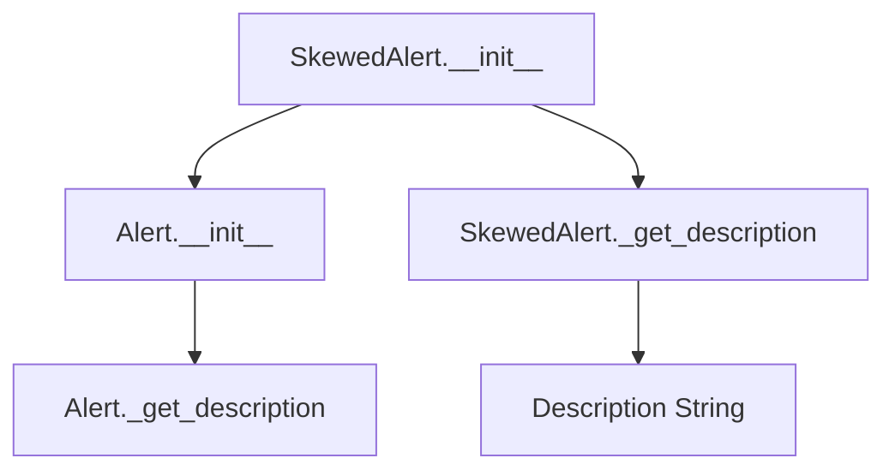

## Raises:
- No explicit exceptions raised by __init__
- May raise exceptions from parent Alert.__init__ if invalid parameters are passed

## Example:
```python
# Create a skewed alert for a column with skewness value
alert = SkewedAlert(
    values={'skewness': 2.5},
    column_name='income',
    is_empty=False
)

# Get the alert description
description = alert._get_description()  # "[income] is highly skewed(γ1 = 2.5)"

# Create a skewed alert without skewness data
alert2 = SkewedAlert(column_name='age')
description2 = alert2._get_description()  # "[age] is highly skewed"
```

### `src.ydata_profiling.model.alerts.SkewedAlert.__init__` · *method*

## Summary:
Initializes a SkewedAlert instance to represent a skewness alert for a data column.

## Description:
Creates a new SkewedAlert object that indicates a column has significant skewness. This method serves as a specialized constructor that sets up the alert with the SKEWED alert type and establishes the skewness field requirement. The alert is typically generated during data profiling when statistical analysis reveals that a column's distribution deviates significantly from normal distribution.

## Args:
    values (Optional[Dict], default=None): Dictionary containing skewness statistics, typically including the skewness value under the 'skewness' key.
    column_name (Optional[str], default=None): Name of the column that triggered this alert.
    is_empty (bool, default=False): Flag indicating whether the column is empty.

## Returns:
    None: This method initializes the object's state but does not return a value.

## Raises:
    None: This method does not explicitly raise exceptions, though parent class initialization may raise exceptions for invalid parameters.

## State Changes:
    Attributes READ: None
    Attributes WRITTEN: 
    - self.fields: Set containing "skewness" to indicate the field being analyzed
    - self.alert_type: Set to AlertType.SKEWED
    - self.values: Assigned the provided values parameter
    - self.column_name: Assigned the provided column_name parameter
    - self._is_empty: Assigned the provided is_empty parameter

## Constraints:
    Preconditions: 
    - The values parameter should contain a 'skewness' key if it's not None
    - The column_name parameter should be a valid string identifier if provided
    
    Postconditions:
    - The alert instance will have its alert_type set to AlertType.SKEWED
    - The fields attribute will contain exactly {'skewness'}
    - All provided parameters will be stored in their respective instance attributes

## Side Effects:
    None: This method performs no I/O operations or external service calls. It only initializes object attributes.

### `src.ydata_profiling.model.alerts.SkewedAlert._get_description` · *method*

## Summary:
Generates a human-readable description of a highly skewed column alert, optionally including skewness statistics.

## Description:
Creates a descriptive string indicating that a specific column exhibits high skewness. This method is part of the SkewedAlert class and overrides the parent Alert class's _get_description method to provide specialized messaging for skewness detection. The method is typically called during report generation when analyzing data distributions to communicate skewness issues to users.

## Args:
    None

## Returns:
    str: A formatted description string in the format "[column_name] is highly skewed" or "[column_name] is highly skewed(γ1 = value)" when skewness statistics are available.

## Raises:
    None

## State Changes:
    Attributes READ: self.column_name, self.values
    Attributes WRITTEN: None

## Constraints:
    Preconditions: 
    - self.column_name must be a valid string or None
    - self.values must be either None or a dictionary containing a 'skewness' key
    Postconditions:
    - Returns a properly formatted string describing the skewness alert
    - The returned string always starts with "[column_name] is highly skewed"

## Side Effects:
    None

## `src.ydata_profiling.model.alerts.TypeDateAlert` · *class*

## Summary:
Represents an alert indicating that a column contains only datetime values but is classified as categorical type.

## Description:
The TypeDateAlert class is used to signal when a data column appears to contain datetime values but is currently categorized as a categorical type. This typically occurs when datetime data is incorrectly parsed as strings or categorical data. The alert suggests converting the column to proper datetime type using `pd.to_datetime()`.

This class is part of the alert system that identifies potential data type mismatches in profiling reports. It extends the base Alert class to provide specific functionality for datetime-related issues.

## State:
- alert_type: AlertType enum value set to TYPE_DATE (indicating this is a datetime type alert)
- values: Optional dictionary containing additional metadata about the alert (default: None)
- column_name: Optional string representing the name of the affected column (default: None)
- is_empty: Boolean flag indicating if the column is empty (default: False)
- fields: Set of field names (inherited from Alert parent class, default: empty set)

## Lifecycle:
- Creation: Instantiate with optional parameters values, column_name, and is_empty
- Usage: Typically created by the profiling system when analyzing data types and detecting datetime values in categorical columns
- Destruction: No special cleanup required; relies on Python's garbage collection

## Method Map:
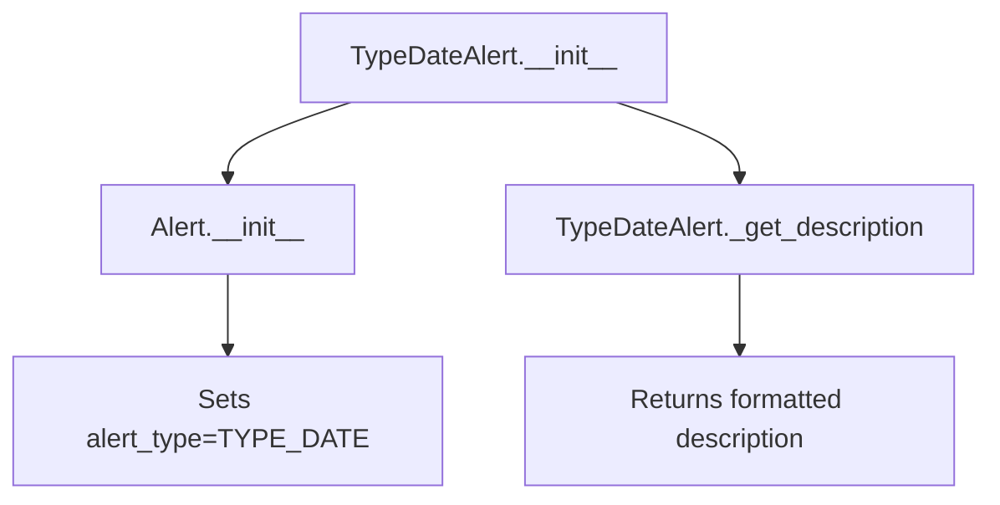

## Raises:
- No explicit exceptions raised by __init__
- Inherits initialization behavior from Alert parent class

## Example:
```python
# Create a TypeDateAlert for a column named "date_column"
alert = TypeDateAlert(
    values={"sample_values": ["2023-01-01", "2023-01-02"]},
    column_name="date_column",
    is_empty=False
)

# Get the alert description
description = alert._get_description()
# Returns: "[date_column] only contains datetime values, but is categorical. Consider applying `pd.to_datetime()`"
```

### `src.ydata_profiling.model.alerts.TypeDateAlert.__init__` · *method*

## Summary:
Initializes a TypeDateAlert instance with the specified configuration for datetime type detection issues.

## Description:
Creates a new TypeDateAlert object that indicates a column containing only datetime values but is classified as categorical. This alert is triggered when the profiling detects datetime data in a categorical column that should be converted to proper datetime type using `pd.to_datetime()`.

## Args:
    values (Optional[Dict]): Dictionary containing additional metadata about the alert, such as field information. Defaults to None.
    column_name (Optional[str]): Name of the column triggering the alert. Defaults to None.
    is_empty (bool): Flag indicating if the column is empty. Defaults to False.

## Returns:
    None: This method initializes the object's state but does not return a value.

## Raises:
    None: This method does not explicitly raise exceptions.

## State Changes:
    Attributes READ: None
    Attributes WRITTEN: 
    - self.alert_type: Set to AlertType.TYPE_DATE
    - self.values: Set to the provided values parameter or empty dict
    - self.column_name: Set to the provided column_name parameter
    - self._is_empty: Set to the provided is_empty parameter
    - self.fields: Set to empty set via parent class initialization

## Constraints:
    Preconditions: None
    Postconditions: The object is initialized with alert_type=AlertType.TYPE_DATE and the provided parameters.

## Side Effects:
    None: This method performs no I/O operations or external service calls.

### `src.ydata_profiling.model.alerts.TypeDateAlert._get_description` · *method*

## Summary:
Returns a descriptive message indicating that a column contains only datetime values but is classified as categorical.

## Description:
This method provides a human-readable description for TypeDateAlert instances, explaining that a column identified as categorical actually contains only datetime values. This helps users understand when their data types need adjustment. The method is called during report generation to display alert messages to users.

## Args:
    None

## Returns:
    str: A formatted string describing the alert with the column name and suggesting to apply pd.to_datetime().

## Raises:
    None

## State Changes:
    Attributes READ: self.column_name
    Attributes WRITTEN: None

## Constraints:
    Preconditions: The alert instance must have a valid column_name attribute set during initialization
    Postconditions: The returned string follows a consistent format for all TypeDateAlert instances

## Side Effects:
    None

## `src.ydata_profiling.model.alerts.UniformAlert` · *class*

## Summary:
Represents an alert indicating that a column has a uniform distribution.

## Description:
The UniformAlert class is used to signal when a data column exhibits a uniform distribution pattern. This alert type is specifically designed to identify columns where all values appear with equal frequency, which may indicate issues with data quality or sampling bias. The class extends the base Alert functionality to provide a specialized description for uniform distribution scenarios.

## State:
- alert_type: AlertType.UNIFORM (set during initialization)
- values: Optional[Dict] - Additional metadata about the uniform distribution, defaults to empty dict
- column_name: Optional[str] - Name of the column triggering the alert
- is_empty: bool - Flag indicating if the column is empty, defaults to False
- fields: Set - Set of field names associated with the alert, defaults to empty set
- _anchor_id: Optional[str] - Internal ID used for HTML anchors, lazily computed

## Lifecycle:
- Creation: Instantiate with column_name and optional values parameters
- Usage: Typically created by data profiling analysis routines when uniform distribution is detected
- Destruction: No special cleanup required, relies on standard Python garbage collection

## Method Map:
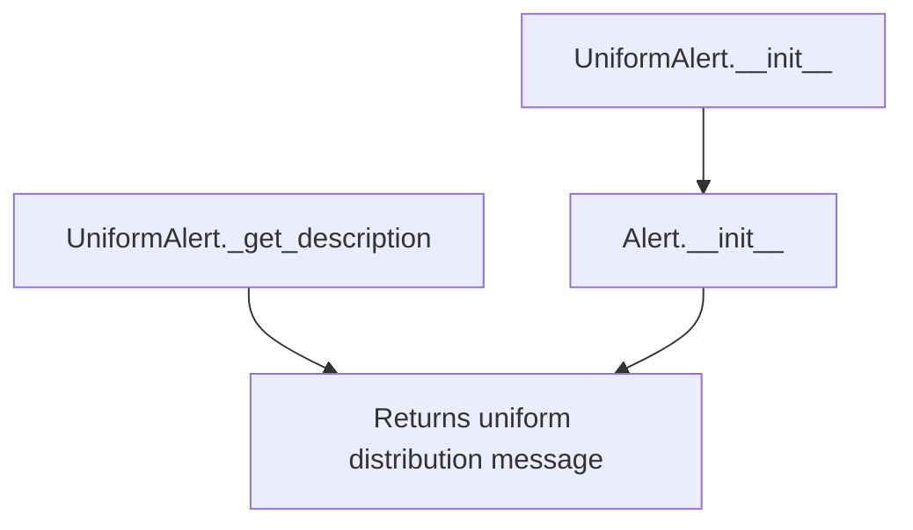

## Raises:
- No explicit exceptions raised by the constructor
- Inherits all exceptions from Alert.__init__ if invalid parameters are passed

## Example:
```python
# Create a uniform distribution alert for a column named "age"
alert = UniformAlert(column_name="age")

# Get the alert description
description = alert._get_description()  # Returns "[age] is uniformly distributed"

# Create with additional values
alert_with_values = UniformAlert(
    column_name="score", 
    values={"min": 0, "max": 100}
)
```

### `src.ydata_profiling.model.alerts.UniformAlert.__init__` · *method*

## Summary:
Initializes a UniformAlert instance with uniform distribution alert properties.

## Description:
Creates a UniformAlert object that represents an alert indicating a column has a uniform distribution. This method serves as a specialized constructor that sets the alert type to UNIFORM while maintaining compatibility with the base Alert class interface.

## Args:
    values (Optional[Dict], optional): Dictionary containing alert-specific data. Defaults to None.
    column_name (Optional[str], optional): Name of the column triggering the alert. Defaults to None.
    is_empty (bool, optional): Flag indicating if the column is empty. Defaults to False.

## Returns:
    None: This method initializes the object state but does not return a value.

## Raises:
    None: This method does not explicitly raise exceptions.

## State Changes:
    Attributes READ: None
    Attributes WRITTEN: 
    - self.alert_type: Set to AlertType.UNIFORM
    - self.values: Set to the provided values parameter or empty dict
    - self.column_name: Set to the provided column_name parameter
    - self._is_empty: Set to the provided is_empty parameter
    - self.fields: Set to an empty set (inherited from parent constructor)

## Constraints:
    Preconditions: None
    Postconditions: 
    - The alert_type attribute is always set to AlertType.UNIFORM
    - The object maintains all standard Alert class properties

## Side Effects:
    None: This method performs no I/O operations or external service calls.

### `src.ydata_profiling.model.alerts.UniformAlert._get_description` · *method*

## Summary:
Returns a formatted description indicating that a column exhibits uniform distribution.

## Description:
This method provides a human-readable description for uniform distribution alerts. It is called during the reporting phase when generating alert messages for data profiling. The method is part of the UniformAlert class, which specifically identifies columns that follow a uniform distribution pattern. This method overrides the parent Alert class's _get_description method to provide a more specific message tailored to uniform distribution alerts.

## Args:
    None

## Returns:
    str: A formatted string in the format "[{column_name}] is uniformly distributed" where column_name is the name of the column being analyzed.

## Raises:
    None

## State Changes:
    Attributes READ: self.column_name
    Attributes WRITTEN: None

## Constraints:
    Preconditions: The object must have a valid column_name attribute set during initialization.
    Postconditions: The returned string follows a consistent format for uniform distribution alerts.

## Side Effects:
    None

## `src.ydata_profiling.model.alerts.UniqueAlert` · *class*

## Summary:
Represents an alert indicating that a column contains unique values.

## Description:
The UniqueAlert class is used to signal when a data column has unique values across all rows. This alert is typically generated during data profiling to highlight columns where each value appears only once, which may indicate identifiers, primary keys, or other unique identifiers in the dataset.

## State:
- alert_type: AlertType.UNIQUE - identifies this as a unique values alert
- values: Optional[Dict] - additional metadata about the unique values (default: None)
- column_name: Optional[str] - name of the column triggering the alert (default: None)
- fields: Set[str] - set containing field names: {"n_distinct", "p_distinct", "n_unique", "p_unique"} - these represent counts and percentages of distinct/unique values
- is_empty: bool - flag indicating if the column is empty (default: False)

## Lifecycle:
- Creation: Instantiate with optional values, column_name, and is_empty parameters
- Usage: Typically created by data profiling routines when analyzing column uniqueness
- Destruction: No special cleanup required; relies on Python's garbage collection

## Method Map:
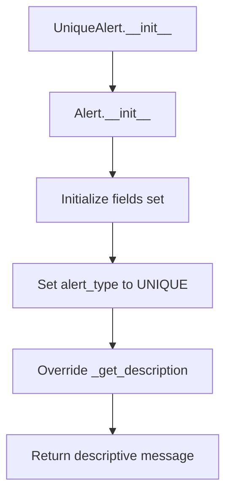

## Raises:
- No explicit exceptions raised by __init__
- Inherits all exceptions from Alert.__init__

## Example:
```python
# Create a UniqueAlert for a column named "user_id"
alert = UniqueAlert(
    values={"n_distinct": 1000, "p_distinct": 1.0, "n_unique": 1000, "p_unique": 1.0},
    column_name="user_id",
    is_empty=False
)

# Get the alert description
description = alert._get_description()  # Returns "[user_id] has unique values"
```

### `src.ydata_profiling.model.alerts.UniqueAlert.__init__` · *method*

## Summary:
Initializes a UniqueAlert object with specific alert type and field definitions for columns with unique values.

## Description:
Creates a UniqueAlert instance that indicates a column contains unique values. This method serves as a specialized constructor that sets the alert type to UNIQUE and defines the standard fields associated with uniqueness checks (distinct count, percentage of distinct values, unique count, and percentage of unique values). The alert is typically generated during data profiling when a column's uniqueness characteristics are evaluated.

## Args:
    values (Optional[Dict], optional): Dictionary containing statistical values related to uniqueness. Defaults to None.
    column_name (Optional[str], optional): Name of the column being analyzed. Defaults to None.
    is_empty (bool, optional): Flag indicating if the column is empty. Defaults to False.

## Returns:
    None: This is a constructor method that initializes the object state.

## Raises:
    None: This method does not explicitly raise exceptions.

## State Changes:
    Attributes READ: None
    Attributes WRITTEN: 
    - self.fields: Set containing {"n_distinct", "p_distinct", "n_unique", "p_unique"}
    - self.alert_type: Set to AlertType.UNIQUE
    - self.values: Set to the provided values parameter or empty dict
    - self.column_name: Set to the provided column_name parameter
    - self._is_empty: Set to the provided is_empty parameter

## Constraints:
    Preconditions: 
    - The alert_type parameter in the parent constructor must accept AlertType.UNIQUE
    - The fields parameter must be a valid set of field names
    - All parameters should be of the expected types (Dict for values, str for column_name, bool for is_empty)
    
    Postconditions:
    - The object will have alert_type set to AlertType.UNIQUE
    - The object will have fields set to {"n_distinct", "p_distinct", "n_unique", "p_unique"}
    - The object will have values, column_name, and _is_empty attributes properly initialized

## Side Effects:
    None: This method performs no I/O operations or external service calls. It only initializes object attributes.

### `src.ydata_profiling.model.alerts.UniqueAlert._get_description` · *method*

## Summary:
Returns a human-readable description indicating that a column contains unique values.

## Description:
This method provides a formatted string description specifically for UniqueAlert instances, indicating that the associated column contains only unique values. It overrides the base Alert class implementation to provide more context-specific messaging.

The method is called during report generation when displaying alert information to users, helping them quickly understand what issue was detected in their data.

## Args:
    None

## Returns:
    str: A formatted string in the pattern "[column_name] has unique values" where column_name is the name of the column being analyzed.

## Raises:
    None

## State Changes:
    Attributes READ: self.column_name
    Attributes WRITTEN: None

## Constraints:
    Preconditions: 
    - The UniqueAlert instance must have a valid column_name attribute set during initialization
    - The column_name attribute should not be None or empty
    
    Postconditions:
    - The returned string follows a consistent format for all UniqueAlert instances
    - The method is deterministic and returns the same result for identical inputs

## Side Effects:
    None

## `src.ydata_profiling.model.alerts.UnsupportedAlert` · *class*

## Summary:
Represents an alert indicating that a column contains an unsupported data type requiring cleaning or further analysis.

## Description:
The UnsupportedAlert class is used to signal when a column in a dataset contains data of a type that is not supported by the profiling system. This typically occurs when data needs cleaning or transformation before it can be properly analyzed. The class extends the base Alert class and specializes in handling unsupported data type scenarios.

## State:
- alert_type: AlertType.UNSUPPORTED (constant, enforced by constructor)
- values: Optional[Dict] - Additional metadata about the unsupported data, defaults to None
- column_name: Optional[str] - Name of the column triggering the alert, defaults to None  
- is_empty: bool - Flag indicating if the column is empty, defaults to False
- fields: Set - Set of field names associated with the alert (inherited from Alert parent)

## Lifecycle:
- Creation: Instantiate with optional values, column_name, and is_empty parameters
- Usage: Typically created by data profiling routines when encountering unsupported data types
- Destruction: No special cleanup required, relies on standard Python garbage collection

## Method Map:
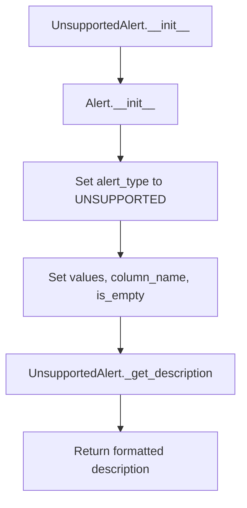

## Raises:
- No explicit exceptions raised by the constructor
- Inherited from Alert parent class, which may raise exceptions during initialization if invalid parameters are passed

## Example:
```python
# Create an unsupported alert for a column
alert = UnsupportedAlert(
    values={"detected_type": "binary_string"},
    column_name="user_status",
    is_empty=False
)

# Get the alert description
description = alert._get_description()
# Returns: "[user_status] is an unsupported type, check if it needs cleaning or further analysis"
```

### `src.ydata_profiling.model.alerts.UnsupportedAlert.__init__` · *method*

## Summary:
Initializes an UnsupportedAlert instance with the specified configuration and sets its alert type to UNSUPPORTED.

## Description:
This constructor creates an alert instance indicating that a column contains unsupported data types that require further analysis or cleaning. It inherits from the base Alert class and configures the alert with the UNSUPPORTED type flag.

## Args:
    values (Optional[Dict], optional): Additional metadata about the alert. Defaults to None.
    column_name (Optional[str], optional): Name of the column triggering the alert. Defaults to None.
    is_empty (bool, optional): Flag indicating if the column is empty. Defaults to False.

## Returns:
    None: This method initializes the object state but does not return a value.

## Raises:
    None: This method does not explicitly raise exceptions.

## State Changes:
    Attributes READ: None
    Attributes WRITTEN: 
    - self.alert_type: Set to AlertType.UNSUPPORTED
    - self.values: Set to the provided values parameter or empty dict
    - self.column_name: Set to the provided column_name parameter
    - self._is_empty: Set to the provided is_empty parameter
    - self.fields: Set to the provided fields parameter or empty set

## Constraints:
    Preconditions: None
    Postconditions: The instance will have its alert_type set to AlertType.UNSUPPORTED and all provided parameters stored in respective attributes.

## Side Effects:
    None: This method performs no I/O operations or external service calls.

### `src.ydata_profiling.model.alerts.UnsupportedAlert._get_description` · *method*

## Summary:
Returns a descriptive message indicating that a column contains an unsupported data type requiring cleaning or further analysis.

## Description:
This method provides a human-readable description for unsupported column type alerts. It is called during report generation to display meaningful information about columns that contain data types not supported by the profiling system. The method overrides the parent Alert class implementation to provide more specific messaging for unsupported types.

## Args:
    None

## Returns:
    str: A formatted string describing the unsupported column type alert in the format "[column_name] is an unsupported type, check if it needs cleaning or further analysis"

## Raises:
    None

## State Changes:
    Attributes READ: self.column_name
    Attributes WRITTEN: None

## Constraints:
    Preconditions: The object must have a valid column_name attribute set during initialization
    Postconditions: The returned string always follows the same format pattern regardless of column_name value

## Side Effects:
    None

## `src.ydata_profiling.model.alerts.ZerosAlert` · *class*

## Summary:
Represents an alert indicating that a column contains zero values, either a specific count or predominantly zeros.

## Description:
The ZerosAlert class is used to signal when a data column contains zero values. It can indicate either a specific number of zeros with percentage, or simply flag that a column has predominantly zeros. This alert type is part of the profiling system's alert mechanism for identifying data quality issues.

## State:
- values: Optional[Dict] - Dictionary containing zero count statistics with keys 'n_zeros' and 'p_zeros', or None
- column_name: Optional[str] - Name of the column being analyzed, or None
- is_empty: bool - Flag indicating if the column is empty, defaults to False
- alert_type: AlertType.ZEROS - Constant indicating this is a zeros alert type
- fields: Set[str] - Set containing the required field names {'n_zeros', 'p_zeros'}

## Lifecycle:
- Creation: Instantiate with optional values dict, column_name string, and is_empty boolean
- Usage: Typically created by profiling routines and used to generate descriptive alerts
- Destruction: No special cleanup required, relies on Python garbage collection

## Method Map:
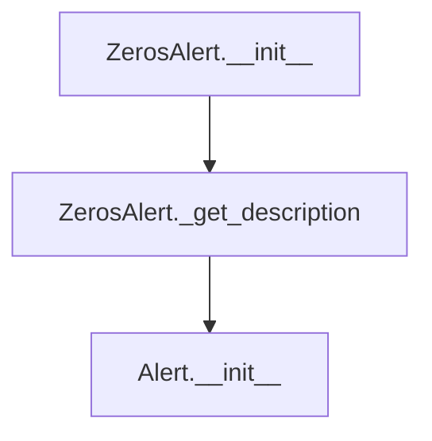

## Raises:
- No explicit exceptions documented in ZerosAlert.__init__

## Example:
```python
# Create alert with specific zero counts
alert1 = ZerosAlert(
    values={'n_zeros': 50, 'p_zeros': 0.25},
    column_name='age',
    is_empty=False
)

# Create alert for predominantly zeros
alert2 = ZerosAlert(
    values=None,
    column_name='feature_x',
    is_empty=False
)
```

### `src.ydata_profiling.model.alerts.ZerosAlert.__init__` · *method*

## Summary:
Initializes a ZerosAlert object that tracks columns with zero values, storing count and percentage of zeros.

## Description:
The ZerosAlert constructor creates an alert instance specifically for identifying columns that contain zero values. It inherits from the base Alert class and sets up the alert with the ZEROS alert type, initializing tracking fields for zero counts and percentages.

## Args:
    values (Optional[Dict], default=None): Dictionary containing zero statistics (n_zeros, p_zeros)
    column_name (Optional[str], default=None): Name of the column being analyzed
    is_empty (bool, default=False): Flag indicating if the column is empty

## Returns:
    None: This method initializes the object state but does not return a value

## Raises:
    None: This method does not explicitly raise exceptions

## State Changes:
    Attributes READ: None
    Attributes WRITTEN: 
    - self.fields: Set containing {"n_zeros", "p_zeros"}
    - self.alert_type: Set to AlertType.ZEROS
    - self.values: Set to the provided values parameter or empty dict
    - self.column_name: Set to the provided column_name parameter
    - self._is_empty: Set to the provided is_empty parameter

## Constraints:
    Preconditions: 
    - The parent Alert class must be properly initialized with valid parameters
    - AlertType.ZEROS should be a valid enum value in the AlertType enum
    
    Postconditions:
    - The object will have fields set to {"n_zeros", "p_zeros"}
    - The alert_type will be set to AlertType.ZEROS
    - All provided parameters will be stored as instance attributes

## Side Effects:
    None: This method performs no I/O operations or external service calls

### `src.ydata_profiling.model.alerts.ZerosAlert._get_description` · *method*

## Summary:
Generates a human-readable description of zero value counts in a column.

## Description:
Returns a formatted string describing the zero values found in a column. This method is used to provide clear, informative alerts about columns that contain zero values, either with specific counts and percentages or indicating a predominance of zeros.

## Args:
    None

## Returns:
    str: A formatted description string in one of two formats:
         - When values are available: "[column_name] has n_zeros (p_zeros%) zeros"
         - When values are not available: "[column_name] has predominantly zeros"

## Raises:
    None

## State Changes:
    Attributes READ: self.values, self.column_name
    Attributes WRITTEN: None

## Constraints:
    Preconditions: 
    - self.column_name must be a valid string or None
    - self.values must be either None or a dictionary containing 'n_zeros' and 'p_zeros' keys
    
    Postconditions:
    - Returns a properly formatted string describing zero values in the column
    - The returned string follows a consistent format for alert reporting

## Side Effects:
    None

## `src.ydata_profiling.model.alerts.RejectedAlert` · *class*

## Summary:
Represents an alert with REJECTED type for data profiling.

## Description:
The RejectedAlert class is a subclass of Alert that specifically indicates when a column was rejected during data profiling. It inherits all functionality from the Alert base class while setting its alert type to REJECTED.

## State:
- alert_type: AlertType - Set to AlertType.REJECTED by the constructor
- values: Optional[Dict] - Additional data associated with the rejection, passed through from the parent class
- column_name: Optional[str] - Name of the column that was rejected, passed through from the parent class
- _is_empty: bool - Internal boolean flag indicating if the column is empty, set from the is_empty parameter
- fields: Set - Set of field names associated with the alert, initialized from the parent class

## Lifecycle:
- Creation: Instantiate with optional values, column_name, and is_empty parameters
- Usage: Called by profiling logic when column validation fails
- Destruction: No special cleanup required

## Method Map:
```mermaid
graph TD
    A[RejectedAlert.__init__] --> B[Alert.__init__]
    B --> C[Set alert_type to REJECTED]
    A --> D[RejectedAlert._get_description]
    D --> E[Return formatted description]
```

## Raises:
- No explicit exceptions raised by __init__
- Inherits initialization behavior from Alert class

## Example:
```python
# Create a rejected alert for a column
alert = RejectedAlert(
    values={"reason": "Invalid data format"},
    column_name="age",
    is_empty=False
)

# Get the description
description = alert._get_description()  # "[age] was rejected"
```

### `src.ydata_profiling.model.alerts.RejectedAlert.__init__` · *method*

## Summary:
Initializes a RejectedAlert instance that indicates a column was rejected during data profiling.

## Description:
This constructor creates a RejectedAlert object, which is used to signal that a particular column was rejected during the profiling process. The alert is typically generated when a column fails validation checks or doesn't meet the requirements for further analysis. This method delegates initialization to the parent Alert class with the specific alert type set to REJECTED.

## Args:
    values (Optional[Dict], optional): Additional metadata about the rejection. Defaults to None.
    column_name (Optional[str], optional): Name of the column that was rejected. Defaults to None.
    is_empty (bool, optional): Flag indicating if the column is empty. Defaults to False.

## Returns:
    None: This method initializes the object state but does not return a value.

## Raises:
    None: This method does not explicitly raise exceptions.

## State Changes:
    Attributes READ: None
    Attributes WRITTEN: 
    - self.alert_type: Set to AlertType.REJECTED
    - self.values: Set to the provided values parameter or empty dict
    - self.column_name: Set to the provided column_name parameter
    - self._is_empty: Set to the provided is_empty parameter
    - self.fields: Set via parent class initialization

## Constraints:
    Preconditions: 
    - The alert_type parameter must be AlertType.REJECTED (implicitly enforced by the constructor call)
    - All parameters are optional and will be handled gracefully by the parent class
    
    Postconditions:
    - The created object will have alert_type set to REJECTED
    - The object will have proper initialization of all Alert base class attributes

## Side Effects:
    None: This method performs only object initialization with no external I/O or side effects.

### `src.ydata_profiling.model.alerts.RejectedAlert._get_description` · *method*

## Summary:
Returns a formatted description indicating that a specific column was rejected.

## Description:
This method provides a human-readable description for a RejectedAlert instance, specifically indicating which column was rejected. It overrides the parent Alert class's _get_description method to provide a more specific message for rejected alerts.

The method is typically called during report generation when displaying alert information to users, helping them understand which columns were rejected during data profiling.

## Args:
    None

## Returns:
    str: A formatted string in the pattern "[column_name] was rejected" where column_name is the name of the rejected column.

## Raises:
    None

## State Changes:
    Attributes READ: self.column_name
    Attributes WRITTEN: None

## Constraints:
    Preconditions: The RejectedAlert instance must have a valid column_name attribute set during initialization.
    Postconditions: The returned string always follows the format "[column_name] was rejected".

## Side Effects:
    None

## `src.ydata_profiling.model.alerts.check_table_alerts` · *function*

*No documentation generated.*

## `src.ydata_profiling.model.alerts.numeric_alerts` · *function*

## Summary:
Generates a list of numerical alerts based on statistical properties of a data column's summary statistics.

## Description:
Processes numerical summary statistics to detect potential data quality issues and returns appropriate alert objects. This function serves as a centralized point for identifying common numerical data problems such as skewness, infinite values, zero values, and uniform distributions.

## Args:
    config: Configuration object containing threshold values for alert detection
    summary: Dictionary containing numerical summary statistics for a data column

## Returns:
    List[Alert]: A list of Alert objects representing detected data quality issues. May be empty if no issues are found.

## Raises:
    None explicitly raised

## Constraints:
    Preconditions:
    - The summary dictionary must contain the keys: "skewness", "p_infinite", "p_zeros"
    - The config object must have vars.num attributes with skewness_threshold and chi_squared_threshold properties
    - The summary dictionary may optionally contain "chi_squared" key with "pvalue" field

    Postconditions:
    - Returns a list of Alert objects (can be empty)
    - Does not modify the input parameters

## Side Effects:
    None

## Control Flow:
```mermaid
flowchart TD
    A[Start numeric_alerts] --> B{skewness_alert}
    B -- True --> C[Add SkewedAlert]
    B -- False --> D{alert_value p_infinite}
    D -- True --> E[Add InfiniteAlert]
    D -- False --> F{alert_value p_zeros}
    F -- True --> G[Add ZerosAlert]
    F -- False --> H{"chi_squared" in summary}
    H -- True --> I{summary["chi_squared"]["pvalue"] > threshold}
    I -- True --> J[Add UniformAlert]
    I -- False --> K[Return alerts]
    H -- False --> K
    C --> K
    E --> K
    G --> K
    J --> K
```

## Examples:
```python
# Basic usage
config = Settings()
summary = {
    "skewness": 3.5,
    "p_infinite": 0.0,
    "p_zeros": 0.0,
    "chi_squared": {"pvalue": 0.95}
}
alerts = numeric_alerts(config, summary)
# Returns [SkewedAlert] because skewness exceeds threshold

# No alerts case
config = Settings()
summary = {
    "skewness": 0.5,
    "p_infinite": 0.0,
    "p_zeros": 0.0
}
alerts = numeric_alerts(config, summary)
# Returns [] because no thresholds are exceeded
```

## `src.ydata_profiling.model.alerts.timeseries_alerts` · *function*

## Summary:
Generates time series-specific alerts by extending numeric alerts with stationarity and seasonality indicators.

## Description:
Creates a list of alerts for time series data by combining general numeric alerts with time series domain-specific alerts. This function adds alerts based on time series characteristics such as stationarity and seasonality patterns.

## Args:
    config (Settings): Configuration settings that control alert thresholds and behaviors
    summary (dict): Dictionary containing time series summary statistics including:
        - "stationary" (bool): Indicates if the time series is stationary
        - "seasonal" (bool): Indicates if the time series exhibits seasonal patterns
        - Other numeric summary statistics used by numeric_alerts function

## Returns:
    List[Alert]: A list of Alert objects representing detected issues in the time series data, including:
        - Base numeric alerts from numeric_alerts function
        - NonStationaryAlert if the series is non-stationary
        - SeasonalAlert if the series exhibits seasonal patterns

## Raises:
    None explicitly raised - relies on underlying functions that may raise exceptions

## Constraints:
    Preconditions:
        - summary dictionary must contain "stationary" and "seasonal" keys
        - config must be a valid Settings object
    Postconditions:
        - Always returns a list of Alert objects (possibly empty)
        - The returned list includes all numeric alerts plus time series specific alerts

## Side Effects:
    None - Pure function with no external state mutations or I/O operations

## Control Flow:
```mermaid
flowchart TD
    A[Start timeseries_alerts] --> B[Call numeric_alerts]
    B --> C{summary["stationary"] is False?}
    C -->|Yes| D[Append NonStationaryAlert]
    C -->|No| E[Skip NonStationaryAlert]
    D --> F[Append SeasonalAlert]
    E --> F
    F --> G[Return alerts list]
```

## Examples:
```python
# Basic usage
config = Settings()
summary = {
    "stationary": False,
    "seasonal": True,
    "skewness": 2.5,
    "p_infinite": 0.0,
    "p_zeros": 0.015
}
alerts = timeseries_alerts(config, summary)
# Returns list containing NonStationaryAlert and SeasonalAlert plus numeric alerts
```

## `src.ydata_profiling.model.alerts.categorical_alerts` · *function*

## Summary:
Generates a list of categorical data quality alerts based on statistical properties and thresholds defined in the configuration.

## Description:
This function evaluates categorical data summary statistics against configured thresholds to identify potential data quality issues. It creates appropriate Alert objects for each detected issue, enabling users to quickly identify problems such as high cardinality, uniform distribution, date formatting issues, constant string lengths, or severe imbalance in categories.

## Args:
    config (Settings): Configuration object containing threshold values for categorical data analysis
    summary (dict): Dictionary containing categorical data summary statistics including:
        - n_distinct: Number of distinct values (int)
        - chi_squared: Dictionary with pvalue key for chi-squared test results (float)
        - date_warning: Boolean indicating date parsing warnings (bool)
        - composition: Dictionary with min_length and max_length keys (int)
        - imbalance: Imbalance ratio value (float)

## Returns:
    List[Alert]: A list of Alert objects representing detected data quality issues. May be empty if no issues are detected.

## Raises:
    None explicitly raised - all conditions are checked before creating alerts

## Constraints:
    Preconditions:
        - config must be a valid Settings object with vars.cat attributes properly initialized
        - summary must be a dictionary with expected categorical data keys
    Postconditions:
        - Always returns a list of Alert objects (empty list if no alerts)
        - No modifications to input parameters occur

## Side Effects:
    None - Pure function with no external state mutations or I/O operations

## Control Flow:
```mermaid
flowchart TD
    A[Start categorical_alerts] --> B{summary.n_distinct > threshold?}
    B -- Yes --> C[Add HighCardinalityAlert]
    B -- No --> D[Continue]
    D --> E{chi_squared in summary AND pvalue > threshold?}
    E -- Yes --> F[Add UniformAlert]
    E -- No --> G[Continue]
    G --> H{date_warning in summary?}
    H -- Yes --> I[Add TypeDateAlert]
    H -- No --> J[Continue]
    J --> K{composition in summary AND min_length == max_length?}
    K -- Yes --> L[Add ConstantLengthAlert]
    K -- No --> M[Continue]
    M --> N{imbalance in summary AND imbalance > threshold?}
    N -- Yes --> O[Add ImbalanceAlert]
    N -- No --> P[Return alerts list]
```

## Examples:
```python
# Basic usage with configuration and summary
config = Settings()
summary = {
    "n_distinct": 1000,
    "chi_squared": {"pvalue": 0.9},
    "date_warning": True,
    "composition": {"min_length": 5, "max_length": 5},
    "imbalance": 0.8
}
alerts = categorical_alerts(config, summary)
# Returns list with HighCardinalityAlert, UniformAlert, TypeDateAlert, 
# ConstantLengthAlert, and ImbalanceAlert
```

## `src.ydata_profiling.model.alerts.boolean_alerts` · *function*

*No documentation generated.*

## `src.ydata_profiling.model.alerts.generic_alerts` · *function*

*No documentation generated.*

## `src.ydata_profiling.model.alerts.supported_alerts` · *function*

## Summary:
Determines and returns appropriate alert objects based on the distinct value count in a data summary.

## Description:
This function evaluates the distinct value count in a data summary dictionary and generates relevant alerts when specific conditions are met. It serves as a decision point for identifying data quality issues such as unique columns or constant columns. The function is designed to be called during data profiling to automatically detect and flag potential data quality concerns.

## Args:
    summary (dict): A dictionary containing statistical summary information about a data column, including keys "n" (total count) and "n_distinct" (distinct value count).

## Returns:
    List[Alert]: A list of Alert objects representing detected data quality issues. The list may be empty if no alerts are triggered, or contain one or more of the following alert types:
        - UniqueAlert: When all values in a column are distinct (n_distinct equals n)
        - ConstantAlert: When all values in a column are identical (n_distinct equals 1)

## Raises:
    None explicitly raised by this function.

## Constraints:
    Preconditions:
        - The summary dictionary must contain the key "n" representing total count of values
        - The summary dictionary must contain the key "n_distinct" representing distinct value count
        - Both "n" and "n_distinct" values must be numeric

    Postconditions:
        - Always returns a list of Alert objects (empty list if no alerts)
        - The returned list contains only Alert instances or subclasses

## Side Effects:
    None.

## Control Flow:
```mermaid
flowchart TD
    A[Start supported_alerts] --> B{summary.get("n_distinct") == summary["n"]?}
    B -- Yes --> C[Create UniqueAlert()]
    B -- No --> D{summary.get("n_distinct") == 1?}
    D -- Yes --> E[Create ConstantAlert()]
    D -- No --> F[Return empty list]
    C --> G[Add UniqueAlert to alerts]
    E --> H[Add ConstantAlert to alerts]
    G --> I[Merge alerts]
    H --> I
    I --> J[Return alerts list]
```

## Examples:
```python
# Example 1: Column with all unique values
summary1 = {"n": 100, "n_distinct": 100}
alerts1 = supported_alerts(summary1)
# Returns [UniqueAlert()] indicating all values are distinct

# Example 2: Column with constant values
summary2 = {"n": 50, "n_distinct": 1}
alerts2 = supported_alerts(summary2)
# Returns [ConstantAlert()] indicating all values are identical

# Example 3: Column with mixed values
summary3 = {"n": 100, "n_distinct": 50}
alerts3 = supported_alerts(summary3)
# Returns [] indicating no alerts triggered
```

## `src.ydata_profiling.model.alerts.unsupported_alerts` · *function*

## Summary:
Creates and returns a list containing two predefined alert instances: UnsupportedAlert and RejectedAlert.

## Description:
This function generates a fixed list of two alert objects that indicate unsupported data types and rejected columns respectively. These alerts are typically used during data profiling to signal issues that require attention. The function serves as a factory method for creating these specific alert types that are always relevant regardless of the data being analyzed.

The function extracts this alert creation logic into its own function to maintain clean separation of concerns and ensure consistent alert generation across different parts of the profiling system.

## Args:
    summary (Dict[str, Any]): A dictionary containing summary information about the data being profiled. This parameter is currently unused in the function implementation.

## Returns:
    List[Alert]: A list containing exactly two Alert objects:
        - UnsupportedAlert(): Indicates columns with unsupported data types that may need cleaning or further analysis
        - RejectedAlert(): Indicates columns that were rejected during processing

## Raises:
    None: This function does not raise any exceptions.

## Constraints:
    Preconditions:
        - The summary parameter should be a dictionary (though not currently used)
        - Alert, UnsupportedAlert, and RejectedAlert classes must be properly imported and defined
    
    Postconditions:
        - Always returns a list with exactly two Alert objects
        - The returned list contains one UnsupportedAlert and one RejectedAlert instance

## Side Effects:
    None: This function has no side effects and is purely a factory method for creating alert objects.

## Control Flow:
```mermaid
flowchart TD
    A[unsupported_alerts function] --> B[Create UnsupportedAlert()]
    B --> C[Create RejectedAlert()]
    C --> D[Return list with both alerts]
```

## Examples:
```python
# Basic usage
summary = {"column_stats": {...}}
alerts = unsupported_alerts(summary)
print(len(alerts))  # Output: 2
print(type(alerts[0]))  # Output: UnsupportedAlert
print(type(alerts[1]))  # Output: RejectedAlert
```

## `src.ydata_profiling.model.alerts.check_variable_alerts` · *function*

## Summary:
Analyzes a variable's descriptive statistics and generates appropriate alerts based on its type and characteristics.

## Description:
Processes a variable's summary statistics to identify potential data quality issues or notable characteristics. This function serves as the central coordinator for alert generation, delegating to specialized alert functions based on the variable's data type. It is called during the profiling process to identify issues such as missing values, high cardinality, skewness, or data type inconsistencies.

## Args:
    config (Settings): Configuration object containing threshold values and settings for alert generation
    col (str): Name of the column being analyzed
    description (dict): Dictionary containing descriptive statistics and metadata about the variable

## Returns:
    List[Alert]: A list of Alert objects representing identified issues or characteristics in the variable

## Raises:
    None explicitly raised

## Constraints:
    Preconditions:
    - The description dictionary must contain a "type" key indicating the variable type
    - The config object must contain appropriate threshold settings for the alert functions
    
    Postconditions:
    - All returned Alert objects will have their column_name attribute set to the provided col parameter
    - All returned Alert objects will have their values attribute populated with the provided description dictionary

## Side Effects:
    None

## Control Flow:
```mermaid
flowchart TD
    A[Start check_variable_alerts] --> B{description["type"] == "Unsupported"?}
    B -- Yes --> C[Call unsupported_alerts]
    B -- No --> D[Call supported_alerts]
    C --> E[Add alerts to result]
    D --> F{description["type"] == "Categorical"?}
    F -- Yes --> G[Call categorical_alerts]
    F -- No --> H{description["type"] == "Numeric"?}
    H -- Yes --> I[Call numeric_alerts]
    H -- No --> J{description["type"] == "TimeSeries"?}
    J -- Yes --> K[Call timeseries_alerts]
    J -- No --> L{description["type"] == "Boolean"?}
    L -- Yes --> M[Call boolean_alerts]
    G --> N[Add alerts to result]
    I --> N
    K --> N
    M --> N
    N --> O[Set column_name and values on all alerts]
    O --> P[Return alerts]
```

## Examples:
```python
# Basic usage
config = Settings()
description = {
    "type": "Numeric",
    "skewness": 2.5,
    "p_missing": 0.1,
    "p_infinite": 0.0
}
alerts = check_variable_alerts(config, "age", description)
# Returns alerts for skewness and missing values
```

## `src.ydata_profiling.model.alerts.check_correlation_alerts` · *function*

## Summary:
Identifies and reports high correlation alerts between variables in a dataset.

## Description:
Processes correlation matrices to detect variables with high correlation coefficients and generates appropriate alerts. This function is part of the profiling pipeline that identifies potential data quality issues related to multicollinearity among features.

## Args:
    config (Settings): Configuration object containing correlation settings including thresholds and warning flags
    correlations (dict): Dictionary mapping correlation types to their respective correlation matrices

## Returns:
    List[Alert]: A list of Alert objects representing high correlation issues found in the data

## Raises:
    None explicitly raised

## Constraints:
    Preconditions:
    - config.correlations must contain valid correlation configurations
    - correlations dictionary must contain valid correlation matrices
    - Each correlation matrix should be a pandas DataFrame with proper column names
    
    Postconditions:
    - Returns an empty list if no high correlations are detected
    - Returns a list of HighCorrelationAlert objects if high correlations are found

## Side Effects:
    None

## Control Flow:
```mermaid
flowchart TD
    A[Start check_correlation_alerts] --> B{config.correlations[corr].warn_high_correlations}
    B -- True --> C[Get threshold]
    C --> D[Call perform_check_correlation]
    D --> E{correlated_mapping not empty}
    E -- True --> F[Consolidate correlations]
    F --> G{correlations_consolidated not empty}
    G -- True --> H[Create HighCorrelationAlert]
    H --> I[Add to alerts list]
    I --> J[Return alerts]
    E -- False --> K[Continue loop]
    B -- False --> L[Skip correlation type]
    L --> K
    G -- False --> J
    K --> M{More correlations}
    M -- Yes --> B
    M -- No --> J
```

## Examples:
    # Basic usage with correlation data
    config = Settings()
    correlations = {
        "pearson": pd.DataFrame([[1.0, 0.8], [0.8, 1.0]], columns=['A', 'B'])
    }
    alerts = check_correlation_alerts(config, correlations)
    # Returns list containing HighCorrelationAlert for column 'A' and 'B'

## `src.ydata_profiling.model.alerts.get_alerts` · *function*

## Summary:
Aggregates and sorts alerts from table statistics, variable descriptions, and correlation analysis.

## Description:
Collects alerts from three distinct sources: table-level alerts (duplicates, empty tables), variable-level alerts (missing values, data type issues, cardinality, distribution patterns), and correlation-level alerts (high correlation between variables). The function consolidates all alerts into a single list and sorts them by alert type name for consistent presentation.

This function serves as the central aggregation point for all alerts in the profiling system, providing a unified interface for accessing all detected data quality issues across the entire dataset.

## Args:
    config (Settings): Configuration object containing thresholds and settings for alert detection
    table_stats (dict): Dictionary containing global table statistics such as duplicate counts and row counts
    series_description (dict): Dictionary mapping column names to their detailed statistical descriptions
    correlations (dict): Dictionary containing correlation matrices for different correlation methods

## Returns:
    List[Alert]: A sorted list of Alert objects representing detected data quality issues across the dataset

## Raises:
    None explicitly raised - All alert generation is handled internally with appropriate conditional checks

## Constraints:
    Preconditions:
    - All input dictionaries must be properly initialized
    - Config object must contain valid threshold settings for alert detection
    - Series description dictionary should contain valid column metadata
    
    Postconditions:
    - Returns a list of Alert objects (possibly empty)
    - Alerts are sorted by alert type name in ascending order
    - Each alert has its column_name and values properly populated

## Side Effects:
    None - This function is pure and does not modify any external state or perform I/O operations

## Control Flow:
```mermaid
flowchart TD
    A[Start get_alerts] --> B[Check table alerts]
    B --> C[Iterate through series descriptions]
    C --> D[Check variable alerts for each column]
    D --> E[Check correlation alerts]
    E --> F[Sort alerts by alert type]
    F --> G[Return sorted alerts]
```

## Examples:
```python
# Basic usage
alerts = get_alerts(config, table_stats, series_description, correlations)

# Usage in a profiling context
config = Settings()
table_stats = {"n_duplicates": 5, "n": 100}
series_description = {
    "column1": {"type": "Numeric", "p_missing": 0.05},
    "column2": {"type": "Categorical", "n_distinct": 1000}
}
correlations = {"pearson": correlation_matrix}

alerts = get_alerts(config, table_stats, series_description, correlations)
print(f"Found {len(alerts)} alerts")
for alert in alerts:
    print(f"- {alert.alert_type_name}: {alert}")
```

## `src.ydata_profiling.model.alerts.alert_value` · *function*

## Summary:
Determines whether a numeric value should trigger an alert based on significance thresholds.

## Description:
Checks if a numeric value is both non-missing and exceeds a minimum threshold of 0.01. This function is typically used in data profiling to identify statistically significant values that warrant attention or alerting. The threshold of 0.01 is commonly used to filter out near-zero or insignificant values.

## Args:
    value (float): The numeric value to evaluate for alert conditions.

## Returns:
    bool: True if the value is not null/missing and greater than 0.01, False otherwise.

## Raises:
    None explicitly raised.

## Constraints:
    Preconditions:
        - Input should be a numeric type that can be evaluated by pandas' isna function
        - Function assumes standard numeric comparison behavior
    
    Postconditions:
        - Always returns a boolean value
        - Returns False for null/missing values regardless of magnitude
        - Returns False for values less than or equal to 0.01

## Side Effects:
    None.

## Control Flow:
```mermaid
flowchart TD
    A[Start alert_value] --> B{Is value NA/NaN?}
    B -- Yes --> C[Return False]
    B -- No --> D{Is value > 0.01?}
    D -- Yes --> E[Return True]
    D -- No --> F[Return False]
```

## Examples:
    >>> alert_value(0.05)
    True
    >>> alert_value(0.005)
    False
    >>> alert_value(float('nan'))
    False
    >>> alert_value(0.01)
    False
```

## `src.ydata_profiling.model.alerts.skewness_alert` · *function*

## Summary:
Determines if a numeric value exhibits significant skewness based on a given threshold.

## Description:
This function evaluates whether a numeric value demonstrates statistically significant skewness by checking if it falls outside the symmetric range defined by the negative and positive threshold values. It's commonly used in statistical profiling to identify potentially problematic data distributions.

The function is designed to be used as part of data quality alerts in statistical profiling reports, specifically for identifying columns with highly skewed distributions that may require special handling or investigation. It's particularly useful in exploratory data analysis where understanding data distribution characteristics is important.

## Args:
    v (float): The numeric value to evaluate for skewness. May be NaN.
    threshold (int): The absolute threshold value defining what constitutes significant skewness. Must be non-negative.

## Returns:
    bool: True if the value is not null and exhibits skewness (i.e., v < -threshold OR v > threshold), False otherwise.

## Raises:
    None explicitly raised.

## Constraints:
    Preconditions:
    - The threshold parameter should be a non-negative integer
    - The value parameter should be numeric (or NaN)
    
    Postconditions:
    - Returns a boolean value
    - Handles NaN values gracefully by returning False
    - The function assumes `pd` is an alias for `pandas` (standard pandas convention)

## Side Effects:
    None.

## Control Flow:
```mermaid
flowchart TD
    A[skewness_alert(v, threshold)] --> B{pd.isna(v) == True?}
    B -- Yes --> C[Return False]
    B -- No --> D{v < (-1 * threshold) OR v > threshold?}
    D -- Yes --> E[Return True]
    D -- No --> F[Return False]
```

## Examples:
    >>> skewness_alert(2.5, 2)
    True
    
    >>> skewness_alert(1.5, 2)
    False
    
    >>> skewness_alert(-3.0, 2)
    True
    
    >>> skewness_alert(float('nan'), 2)
    False
```

## `src.ydata_profiling.model.alerts.type_date_alert` · *function*

## Summary:
Determines whether all elements in a pandas Series can be successfully parsed as dates.

## Description:
This function evaluates whether every element in the provided pandas Series can be converted to a datetime object using the dateutil.parser.parse function. It serves as an alert mechanism to identify Series that contain date-like data that may require special handling or validation.

The function is designed to be used as part of data profiling workflows where identifying date-type columns is important for proper data analysis and visualization.

## Args:
    series (pd.Series): A pandas Series containing potentially date-like data to validate

## Returns:
    bool: True if all elements in the series can be parsed as dates, False otherwise

## Raises:
    None explicitly raised, but may raise ParserError internally from dateutil.parser.parse

## Constraints:
    Preconditions:
    - Input must be a valid pandas Series
    - Series should contain string-like data that could represent dates
    
    Postconditions:
    - Function returns a boolean value indicating date-parsability
    - No modifications are made to the input series

## Side Effects:
    None

## Control Flow:
```mermaid
flowchart TD
    A[Start type_date_alert] --> B{Apply parse to series}
    B --> C{ParserError raised?}
    C -->|Yes| D[Return False]
    C -->|No| E[Return True]
    D --> F[End]
    E --> F[End]
```

## Examples:
```python
import pandas as pd
from ydata_profiling.model.alerts import type_date_alert

# Valid date data
date_series = pd.Series(['2023-01-01', '2023-01-02', '2023-01-03'])
result = type_date_alert(date_series)  # Returns True

# Invalid date data
mixed_series = pd.Series(['2023-01-01', 'invalid-date', '2023-01-03'])
result = type_date_alert(mixed_series)  # Returns False
```

