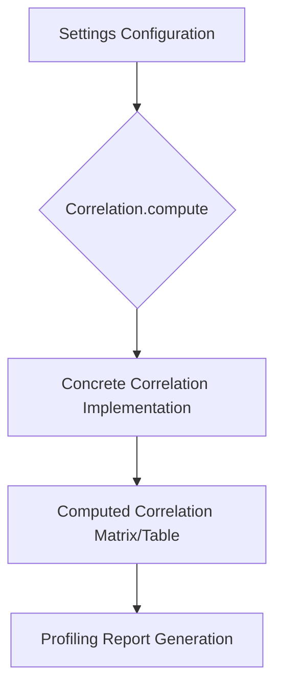
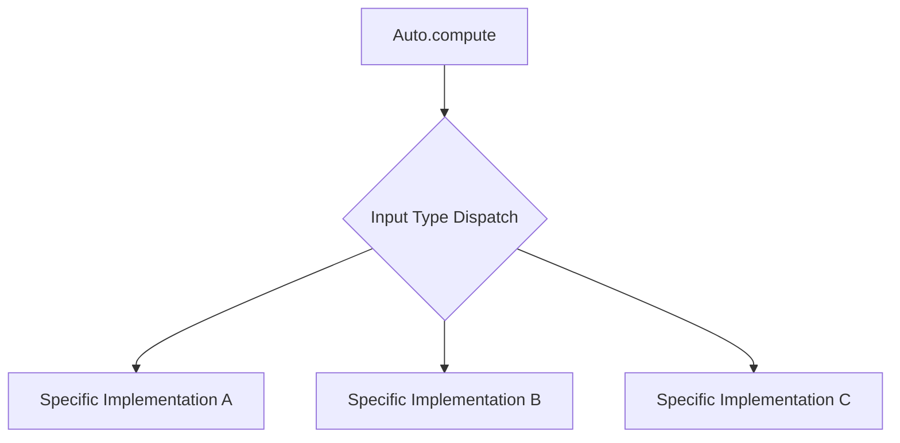
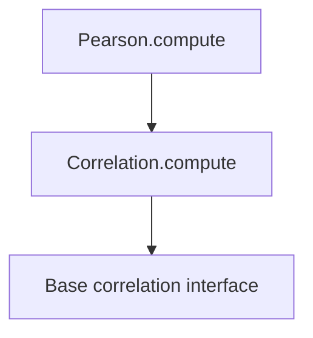
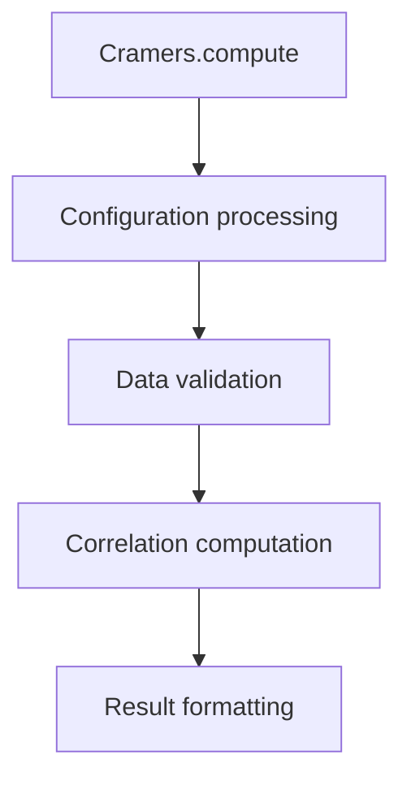
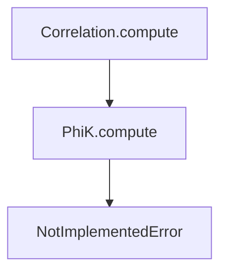
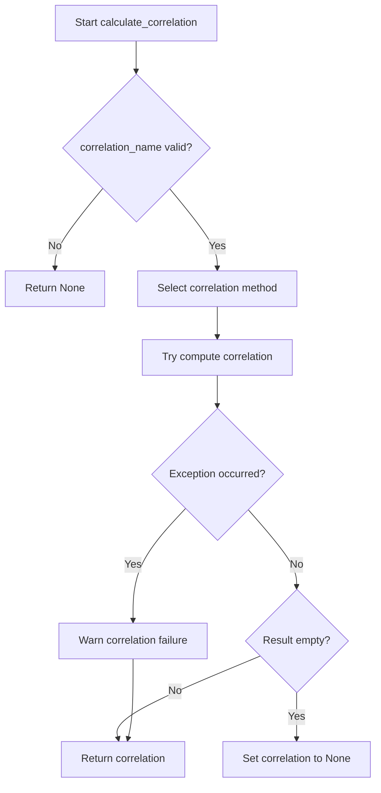

# `correlations.py`

## `src.ydata_profiling.model.correlations.Correlation` · *class*

## Summary:
Static base class for correlation computation methods in data profiling.

## Description:
The Correlation class serves as a static base class defining the interface for computing correlation matrices or tables from datasets. It is part of the ydata-profiling library's data analysis framework and provides a standardized static method signature that all correlation computation implementations must follow. This class is designed to be extended by specific correlation implementations such as Pearson, Spearman, Kendall, etc., which provide the actual computational logic.

The compute method is declared as a static method and is intended to be overridden by subclasses that implement specific correlation algorithms.

## State:
- This is a static method class that doesn't maintain instance state
- The compute method is a static method that operates on parameters only
- Parameters are passed through method arguments rather than instance attributes

## Lifecycle:
- Creation: Not applicable - this is a static method class
- Usage: Called by the profiling system to compute correlations based on configuration settings
- Destruction: No special cleanup required

## Method Map:


## Raises:
- NotImplementedError: Always raised by the base class implementation, indicating that subclasses must override this method

## Example:
```python
# This would be called internally by the profiling system
# Actual implementation depends on the specific correlation type
result = Correlation.compute(
    config=settings,
    df=dataframe,
    summary=summary_dict
)
```

### `src.ydata_profiling.model.correlations.Correlation.compute` · *method*

## Summary:
Static method interface for computing correlation statistics, requiring implementation in subclasses.

## Description:
This static method defines the interface for correlation computation within the profiling framework. It is intended to process dataset information and configuration parameters to generate correlation metrics that identify relationships between variables. As a placeholder method, it raises NotImplementedError and must be overridden by implementing subclasses to provide actual correlation calculation functionality.

## Args:
    config (Settings): Configuration settings controlling correlation calculation behavior, including thresholds and bin counts.
    df (Sized): Input dataset (typically a pandas DataFrame or compatible structure) to analyze for variable correlations.
    summary (dict): Dataset summary information containing statistical properties that may be used in correlation calculations.

## Returns:
    Optional[Sized]: Expected return type for correlation results, typically a structured container (list, dict, array) containing correlation coefficients and metadata, or None if correlation computation is disabled or not applicable.

## Raises:
    NotImplementedError: Raised when the method is called without being overridden by a concrete implementation in a subclass.

## State Changes:
    Attributes READ: None - this is a static method that operates on parameters only.
    Attributes WRITTEN: None - this is a static method that doesn't modify instance state.

## Constraints:
    Preconditions: 
    - config must be a valid Settings object with correlation-specific configuration
    - df must be a Sized object representing the dataset to analyze
    - summary must be a dictionary containing valid dataset summary information
    
    Postconditions:
    - Method signature maintains consistency with correlation computation interface
    - Concrete implementations must return appropriately structured correlation data

## Side Effects:
    None - This method does not perform I/O operations or mutate external state.

## `src.ydata_profiling.model.correlations.Auto` · *class*

## Summary:
Static base class for automatic correlation computation methods.

## Description:
The Auto class serves as a static base class for implementing automatic correlation computation strategies. It inherits from the Correlation base class and defines the interface for correlation computation methods that can be automatically selected based on input characteristics. This class is designed to be extended by specific correlation implementations that handle different data types or scenarios.

The @multimethod decorator indicates this class is intended to support multiple dispatch based on argument types, allowing different implementations to be selected automatically based on the input parameters.

## State:
- Inherits all attributes from parent Correlation class:
  - key: str - identifier for the correlation method (default: "")
  - calculate: bool - flag indicating whether to compute correlations (default: True)
  - warn_high_correlations: int - threshold for warning about high correlations (default: 10)
  - threshold: float - correlation threshold for analysis (default: 0.5)
  - n_bins: int - number of bins for discretization (default: 10)

## Lifecycle:
- Creation: As a static base class, no instantiation is required; methods are called statically
- Usage: Static compute() method invoked with Settings config, data frame/Sized object, and summary dictionary
- Destruction: No special cleanup required; operates as a stateless utility class

## Method Map:


## Raises:
- NotImplementedError: Raised when the compute method is called without proper implementation in subclasses

## Example:
```python
# Usage pattern (requires subclass implementation)
config = Settings()
df = pandas.DataFrame({'A': [1, 2, 3], 'B': [4, 5, 6]})
summary = {}

# This would typically be implemented in a subclass
# result = Auto.compute(config, df, summary)
```

### `src.ydata_profiling.model.correlations.Auto.compute` · *method*

## Summary:
Computes correlation coefficients between variables in a dataset according to the configured correlation method.

## Description:
This static method implements the correlation computation logic for the Auto correlation type. It analyzes the provided dataset to calculate correlation coefficients between variables, returning the results or None if computation is not feasible. This method serves as the core implementation for automatic correlation detection and calculation within the profiling framework.

## Args:
    config (Settings): Configuration settings that control correlation computation parameters such as threshold, bin count, and calculation flags.
    df (Sized): The input dataset containing variables to correlate, typically a pandas DataFrame or similar sized data structure.
    summary (dict): Pre-computed summary statistics for the dataset that may be used to optimize correlation calculations.

## Returns:
    Optional[Sized]: Correlation matrix or coefficients if computation succeeds, None if the computation cannot be performed due to insufficient data or other constraints.

## Raises:
    NotImplementedError: This method is not implemented in the base class and must be overridden by subclasses.

## State Changes:
    Attributes READ: None - this is a static method that doesn't modify instance state.
    Attributes WRITTEN: None - this is a static method that doesn't modify instance state.

## Constraints:
    Preconditions: 
    - config must be a valid Settings object with appropriate correlation configuration
    - df must be a Sized data structure containing variables to analyze
    - summary must be a dictionary containing pre-computed statistics
    
    Postconditions:
    - Returns either a correlation matrix/data structure or None
    - Method is designed to handle edge cases gracefully (empty datasets, insufficient variables, etc.)

## Side Effects:
    None - This method performs computations without external I/O or state mutations.

## `src.ydata_profiling.model.correlations.Spearman` · *class*

## Summary:
Static method class providing Spearman rank correlation computation interface.

## Description:
The Spearman class implements the static compute method for calculating Spearman rank correlation coefficients between variables in a dataset. It inherits from the Correlation base class in the same module, which defines the static compute interface that all correlation computation methods must implement.

This class serves as part of a polymorphic correlation computation framework where different correlation methods (Spearman, Pearson, Kendall, etc.) can be used interchangeably. The compute method is designed to be overridden by concrete implementations that actually perform the correlation calculations.

## State:
- Inherits static method interface from Correlation base class
- No instance state maintained (this is a static method class)
- The parent Correlation class in config module contains instance fields but these are not used in the static method implementation

## Lifecycle:
- Creation: Not applicable - this is a static method class, no instantiation required
- Usage: The static compute method is invoked by the profiling system when Spearman correlations are computed
- Destruction: No cleanup required - follows standard Python static method behavior

## Method Map:
```mermaid
graph TD
    A[Settings.correlations["spearman"]] --> B[Spearman.compute]
    B --> C{Compute Spearman correlation}
    C --> D[Raise NotImplementedError]
```

## Raises:
- NotImplementedError: Always raised by the compute method, indicating this is an abstract base implementation that must be implemented by concrete subclasses

## Example:
```python
# Used through the configuration system
config = Settings()
# Access via config.correlations["spearman"] which returns a Spearman instance
# The actual computation is handled by subclasses that implement the compute method
# Returns: Optional[Sized] - computed correlation results or None
```

### `src.ydata_profiling.model.correlations.Spearman.compute` · *method*

## Summary:
Abstract method for computing Spearman rank correlation coefficients.

## Description:
This static method defines the interface for computing Spearman rank correlation coefficients between variables in a dataset. It is intended to be implemented by subclasses to provide specific correlation calculation logic. As an abstract method, it raises NotImplementedError in the base implementation.

## Args:
    config (Settings): Configuration settings for correlation analysis.
    df (Sized): Input dataset containing variables to correlate.
    summary (dict): Dataset summary statistics and metadata.

## Returns:
    Optional[Sized]: Computed correlation results or None.

## Raises:
    NotImplementedError: Raised by the base implementation indicating subclass implementation is required.

## State Changes:
    Attributes READ: None - this is a static method
    Attributes WRITTEN: None - this is a static method

## Constraints:
    Preconditions: 
    - config must be a valid Settings object
    - df must be a Sized object
    - summary must be a dictionary
    
    Postconditions:
    - Method must be overridden by subclasses to return actual correlation results

## Side Effects:
    None - This is a pure static method with no external dependencies or I/O operations

## `src.ydata_profiling.model.correlations.Pearson` · *class*

## Summary:
Static base class for Pearson correlation computation in data profiling.

## Description:
The Pearson class serves as a static base class defining the interface for computing correlation matrices or tables from datasets. It inherits from the Correlation base class and implements the static compute method that calculates correlation statistics. This class provides the structural foundation for correlation analysis within the profiling system, though the actual implementation is left to subclasses.

## State:
- Inherits from Correlation base class
- No instance attributes beyond those inherited from Correlation
- The compute method is static and operates on configuration, dataframe, and summary data
- As a static base class, it doesn't maintain instance state

## Lifecycle:
- Creation: Used as a static method class that doesn't require instantiation
- Usage: Called via the static compute method with Settings config, dataframe, and summary dictionary
- Destruction: No special cleanup required as it's a static method-based implementation

## Method Map:


## Raises:
- NotImplementedError: Raised by the compute method as this is an abstract implementation that must be overridden by subclasses

## Example:
```python
# Typical usage pattern (implementation would be provided by subclasses)
config = Settings()
df = pandas.DataFrame({'A': [1, 2, 3], 'B': [4, 5, 6]})
summary = {}
result = Pearson.compute(config, df, summary)
```

### `src.ydata_profiling.model.correlations.Pearson.compute` · *method*

## Summary:
Computes Pearson correlation coefficients between variables in a dataset.

## Description:
This method calculates Pearson correlation coefficients, which measure the linear relationship between pairs of variables. It is part of the Pearson correlation implementation within the ydata-profiling correlation framework. The method processes the input dataframe according to configuration settings and returns correlation statistics for further analysis.

## Args:
    config (Settings): Configuration settings controlling correlation computation parameters such as thresholds and calculation flags
    df (Sized): Input dataset containing variables to correlate, typically a pandas DataFrame or compatible structure  
    summary (dict): Pre-computed summary statistics about the dataset that may be used in correlation calculations

## Returns:
    Optional[Sized]: Correlation matrix or structure containing Pearson correlation coefficients between variable pairs, or None if computation cannot be performed

## Raises:
    NotImplementedError: This method is intended to be overridden by implementing classes

## State Changes:
    Attributes READ: None - this method operates on input parameters
    Attributes WRITTEN: None - this method is read-only

## Constraints:
    Preconditions: 
    - config must be a valid Settings object with proper correlation configuration
    - df must be a Sized object (typically pandas DataFrame) with compatible data types
    - summary must be a dictionary containing pre-computed dataset statistics
    
    Postconditions: 
    - Method must return either a correlation structure or None
    - Returned structure should be compatible with downstream correlation processing

## Side Effects:
    None - this method is a pure computation that doesn't modify external state

## `src.ydata_profiling.model.correlations.Kendall` · *class*

## Summary:
Static method class defining the interface for Kendall rank correlation coefficient computation.

## Description:
The Kendall class defines the interface for computing Kendall's tau rank correlation coefficient, a non-parametric measure of ordinal association between two variables. This class serves as a placeholder in the correlation analysis framework, following the same pattern as other correlation implementations (Pearson, Spearman).

As a static method class inheriting from Correlation, it provides the standard method signature for correlation computations but does not implement the actual algorithm. The compute method is intentionally left unimplemented and raises NotImplementedError, requiring subclasses to provide the actual implementation.

## State:
- Inherits from Correlation base class which defines configuration parameters:
  - key: str = "" (correlation method identifier)
  - calculate: bool = True (whether to calculate this correlation)
  - warn_high_correlations: int = 10 (threshold for warning about high correlations)
  - threshold: float = 0.5 (correlation threshold for reporting)
  - n_bins: int = 10 (number of bins for correlation calculation)

## Lifecycle:
- Creation: Not applicable - this is a static method class that serves as an interface
- Usage: The static compute() method is called by the framework for correlation analysis, but will raise NotImplementedError in this base implementation
- Destruction: No special cleanup required

## Method Map:
```mermaid
graph TD
    A[Framework correlation analysis] --> B[Kendall.compute()]
    B --> C{NotImplementedError}
```

## Raises:
- NotImplementedError: Always raised by the base implementation, indicating that subclasses must implement the actual Kendall correlation computation

## Example:
```python
# This will raise NotImplementedError
# result = Kendall.compute(settings, dataframe, summary)
```

### `src.ydata_profiling.model.correlations.Kendall.compute` · *method*

## Summary:
Computes Kendall rank correlation coefficients for a dataset according to the configured correlation settings.

## Description:
This static method implements the Kendall rank correlation computation algorithm. It serves as a placeholder that must be overridden by concrete implementations in subclasses. The method takes a configuration object, a dataset, and summary statistics to compute correlation coefficients between variables in the dataset.

## Args:
    config (Settings): Configuration settings that control correlation computation parameters such as threshold, bin count, and calculation flags
    df (Sized): A dataset-like object containing the data to analyze for correlations
    summary (dict): Pre-computed summary statistics about the dataset that may be used in correlation calculations

## Returns:
    Optional[Sized]: Correlation matrix or coefficients computed using Kendall's tau rank correlation method, or None if computation is skipped or fails

## Raises:
    NotImplementedError: Always raised by this base implementation indicating that subclasses must override this method with concrete implementation

## State Changes:
    Attributes READ: None - this is a static method that doesn't modify instance state
    Attributes WRITTEN: None - this is a static method that doesn't modify instance state

## Constraints:
    Preconditions: 
    - config must be a valid Settings object with appropriate correlation configuration
    - df must be a sized object (like pandas DataFrame or Series) that supports correlation operations
    - summary must be a dictionary containing pre-computed dataset statistics
    
    Postconditions: 
    - Method always raises NotImplementedError in base implementation
    - Concrete implementations should return correlation results matching the expected format

## Side Effects:
    None - this is a pure computation method that doesn't perform I/O or mutate external state

## `src.ydata_profiling.model.correlations.Cramers` · *class*

## Summary:
Static base class for correlation computation methods in data profiling.

## Description:
The Cramers class is a static base class that defines the interface for correlation computation methods within the ydata-profiling framework. It inherits from the base Correlation class and implements a static compute method that operates on configuration, dataframe, and summary parameters.

This class serves as a template for implementing specific correlation algorithms such as Cramér's V, Pearson correlation, or other correlation measures.

## State:
- Inherits all attributes from Correlation base class:
  - key (str): Identifier for this correlation method (default: "")
  - calculate (bool): Whether to calculate this correlation (default: True)
  - warn_high_correlations (int): Threshold for warning about high correlations (default: 10)
  - threshold (float): Correlation threshold for reporting (default: 0.5)
  - n_bins (int): Number of bins for discretization (default: 10)

## Lifecycle:
- Creation: Not applicable - this is a static method class
- Usage: Called statically by the profiling pipeline when computing correlations
- Destruction: No special cleanup required; operates as a static method

## Method Map:


## Raises:
- NotImplementedError: Always raised by the base implementation, indicating this method needs to be overridden in subclasses

## Example:
```python
# Typically used internally by the profiling system
config = Settings()
df = pd.DataFrame({'cat1': ['A', 'B', 'A'], 'cat2': ['X', 'Y', 'X']})
summary = {}
result = Cramers.compute(config, df, summary)
# Note: This will raise NotImplementedError as the actual implementation is missing
```

### `src.ydata_profiling.model.correlations.Cramers.compute` · *method*

## Summary:
Abstract interface method for computing Cramers V correlation coefficients.

## Description:
This method serves as an abstract interface for computing Cramers V correlation coefficients between categorical variables. It is designed to be implemented by subclasses that provide actual correlation computation functionality. The method signature follows the standard pattern for correlation computation methods in this profiling system.

## Args:
    config (Settings): Configuration settings for the profiling process, including options for correlation computation
    df (Sized): Input dataset containing categorical variables to analyze for correlations
    summary (dict): Pre-computed summary statistics about the dataset that may be used in correlation calculations

## Returns:
    Optional[Sized]: Return type specification for correlation results, to be implemented by subclasses

## Raises:
    NotImplementedError: This base implementation raises NotImplementedError to indicate that subclasses must override this method with their own implementation

## State Changes:
    Attributes READ: None - this is a standalone compute method
    Attributes WRITTEN: None - this is a standalone compute method

## Constraints:
    Preconditions: 
    - config should be a valid Settings object with appropriate correlation settings
    - df should be a sized object (like DataFrame or Series) containing categorical data
    - summary should contain pre-computed statistics about the dataset
    
    Postconditions:
    - Subclasses must implement this method to provide actual correlation computation
    - Method signature is fixed and should not be changed by implementations

## Side Effects:
    None - This method performs no I/O operations or external service calls

## `src.ydata_profiling.model.correlations.PhiK` · *class*

## Summary:
PhiK is a correlation computation class that implements the Phi-K correlation coefficient for categorical variable associations.

## Description:
PhiK is a subclass of Correlation that provides a static compute method for calculating Phi-K correlation coefficients between categorical variables. This class serves as a placeholder implementation that raises NotImplementedError, indicating it's intended to be extended by concrete implementations.

The Phi-K correlation coefficient is a measure of association between categorical variables that extends the traditional Phi coefficient to handle multi-dimensional categorical data. It's part of the correlation methods available in the ydata-profiling library for analyzing relationships in categorical datasets.

## State:
- Inherits from Correlation base class
- Implements static compute method with signature: compute(config: Settings, df: Sized, summary: dict) -> Optional[Sized]
- All attributes inherited from parent Correlation class

## Lifecycle:
- Creation: Instantiated as part of the correlation configuration system
- Usage: Called via static compute() method with Settings, DataFrame/Sized object, and summary dictionary
- Destruction: No special cleanup required as it's a static method-based utility

## Method Map:


## Raises:
- NotImplementedError: Raised by the compute method, indicating this is an abstract implementation requiring subclass override

## Example:
```python
# This would raise NotImplementedError
# result = PhiK.compute(config, dataframe, summary_dict)
```

### `src.ydata_profiling.model.correlations.PhiK.compute` · *method*

## Summary:
Abstract function for computing Phi-K correlation coefficients between categorical variables.

## Description:
This function serves as an abstract interface for computing Phi-K correlation matrices, which measure associations between categorical variables. The Phi-K correlation extends the phi coefficient to handle multi-way contingency tables. This function must be implemented by concrete implementations to provide correlation computation functionality.

## Args:
    config (Settings): Configuration settings controlling the correlation computation process
    df (Sized): Dataset containing categorical variables to analyze, typically a pandas DataFrame or similar sized structure  
    summary (dict): Pre-computed summary statistics of the dataset for efficient processing

## Returns:
    Optional[Sized]: Computed correlation data structure or None if computation is not applicable or not implemented

## Raises:
    NotImplementedError: Raised by this base implementation to indicate that implementations must override this function

## State Changes:
    Attributes READ: None - this function does not read instance attributes
    Attributes WRITTEN: None - this function does not modify instance attributes

## Constraints:
    Preconditions:
    - config parameter must be a valid Settings object
    - df parameter must support the Sized protocol (have __len__ method)
    - summary parameter must be a dictionary containing appropriate metadata
    
    Postconditions:
    - Base implementation always raises NotImplementedError
    - Implementations must return valid correlation results

## Side Effects:
    None - this function performs no external operations or state mutations

## `src.ydata_profiling.model.correlations.warn_correlation` · *function*

## Summary:
Issues a warning through Python's warnings module for correlation-related problems.

## Description:
This function provides a standardized interface for issuing warnings when correlation calculations encounter issues. It accepts correlation identification and error information to create appropriate warning messages.

## Args:
    correlation_name (str): Name identifying the correlation method or metric involved
    error (str): Error description explaining the correlation problem encountered

## Returns:
    None: This function does not return any value

## Raises:
    None: This function does not raise exceptions directly

## Constraints:
    Preconditions:
    - correlation_name must be a string
    - error must be a string
    
    Postconditions:
    - A warning is issued via Python's warnings module
    - Function execution completes without error

## Side Effects:
    - Issues a warning message through Python's warnings module
    - May produce console output if warnings are configured to be displayed

## Control Flow:
```mermaid
flowchart TD
    A[warn_correlation called] --> B[Process parameters]
    B --> C[Call warnings.warn()]
    C --> D[Function completes]
```

## Examples:
```python
# Typical usage for correlation warnings
warn_correlation("pearson", "Calculation failed due to insufficient data")
```

## `src.ydata_profiling.model.correlations.calculate_correlation` · *function*

## Summary:
Dispatches correlation computation to the appropriate method based on correlation type while handling errors and validating results.

## Description:
Serves as a dispatcher function that routes correlation computation requests to specific correlation measure implementations based on the provided correlation name. This function manages the execution of various correlation methods (Pearson, Spearman, Kendall, Cramers, Phi-K, and auto) and handles common exceptions that may occur during computation.

## Args:
    config (Settings): Configuration settings for correlation computation
    df (Sized): Input dataset that implements the Sized protocol (typically a DataFrame or similar structure)
    correlation_name (str): Name of the correlation method to use ('auto', 'pearson', 'spearman', 'kendall', 'cramers', or 'phi_k')
    summary (dict): Summary statistics of the dataset used for correlation computation

## Returns:
    Optional[Sized]: Computed correlation matrix or data structure, or None if computation fails or produces empty results

## Raises:
    None explicitly raised - exceptions are caught and handled internally

## Constraints:
    Preconditions:
    - config must be a valid Settings object
    - df must implement the Sized protocol (supporting len() operation)
    - correlation_name must be one of the supported correlation methods
    - summary must be a dictionary containing dataset statistics
    
    Postconditions:
    - Returns either a valid correlation structure or None
    - Empty correlation results are converted to None

## Side Effects:
    - Issues warnings via the warn_correlation function when correlation computation fails
    - No direct I/O operations or external state mutations

## Control Flow:


## Examples:
    # Compute Pearson correlation
    result = calculate_correlation(config, dataframe, "pearson", summary)
    
    # Compute auto correlation (automatic selection)
    result = calculate_correlation(config, dataframe, "auto", summary)
    
    # Handle potential None return
    correlation = calculate_correlation(config, dataframe, "spearman", summary)
    if correlation is not None:
        # Use correlation data
        pass
    else:
        # Handle failed computation
        pass

## `src.ydata_profiling.model.correlations.perform_check_correlation` · *function*

## Summary:
Identifies pairs of features in a correlation matrix that exceed a specified threshold.

## Description:
Analyzes a correlation matrix to find feature pairs with absolute correlation values greater than or equal to the specified threshold. This function is used to detect multicollinearity among features in a dataset, which is important for feature selection and model stability.

## Args:
    correlation_matrix (pd.DataFrame): A square correlation matrix where rows and columns represent features, and values represent correlation coefficients between -1 and 1.
    threshold (float): Minimum absolute correlation value to consider as significant. Must be between 0 and 1 inclusive.

## Returns:
    Dict[str, List[str]]: A dictionary mapping each feature name to a list of other feature names that have absolute correlation values greater than or equal to the threshold. Features with no significant correlations are excluded from the result.

## Raises:
    None explicitly raised, but may raise exceptions from underlying operations like DataFrame operations or numpy operations.

## Constraints:
    Preconditions:
    - correlation_matrix must be a square DataFrame (same number of rows and columns)
    - correlation_matrix must contain numeric data
    - threshold must be a float between 0 and 1 inclusive
    
    Postconditions:
    - The returned dictionary will only contain keys for features that have at least one significant correlation
    - All values in the returned dictionary will be lists of strings representing feature names
    - Self-correlations (diagonal elements) are automatically excluded from consideration

## Side Effects:
    None

## Control Flow:
```mermaid
flowchart TD
    A[Start perform_check_correlation] --> B[Get column names]
    B --> C[Create boolean mask of correlations >= threshold]
    C --> D[Set diagonal to False (exclude self-correlations)]
    D --> E{Any correlations above threshold?}
    E -->|Yes| F[Build result dictionary]
    F --> G[Return dictionary mapping features to correlated features]
    E -->|No| H[Return empty dictionary]
```

## Examples:
```python
import pandas as pd
import numpy as np

# Example correlation matrix
corr_matrix = pd.DataFrame({
    'A': [1.0, 0.8, 0.2],
    'B': [0.8, 1.0, 0.1],
    'C': [0.2, 0.1, 1.0]
})

# Find features with correlation >= 0.7
result = perform_check_correlation(corr_matrix, 0.7)
# Returns: {'A': ['B'], 'B': ['A']}

# Find features with correlation >= 0.3
result = perform_check_correlation(corr_matrix, 0.3)
# Returns: {'A': ['B', 'C'], 'B': ['A', 'C'], 'C': ['A', 'B']}
```

## `src.ydata_profiling.model.correlations.get_active_correlations` · *function*

## Summary
Returns a list of correlation method names that are configured to be calculated.

## Description
Filters and returns the names of correlation methods from the configuration that have their `calculate` flag set to True. This function serves as a utility to determine which correlation analyses should be performed based on the current profiling configuration.

The function extracts correlation names from the configuration's correlations dictionary and applies a filter based on the `calculate` attribute of each correlation configuration. This separation allows for flexible configuration of which correlation methods to compute during profiling, enabling users to enable/disable specific correlation calculations without modifying the core computation logic.

## Args
    config (Settings): Configuration object containing correlation settings. Must have a `correlations` attribute that is a dictionary mapping correlation names to Correlation objects with a `calculate` boolean attribute.

## Returns
    List[str]: A list of correlation method names (strings) where the corresponding Correlation configuration has `calculate=True`. Returns an empty list if no correlations are configured to be calculated or if config.correlations is empty.

## Raises
    AttributeError: If config.correlations does not exist or if any correlation object in config.correlations does not have a calculate attribute.

## Constraints
    Preconditions:
    - config must be a Settings object with a correlations attribute
    - config.correlations must be a dictionary-like object with string keys
    - Each value in config.correlations must have a calculate attribute that is a boolean
    
    Postconditions:
    - Returns a list of strings representing correlation method names
    - All returned correlation names correspond to entries in config.correlations where calculate=True

## Side Effects
    None

## Control Flow
```mermaid
flowchart TD
    A[Start get_active_correlations] --> B{config.correlations exists?}
    B -- No --> C[Return empty list]
    B -- Yes --> D[Iterate through config.correlations.keys()]
    D --> E{correlation.calculate == True?}
    E -- No --> F[Skip correlation]
    E -- Yes --> G[Add correlation name to result]
    F --> H[Continue iteration]
    G --> H
    H --> I[Return correlation_names list]
```

## Examples
    # Basic usage with default configuration
    config = Settings()
    active_correlations = get_active_correlations(config)
    # Returns ['auto'] because only 'auto' correlation has calculate=True by default
    
    # With custom configuration
    config = Settings()
    config.correlations['pearson'].calculate = True
    active_correlations = get_active_correlations(config)
    # Returns ['auto', 'pearson'] if both have calculate=True
    
    # With no active correlations
    config = Settings()
    for corr in config.correlations.values():
        corr.calculate = False
    active_correlations = get_active_correlations(config)
    # Returns [] - empty list

