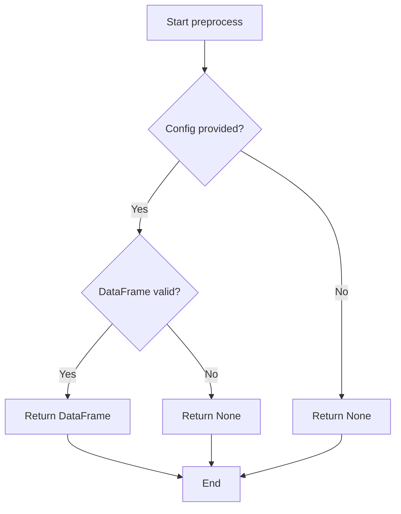

# `dataframe.py`

## `src.ydata_profiling.model.dataframe.check_dataframe` · *function*

## Summary:
Placeholder validation function for DataFrame inputs in data profiling.

## Description:
A placeholder function for DataFrame validation within the ydata-profiling data profiling framework. This function is currently not implemented and raises NotImplementedError when called. It is located in the dataframe module and follows the multimethod pattern indicated by the import of 'multimethod' from the module.

## Args:
    df (Any): The input data structure to be validated. The parameter uses the 'Any' type hint indicating it can accept any type.

## Returns:
    None: This function does not return any value.

## Raises:
    NotImplementedError: Raised when the function is called, as it is not yet implemented.

## Constraints:
    Preconditions: The function expects a single parameter 'df'.
    Postconditions: Not applicable as the function is not implemented.

## Side Effects:
    None: This function does not perform any I/O operations or external state mutations.

## Control Flow:
```mermaid
flowchart TD
    A[check_dataframe(df)] --> B{Not Implemented?}
    B -->|Yes| C[raise NotImplementedError]
    B -->|No| D[Validate df and return]
```

## Examples:
    # Function is not yet implemented
    try:
        check_dataframe(data)
    except NotImplementedError:
        # Handle unimplemented validation
        pass

## `src.ydata_profiling.model.dataframe.preprocess` · *function*

## Summary:
Processes and prepares a DataFrame for profiling according to configuration settings.

## Description:
This function serves as a preprocessing hook that applies configuration-based transformations to DataFrames before analysis. While the current implementation simply returns the input DataFrame unchanged, it is designed to be overridden by subclasses to implement specific preprocessing logic such as data type inference, missing value handling, or column filtering based on the provided Settings configuration.

The function is called during the data preparation phase of the profiling pipeline to ensure that DataFrames are in the appropriate format for subsequent analysis steps.

## Args:
    config (Settings): Configuration object containing profiling settings and parameters that may influence preprocessing decisions
    df (Any): Input DataFrame to be processed and prepared for profiling

## Returns:
    Any: The processed DataFrame, which may be modified based on configuration settings or remain unchanged

## Raises:
    None: This basic implementation does not raise any exceptions

## Constraints:
    Preconditions:
    - config must be a valid Settings object instance
    - df must be a valid DataFrame-like object
    
    Postconditions:
    - The returned object maintains the same structure as the input DataFrame
    - No modifications are made to the original DataFrame in this base implementation

## Side Effects:
    None: This basic implementation performs no I/O operations or external state mutations

## Control Flow:


## Examples:
```python
# Basic usage with default settings
config = Settings()
df = pd.DataFrame({'A': [1, 2, 3], 'B': [4, 5, 6]})
processed_df = preprocess(config, df)
# Result: identical to original df

# Usage in profiling pipeline
from ydata_profiling import ProfileReport
config = Settings(title="My Report")
df = pd.DataFrame({'col1': [1, 2, 3], 'col2': ['a', 'b', 'c']})
profile = ProfileReport(df, config=config)
```

