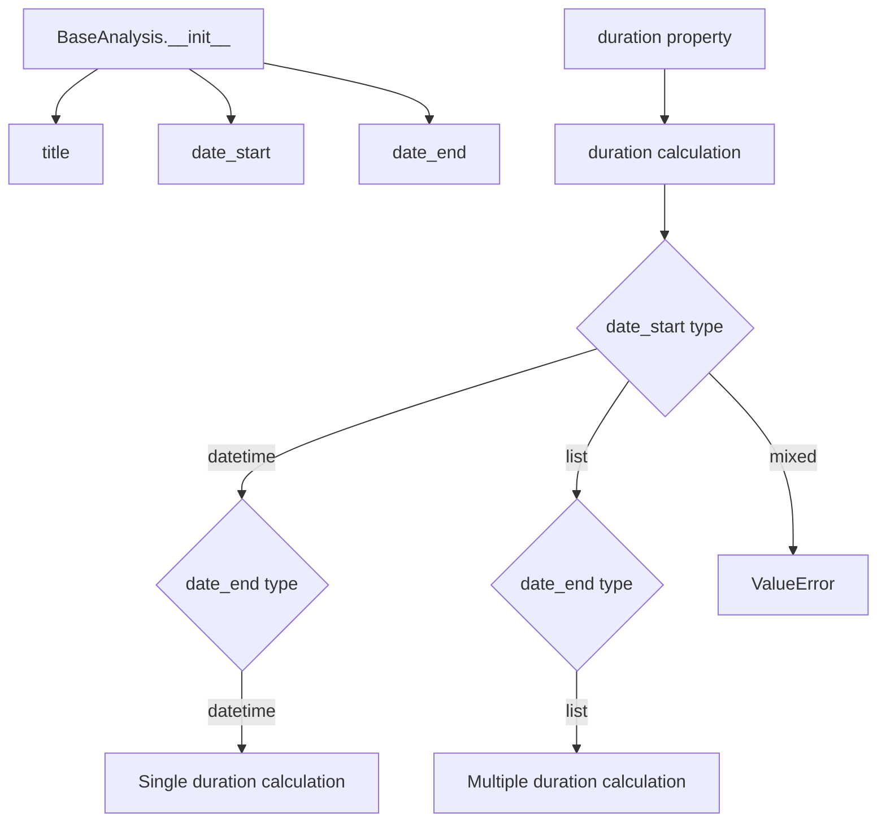
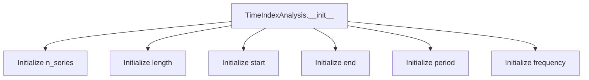

# `description.py`

## `src.ydata_profiling.model.description.BaseAnalysis` · *class*

## Summary:
Represents base analysis metadata with title and temporal bounds, providing duration calculation capabilities.

## Description:
The BaseAnalysis class serves as a foundational data structure for representing analytical work with associated metadata including a descriptive title and temporal boundaries. It enables calculation of duration between start and end timestamps while supporting both single datetime pairs and multiple datetime pairs.

This class acts as a base abstraction for analysis entities, encapsulating common metadata and temporal properties that are fundamental to profiling and analysis workflows.

## State:
- title: str - Descriptive identifier for the analysis
- date_start: Union[datetime, List[datetime]] - Starting timestamp(s) for the analysis period
- date_end: Union[datetime, List[datetime]] - Ending timestamp(s) for the analysis period

## Lifecycle:
- Creation: Instantiate with title, date_start, and date_end parameters
- Usage: Access title, date_start, date_end attributes; use duration property to compute time differences between start and end timestamps
- Destruction: No special cleanup required; relies on Python's garbage collection

## Method Map:


## Raises:
- ValueError: When date_start and date_end types don't match (one is datetime, other is list)

## Example:
```python
from datetime import datetime
from ydata_profiling.model.description import BaseAnalysis

# Single datetime analysis
analysis = BaseAnalysis("Monthly Report", datetime(2023, 1, 1), datetime(2023, 1, 31))
print(analysis.title)  # "Monthly Report"
print(analysis.duration)  # timedelta(days=30)

# Multiple datetime analysis
start_dates = [datetime(2023, 1, 1), datetime(2023, 2, 1)]
end_dates = [datetime(2023, 1, 15), datetime(2023, 2, 15)]
multi_analysis = BaseAnalysis("Quarterly Report", start_dates, end_dates)
print(multi_analysis.duration)  # [timedelta(days=14), timedelta(days=14)]

# Error case - mixed types
try:
    mixed_analysis = BaseAnalysis("Error Test", datetime(2023, 1, 1), [datetime(2023, 1, 15)])
except ValueError:
    print("Caught expected ValueError")
```

### `src.ydata_profiling.model.description.BaseAnalysis.__init__` · *method*

## Summary:
Initializes a BaseAnalysis object with title and date range metadata.

## Description:
Constructs a BaseAnalysis instance by storing the provided title and date range information. This method serves as the primary constructor for initializing analysis metadata, establishing the foundational properties needed for reporting and profiling operations.

## Args:
    title (str): The title or name of the analysis report.
    date_start (datetime): The starting date/time of the analysis period.
    date_end (datetime): The ending date/time of the analysis period.

## Returns:
    None: This method does not return any value.

## Raises:
    None: This method does not raise any exceptions.

## State Changes:
    Attributes READ: None
    Attributes WRITTEN: self.title, self.date_start, self.date_end

## Constraints:
    Preconditions: All arguments must be provided and of the correct type (title as str, dates as datetime objects).
    Postconditions: The instance will have title, date_start, and date_end attributes properly initialized with the provided values.

## Side Effects:
    None: This method performs no I/O operations or external service calls.

### `src.ydata_profiling.model.description.BaseAnalysis.duration` · *method*

## Summary:
Calculates the time duration between start and end date/time points.

## Description:
Computes the difference between `date_start` and `date_end` attributes. This method supports both single datetime objects and lists of datetime objects for batch processing. The calculation is performed by subtracting the start time from the end time.

## Args:
    None

## Returns:
    Union[timedelta, List[timedelta]]: A single timedelta when both date_start and date_end are datetime objects, or a list of timedeltas when both are lists of datetime objects.

## Raises:
    ValueError: When the date_start and date_end attributes are not compatible types (one is datetime and the other is list, or invalid combinations).

## State Changes:
    Attributes READ: self.date_start, self.date_end
    Attributes WRITTEN: None

## Constraints:
    Preconditions: 
    - Both `date_start` and `date_end` must be either datetime objects or lists of datetime objects
    - When both are lists, they must have equal length
    Postconditions:
    - Returns a timedelta or list of timedeltas representing the duration between start and end times

## Side Effects:
    None

## `src.ydata_profiling.model.description.TimeIndexAnalysis` · *class*

## Summary:
A data class that encapsulates time index analysis information for time series data profiling.

## Description:
The TimeIndexAnalysis class serves as a container for storing metadata and statistics related to time series data indexing. It is typically instantiated during the profiling process when analyzing temporal data characteristics such as series count, duration, time range, and periodicity. This class provides a standardized way to represent time index properties that are essential for time series analysis and reporting.

## State:
- n_series: Union[int, List[int]] - Number of time series or list of series counts. Valid range: positive integers. Invariant: represents the count of time series being analyzed.
- length: Union[int, List[int]] - Length of the time series or list of lengths. Valid range: positive integers. Invariant: represents the number of observations in each series.
- start: Any - Start timestamp or datetime object. Valid values: datetime objects or comparable time representations. Invariant: represents the earliest timestamp in the time series.
- end: Any - End timestamp or datetime object. Valid values: datetime objects or comparable time representations. Invariant: represents the latest timestamp in the time series.
- period: Union[float, List[float]] - Average period between observations or list of periods. Valid range: positive floats. Invariant: represents the average time interval between consecutive observations.
- frequency: Union[Optional[str], List[Optional[str]]] - Frequency string representation or list of frequency strings. Valid values: None or frequency strings like 'D', 'H', 'M'. Invariant: represents the sampling frequency of the time series.

## Lifecycle:
- Creation: Instantiate with required parameters (n_series, length, start, end, period) and optional frequency parameter
- Usage: Store and retrieve time index analysis data; typically accessed by profiling components that analyze temporal characteristics
- Destruction: No special cleanup required; standard Python garbage collection handles memory management

## Method Map:


## Raises:
- No explicit exceptions are raised by the constructor
- Invalid parameter types may cause runtime errors when used by downstream components

## Example:
```python
# Create a time index analysis instance for a single time series
analysis = TimeIndexAnalysis(
    n_series=1,
    length=100,
    start=datetime(2023, 1, 1),
    end=datetime(2023, 12, 31),
    period=1.0,
    frequency="D"
)

# Access the stored values
print(f"Series count: {analysis.n_series}")
print(f"Length: {analysis.length}")
print(f"Start date: {analysis.start}")
print(f"End date: {analysis.end}")
print(f"Period: {analysis.period}")
print(f"Frequency: {analysis.frequency}")
```

### `src.ydata_profiling.model.description.TimeIndexAnalysis.__init__` · *method*

## Summary:
Initializes a TimeIndexAnalysis object with time series metadata including series count, length, temporal bounds, period, and frequency information.

## Description:
This constructor creates a TimeIndexAnalysis instance to store metadata about time series data. It's designed to capture essential characteristics of time-indexed data for profiling purposes, including the number of series, total length, temporal boundaries (start and end), sampling period, and frequency information.

## Args:
    n_series (int): Number of time series in the dataset
    length (int): Total length of the time series
    start (Any): Start timestamp or date of the time series
    end (Any): End timestamp or date of the time series
    period (float): Sampling period of the time series
    frequency (Optional[str]): Frequency string describing the time series frequency pattern, defaults to None

## Returns:
    None: This method initializes instance attributes and does not return a value

## Raises:
    None: This method does not explicitly raise exceptions

## State Changes:
    Attributes READ: No attributes are read from self
    Attributes WRITTEN: 
    - self.n_series: Set to the n_series parameter value
    - self.length: Set to the length parameter value  
    - self.start: Set to the start parameter value
    - self.end: Set to the end parameter value
    - self.period: Set to the period parameter value
    - self.frequency: Set to the frequency parameter value

## Constraints:
    Preconditions: All parameters must be provided except frequency which is optional
    Postconditions: The instance will have all attributes properly initialized with the provided values

## Side Effects:
    None: This method performs only attribute assignment with no external I/O or side effects

## `src.ydata_profiling.model.description.BaseDescription` · *class*

## Summary:
A data structure that holds comprehensive analysis results and metadata from data profiling operations.

## Description:
The BaseDescription class serves as a container for storing the results of various data analysis operations performed by the ydata-profiling library. It aggregates different types of analysis data including basic metadata, time series information, table statistics, variable-level insights, correlation matrices, missing data patterns, alerts, package information, sample data, and duplicate detection results. This class acts as a central repository for all profiling results, making it easier to manage and access comprehensive data analysis outcomes.

This class is typically instantiated by profiling pipelines or analysis modules within the ydata-profiling library, rather than being created directly by end users. It provides a standardized structure for organizing diverse analytical outputs from different components of the profiling system.

## State:
- analysis: BaseAnalysis - Contains fundamental metadata about the analysis including title and date range
- time_index_analysis: Optional[TimeIndexAnalysis] - Optional time series analysis information, containing series count, length, temporal bounds, and frequency characteristics
- table: Any - Table-level statistics and metadata about the dataset
- variables: Dict[str, Any] - Variable-level analysis results indexed by variable names
- scatter: Any - Scatter plot-related analysis data
- correlations: Dict[str, Any] - Correlation matrix and related correlation analysis results
- missing: Dict[str, Any] - Missing data patterns and analysis results
- alerts: Any - Alert or anomaly detection results from the analysis
- package: Dict[str, Any] - Package version and dependency information
- sample: Any - Sample data points from the dataset
- duplicates: Any - Duplicate detection and analysis results

## Lifecycle:
- Creation: Instances are typically created internally by profiling processes and analysis modules within the ydata-profiling library
- Usage: Once created, the instance serves as a read-only container for accessing analysis results throughout the profiling workflow
- Destruction: No special cleanup required; follows standard Python object lifecycle management

## Method Map:
```mermaid
graph TD
    A[BaseDescription] --> B[analysis: BaseAnalysis]
    A --> C[time_index_analysis: Optional[TimeIndexAnalysis]]
    A --> D[table: Any]
    A --> E[variables: Dict[str, Any]]
    A --> F[scatter: Any]
    A --> G[correlations: Dict[str, Any]]
    A --> H[missing: Dict[str, Any]]
    A --> I[alerts: Any]
    A --> J[package: Dict[str, Any]]
    A --> K[sample: Any]
    A --> L[duplicates: Any]
```

## Raises:
No exceptions are raised during initialization as this is a simple data container class with no constructor logic.

## Example:
```python
# Typically created internally by profiling pipeline
description = BaseDescription(
    analysis=BaseAnalysis(title="Sales Data Analysis", date_start=datetime(2023, 1, 1), date_end=datetime(2023, 12, 31)),
    time_index_analysis=None,
    table={"count": 1000, "columns": 15},
    variables={"age": {"type": "numeric", "mean": 35.2}, "city": {"type": "categorical"}},
    scatter=None,
    correlations={"age_income": 0.75},
    missing={"age": 5, "income": 2},
    alerts=[],
    package={"version": "0.3.0"},
    sample={"rows": 5},
    duplicates={"count": 10}
)
```

