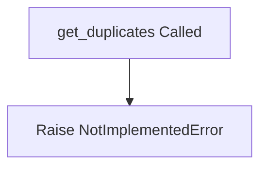

# `duplicates.py`

## `src.ydata_profiling.model.duplicates.get_duplicates` · *function*

## Summary:
Abstract interface for identifying duplicate records in a dataset and returning duplicate analysis metadata.

## Description:
This function defines the interface for duplicate detection functionality within the ydata profiling framework. It is intended to be implemented by concrete methods that analyze DataFrames for duplicate records based on specified columns. The function signature follows a standard pattern for profiling operations that return both analytical results and potentially processed data.

## Args:
    config (Settings): Configuration settings controlling duplicate detection behavior and parameters.
    df (T): Input DataFrame containing data to analyze for duplicates, where T represents a generic DataFrame type.
    supported_columns (Sequence): Sequence of column names that are eligible for duplicate analysis.

## Returns:
    Tuple[Dict[str, Any], Optional[T]]: A tuple where:
        - First element is a dictionary containing metadata about duplicate detection results
        - Second element is an optional DataFrame that may contain filtered or processed data, or None

## Raises:
    NotImplementedError: This function is currently not implemented and must be overridden by concrete implementations.

## Constraints:
    Preconditions:
        - config must be a valid Settings instance
        - df must be a valid DataFrame-like object
        - supported_columns must be a sequence of column names that exist in df
    
    Postconditions:
        - The original input df should remain unmodified
        - Return values should conform to the specified tuple structure

## Side Effects:
    None: This function is designed to be stateless and not cause side effects.

## Control Flow:


## Examples:
```python
# This function would typically be called by profiling pipelines
# config = Settings()
# df = pd.DataFrame({'col1': [1,2,2,3], 'col2': [4,5,5,6]})
# supported_columns = ['col1', 'col2']
# metadata, filtered_df = get_duplicates(config, df, supported_columns)
# The above would raise NotImplementedError in current implementation
```

