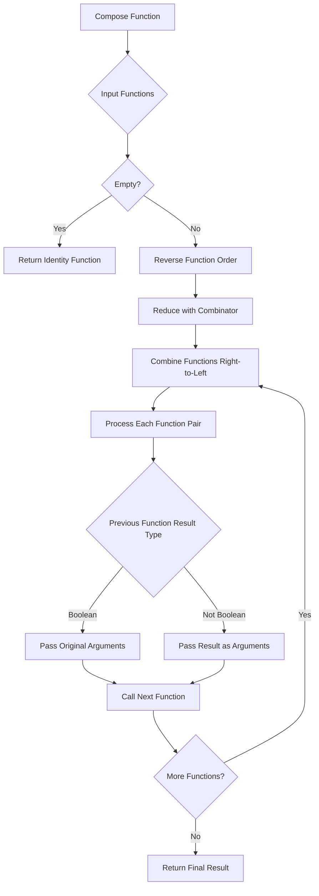
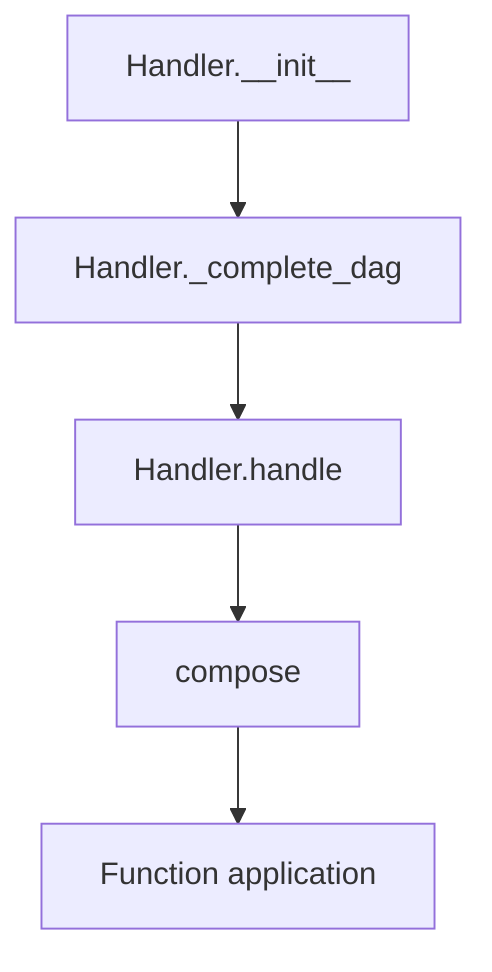
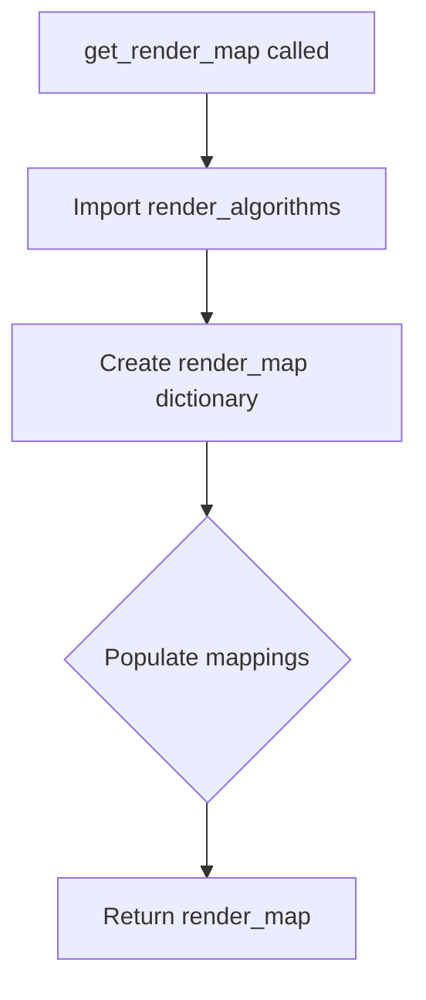

# `handler.py`

## `src.ydata_profiling.model.handler.compose` · *function*

## Summary:
Creates a right-to-left function composition that conditionally passes arguments based on return types.

## Description:
This function implements function composition where multiple callable functions are combined into a single function. Functions are applied from right to left through the provided sequence using `functools.reduce`. When a function in the sequence returns a boolean value, the next function receives the original arguments; otherwise, it receives the result of the previous function. This enables conditional execution paths in composed functions.

## Args:
    functions (Sequence[Callable]): A sequence of callable functions to compose. Functions are applied from right to left.

## Returns:
    Callable: A composed function that applies all input functions in sequence. The returned function accepts any number of arguments and returns the result of applying all composed functions.

## Raises:
    None explicitly raised, but may propagate exceptions from the composed functions.

## Constraints:
    Preconditions:
    - All elements in the functions sequence must be callable
    - The sequence should not be empty for meaningful composition
    
    Postconditions:
    - The returned function will accept the same argument types as the first function in the sequence
    - The returned function will return the same type as the last function in the sequence

## Side Effects:
    None

## Control Flow:


## Examples:
```python
# Basic usage - multiply by 2, then add 1
def add_one(x):
    return x + 1

def multiply_by_two(x):
    return x * 2

composed_func = compose([add_one, multiply_by_two])
result = composed_func(5)  # Returns 11 (multiply_by_two(5)=10, add_one(10)=11)

# Boolean handling - check positive, then negate
def check_positive(x):
    return x > 0

def negate(x):
    return -x

composed_with_bool = compose([negate, check_positive])
result = composed_with_bool(-5)  # Returns -5 (check_positive(-5)=False, negate(-5)=-5)

# Chain multiple operations
def square(x):
    return x ** 2

def divide_by_two(x):
    return x / 2

def add_ten(x):
    return x + 10

composed_chain = compose([add_ten, divide_by_two, square])
result = composed_chain(4)  # Returns 18.0 (square(4)=16, divide_by_two(16)=8, add_ten(8)=18)
```

## `src.ydata_profiling.model.handler.Handler` · *class*

## Summary:
A handler class that manages data type processing by mapping types to sequences of functions and applying them in dependency-ordered execution.

## Description:
The Handler class serves as a central orchestrator for processing different data types in a profiling system. It maintains a mapping from data type identifiers to sequences of processing functions and ensures these functions are applied in the correct order based on type dependencies established by the VisionsTypeset.

This class leverages the Visions library's type system to build a dependency graph among data types. Through topological sorting of this graph, it ensures that processing functions for dependent types are properly chained together, enabling efficient and ordered processing of data according to type relationships.

## State:
- mapping: Dict[str, List[Callable]] - Maps data type names to lists of processing functions that will be composed and applied
- typeset: VisionsTypeset - Contains type definitions and their hierarchical relationships through base_graph
- The mapping dictionary is modified during initialization to ensure all dependent types have their functions properly chained through the dependency graph

## Lifecycle:
- Creation: Instantiate with a mapping dictionary, VisionsTypeset, and optional arguments
- Usage: Call handle() method with a data type identifier and arguments to process data through the composed functions
- Destruction: No explicit cleanup required; relies on Python's garbage collection

## Method Map:


## Raises:
- None explicitly raised by __init__
- The handle method may raise exceptions from the composed functions if they fail during execution

## Example:
```python
# Create a handler with type mappings
handler = Handler(mapping={"int": [validate_int, summarize_int]}, typeset=my_typeset)

# Process data of a specific type
result = handler.handle("int", data_value)
```

### `src.ydata_profiling.model.handler.Handler.__init__` · *method*

## Summary:
Initializes a Handler instance with a mapping of data types to processing functions and completes the mapping using type relationships.

## Description:
The Handler.__init__ method sets up the core data structures for type-based processing. It stores the provided mapping and typeset, then calls _complete_dag() to extend the mapping with derived type relationships from the typeset's base graph structure.

## Args:
    mapping (Dict[str, List[Callable]]): A dictionary mapping data type names to lists of processing functions
    typeset (VisionsTypeset): A typeset containing type relationships and base graph structure
    *args: Additional positional arguments (passed to parent class if applicable)
    **kwargs: Additional keyword arguments (passed to parent class if applicable)

## Returns:
    None: This method initializes the object's state and doesn't return a value

## Raises:
    None explicitly raised: The method doesn't contain try/except blocks or explicit raises

## State Changes:
    Attributes READ: self.typeset.base_graph (used in _complete_dag)
    Attributes WRITTEN: self.mapping (modified by _complete_dag), self.typeset (assigned directly)

## Constraints:
    Preconditions: 
    - mapping should be a dictionary mapping string type names to lists of callable functions
    - typeset should be a valid VisionsTypeset instance with a base_graph attribute
    Postconditions:
    - self.mapping contains all type mappings including derived relationships
    - self.typeset is assigned the provided typeset instance

## Side Effects:
    None: This method doesn't perform I/O operations or mutate external state

### `src.ydata_profiling.model.handler.Handler._complete_dag` · *method*

## Summary:
Completes the type handler mapping by propagating function lists through a topological traversal of the type dependency graph.

## Description:
This method performs a topological sort of the line graph derived from the typeset's base graph to propagate function handler lists through type dependencies. It ensures that each type in the dependency graph inherits all applicable handlers from its predecessors in the dependency chain.

The method is called during Handler initialization to build a complete mapping of type-specific functions that can be used for processing data of various types.

## Args:
    None

## Returns:
    None

## Raises:
    None explicitly raised

## State Changes:
    Attributes READ: self.typeset, self.mapping
    Attributes WRITTEN: self.mapping

## Constraints:
    Preconditions:
    - self.typeset.base_graph must be a valid NetworkX graph
    - self.mapping must be a dictionary with string keys and list of callable values
    - The base_graph must represent a valid directed acyclic graph for topological sorting to work

    Postconditions:
    - All entries in self.mapping have been updated with propagated function lists
    - The mapping reflects the complete transitive closure of type dependencies

## Side Effects:
    None

### `src.ydata_profiling.model.handler.Handler.handle` · *method*

## Summary:
Applies a composition of type-specific functions to input arguments based on the provided data type, enabling polymorphic processing of different data types.

## Description:
This method serves as the core dispatch mechanism for type-specific processing within the profiling system. It retrieves functions associated with a given data type from the internal mapping, composes them into a single callable operation, and executes that operation with the provided arguments. This design allows for flexible, extensible type handling where different data types can have different processing pipelines. The composition logic specifically handles boolean return values by passing them through to subsequent functions, while other return types are passed as arguments to the next function in the chain.

## Args:
    dtype (str): The data type identifier used to look up functions in the mapping
    *args: Variable length argument list passed to the composed functions
    **kwargs: Arbitrary keyword arguments passed to the composed functions

## Returns:
    dict: A dictionary containing the processed results from applying the composed functions to the input arguments

## Raises:
    None explicitly raised - depends on the behavior of functions in the mapping

## State Changes:
    Attributes READ: self.mapping, self.typeset
    Attributes WRITTEN: None

## Constraints:
    Preconditions: 
    - The Handler instance must be properly initialized with a valid mapping
    - The dtype parameter must be a valid key in the mapping or will default to an empty list
    Postconditions:
    - Returns a dictionary result from executing the composed functions
    - The composition process preserves the order of functions in the mapping

## Side Effects:
    None - does not perform I/O operations or mutate external state

## `src.ydata_profiling.model.handler.get_render_map` · *function*

## Summary:
Creates and returns a mapping of data type names to their corresponding rendering functions for report generation.

## Description:
This function serves as a factory that constructs and returns a dictionary mapping data type identifiers (as strings) to their respective rendering functions from the report structure module. The returned mapping is used throughout the profiling system to dynamically select appropriate rendering logic based on data type.

The function encapsulates the dependency on the render algorithms module and centralizes the type-to-renderer mapping, making it easier to manage and extend rendering capabilities without modifying multiple locations in the codebase.

## Args:
    None

## Returns:
    Dict[str, Callable]: A dictionary mapping data type names to their corresponding rendering functions. The keys are string representations of data types including "Boolean", "Numeric", "Complex", "Text", "DateTime", "Categorical", "URL", "Path", "File", "Image", "Unsupported", and "TimeSeries". Each value is a callable function responsible for rendering the corresponding data type.

## Raises:
    None

## Constraints:
    Preconditions:
    - The module `ydata_profiling.report.structure.variables` must be importable and contain the expected rendering functions
    - All referenced rendering functions must be callable objects
    
    Postconditions:
    - The returned dictionary contains exactly 12 key-value pairs
    - All values in the returned dictionary are callable objects
    - All keys are string representations of data types

## Side Effects:
    None

## Control Flow:


## Examples:
```python
# Typical usage in profiling system
render_map = get_render_map()
renderer_function = render_map["Numeric"]
# renderer_function would now reference render_real from render_algorithms
```

