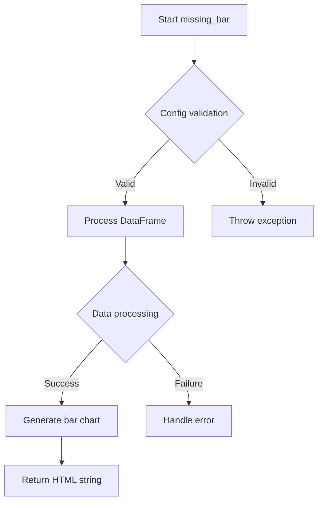
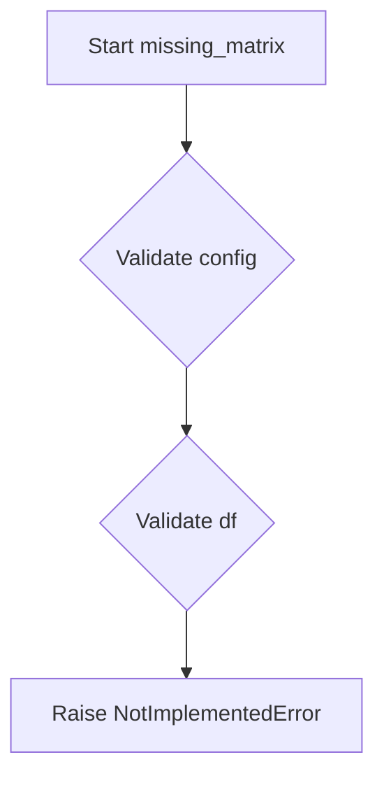
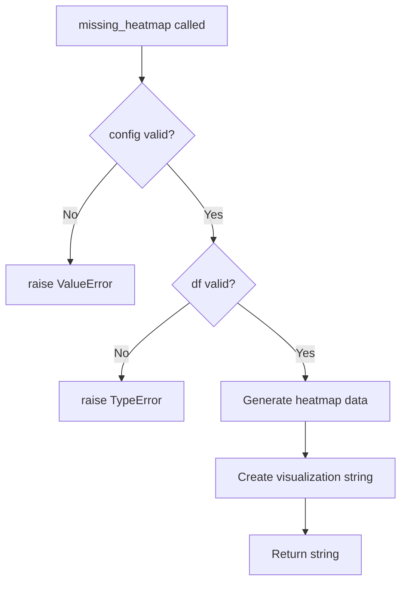
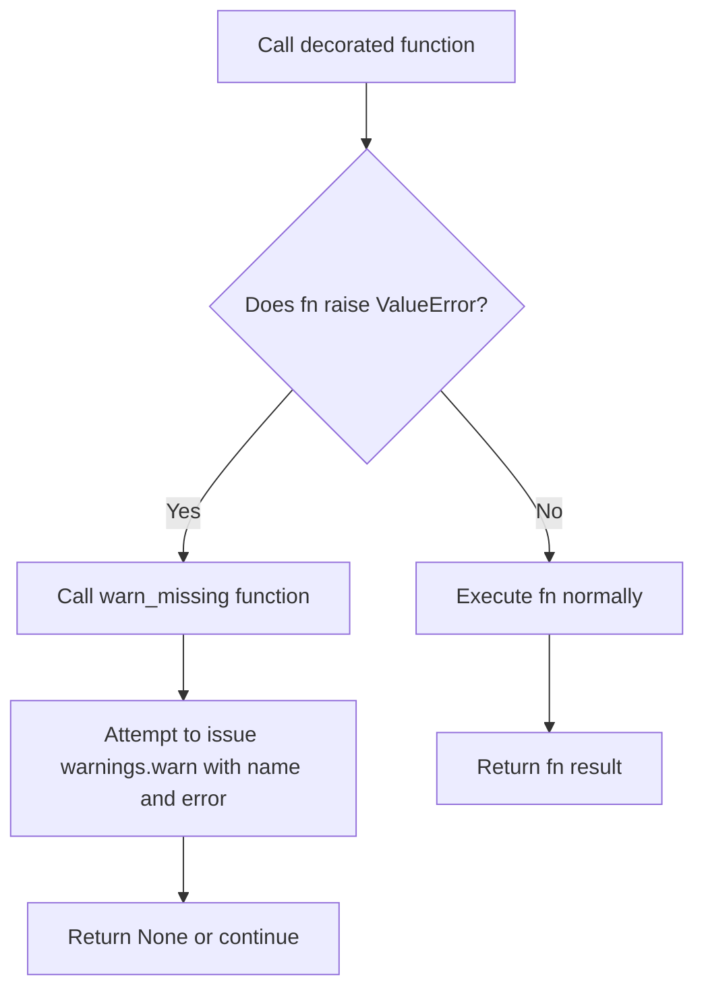
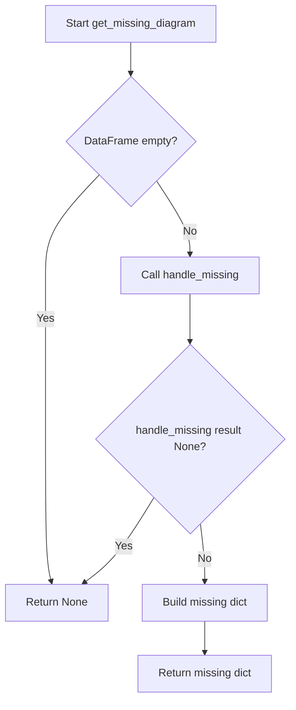

# `missing.py`

## `src.ydata_profiling.model.missing.missing_bar` · *function*

## Summary:
Generates a bar chart visualization displaying missing data patterns for each column in a DataFrame.

## Description:
Creates a bar chart representation showing the count or percentage of missing values for each column in the dataset. This function is part of the missing data analysis module in the ydata-profiling library and is designed to provide visual insights into data completeness patterns. The function currently raises NotImplementedError as the implementation is pending.

## Args:
    config (Settings): Configuration settings object containing profiling parameters and visualization preferences.
    df (Any): Input DataFrame containing the data to analyze for missing values.

## Returns:
    str: HTML string representation of the missing data bar chart visualization (currently raises NotImplementedError).

## Raises:
    NotImplementedError: Always raised as the implementation is incomplete.

## Constraints:
    Preconditions: 
    - config must be a valid Settings object from ydata_profiling.config
    - df must be a valid DataFrame-like object
    
    Postconditions:
    - Function will eventually return a properly formatted HTML string for visualization

## Side Effects:
    None

## Control Flow:


## Examples:
    Not applicable due to NotImplementedError

## `src.ydata_profiling.model.missing.missing_matrix` · *function*

## Summary:
Placeholder function for generating a string representation of missing data patterns in a dataset.

## Description:
This function is intended to generate a visualization or representation of missing data patterns in a dataset, typically as an HTML string. It serves as a placeholder for the missing matrix functionality in the data profiling system.

The function is part of the missing data analysis module and is designed to create visualizations showing where missing values occur in the input dataframe. This would help users understand data quality issues and identify systematic patterns in missing data.

Currently, this function raises NotImplementedError as the implementation is not yet complete. It is expected to return a string representation (likely HTML) showing the missing data matrix pattern.

## Args:
    config (Settings): Configuration settings object containing profiling preferences and options
    df (Any): Input dataframe containing the data to analyze for missing values

## Returns:
    str: String representation of missing data patterns (implementation pending)

## Raises:
    NotImplementedError: Always raised by this function as it is not yet implemented

## Constraints:
    Preconditions:
        - config must be a valid Settings object
        - df must be a valid dataframe-like object
    Postconditions:
        - Function would return a string representation of missing data patterns

## Side Effects:
    None: This function does not perform any I/O operations or mutate external state

## Control Flow:


## Examples:
    # Usage example (currently raises NotImplementedError)
    try:
        missing_report = missing_matrix(settings_config, data_df)
        print(missing_report)
    except NotImplementedError:
        print("Missing matrix generation not yet implemented")
```

## `src.ydata_profiling.model.missing.missing_heatmap` · *function*

## Summary:
Generates a heatmap visualization showing patterns of missing data across columns in a DataFrame.

## Description:
Creates a heatmap representation that visualizes the distribution and patterns of missing values across different columns in the provided dataset. This function is part of the missing data analysis module and is designed to help users quickly identify trends in missing data, such as which columns have the most missing values or if missing values occur in specific patterns.

The function is typically called during the profiling process when generating missing data reports and visualizations. It extracts missing data patterns from the input DataFrame using the provided configuration settings and returns a string representation of the visualization.

This logic is extracted into its own function to separate the visualization generation concern from the main profiling pipeline, allowing for easier testing, reuse, and modular development of missing data analysis features.

## Args:
    config (Settings): Configuration settings object containing parameters for visualization generation, such as chart dimensions, color schemes, and missing data thresholds.
    df (Any): Input DataFrame containing the data to analyze for missing values. Should be compatible with pandas DataFrame operations.

## Returns:
    str: A string representation of the heatmap visualization, typically in HTML format, showing missing data patterns across columns.

## Raises:
    NotImplementedError: This function is currently not implemented and raises this exception when called.

## Constraints:
    Preconditions:
    - config must be a valid Settings object with appropriate missing data analysis configurations
    - df must be a valid DataFrame-like object that supports basic pandas operations
    
    Postconditions:
    - Function will raise NotImplementedError until properly implemented

## Side Effects:
    None: This function does not perform any I/O operations or mutate external state.

## Control Flow:


## Examples:
```python
# Typical usage in a profiling context
from ydata_profiling.config import Settings
import pandas as pd

config = Settings()
df = pd.DataFrame({'A': [1, None, 3], 'B': [None, 2, 3]})
# This would normally return a heatmap visualization string
# heatmap_str = missing_heatmap(config, df)
```

## `src.ydata_profiling.model.missing.get_missing_active` · *function*

## Summary:
Filters and returns active missing data visualization configurations based on configuration settings and table statistics.

## Description:
This function determines which missing data visualization options should be displayed by filtering the available visualization types according to user configuration and data characteristics. It evaluates whether each visualization type should be active based on enabled flags in the configuration and minimum requirements defined by the visualization type.

## Args:
    config (Settings): Configuration object containing missing_diagrams settings that control which visualizations are enabled.
    table_stats (dict): Dictionary containing statistical information about the dataset, specifically including:
        - n_vars_with_missing: Number of variables (columns) with missing values
        - n_vars_all_missing: Number of variables (columns) with all values missing

## Returns:
    Dict[str, Any]: Filtered dictionary of active missing data visualization configurations, where keys are visualization names and values are dictionaries containing:
        - min_missing: Minimum number of variables with missing values required for this visualization
        - name: Human-readable name of the visualization
        - caption: Description of what the visualization shows
        - function: Reference to the function that generates this visualization

## Raises:
    None explicitly raised in the function body.

## Constraints:
    Preconditions:
    - config must be a valid Settings object with missing_diagrams attribute
    - table_stats must be a dictionary containing 'n_vars_with_missing' and 'n_vars_all_missing' keys
    
    Postconditions:
    - Returns a dictionary with zero or more visualization configurations
    - All returned configurations have valid function references

## Side Effects:
    None.

## Control Flow:
```mermaid
flowchart TD
    A[Start get_missing_active] --> B{config.missing_diagrams[name] enabled?}
    B -- Yes --> C{table_stats[n_vars_with_missing] >= min_missing?}
    C -- Yes --> D{name != "heatmap"?}
    D -- Yes --> E[Include visualization]
    D -- No --> F{table_stats[n_vars_with_missing] - table_stats[n_vars_all_missing] >= min_missing?}
    F -- Yes --> E
    F -- No --> G[Exclude visualization]
    C -- No --> H[Exclude visualization]
    B -- No --> H
    E --> I[Return filtered map]
    G --> I
    H --> I
```

## Examples:
    # Basic usage with enabled visualizations
    config = Settings()
    config.missing_diagrams = {"bar": True, "matrix": True, "heatmap": False}
    table_stats = {
        "n_vars_with_missing": 5,
        "n_vars_all_missing": 1
    }
    active_visualizations = get_missing_active(config, table_stats)
    # Returns configurations for "bar" and "matrix" visualizations

## `src.ydata_profiling.model.missing.handle_missing` · *function*

## Summary:
Decorator that wraps functions to catch ValueError exceptions and attempt to issue warnings.

## Description:
This decorator serves as a protective wrapper around functions that may encounter ValueError exceptions. When such an exception occurs, it attempts to convert the error into a warning rather than letting it propagate, allowing data processing to continue.

The decorator is particularly useful in data profiling contexts where missing data scenarios should not halt execution but should be reported to users. Note: The current implementation contains a bug in the warning message formatting.

## Args:
    name (str): A descriptive identifier for the operation being performed, used in warning messages
    fn (Callable): The function to be wrapped and protected from ValueError exceptions

## Returns:
    Callable: A wrapper function that executes the original function and catches ValueError exceptions

## Raises:
    ValueError: Original ValueError exceptions from the wrapped function are caught and converted to warnings (the decorator doesn't raise exceptions itself)

## Constraints:
    Preconditions:
    - The `name` parameter must be a string describing the operation
    - The `fn` parameter must be a callable that can potentially raise ValueError exceptions
    - The wrapped function should accept arbitrary positional and keyword arguments
    
    Postconditions:
    - The returned wrapper function maintains the same interface as the original function
    - If the wrapped function raises ValueError, it will be caught and converted to a warning
    - If the wrapped function succeeds normally, its result is returned unchanged

## Side Effects:
    - Issues Python warnings via the warnings module when ValueErrors occur
    - No other external state mutations or I/O operations

## Control Flow:


## Examples:
```python
@handle_missing("data_validation", validate_data)
def process_data(data):
    # Processing logic that might raise ValueError for missing data
    pass

# If validate_data raises ValueError due to missing data,
# a warning will be issued instead of propagating the error
```

## `src.ydata_profiling.model.missing.get_missing_diagram` · *function*

## Summary
Creates a missing data diagram configuration dictionary from DataFrame and settings.

## Description
Processes missing data visualization settings and generates a structured dictionary containing the missing data matrix and associated metadata. This function acts as a wrapper that orchestrates the missing data analysis process and formats the results according to the expected output structure.

The function delegates the actual missing data computation to the `handle_missing` decorator, which provides error handling for missing data operations. It serves as a bridge between the configuration settings and the missing data processing pipeline.

## Args
    config (Settings): Configuration object containing profiling settings
    df (pd.DataFrame): Input DataFrame to analyze for missing values
    settings (Dict[str, Any]): Dictionary containing missing data analysis settings including:
        - "name" (str): Name identifier for the missing data analysis
        - "function" (Callable): Function to execute for missing data analysis
        - "caption" (str): Caption for the missing data visualization

## Returns
    Optional[Dict[str, Any]]: Dictionary containing missing data analysis results with keys:
        - "name" (str): Analysis name
        - "caption" (str): Visualization caption
        - "matrix" (Any): Missing data matrix result
    Returns None if input DataFrame is empty or if the missing data analysis produces no result.

## Raises
    None explicitly raised, though underlying operations may raise exceptions handled by the `handle_missing` decorator.

## Constraints
    Preconditions:
        - config must be a valid Settings object
        - df must be a pandas DataFrame
        - settings must contain "name", "function", and "caption" keys
    Postconditions:
        - Returns None if df is empty (length 0)
        - Returns None if handle_missing operation returns None
        - Returns properly formatted dictionary with required keys when successful

## Side Effects
    - May issue warnings via Python warnings module when missing data operations fail
    - No external state mutations or I/O operations

## Control Flow


## Examples
```python
# Basic usage
config = Settings()
df = pd.DataFrame({'A': [1, None, 3], 'B': [None, 2, 3]})
settings = {
    "name": "missing_matrix",
    "function": some_missing_function,
    "caption": "Missing Data Pattern"
}
result = get_missing_diagram(config, df, settings)
# Returns: {"name": "missing_matrix", "caption": "Missing Data Pattern", "matrix": ...}
```

