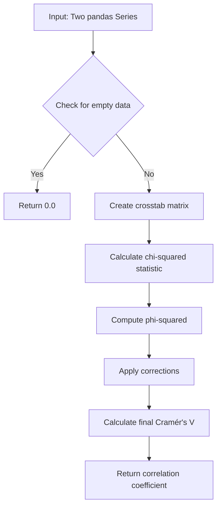
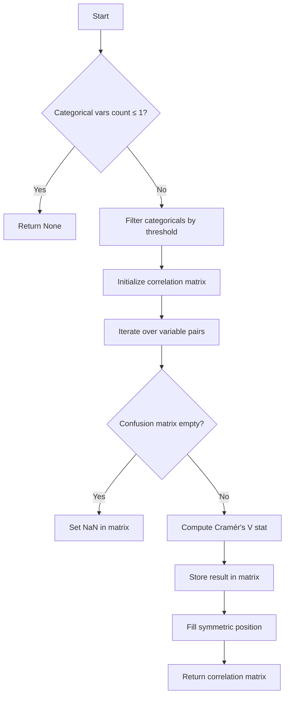
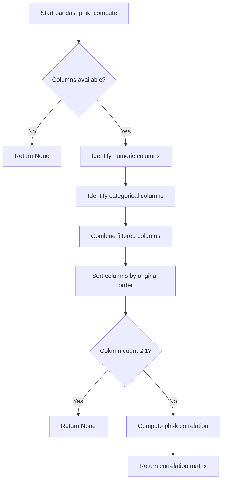

# `correlations_pandas.py`

## `src.ydata_profiling.model.pandas.correlations_pandas.pandas_spearman_compute` · *function*

## Summary:
Computes Spearman rank correlation coefficients for numeric columns in a pandas DataFrame.

## Description:
This function computes Spearman rank correlation coefficients between all pairs of numeric columns in the input DataFrame using pandas' built-in correlation method. It serves as a specific implementation within a modular correlation computation framework that supports multiple correlation types (Pearson, Spearman, Kendall, etc.).

The function acts as a thin wrapper around pandas' `DataFrame.corr(method="spearman")` method, providing a consistent interface for correlation computation regardless of the specific correlation method being used.

## Args:
    config (Settings): Configuration object containing system-wide settings and preferences. This parameter is accepted for interface consistency but is not used in the current implementation.
    df (pd.DataFrame): Input DataFrame containing numerical data for which correlation coefficients need to be computed.
    summary (dict): Summary statistics dictionary containing metadata about the dataset. This parameter is accepted for interface consistency but is not used in the current implementation.

## Returns:
    Optional[pd.DataFrame]: A DataFrame containing the Spearman correlation coefficients between all pairs of numeric columns in the input DataFrame. The returned DataFrame has rows and columns labeled according to the input DataFrame's column names. Returns None if the input DataFrame contains no numeric columns or is empty.

## Raises:
    None explicitly raised by this function. However, underlying pandas operations may raise exceptions such as TypeError if incompatible data types are present in the DataFrame.

## Constraints:
    Preconditions:
    - Input df must be a valid pandas DataFrame
    - DataFrame should contain at least one numeric column for meaningful correlation computation
    
    Postconditions:
    - Returns a symmetric correlation matrix with correlation values between -1 and 1
    - Diagonal elements are always 1.0 (perfect correlation of each column with itself)
    - Non-numeric columns are automatically excluded from computation by pandas' corr() method

## Side Effects:
    None. This function is pure and does not modify any external state or perform I/O operations.

## Control Flow:
```mermaid
flowchart TD
    A[Start pandas_spearman_compute] --> B{Input DataFrame validation}
    B --> C[Call df.corr(method="spearman")]
    C --> D[Return correlation DataFrame or None]
```

## Examples:
```python
import pandas as pd
from ydata_profiling.config import Settings

# Basic usage with numeric data
config = Settings()
df = pd.DataFrame({'A': [1, 2, 3], 'B': [4, 5, 6], 'C': [7, 8, 9]})
result = pandas_spearman_compute(config, df, {})

# Result will be a correlation matrix showing relationships between columns
print(result)
# Output:
#      A    B    C
# A  1.0  1.0  1.0
# B  1.0  1.0  1.0
# C  1.0  1.0  1.0

# Usage with mixed data types (non-numeric columns are ignored)
df_mixed = pd.DataFrame({'A': [1, 2, 3], 'B': ['x', 'y', 'z'], 'C': [7, 8, 9]})
result = pandas_spearman_compute(config, df_mixed, {})
# Only columns A and C will be considered for correlation
```

## `src.ydata_profiling.model.pandas.correlations_pandas.pandas_pearson_compute` · *function*

## Summary:
Computes the Pearson correlation matrix for numeric columns in a pandas DataFrame.

## Description:
This function calculates Pearson correlation coefficients between all pairs of numeric columns in the provided DataFrame. It serves as a wrapper around pandas' built-in correlation computation method, specifically configured for Pearson correlation. The function is part of a family of correlation computation functions that support different correlation methods (Pearson, Spearman, Kendall, Phi-K, Cramers).

This function is typically called by correlation computation dispatchers that select the appropriate correlation method based on configuration settings in the Settings object.

## Args:
    config (Settings): Configuration object containing profiling settings, though this particular function ignores most settings except for potential future extensions.
    df (pd.DataFrame): Input DataFrame containing the data for which to compute correlations.
    summary (dict): Dictionary containing column-wise summary statistics used for filtering and validation purposes.

## Returns:
    Optional[pd.DataFrame]: A DataFrame containing the Pearson correlation matrix where rows and columns represent the same variables, or None if insufficient numeric data exists for correlation computation.

## Raises:
    None explicitly raised by this function, though underlying pandas operations may raise exceptions for invalid inputs.

## Constraints:
    Preconditions:
        - df must be a valid pandas DataFrame
        - summary must be a dictionary with column metadata
        - The DataFrame should contain at least two numeric columns for meaningful correlation computation
        
    Postconditions:
        - Returns a symmetric correlation matrix with diagonal values of 1.0
        - All correlation values are between -1.0 and 1.0
        - Returns None when there are fewer than 2 numeric columns with sufficient data

## Side Effects:
    None

## Control Flow:
```mermaid
flowchart TD
    A[Start pandas_pearson_compute] --> B{DataFrame has columns?}
    B -- No --> C[Return None]
    B -- Yes --> D[Call df.corr(method="pearson")]
    D --> E[Return correlation matrix]
```

## Examples:
```python
# Basic usage
import pandas as pd
from ydata_profiling.config import Settings

config = Settings()
df = pd.DataFrame({'A': [1, 2, 3], 'B': [4, 5, 6], 'C': [7, 8, 9]})
result = pandas_pearson_compute(config, df, {})
print(result)
# Output: correlation matrix showing relationships between A, B, and C

# With insufficient data
df_empty = pd.DataFrame({'A': [1, 2, 3]})
result = pandas_pearson_compute(config, df_empty, {})
print(result)
# Output: None (insufficient columns for correlation)
```

## `src.ydata_profiling.model.pandas.correlations_pandas.pandas_kendall_compute` · *function*

## Summary:
Computes Kendall rank correlation coefficients for a pandas DataFrame.

## Description:
This function calculates the Kendall rank correlation matrix for numeric columns in the provided DataFrame. It serves as a specialized implementation for computing Kendall correlations within the ydata-profiling framework, following the standard pattern of correlation computation functions in the pandas module.

## Args:
    config (Settings): Configuration settings object containing profiling parameters
    df (pd.DataFrame): Input DataFrame containing the data to correlate
    summary (dict): Dictionary containing column summary statistics and metadata

## Returns:
    Optional[pd.DataFrame]: A DataFrame containing the Kendall correlation coefficients between columns, or None if insufficient data is available for correlation computation.

## Raises:
    None explicitly raised by this function

## Constraints:
    Preconditions:
    - The input DataFrame should contain numeric data suitable for rank correlation analysis
    - The config parameter should be properly initialized with valid settings
    
    Postconditions:
    - Returns a symmetric correlation matrix with values between -1 and 1
    - Diagonal elements are always 1.0 (perfect correlation with themselves)
    - Returns None when the DataFrame has fewer than 2 columns or insufficient data

## Side Effects:
    None

## Control Flow:
    ```mermaid
    flowchart TD
        A[Start pandas_kendall_compute] --> B{DataFrame has columns?}
        B -- Yes --> C[Call df.corr(method="kendall")]
        C --> D[Return correlation matrix]
        B -- No --> E[Return None]
        E --> F[End]
        D --> F
    ```

## Examples:
    ```python
    # Basic usage
    config = Settings()
    df = pd.DataFrame({'A': [1, 2, 3, 4], 'B': [2, 4, 6, 8], 'C': [1, 3, 5, 7]})
    result = pandas_kendall_compute(config, df, {})
    
    # Result would be a 3x3 correlation matrix showing Kendall correlations
    ```

## `src.ydata_profiling.model.pandas.correlations_pandas._cramers_corrected_stat` · *function*

## Summary:
Calculates Cramér's corrected statistic (Cramér's V) for measuring association between categorical variables from a contingency table.

## Description:
This function computes Cramér's V coefficient, a measure of association between two nominal categorical variables. It applies Yates' correction for continuity when requested and handles edge cases such as empty matrices or degenerate conditions. The function is part of the correlation analysis pipeline for categorical data in the ydata-profiling library, specifically used in computing Cramér's correlation coefficients.

Cramér's V is calculated as the square root of the chi-squared statistic divided by the minimum of (rows-1) and (columns-1), adjusted for sample size. It ranges from 0 (no association) to 1 (perfect association).

## Args:
    confusion_matrix (pandas.DataFrame): A contingency table (cross-tabulation) of two categorical variables
    correction (bool): Whether to apply Yates' correction for continuity in the chi-squared test

## Returns:
    float: Cramér's V coefficient ranging from 0 to 1, where 0 indicates no association and 1 indicates perfect association. Returns 0 for empty matrices.

## Raises:
    None explicitly raised, but may raise exceptions from scipy.stats.chi2_contingency() when invalid input is provided

## Constraints:
    Preconditions:
    - confusion_matrix must be a valid pandas DataFrame
    - confusion_matrix should represent a contingency table with non-negative integer values
    - When correction=True, the function assumes the data is suitable for Yates' correction
    
    Postconditions:
    - Returns a float value between 0 and 1 inclusive
    - Returns 0 for empty matrices
    - Handles numerical edge cases gracefully through np.errstate context manager

## Side Effects:
    None

## Control Flow:
```mermaid
flowchart TD
    A[Start] --> B{confusion_matrix.empty?}
    B -- Yes --> C[Return 0]
    B -- No --> D[Calculate chi2_contingency with correction]
    D --> E[Calculate n (total observations), phi2, r (rows), k (columns)]
    E --> F[Apply numerical corrections with np.errstate]
    F --> G{rkcorr == 0?}
    G -- Yes --> H[Set corr = 1.0]
    G -- No --> I[Calculate corr = sqrt(phi2corr/rkcorr)]
    I --> J[Return corr]
    H --> J
```

## Examples:
    # Basic usage with a contingency table
    import pandas as pd
    import numpy as np
    from scipy import stats
    
    # Create sample contingency table
    data = [[10, 15, 5], [20, 25, 10], [5, 10, 15]]
    df = pd.DataFrame(data, columns=['A', 'B', 'C'], index=['X', 'Y', 'Z'])
    
    # Calculate Cramér's V
    result = _cramers_corrected_stat(df, correction=False)
    print(f"Cramér's V: {result:.4f}")
    
    # With Yates' correction
    result_corrected = _cramers_corrected_stat(df, correction=True)
    print(f"Cramér's V (corrected): {result_corrected:.4f}")
```

## `src.ydata_profiling.model.pandas.correlations_pandas._pairwise_spearman` · *function*

## Summary:
Computes the Spearman rank correlation coefficient between two pandas Series.

## Description:
This function calculates the Spearman rank correlation between two numerical variables represented as pandas Series. It leverages pandas' built-in correlation method with the spearman method parameter to compute the rank-based correlation coefficient.

## Args:
    col_1 (pd.Series): First pandas Series containing numerical data for correlation calculation
    col_2 (pd.Series): Second pandas Series containing numerical data for correlation calculation

## Returns:
    float: Spearman correlation coefficient ranging from -1.0 to 1.0, where:
        - 1.0 indicates perfect positive monotonic relationship
        - 0.0 indicates no monotonic relationship
        - -1.0 indicates perfect negative monotonic relationship

## Raises:
    None explicitly raised - relies on pandas Series.corr() method which may raise exceptions for invalid inputs

## Constraints:
    Preconditions:
        - Both input parameters must be pandas Series objects
        - Both Series should contain numerical data
        - Both Series must have the same length for meaningful correlation calculation
    
    Postconditions:
        - Returns a float value between -1.0 and 1.0 inclusive
        - Function execution does not modify the input Series

## Side Effects:
    None - This function is pure and has no side effects

## Control Flow:
```mermaid
flowchart TD
    A[Input: col_1, col_2] --> B{Validate inputs}
    B -->|Valid| C[Call col_1.corr(col_2, method="spearman")]
    C --> D[Return correlation coefficient]
    B -->|Invalid| E[Raise pandas exception]
```

## Examples:
```python
import pandas as pd
import numpy as np

# Basic usage
series1 = pd.Series([1, 2, 3, 4, 5])
series2 = pd.Series([2, 4, 6, 8, 10])
correlation = _pairwise_spearman(series1, series2)
# Returns 1.0 (perfect positive correlation)

# Negative correlation
series3 = pd.Series([1, 2, 3, 4, 5])
series4 = pd.Series([5, 4, 3, 2, 1])
correlation = _pairwise_spearman(series3, series4)
# Returns -1.0 (perfect negative correlation)

# No correlation
series5 = pd.Series([1, 2, 3, 4, 5])
series6 = pd.Series([3, 1, 4, 1, 5])
correlation = _pairwise_spearman(series5, series6)
# Returns approximately 0.0 (no correlation)
```

## `src.ydata_profiling.model.pandas.correlations_pandas._pairwise_cramers` · *function*

## Summary:
Computes the Cramér's V correlation coefficient between two categorical variables.

## Description:
Calculates the Cramér's V correlation coefficient, a measure of association between two categorical variables, using the chi-squared test statistic. This function is designed for pairwise correlation computations in correlation matrices involving categorical data.

This function is typically called as part of a larger correlation computation pipeline when analyzing relationships between categorical variables in datasets. It serves as a specialized correlation metric for nominal-scale data, returning values between 0 and 1 where 0 indicates no association and 1 indicates perfect association.

## Args:
    col_1 (pd.Series): First categorical variable as a pandas Series
    col_2 (pd.Series): Second categorical variable as a pandas Series

## Returns:
    float: Cramér's V correlation coefficient between the two variables, ranging from 0.0 to 1.0. Returns 0.0 when either input is empty or when the calculation results in an undefined value.

## Raises:
    None explicitly raised - however, underlying statistical operations may raise exceptions from scipy.stats.chi2_contingency or numpy operations.

## Constraints:
    Preconditions:
    - Both input parameters must be pandas Series objects
    - Both Series should contain categorical data
    - Series should not be completely empty
    
    Postconditions:
    - Returns a float value between 0.0 and 1.0 inclusive
    - Function is deterministic for identical inputs

## Side Effects:
    None - This function is pure and does not modify external state or perform I/O operations.

## Control Flow:


## Examples:
```python
import pandas as pd
from src.ydata_profiling.model.pandas.correlations_pandas import _pairwise_cramers

# Basic usage with categorical data
col1 = pd.Series(['A', 'B', 'A', 'C', 'B'])
col2 = pd.Series(['X', 'Y', 'X', 'Z', 'Y'])
correlation = _pairwise_cramers(col1, col2)
print(f"Correlation: {correlation}")  # Output: float between 0.0 and 1.0

# With empty series (returns 0.0)
empty_col = pd.Series([], dtype='object')
result = _pairwise_cramers(empty_col, col1)
print(result)  # Output: 0.0
```

## `src.ydata_profiling.model.pandas.correlations_pandas.pandas_cramers_compute` · *function*

## Summary:
Computes Cramér's V correlation matrix for categorical variables within a DataFrame based on configuration thresholds.

## Description:
This function calculates pairwise Cramér's V correlations between categorical variables that meet specified distinct value thresholds. It serves as a specialized correlation computation method for categorical data, returning a symmetric correlation matrix where values represent the strength of association between variable pairs.

The function is part of a family of correlation computation functions (pandas_pearson_compute, pandas_spearman_compute, etc.) that handle different correlation types for various data types. It specifically targets categorical and boolean variables with a reasonable number of distinct values.

## Args:
    config (Settings): Configuration object containing categorical maximum correlation distinct threshold
    df (pd.DataFrame): Input DataFrame containing the data to analyze
    summary (dict): Dictionary containing column metadata including data types and distinct counts

## Returns:
    Optional[pd.DataFrame]: A symmetric correlation matrix with categorical variable names as both row and column labels, or None if insufficient categorical variables exist for correlation analysis

## Raises:
    None explicitly raised - though underlying operations may raise exceptions from pandas or scipy operations

## Constraints:
    Preconditions:
    - config must contain a valid categorical_maximum_correlation_distinct attribute
    - df must be a valid pandas DataFrame
    - summary must be a dictionary with proper column metadata structure
    
    Postconditions:
    - If return value is not None, the returned DataFrame will be symmetric with 1.0 diagonal values
    - All off-diagonal values will be between 0 and 1 inclusive
    - If return value is None, it indicates fewer than 2 qualifying categorical variables

## Side Effects:
    None - This function is pure and doesn't modify external state or perform I/O operations

## Control Flow:


## Examples:
```python
# Basic usage with a DataFrame containing categorical data
config = Settings()
df = pd.DataFrame({
    'category_a': ['X', 'Y', 'X', 'Z'],
    'category_b': ['P', 'Q', 'P', 'R'],
    'numeric_col': [1, 2, 3, 4]
})
summary = {
    'category_a': {'type': 'Categorical', 'n_distinct': 3},
    'category_b': {'type': 'Categorical', 'n_distinct': 3},
    'numeric_col': {'type': 'Numeric', 'n_distinct': 4}
}

result = pandas_cramers_compute(config, df, summary)
# Returns a 2x2 correlation matrix showing association between category_a and category_b
```

## `src.ydata_profiling.model.pandas.correlations_pandas.pandas_phik_compute` · *function*

## Summary:
Computes the phi-k correlation matrix for numeric and categorical columns meeting specified criteria.

## Description:
This function calculates phi-k correlations between numeric and categorical columns in a DataFrame. It filters columns based on their data type and distinct value counts, then computes the correlation matrix using the phik library. The function handles mixed data types by identifying numeric columns (with more than 1 distinct value) and categorical columns (with 1 < n_distinct <= config.categorical_maximum_correlation_distinct), combining them appropriately for correlation analysis.

## Args:
    config (Settings): Configuration object containing settings such as maximum distinct values for categorical correlation
    df (pd.DataFrame): Input DataFrame containing the data to analyze
    summary (dict): Dictionary containing column summary statistics including data types and distinct value counts

## Returns:
    Optional[pd.DataFrame]: Correlation matrix computed using phi-k method with values between -1 and 1, or None if fewer than 2 qualifying columns exist

## Raises:
    None explicitly raised

## Constraints:
    Preconditions:
    - config must contain a valid categorical_maximum_correlation_distinct setting
    - df must be a valid pandas DataFrame
    - summary must contain proper column metadata with "type" and "n_distinct" keys
    
    Postconditions:
    - Returns None when fewer than 2 columns qualify for correlation analysis
    - Returns a symmetric correlation matrix when 2+ columns qualify
    - Column ordering in result matches original DataFrame column order
    - All returned correlation values are between -1 and 1

## Side Effects:
    - Suppresses warnings from the phik library during correlation computation
    - Imports phik library internally within the function scope

## Control Flow:


## Examples:
    # Basic usage with mixed data types
    config = Settings()
    df = pd.DataFrame({'A': [1, 2, 3], 'B': ['x', 'y', 'z']})
    summary = {'A': {'type': 'Numeric', 'n_distinct': 3}, 'B': {'type': 'Categorical', 'n_distinct': 2}}
    result = pandas_phik_compute(config, df, summary)
    # Returns correlation matrix with shape (2, 2)
    
    # Returns None when insufficient qualifying columns
    summary = {'A': {'type': 'Numeric', 'n_distinct': 1}}  # Only 1 distinct value
    result = pandas_phik_compute(config, df, summary)  # Returns None

## `src.ydata_profiling.model.pandas.correlations_pandas.pandas_auto_compute` · *function*

## Summary:
Computes an automatic correlation matrix for mixed-type data columns using appropriate statistical methods.

## Description:
This function automatically determines the most suitable correlation method based on column types and computes pairwise correlations between numerical and categorical columns. It discretizes numerical columns for categorical correlation analysis and handles different correlation methods appropriately. The function identifies numerical columns (Numeric and TimeSeries types with more than 1 distinct value) and categorical columns (Categorical and Boolean types with 1 < distinct values <= threshold) to compute appropriate correlations.

## Args:
    config (Settings): Configuration object containing correlation settings including categorical maximum distinct values and auto-correlation bin settings.
    df (pd.DataFrame): Input DataFrame containing the data to analyze.
    summary (dict): Column summary statistics dictionary with type and distinct count information for each column.

## Returns:
    Optional[pd.DataFrame]: Correlation matrix DataFrame with shape (n_columns, n_columns) where n_columns is the number of qualifying columns, or None if fewer than 2 qualifying columns exist.

## Raises:
    None explicitly raised in the function body.

## Constraints:
    Preconditions:
    - The input DataFrame must contain at least two columns with sufficient distinct values for correlation analysis
    - Config must contain valid settings for categorical maximum correlation distinct values and auto-correlation bins
    - Column summary must contain type and n_distinct keys for each column
    
    Postconditions:
    - Returns None if fewer than 2 columns qualify for correlation analysis
    - Returns a symmetric correlation matrix with values between -1 and 1 when successful
    - Matrix diagonal elements are always 1.0

## Side Effects:
    None explicitly mentioned in the function body.

## Control Flow:
```mermaid
flowchart TD
    A[Start pandas_auto_compute] --> B{Total qualifying columns ≤ 1?}
    B -- Yes --> C[Return None]
    B -- No --> D[Calculate thresholds]
    D --> E[Identify numerical columns]
    E --> F[Identify categorical columns]
    F --> G[Discretize numerical columns]
    G --> H[Initialize correlation matrix with ones]
    H --> I[Iterate over unique column pairs]
    I --> J{Both columns categorical?}
    J -- Yes --> K[Use Cramers correlation]
    J -- No --> L[Use Spearman correlation]
    K --> M[Compute correlation using _pairwise_cramers]
    L --> M
    M --> N[Store correlation in matrix (symmetric)]
    N --> O[Continue to next pair?]
    O -- Yes --> I
    O -- No --> P[Return correlation matrix]
```

## Examples:
```python
# Basic usage
config = Settings()
df = pd.DataFrame({'A': [1, 2, 3], 'B': ['x', 'y', 'z']})
summary = {
    'A': {'type': 'Numeric', 'n_distinct': 3},
    'B': {'type': 'Categorical', 'n_distinct': 2}
}
result = pandas_auto_compute(config, df, summary)
# Returns correlation matrix or None if insufficient data

# With all numerical columns
df2 = pd.DataFrame({'A': [1, 2, 3], 'B': [4, 5, 6]})
summary2 = {
    'A': {'type': 'Numeric', 'n_distinct': 3},
    'B': {'type': 'Numeric', 'n_distinct': 3}
}
result2 = pandas_auto_compute(config, df2, summary2)
# Returns Spearman correlation matrix
```

