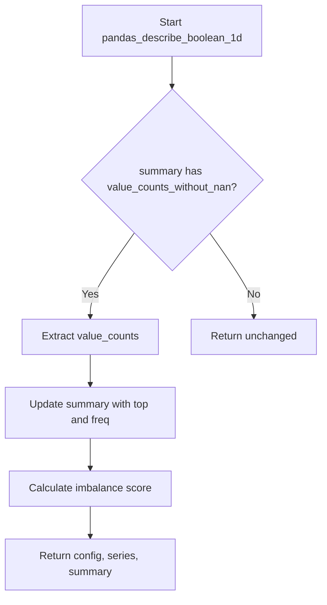

# `describe_boolean_pandas.py`

## `src.ydata_profiling.model.pandas.describe_boolean_pandas.pandas_describe_boolean_1d` · *function*

## Summary:
Computes additional statistical properties for boolean data series including top value frequency and imbalance score.

## Description:
This function enhances a summary dictionary for boolean data series by calculating and adding the most frequent value and its frequency, as well as an imbalance score that measures the distribution skewness of the boolean values. It serves as a specialized processor for boolean data within the pandas profiling framework.

The function is designed to be used as part of a data profiling pipeline where boolean columns require specific statistical treatment beyond basic descriptive statistics.

## Args:
    config (Settings): Configuration settings for the profiling process
    series (pd.Series): The boolean data series being analyzed
    summary (dict): Dictionary containing existing summary statistics for the series

## Returns:
    Tuple[Settings, pd.Series, dict]: The unchanged config, series, and updated summary dictionary

## Raises:
    None explicitly raised by this function

## Constraints:
    Preconditions:
    - The summary dictionary must contain a key "value_counts_without_nan" with a pandas Series value
    - The value_counts_without_nan Series must have at least one element
    
    Postconditions:
    - The summary dictionary will contain "top" and "freq" keys with the most frequent value and its count
    - The summary dictionary will contain an "imbalance" key with the calculated imbalance score

## Side Effects:
    None

## Control Flow:


## Examples:
```python
# Typical usage in profiling pipeline
config = Settings()
series = pd.Series([True, False, True, True])
summary = {"value_counts_without_nan": pd.Series([True: 3, False: 1])}

updated_config, updated_series, updated_summary = pandas_describe_boolean_1d(config, series, summary)
# Result: updated_summary contains "top": True, "freq": 3, "imbalance": 0.5849625007211562
```

