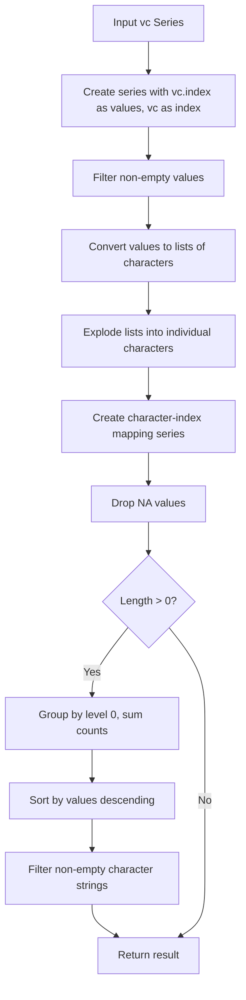
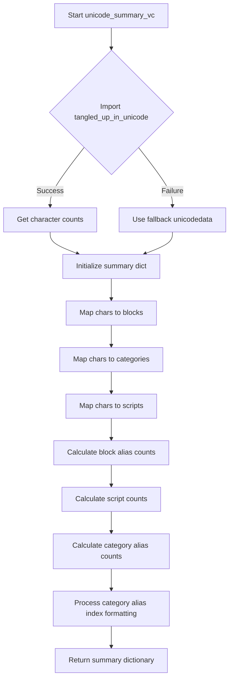
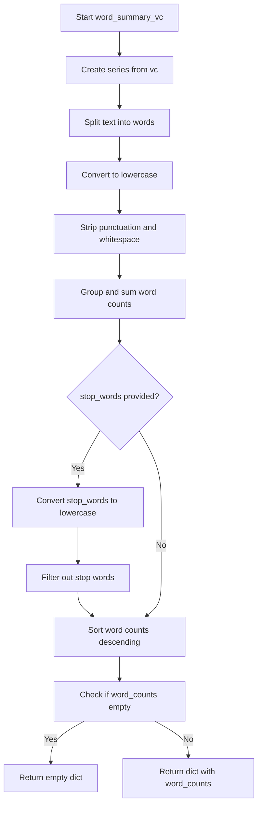
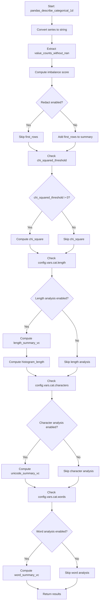

# `describe_categorical_pandas.py`

## `src.ydata_profiling.model.pandas.describe_categorical_pandas.get_character_counts_vc` · *function*

## Summary:
Computes character frequency counts from categorical data by extracting individual characters from non-empty values.

## Description:
Processes a pandas Series containing categorical values and their counts to compute frequency counts of individual characters. This function serves as a utility for data profiling to analyze character distributions within categorical columns, enabling insights into text characteristics such as character diversity, common character usage, and potential data quality issues in textual categorical data.

## Args:
    vc (pd.Series): A pandas Series where the index contains categorical values and the values represent their respective counts (frequencies).

## Returns:
    pd.Series: A pandas Series containing character frequencies, indexed by character, sorted in descending order of frequency. Empty characters are filtered out. Returns an empty Series if no valid characters exist.

## Raises:
    None explicitly raised.

## Constraints:
    Preconditions:
    - Input vc should be a pandas Series with categorical values as index and numeric counts as values
    - The function assumes the index contains the actual categorical values being counted
    
    Postconditions:
    - Returns a Series with character indices and their frequency counts
    - Characters are sorted by frequency in descending order
    - Empty characters are excluded from results
    - If no valid characters exist, returns an empty Series

## Side Effects:
    None.

## Control Flow:


## Examples:
```python
import pandas as pd

# Example usage - character analysis of categorical data
vc = pd.Series([10, 5, 3], index=['hello', 'world', 'foo'])
result = get_character_counts_vc(vc)
# Returns character frequency counts for all characters in 'hello', 'world', 'foo'
# Result would show frequencies of 'l', 'o', 'h', 'e', 'w', 'r', 'd', 'f', 'u'

# Edge case with empty values - only non-empty strings are processed
empty_vc = pd.Series([1, 1], index=['', 'test'])
result_empty = get_character_counts_vc(empty_vc)
# Returns character frequency counts for 't','e','s','t' only (ignoring empty string)
```

## `src.ydata_profiling.model.pandas.describe_categorical_pandas.get_character_counts` · *function*

## Summary:
Computes character frequency counts for all characters in a pandas Series by concatenating all elements and counting individual character occurrences.

## Description:
This function extracts character-level statistics from a pandas Series by first concatenating all string elements using the `str.cat()` method, then creating a Counter object to track the frequency of each character in the resulting string. It serves as a utility for analyzing textual content within categorical data columns.

The function is designed to handle Series containing string data and provides a convenient way to compute character-level distributions for text analysis purposes. It leverages pandas' built-in string operations to efficiently concatenate elements and count character frequencies.

## Args:
    series (pandas.Series): A pandas Series containing string elements to analyze. The series may contain null/NaN values which are handled by pandas' str.cat() method by excluding them from concatenation.

## Returns:
    Counter: A collections.Counter object mapping each unique character to its frequency count in the concatenated string. Characters with zero occurrences are not included in the counter. Empty series or series with only null values will return an empty Counter.

## Raises:
    AttributeError: If the input series does not have a string accessor (i.e., if series.str is not available), though this would typically occur at runtime when the str.cat() method is called.

## Constraints:
    Preconditions:
    - Input series should contain string-like elements that can be concatenated
    - The series should be compatible with pandas string operations
    
    Postconditions:
    - Returns a Counter object with integer counts for each character
    - All characters from the concatenated string are represented in the counter
    - Empty or null-only series result in empty Counter

## Side Effects:
    None - This function is pure and has no side effects beyond the standard pandas string operations.

## Control Flow:
```mermaid
flowchart TD
    A[Input Series] --> B{Series contains strings?}
    B -->|Yes| C[series.str.cat()]
    B -->|No| D[Handle appropriately]
    C --> E[Counter(series.str.cat())]
    E --> F[Return Counter]
```

## Examples:
```python
import pandas as pd
from collections import Counter

# Basic usage with string series
series = pd.Series(['hello', 'world', 'hello'])
result = get_character_counts(series)
# Returns Counter({'l': 4, 'o': 2, 'h': 2, 'e': 2, 'w': 1, 'r': 1, 'd': 1})

# Usage with mixed content
series = pd.Series(['a', 'bb', 'ccc'])
result = get_character_counts(series)
# Returns Counter({'c': 3, 'b': 2, 'a': 1})

# Usage with null values
series = pd.Series(['hello', None, 'world'])
result = get_character_counts(series)
# Returns Counter({'l': 2, 'o': 2, 'h': 1, 'e': 1, 'w': 1, 'r': 1, 'd': 1})
```

## `src.ydata_profiling.model.pandas.describe_categorical_pandas.counter_to_series` · *function*

## Summary:
Converts a Counter object into a pandas Series with item counts as values and items as index labels.

## Description:
Transforms a collections.Counter instance into a pandas Series where each unique item from the counter becomes an index label and its corresponding count becomes the value. This utility function provides a standardized way to convert categorical frequency data into pandas Series format for further analysis or display.

## Args:
    counter (Counter): A collections.Counter object containing item frequencies to be converted.

## Returns:
    pd.Series: A pandas Series with the counter items as index labels and their counts as values. Returns an empty Series with dtype=object if the input counter is empty.

## Raises:
    None explicitly raised.

## Constraints:
    Preconditions:
    - Input must be a collections.Counter object
    - Items in the counter should be hashable (as required by Counter)
    
    Postconditions:
    - Output Series has the same length as the number of unique items in the counter
    - Index labels correspond exactly to the items in the counter
    - Values correspond exactly to the counts of those items

## Side Effects:
    None.

## Control Flow:
```mermaid
flowchart TD
    A[Start: counter_to_series] --> B{Is counter empty?}
    B -- Yes --> C[Return empty Series]
    B -- No --> D[Get counter.most_common()]
    D --> E[Unpack items and counts]
    E --> F[Create Series with counts as values, items as index]
    F --> G[Return Series]
```

## Examples:
```python
from collections import Counter
import pandas as pd

# Example 1: Non-empty counter
counter = Counter(['a', 'b', 'c', 'a', 'b', 'a'])
result = counter_to_series(counter)
# Returns: 
# a    3
# b    2
# c    1
# dtype: int64

# Example 2: Empty counter
empty_counter = Counter()
result = counter_to_series(empty_counter)
# Returns:
# Series([], dtype: object)
```

## `src.ydata_profiling.model.pandas.describe_categorical_pandas.unicode_summary_vc` · *function*

## Summary:
Analyzes Unicode character distribution in a pandas Series and computes detailed statistics grouped by Unicode blocks, scripts, and categories.

## Description:
Processes a pandas Series containing character data to compute comprehensive Unicode character statistics. This function extracts character frequencies and categorizes them by Unicode blocks, scripts, and categories, providing detailed breakdowns for character analysis. It serves as a utility for understanding the composition of text data in terms of Unicode properties.

The function handles potential import failures of the `tangled_up_in_unicode` library by falling back to standard library alternatives when available. This ensures compatibility across different environments while maintaining rich Unicode analysis capabilities.

## Args:
    vc (pd.Series): A pandas Series containing character data where the index represents characters and values represent their counts/frequencies.

## Returns:
    dict: A dictionary containing the following keys:
        - "n_characters_distinct" (int): Number of distinct characters found
        - "n_characters" (int): Total count of all characters
        - "character_counts" (pd.Series): Series mapping characters to their counts
        - "category_alias_values" (dict): Mapping of characters to their Unicode category aliases
        - "block_alias_values" (dict): Mapping of characters to their Unicode block aliases
        - "block_alias_counts" (pd.Series): Series mapping Unicode block aliases to total character counts
        - "n_block_alias" (int): Number of distinct Unicode blocks found
        - "block_alias_char_counts" (dict): Nested dictionary mapping block aliases to character counts
        - "script_counts" (pd.Series): Series mapping Unicode script names to total character counts
        - "n_scripts" (int): Number of distinct Unicode scripts found
        - "script_char_counts" (dict): Nested dictionary mapping script names to character counts
        - "category_alias_counts" (pd.Series): Series mapping Unicode category aliases to total character counts
        - "n_category" (int): Number of distinct Unicode categories found
        - "category_alias_char_counts" (dict): Nested dictionary mapping category aliases to character counts

## Raises:
    None explicitly raised - though underlying operations may raise exceptions from pandas or numpy operations.

## Constraints:
    Preconditions:
        - Input vc must be a pandas Series
        - The Series should contain character data with proper indexing
        - Characters in the index should be valid Unicode characters
    
    Postconditions:
        - Returns a dictionary with consistent structure regardless of input content
        - All returned Series objects maintain proper index-value relationships
        - Empty inputs result in appropriate empty structures in the output

## Side Effects:
    None - This function is pure and does not modify external state or perform I/O operations.

## Control Flow:


## Examples:
```python
import pandas as pd
from src.ydata_profiling.model.pandas.describe_categorical_pandas import unicode_summary_vc

# Example with sample character data
char_series = pd.Series([5, 3, 2], index=['a', 'b', 'c'])
result = unicode_summary_vc(char_series)
print(result['n_characters'])  # Output: 10
print(result['n_characters_distinct'])  # Output: 3
```

## `src.ydata_profiling.model.pandas.describe_categorical_pandas.word_summary_vc` · *function*

## Summary:
Processes a categorical series containing text data to compute word frequency counts while optionally filtering stop words.

## Description:
This function analyzes text data stored in a pandas Series and computes the frequency count of individual words. It performs text preprocessing including lowercasing, splitting on whitespace, and removing punctuation and whitespace characters. The resulting word counts can optionally exclude common stop words. This function is typically used in categorical data profiling to understand textual content distribution.

The function extracts word counting logic to enable reuse in different profiling contexts while maintaining clean separation between text processing and statistical analysis operations.

## Args:
    vc (pd.Series): A pandas Series where the index contains text values and the values represent their frequencies or counts.
    stop_words (List[str], optional): A list of stop words to exclude from the word count results. Defaults to empty list.

## Returns:
    dict: A dictionary containing the key "word_counts" mapping to a pandas Series with word frequencies sorted in descending order. Returns an empty dictionary if no valid words remain after processing.

## Raises:
    None explicitly raised

## Constraints:
    Preconditions:
    - vc must be a pandas Series with text data in the index
    - stop_words should be a list of strings if provided
    
    Postconditions:
    - Returned dictionary contains either empty dict or dict with "word_counts" key
    - Word counts are sorted in descending order
    - Stop words are filtered out if provided

## Side Effects:
    None

## Control Flow:


## Examples:
```python
# Basic usage with text data
import pandas as pd
vc = pd.Series([2, 1, 3], index=['hello world', 'hello there', 'world peace'])
result = word_summary_vc(vc)
# Returns: {'word_counts': pd.Series([3, 2, 1], index=['hello', 'world', 'there'])}

# Usage with stop words
stop_words = ['the', 'and', 'or']
result = word_summary_vc(vc, stop_words)
# Returns word counts excluding stop words
```

## `src.ydata_profiling.model.pandas.describe_categorical_pandas.length_summary_vc` · *function*

## Summary:
Calculates descriptive statistics for character lengths of categorical values from a value count series.

## Description:
Processes a pandas Series containing value counts to compute statistical measures of character length for the categorical values. This function extracts length information from the index of the input series and computes various summary statistics including maximum, minimum, mean, and median character lengths, along with a histogram of length frequencies. It is typically used in categorical data profiling to understand the distribution of string lengths in text columns, helping identify potential data quality issues or patterns in textual data.

## Args:
    vc (pandas.Series): A pandas Series where the index contains categorical values (typically strings) and the values represent their counts/frequencies.

## Returns:
    dict: A dictionary containing:
        - "max_length" (int): The maximum character length among all values
        - "mean_length" (float): The weighted average character length
        - "median_length" (float): The weighted median character length
        - "min_length" (int): The minimum character length among all values
        - "length_histogram" (pandas.Series): A series with character lengths as index and their frequency counts as values, sorted by frequency descending

## Raises:
    None explicitly raised - however, underlying operations may raise exceptions if input is malformed (e.g., non-hashable index values, incompatible data types).

## Constraints:
    Preconditions:
        - Input `vc` must be a pandas Series
        - The index of `vc` should contain hashable values that support .str.len() operation
    Postconditions:
        - Returns a dictionary with exactly the five keys mentioned above
        - The returned histogram is sorted by frequency in descending order

## Side Effects:
    None

## Control Flow:
```mermaid
flowchart TD
    A[Input vc Series] --> B{Index contains hashable values?}
    B -->|Yes| C[Create series with vc.index as values and vc as index]
    C --> D[Calculate character lengths using str.len()]
    D --> E[Create length counts series with length as index]
    E --> F[Group by level 0 and sum to aggregate lengths]
    F --> G[Sort by values descending (frequency)]
    G --> H[Calculate max, mean, median, min from length counts]
    H --> I[Return summary dictionary]
```

## Examples:
```python
import pandas as pd
import numpy as np

# Example usage with string values
vc = pd.Series([5, 3, 2], index=['apple', 'banana', 'cherry'])
result = length_summary_vc(vc)
print(f"Max length: {result['max_length']}")
print(f"Mean length: {result['mean_length']:.2f}")
print("Length histogram:")
print(result['length_histogram'])

# Expected output:
# Max length: 6
# Mean length: 4.50
# Length histogram:
# 5    5
# 6    3
# 5    2
# Name: None, dtype: int64
```

## `src.ydata_profiling.model.pandas.describe_categorical_pandas.pandas_describe_categorical_1d` · *function*

## Summary:
Processes and summarizes categorical data in a pandas Series by computing various statistical measures including imbalance scores, chi-square tests, length distributions, character analyses, and word frequency counts.

## Description:
This function serves as the core processing routine for analyzing categorical data in pandas Series. It transforms the input series into string format and computes comprehensive statistics based on configuration settings. The function is designed to be called as part of a larger profiling pipeline where categorical columns are analyzed for patterns, distributions, and characteristics.

The logic is extracted into its own function to separate the concerns of data transformation from statistical computation, allowing for modular testing and reuse in different profiling contexts. It handles various aspects of categorical analysis including distributional properties, textual characteristics, and statistical significance tests.

## Args:
    config (Settings): Configuration object containing various settings for analysis, particularly for categorical and numerical variables
    series (pd.Series): Input pandas Series containing categorical data to be analyzed
    summary (dict): Dictionary containing pre-computed summary statistics including value_counts_without_nan

## Returns:
    Tuple[Settings, pd.Series, dict]: Returns a tuple containing:
    - Updated configuration object
    - Processed series (converted to string type)
    - Extended summary dictionary with additional computed statistics including:
      * imbalance: Column imbalance score
      * first_rows: First 5 rows of the series (when redaction is disabled)
      * chi_squared: Chi-square test result (when chi_squared_threshold > 0)
      * Various length, character, and word analysis statistics (based on config flags)

## Raises:
    None explicitly raised - All exceptions would come from underlying functions like chi_square, histogram_compute, etc.

## Constraints:
    Preconditions:
    - The input series must be compatible with pandas operations
    - The summary dictionary must contain "value_counts_without_nan" key
    - Config must have properly initialized vars.cat and vars.num sections
    
    Postconditions:
    - The series is converted to string type
    - The summary dictionary is updated with various computed statistics
    - The returned summary contains at minimum the imbalance score

## Side Effects:
    None directly observable - The function modifies the summary dictionary in-place and returns updated objects, but doesn't perform I/O operations or external state mutations.

## Control Flow:


## Examples:
```python
# Basic usage
config = Settings()
series = pd.Series(['A', 'B', 'A', 'C', 'B'])
summary = {'value_counts_without_nan': pd.Series([2, 2, 1], index=['A', 'B', 'C'])}
updated_config, processed_series, updated_summary = pandas_describe_categorical_1d(config, series, summary)
```

