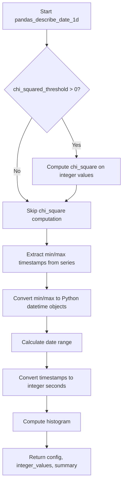

# `describe_date_pandas.py`

## `src.ydata_profiling.model.pandas.describe_date_pandas.pandas_describe_date_1d` · *function*

## Summary:
Processes a pandas Series containing datetime data to compute descriptive statistics including min/max values, range, chi-squared test results, and histogram data.

## Description:
This function extracts temporal statistics from a pandas datetime Series and updates a summary dictionary with computed values. It handles conversion between pandas Timestamp objects and Python datetime objects, computes date ranges, and optionally performs statistical tests and histogram computations for date distributions. This function is part of the date profiling pipeline and is typically called when analyzing datetime columns in datasets.

## Args:
    config (Settings): Configuration object containing settings for statistical computations and plotting parameters
    series (pd.Series): A pandas Series containing datetime data (Timestamp objects)
    summary (dict): Dictionary to be updated with computed date statistics

## Returns:
    Tuple[Settings, numpy.ndarray, dict]: The unchanged config object, integer timestamp values in seconds, and the updated summary dictionary

## Raises:
    None explicitly raised in the function body

## Constraints:
    Preconditions:
    - The series parameter must contain valid pandas Timestamp objects
    - The summary parameter must be a mutable dictionary
    - Config must be properly initialized with appropriate settings
    
    Postconditions:
    - The summary dictionary will contain keys: 'min', 'max', 'range', and potentially 'chi_squared' and 'histogram'
    - The returned values array contains integer representations of timestamps in seconds

## Side Effects:
    - Modifies the summary dictionary in-place by updating it with computed statistics
    - No external I/O operations or state mutations beyond the summary dictionary modification

## Control Flow:

## Examples:
    # Basic usage with date series
    config = Settings()
    date_series = pd.Series([pd.Timestamp('2020-01-01'), pd.Timestamp('2020-12-31')])
    summary = {}
    result_config, result_values, result_summary = pandas_describe_date_1d(config, date_series, summary)
    
    # Usage with chi-squared threshold enabled
    config.vars.num.chi_squared_threshold = 0.5
    result_config, result_values, result_summary = pandas_describe_date_1d(config, date_series, summary)
    
    # Typical usage in profiling pipeline
    # This function is called internally by the profiling system when processing datetime columns
    # The returned integer values are used for histogram computations and statistical analysis

