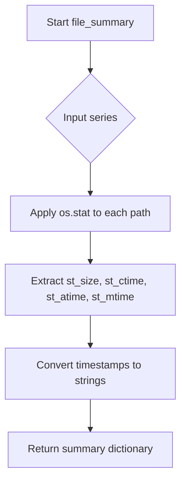

# `describe_file_pandas.py`

## `src.ydata_profiling.model.pandas.describe_file_pandas.file_summary` · *function*

## Summary:
Extracts and formats file metadata statistics from a series of file paths.

## Description:
Processes a pandas Series containing file paths to compute file size and timestamp information for each file. This function is designed to provide basic file metadata analysis for profiling purposes.

## Args:
    series (pd.Series): A pandas Series containing file paths as strings.

## Returns:
    dict: A dictionary containing four keys:
        - "file_size": A pandas Series with file sizes in bytes
        - "file_created_time": A pandas Series with creation timestamps formatted as "%Y-%m-%d %H:%M:%S"
        - "file_accessed_time": A pandas Series with last access timestamps formatted as "%Y-%m-%d %H:%M:%S"  
        - "file_modified_time": A pandas Series with last modification timestamps formatted as "%Y-%m-%d %H:%M:%S"

## Raises:
    FileNotFoundError: When a file path in the series does not exist and os.stat() cannot access it.
    PermissionError: When a file path in the series cannot be accessed due to insufficient permissions.

## Constraints:
    Preconditions:
        - Input series must contain valid file paths as strings
        - Files referenced by the paths must be accessible by the running process
    Postconditions:
        - All returned Series will have the same length as the input series
        - Timestamp fields will be properly formatted strings in "%Y-%m-%d %H:%M:%S" format

## Side Effects:
    - File system I/O operations via os.stat() calls
    - Potential permission errors if files are not accessible

## Control Flow:


## Examples:
```python
import pandas as pd
from src.ydata_profiling.model.pandas.describe_file_pandas import file_summary

# Basic usage
file_paths = pd.Series(['file1.txt', 'file2.csv'])
result = file_summary(file_paths)
print(result['file_size'])  # Series with file sizes
print(result['file_created_time'])  # Series with formatted creation times
```

## `src.ydata_profiling.model.pandas.describe_file_pandas.pandas_describe_file_1d` · *function*

## Summary:
Processes a pandas Series of file paths to compute file statistics and histogram data for profiling.

## Description:
This function validates file path data and computes comprehensive file statistics including file sizes, creation times, access times, and modification times. It also generates histogram data for file sizes to support data visualization in profiling reports.

The function is designed to be part of a larger profiling pipeline where file metadata is analyzed to understand file characteristics and distributions.

## Args:
    config (Settings): Configuration settings for the profiling process
    series (pd.Series): Pandas Series containing file paths as strings
    summary (dict): Dictionary to be updated with computed file statistics

## Returns:
    Tuple[Settings, pd.Series, dict]: Returns the original config, series, and updated summary dictionary

## Raises:
    ValueError: Raised when the series contains NaN values or when the series does not have a string accessor (.str)

## Constraints:
    Preconditions:
        - The series must not contain any NaN values
        - The series must have a string accessor (.str) available
        - The series should contain valid file paths that can be processed by os.stat
    
    Postconditions:
        - The summary dictionary will be updated with file statistics including file_size, file_created_time, file_accessed_time, and file_modified_time
        - The summary dictionary will contain histogram data under the key "histogram_file_size"

## Side Effects:
    - Calls os.stat() internally to retrieve file metadata
    - Modifies the input summary dictionary in-place by updating it with computed statistics
    - Uses datetime conversion functions to format timestamp data

## Control Flow:
```mermaid
flowchart TD
    A[Start pandas_describe_file_1d] --> B{series.hasnans?}
    B -- Yes --> C[raise ValueError]
    B -- No --> D{hasattr(series, "str")?}
    D -- No --> E[raise ValueError]
    D -- Yes --> F[summary.update(file_summary(series))]
    F --> G[summary.update(histogram_compute(...))]
    G --> H[Return (config, series, summary)]
```

## Examples:
```python
# Basic usage
config = Settings()
series = pd.Series(['/path/to/file1.txt', '/path/to/file2.txt'])
summary = {}

try:
    config, series, summary = pandas_describe_file_1d(config, series, summary)
    print(summary['file_size'])  # Shows file size statistics
    print(summary['histogram_file_size'])  # Shows histogram data
except ValueError as e:
    print(f"Invalid input: {e}")
```

